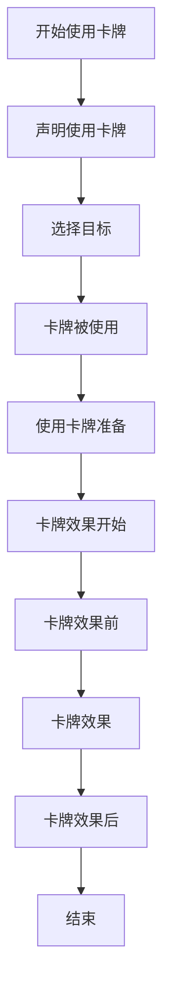
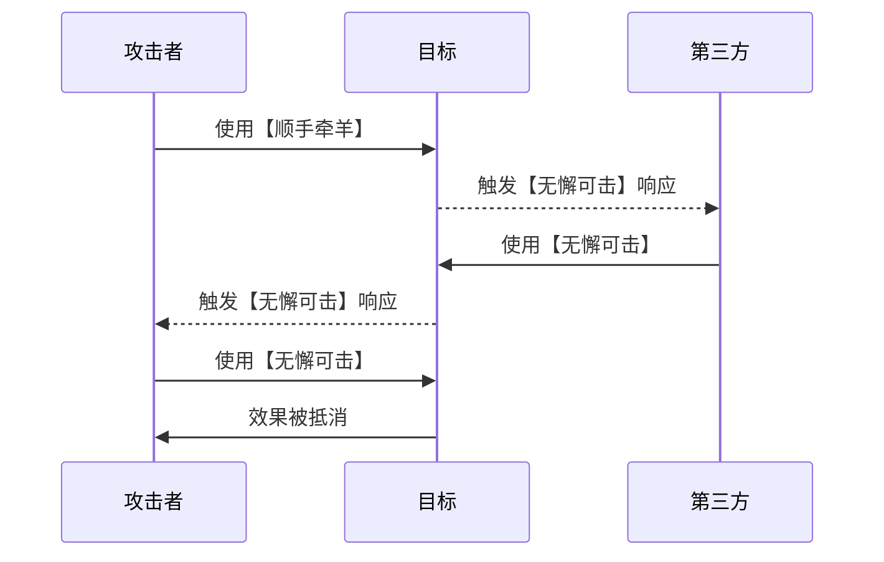
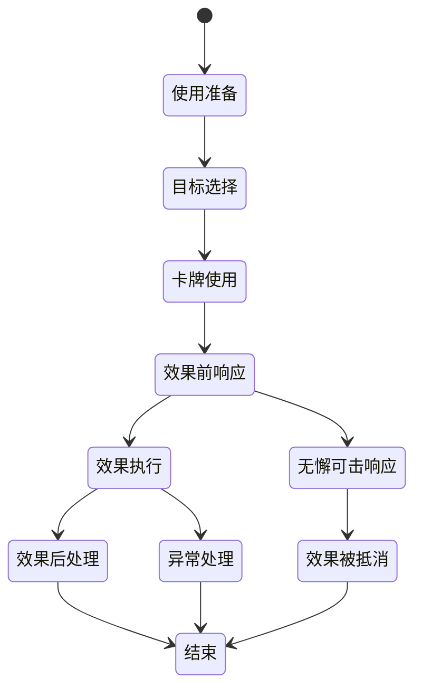

# 效果判定逻辑

<cite>
**本文档引用文件**  
- [card.use.ts](file://server/src/core/card/card.use.ts)
- [event.use.ts](file://server/src/core/event/types/event.use.ts)
</cite>

## 目录
1. [效果判定逻辑概述](#效果判定逻辑概述)  
2. [卡牌使用与效果执行流程](#卡牌使用与效果执行流程)  
3. [响应机制分析](#响应机制分析)  
4. [特殊卡牌响应流程](#特殊卡牌响应流程)  
5. [判定牌使用规则](#判定牌使用规则)  
6. [状态转换与异常处理](#状态转换与异常处理)

## 效果判定逻辑概述

本节介绍resgsv1项目中卡牌使用后的效果判定逻辑，重点围绕`card.use.ts`中的`executeCardEffect`函数实现机制。系统通过事件驱动模型处理卡牌使用、响应、判定等复杂交互，确保游戏逻辑的严谨性和可扩展性。

**Section sources**  
- [card.use.ts](file://server/src/core/card/card.use.ts#L1-L105)

## 卡牌使用与效果执行流程

### executeCardEffect函数实现

`executeCardEffect`函数是卡牌效果执行的核心入口，其逻辑封装在`UseCardEvent`类中。该函数通过事件触发器（EventTriggers）驱动整个效果流程。



**Diagram sources**  
- [event.use.ts](file://server/src/core/event/types/event.use.ts#L785-L819)

**Section sources**  
- [event.use.ts](file://server/src/core/event/types/event.use.ts#L785-L819)

### 判定阶段触发

当卡牌进入使用流程后，系统会根据卡牌类型触发不同的判定阶段：

- **延时锦囊牌**：如“乐不思蜀”、“兵粮寸断”，直接置入目标判定区。
- **装备牌**：替换目标对应装备区的旧装备。
- **基本牌/非延时锦囊**：进入目标结算流程。

```typescript
protected async [`${EventTriggers.UseCardReady}_After`]() {
    if (this.card.subtype === CardSubType.DelayedScroll) {
        // 延时锦囊处理
        await this.room.moveCards({
            cards: this.card.subcards,
            toArea: this.targetList[0].target.judgeArea,
            reason: MoveCardReason.Use
        });
        this.isEnd = true;
    }
}
```

**Section sources**  
- [event.use.ts](file://server/src/core/event/types/event.use.ts#L785-L819)

## 响应机制分析

### '闪'对'杀'的响应机制

当玩家使用“杀”攻击目标时，目标玩家有机会使用“闪”进行响应。系统通过`PreUseCardData`类中的`get_prompt`方法生成响应提示。

```typescript
if (this.has('shan') && this.source.is(UseCardEvent) && this.source.card.name === 'sha') {
    return {
        prompt: {
            text: `@shan`,
            values: [{ type: 'player', value: this.source.from.playerId }]
        },
        thinkPrompt: `shan`
    };
}
```

#### 响应时机
- **响应时机**：在`CardEffectBefore`阶段触发，所有存活玩家均可响应。
- **响应顺序**：按游戏内响应顺序（通常为逆时针）依次询问。
- **连锁反应**：若“杀”被“闪”抵消，可继续使用“无懈可击”进行二次响应。

**Section sources**  
- [event.use.ts](file://server/src/core/event/types/event.use.ts#L785-L819)

## 特殊卡牌响应流程

### '无懈可击'的响应流程

“无懈可击”作为万能响应牌，可用于抵消任何锦囊牌效果。其响应流程支持多层嵌套和优先级判定。



**Diagram sources**  
- [event.use.ts](file://server/src/core/event/types/event.use.ts#L785-L819)

#### 多层响应与优先级
- **响应层级**：每层响应都会生成新的`UseCardToCardEvent`事件。
- **优先级判定**：响应权按逆时针顺序传递，原使用者最后响应。
- **终止条件**：当连续两名玩家放弃响应时，效果生效。

```typescript
protected async [`${EventTriggers.CardEffectBefore}_Before`]() {
    this.triggerNot = true;
    await this.room.trigger(
        EventTriggers.CardEffectBefore,
        this,
        this.room.playerAlives.filter((v) => !this.cantResponse.includes(v))
    );
}
```

**Section sources**  
- [event.use.ts](file://server/src/core/event/types/event.use.ts#L785-L819)

## 判定牌使用规则

### 乐不思蜀判定流程

“乐不思蜀”作为延时锦囊，其判定流程如下：

1. 使用者选择目标
2. 卡牌置入目标判定区
3. 目标回合开始时进行判定
4. 若判定结果为♠，则跳过出牌阶段

```typescript
if (this.card.subtype === CardSubType.DelayedScroll) {
    await this.room.moveCards({
        cards: this.card.subcards,
        toArea: this.targetList[0].target.judgeArea,
        reason: MoveCardReason.Use
    });
}
```

### 兵粮寸断判定流程

“兵粮寸断”判定规则与“乐不思蜀”类似，但判定结果为♣时生效，目标跳过摸牌阶段。

**Section sources**  
- [event.use.ts](file://server/src/core/event/types/event.use.ts#L785-L819)

## 状态转换与异常处理

### 效果判定状态转换图



**Diagram sources**  
- [event.use.ts](file://server/src/core/event/types/event.use.ts#L785-L819)

### 异常情况处理方案

| 异常类型 | 处理方案 |
|---------|---------|
| 目标死亡 | 从目标列表中移除 |
| 卡牌无效 | 标记`invalid`并跳过结算 |
| 响应超时 | 自动视为放弃响应 |
| 网络中断 | 恢复后继续未完成的事件 |

```typescript
protected async [`${EventTriggers.UseCardReady}_After`]() {
    // 将已死亡的角色移出目标列表
    this.targetList.slice().forEach((v) => {
        if (v.target.death) {
            this.removeTarget(v.index);
        }
    });
}
```

**Section sources**  
- [event.use.ts](file://server/src/core/event/types/event.use.ts#L785-L819)