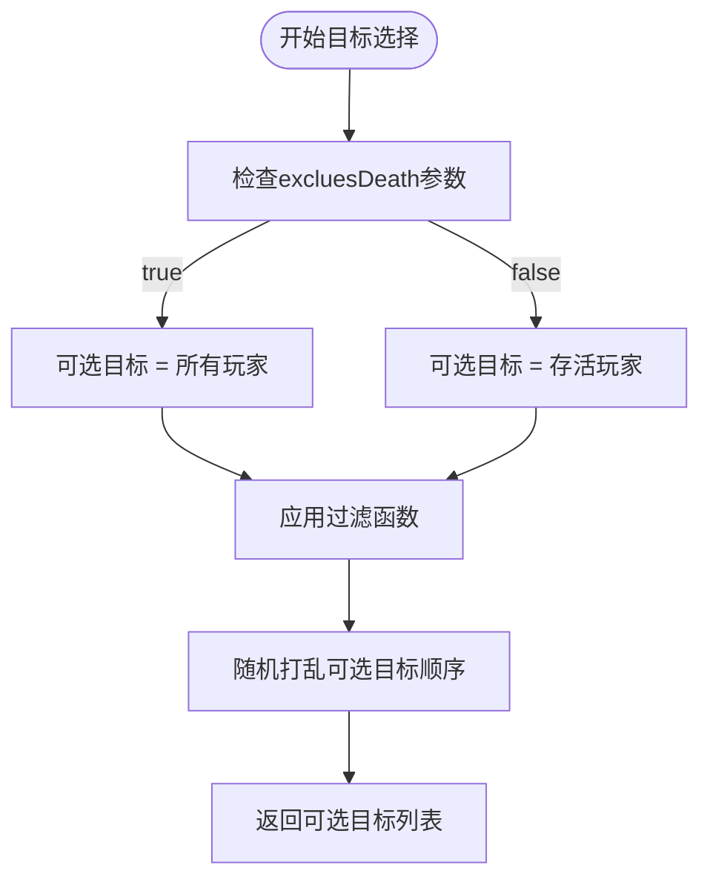
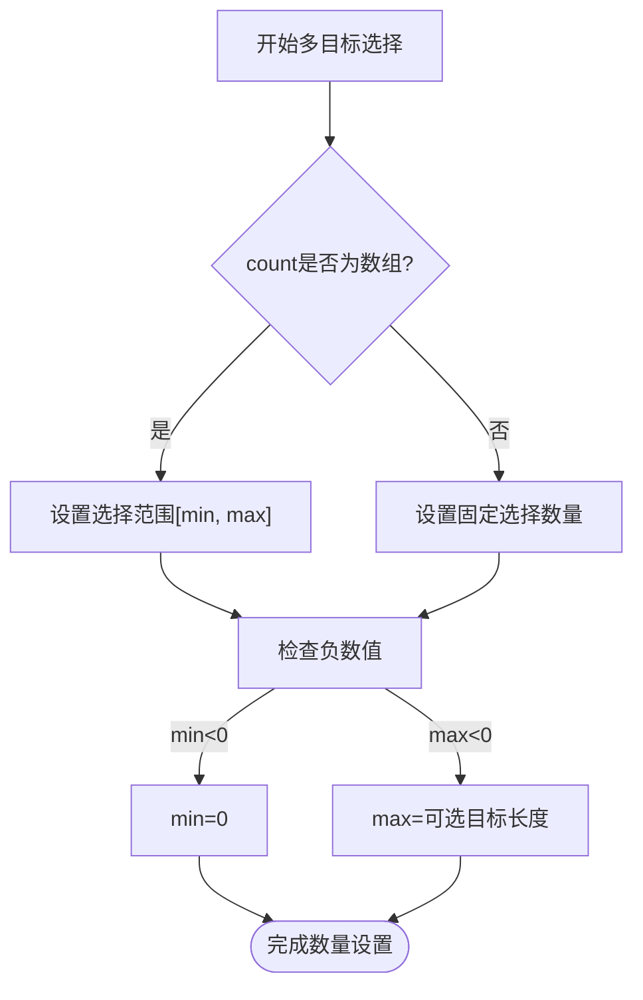
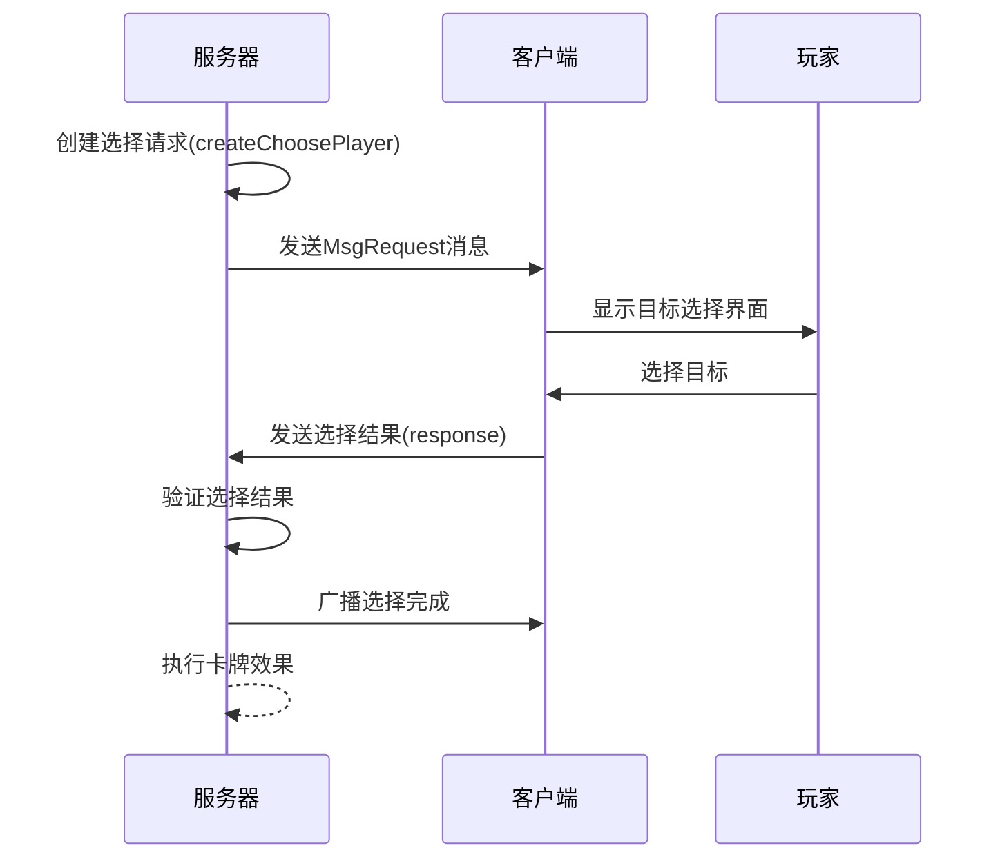
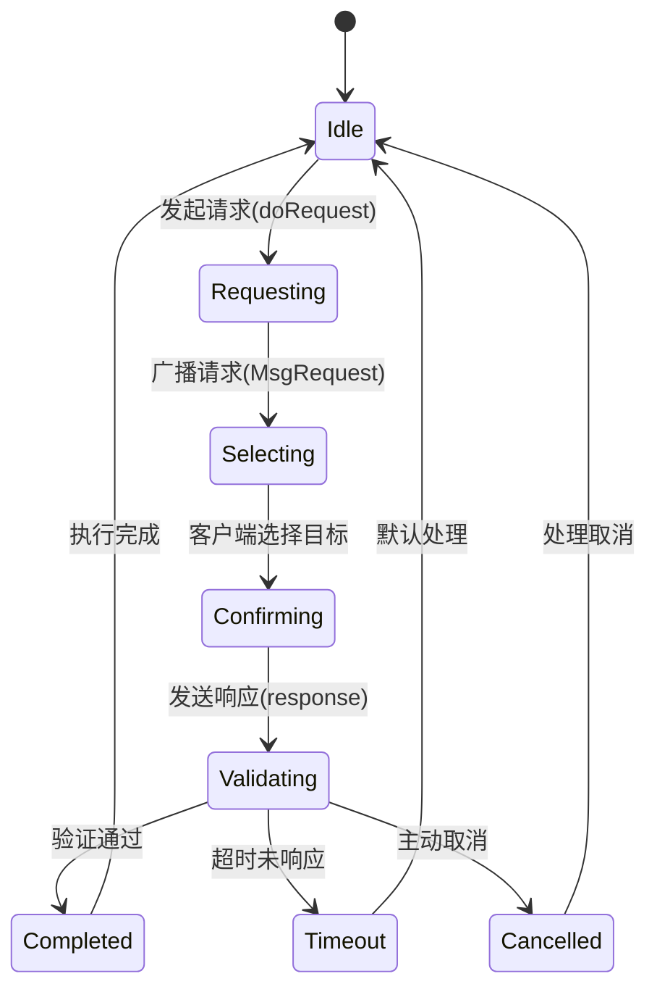

# 目标选择机制

<cite>
**本文档引用文件**  
- [choose.player.ts](file://server/src/core/choose/types/choose.player.ts)
- [room.choose.ts](file://server/src/core/room/mixins/room.choose.ts)
- [choose.types.ts](file://server/src/core/choose/choose.types.ts)
- [nanmanruqin.ts](file://server/src/extensions/standard/cards/scroll/nanmanruqin.ts)
</cite>

## 目录
1. [引言](#引言)
2. [目标选择逻辑实现](#目标选择逻辑实现)
3. [交互流程分析](#交互流程分析)
4. [群体卡牌目标选择示例](#群体卡牌目标选择示例)
5. [特殊技能对目标选择的影响](#特殊技能对目标选择的影响)
6. [状态机设计与异常处理](#状态机设计与异常处理)

## 引言
目标选择机制是卡牌游戏resgsv1中的核心交互逻辑之一，负责处理卡牌使用时的目标选取过程。该机制通过服务器与客户端的协同工作，确保玩家能够正确选择卡牌目标，并在满足条件的情况下完成卡牌效果的执行。本文档将深入分析目标选择的实现原理、交互流程以及相关代码结构。

**Section sources**
- [choose.player.ts](file://server/src/core/choose/types/choose.player.ts)
- [room.choose.ts](file://server/src/core/room/mixins/room.choose.ts)

## 目标选择逻辑实现

### 有效目标范围计算
目标选择的范围由`createChoosePlayer`方法创建，其核心参数包括`selectable`（可选目标列表）和`filter`函数（过滤条件）。根据`excluesDeath`参数决定是否包含已死亡的玩家。



**Diagram sources**
- [room.choose.ts](file://server/src/core/room/mixins/room.choose.ts#L302-L331)

### 目标过滤规则
目标过滤通过`filter`函数实现，该函数接收当前目标项和已选目标列表作为参数，返回布尔值表示是否可选。例如，在"南蛮入侵"卡牌中，过滤规则排除了出牌者自身：

```typescript
filter(item, selected) {
    return from !== item;
}
```

此外，系统还支持多种限制排除选项：
- **excluesCardTimesLimit**: 是否排除卡牌使用次数限制（默认为true）
- **excluesCardDistanceLimit**: 是否排除卡牌距离限制（默认为false）
- **excluesToCard**: 是否让目标为牌的卡牌必定不通过检测（默认为false）

**Section sources**
- [choose.player.ts](file://server/src/core/choose/types/choose.player.ts#L0-L15)
- [room.choose.ts](file://server/src/core/room/mixins/room.choose.ts#L302-L331)

### 多目标选择处理
多目标选择通过`count`参数控制，支持两种格式：
- 数字：必须选择指定数量的目标
- 数组`[min, max]`：选择数量在最小值和最大值之间

当最大值为-1时，表示最大可选数量为目标列表的长度。系统会自动调整负数的最小值为0。



**Diagram sources**
- [room.choose.ts](file://server/src/core/room/mixins/room.choose.ts#L315-L323)

## 交互流程分析

### 完整选择流程
目标选择的交互流程从服务器发起请求开始，经过客户端响应，最终由服务器验证完成。



**Diagram sources**
- [room.choose.ts](file://server/src/core/room/mixins/room.choose.ts#L220-L252)

### 服务器请求处理
服务器通过`doRequest`方法发起目标选择请求，该方法返回一个Promise，等待客户端响应。

```typescript
public async doRequest(
    this: GameRoom,
    options: Pick<GameRequest, 'player' | 'get_selectors'>
) {
    // 创建请求对象
    const req: GameRequest = Object.assign(
        {},
        {
            id: this.requestids++,
            room: this,
        },
        options
    ) as GameRequest;
    
    // 填充请求数据
    this.fillRequest(req);
    
    // 广播请求到客户端
    this.broadcast({
        type: 'MsgRequest',
        id: req.id,
        player: req.player.playerId,
        get_selectors: {
            selectorId,
            context: this.toJson_Context(context),
        },
    });
    
    // 设置超时处理
    setTimeout(() => {
        if (!req.complete) {
            this.response({
                id: req.id,
                timeout: true,
                cancle: true,
                results: {},
            } as any);
        }
    }, (maxms + 1) * 1000);
    
    return req;
}
```

**Section sources**
- [room.choose.ts](file://server/src/core/room/mixins/room.choose.ts#L45-L108)

## 群体卡牌目标选择示例

### 南蛮入侵目标选择
"南蛮入侵"是一张典型的群体攻击卡牌，其目标选择机制具有代表性。

```typescript
target(room, from, card) {
    return room.createChoosePlayer({
        count: [1, -1],  // 至少选择1个，最多选择所有玩家
        filter(item, selected) {
            return from !== item;  // 排除出牌者自身
        },
        auto: true,  // 自动选择所有符合条件的目标
    });
}
```

**Section sources**
- [nanmanruqin.ts](file://server/src/extensions/standard/cards/scroll/nanmanruqin.ts#L4-L12)

### 响应规则
当目标玩家被选中后，系统会依次向每个目标玩家发起响应请求，要求其打出【杀】来抵消伤害。

```typescript
async effect(room, target, data: UseCardEvent) {
    const { from, card, current, baseDamage = 1 } = data;
    const cards = ['sha'];
    let play: PlayCardEvent;
    
    if (!data.cantResponse.includes(current.target)) {
        play = await room.needPlayCard({
            from: current.target,
            cards,
            source: data,
            reason: this.name,
            reqOptions: {
                canCancle: true,
                showMainButtons: true,
                prompt: '@nanmanruqin_response',
                thinkPrompt: '@@nanmanruqin_response',
            },
        });
    }
    
    if (!play) {
        await room.damage({
            from,
            to: current.target,
            number: baseDamage,
            damageType: DamageType.None,
            channel: card,
            isChain: false,
            source: data,
            reason: this.name,
        });
    }
}
```

**Section sources**
- [nanmanruqin.ts](file://server/src/extensions/standard/cards/scroll/nanmanruqin.ts#L13-L34)

## 特殊技能对目标选择的影响

### 技能改变目标数量
某些武将技能可以改变目标选择的数量限制。例如，王桃王悦的技能通过`getSelectors`方法修改目标选择器：

```typescript
getSelectors(room, context) {
    const targets = context.targets;
    return {
        target: () => {
            return {
                selectors: {
                    target: room.createChoosePlayer({
                        filter(item, selected) {
                            return selected.length === 0
                                ? targets.includes(item)
                                : true;
                        },
                        excluesCardTimesLimit: true,
                    }),
                },
            };
        },
    };
}
```

此技能将目标选择限制为只能选择特定的目标，并且排除了卡牌使用次数限制。

**Section sources**
- [wangtaowangyue.ts](file://server/src/extensions/wars/generals/kangli/wangtaowangyue.ts#L76-L112)

### 技能改变目标范围
其他技能可能通过修改`selectable`列表来改变可选目标的范围。系统允许技能通过`createChoosePlayer`的参数灵活控制目标选择行为，包括：
- 修改可选目标列表
- 添加自定义过滤条件
- 调整选择数量限制
- 改变选择方式（如自动选择）

## 状态机设计与异常处理

### 目标选择状态机
目标选择过程可以建模为一个状态机，包含多个状态和转换。



**Diagram sources**
- [room.choose.ts](file://server/src/core/room/mixins/room.choose.ts#L45-L108)

### 异常处理机制
系统实现了完善的异常处理机制，主要体现在以下几个方面：

1. **超时处理**：为每个请求设置超时定时器，超时后自动执行默认选择
2. **取消处理**：支持玩家主动取消选择，通过`canCancle`参数控制
3. **默认选择**：当请求未完成时，调用`defaultRequest`方法执行默认逻辑
4. **数据验证**：在服务器端验证客户端返回的选择结果

```typescript
public defaultRequest(this: GameRoom, req: GameRequest) {
    req.result = {} as any;
    if (req.options.canCancle) {
        req.result.cancle = true;
    } else {
        // 执行默认选择逻辑
        Object.keys(req.selectors)
            .sort((a, b) => {
                return req.selectors[a]?.step - req.selectors[b]?.step;
            })
            .forEach((v) => {
                const selector = req.selectors[v];
                // ... 默认选择实现
            });
        req.result.cancle = false;
    }
}
```

**Section sources**
- [room.choose.ts](file://server/src/core/room/mixins/room.choose.ts#L220-L252)