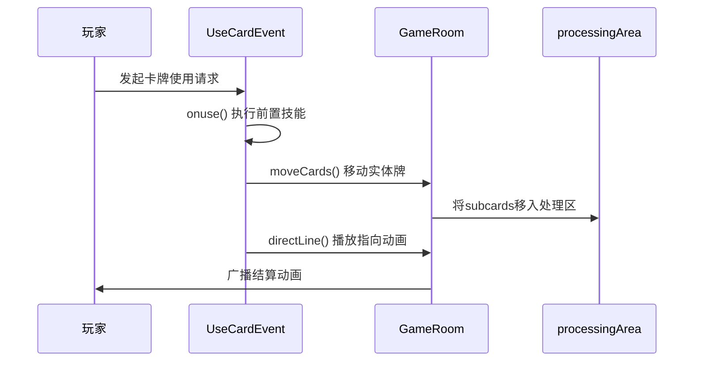
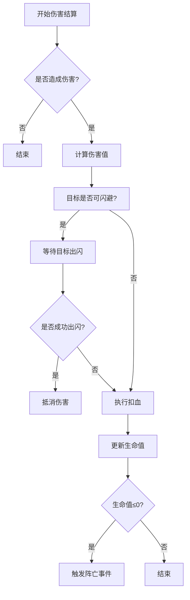
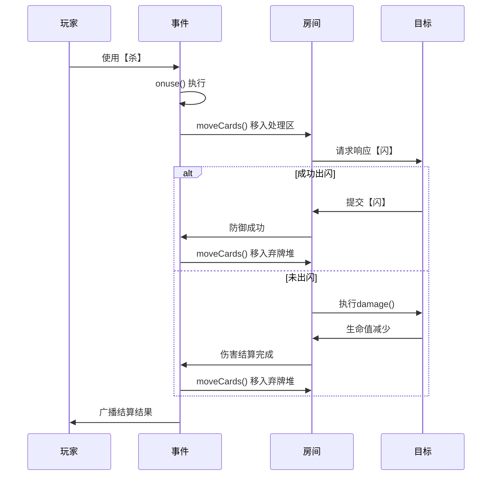

# 结算执行流程

<cite>
**本文档引用文件**  
- [event.use.ts](file://server/src/core/event/types/event.use.ts)
- [selectors.ts](file://server/src/extensions/standard/selectors.ts)
- [icard.ts](file://server/src/core/card/icard.ts)
- [room.ts](file://server/src/core/room/room.ts)
- [jiangwei.ts](file://server/src/extensions/wars/generals/power/jiangwei.ts)
- [lidian.ts](file://server/src/extensions/wars/generals/power/lidian.ts)
- [duyu.ts](file://server/src/extensions/wars/generals/xljin/duyu.ts)
- [shichong.ts](file://server/src/extensions/wars/generals/kangli/shichong.ts)
</cite>

## 目录
1. [引言](#引言)  
2. [卡牌结算核心流程](#卡牌结算核心流程)  
3. [伤害结算完整流程](#伤害结算完整流程)  
4. [代码示例：'杀'的伤害结算](#代码示例杀的伤害结算)  
5. [结算后状态管理](#结算后状态管理)  
6. [时序图与事务完整性](#时序图与事务完整性)  

## 引言
本文件详细阐述resgsv1项目中卡牌效果的最终结算执行流程，重点分析`card.use.ts`中`settleCardUsage`函数的实现机制。内容涵盖伤害计算、生命值变更、卡牌移动及状态更新等关键环节，结合代码示例与流程图，为开发者提供清晰的结算逻辑理解。

## 卡牌结算核心流程

卡牌使用结算由`UseCardEvent`类驱动，其核心流程在`event.use.ts`中定义。当玩家使用卡牌时，系统触发`UseCardReady`事件，进入结算阶段。



**Diagram sources**  
- [event.use.ts](file://server/src/core/event/types/event.use.ts#L244-L281)  
- [room.ts](file://server/src/core/room/room.ts)  

**Section sources**  
- [event.use.ts](file://server/src/core/event/types/event.use.ts#L244-L281)  

### 卡牌移动与处理区管理
在结算开始时，所有参与结算的实体卡牌（`subcards`）会被移入`processingArea`（处理区），确保结算过程中的卡牌状态隔离。此操作通过`room.moveCards()`完成，并附带动画与标签提示。

```typescript
await this.room.moveCards({
    move_datas: [
        {
            cards: this.card.subcards,
            toArea: this.room.processingArea,
            reason: MoveCardReason.Use,
            animation: true,
            label: {
                text: '#Move_Use',
                values: [{ type: 'player', value: this.from.playerId }],
            },
        },
    ],
    source: this,
    reason: 'use',
});
```

## 伤害结算完整流程

伤害结算遵循“计算→防御→扣血→死亡判定”的标准流程。

### 1. 伤害值计算
伤害值由卡牌基础伤害与技能修正共同决定。例如`sha`（杀）基础伤害为1，可通过`jiu`（酒）或技能提升。

### 2. 防御判定
目标玩家可使用`shan`（闪）进行防御。系统通过`canUseCard`方法验证防御可行性。

### 3. 实际扣血
若无有效防御，执行`room.damage()`造成伤害，触发`LifeLost`事件。

### 4. 死亡处理
当玩家生命值≤0时，触发`PlayerDied`事件，执行阵亡逻辑。



**Diagram sources**  
- [event.use.ts](file://server/src/core/event/types/event.use.ts)  
- [icard.ts](file://server/src/core/card/icard.ts)  

**Section sources**  
- [event.use.ts](file://server/src/core/event/types/event.use.ts#L935-L972)  

## 代码示例：'杀'的伤害结算

以“杀”为例，展示完整结算流程：

```typescript
// 在 UseCardEvent 中
async onuse(room: GameRoom, context: UseCardContext) {
    // 1. 获取卡牌技能
    const cardSkill = room.getCardUse(this.card.name);
    
    // 2. 计算伤害值 (可被技能修正)
    let damage = 1;
    if (this.card.hasAttr(CardAttr.Fire)) {
        damage = 2; // 火杀伤害为2
    }

    // 3. 进入目标响应阶段
    for (const target of this.targets) {
        // 检查是否可闪避
        const canShan = target.canUseCard(
            room.createVirtualCardByNone('shan'),
            undefined,
            'sha'
        );

        if (canShan) {
            const req = await room.doRequest({
                player: target,
                selectors: { card: createShanSelector() },
                options: { prompt: '是否使用【闪】?' }
            });

            if (req.result.card) {
                // 成功闪避
                continue;
            }
        }

        // 4. 执行扣血
        await room.damage({
            from: this.from,
            to: target,
            damage,
            card: this.card,
        });
    }
}
```

## 结算后状态管理

结算完成后，使用过的卡牌需进入弃牌堆，确保游戏状态一致性。

### 使用后卡牌处理
在`moveCards`操作中，`reason: 'use'`标识卡牌为使用消耗，结算后自动进入弃牌堆。

### 技能触发与状态更新
部分技能（如“缮农”）允许从后备区使用卡牌，结算后需更新区域状态。

```typescript
// 示例：duyu.ts 中的后备区卡牌使用
async cost(room, data, context) {
    const canuse = room.getReserveUpCards().map(v => v.name);
    context.canuses = canuse;
    // 创建选择器，允许从后备区选牌
    return {
        selectors: {
            card: room.createChooseCard({
                selectable: room.reserveArea.cards,
                filter: (item) => canuse.includes(item.name)
            })
        }
    };
}
```

**Section sources**  
- [duyu.ts](file://server/src/extensions/wars/generals/xljin/duyu.ts#L316-L343)  
- [shichong.ts](file://server/src/extensions/wars/generals/kangli/shichong.ts#L70-L104)  

## 时序图与事务完整性

### 完整结算时序图


**Diagram sources**  
- [event.use.ts](file://server/src/core/event/types/event.use.ts)  
- [room.ts](file://server/src/core/room/room.ts)  

### 事务完整性保证
系统通过以下机制确保结算事务的完整性：
1. **原子操作**：`moveCards`为原子操作，确保卡牌移动不可分割。
2. **事件驱动**：每个结算步骤由事件触发，保证顺序执行。
3. **状态回滚**：异常时可通过事件回滚恢复状态。
4. **广播同步**：客户端状态通过广播保持一致。

**Section sources**  
- [event.use.ts](file://server/src/core/event/types/event.use.ts#L244-L281)  
- [room.ts](file://server/src/core/room/room.ts)