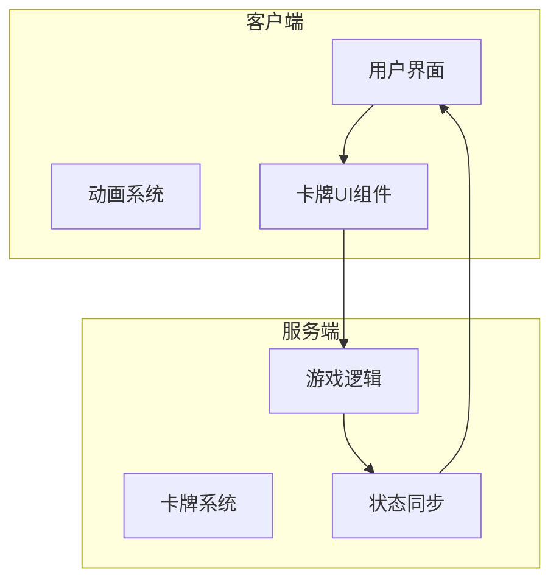
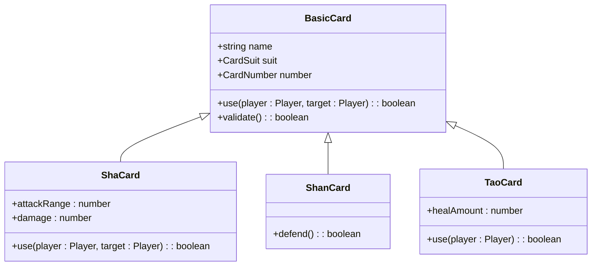
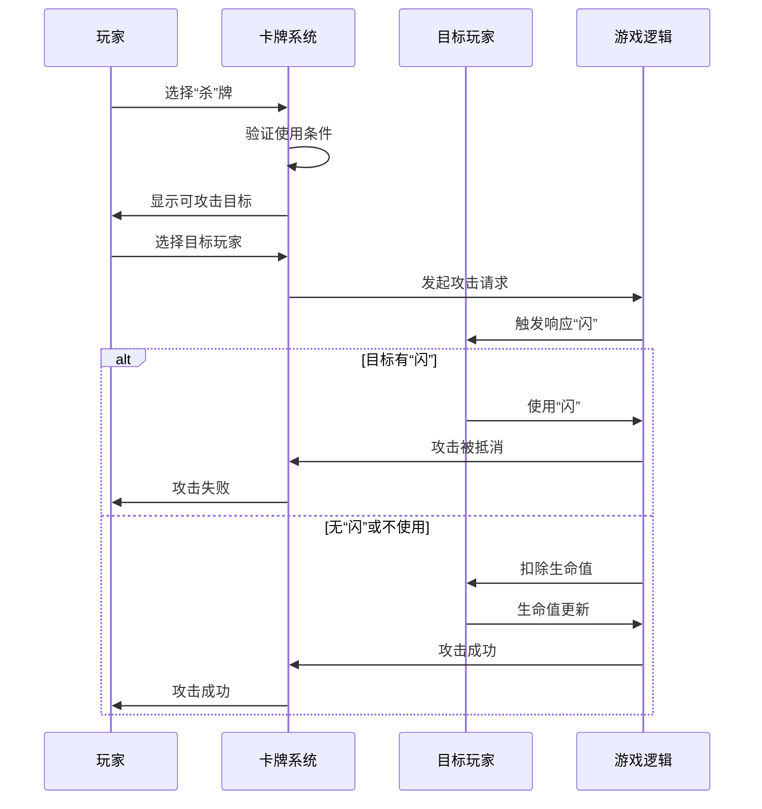
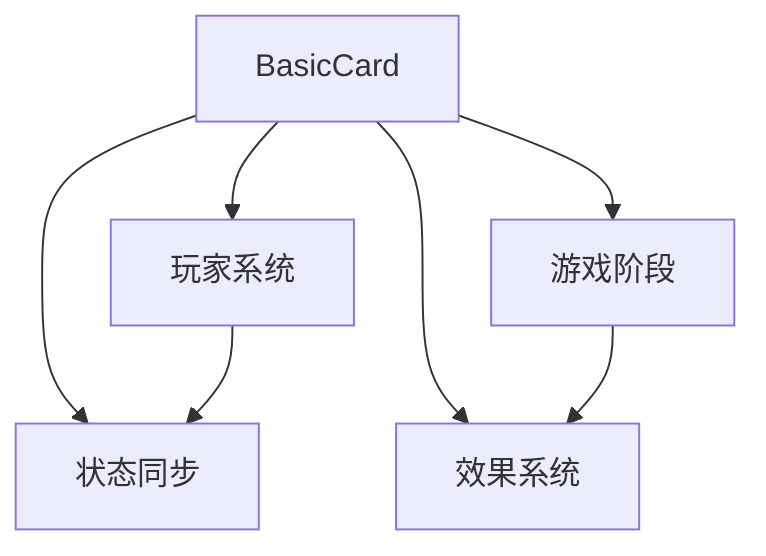

# 基本牌设计

<cite>
**本文档中引用的文件**  
- [BasicCard.ts](file://client/src/models/BasicCard.ts)
- [card.types.ts](file://server/src/core/card/card.types.ts)
- [BasicCardType.ts](file://client/src/enums.ts)
- [vcard.ts](file://server/src/core/card/vcard.ts)
- [icard.ts](file://server/src/core/card/icard.ts)
</cite>

## 目录
1. [引言](#引言)
2. [项目结构](#项目结构)
3. [核心组件](#核心组件)
4. [架构概览](#架构概览)
5. [详细组件分析](#详细组件分析)
6. [依赖关系分析](#依赖关系分析)
7. [性能考量](#性能考量)
8. [故障排除指南](#故障排除指南)
9. [结论](#结论)

## 引言
本文档详细介绍了resgsv1项目中基本牌的设计与实现机制，重点分析“杀”、“闪”、“桃”三种基本牌的游戏规则、使用限制及代码实现。通过实际代码示例和序列图，全面展示基本牌从玩家使用到效果执行的完整流程。

## 项目结构
项目分为客户端（client）和服务端（server）两大部分。客户端主要负责UI渲染、动画播放和用户交互，服务端负责游戏逻辑处理、状态同步和规则验证。



**Diagram sources**
- [UICard.ts](file://client/src/ui/UICard.ts)
- [server_table.ts](file://client/src/server/server_table.ts)

**Section sources**
- [project_structure](file://workspace/project_structure)

## 核心组件
基本牌的核心实现位于服务端的卡牌系统中，主要包括`BasicCard`类和`BasicCardType`枚举。这些组件定义了基本牌的行为、属性和游戏规则。

**Section sources**
- [BasicCard.ts](file://client/src/models/BasicCard.ts)
- [card.types.ts](file://server/src/core/card/card.types.ts)

## 架构概览
基本牌系统采用面向对象设计模式，通过继承和多态实现不同类型卡牌的差异化行为。系统分为数据层、逻辑层和表现层。



**Diagram sources**
- [BasicCard.ts](file://client/src/models/BasicCard.ts)
- [card.types.ts](file://server/src/core/card/card.types.ts)

## 详细组件分析

### 基本牌类型定义
`BasicCardType`枚举定义了所有基本牌的类型，包括“杀”、“闪”、“桃”等。

```typescript
enum BasicCardType {
    Sha = "sha",
    Shan = "shan",
    Tao = "tao",
    Jiu = "jiu"
}
```

该枚举在游戏流程中用于判断卡牌类型，决定其使用规则和效果。

**Section sources**
- [enums.ts](file://client/src/enums.ts#L1-L10)

### “杀”牌实现机制
“杀”牌是攻击性卡牌，用于对其他角色造成伤害。其实现包含攻击范围、伤害值和使用次数限制。

```typescript
class ShaCard extends BasicCard {
    private maxUsePerTurn: number = 1;
    private currentUseCount: number = 0;
    private damage: number = 1;
    
    public use(attacker: Player, target: Player): boolean {
        if (this.currentUseCount >= this.maxUsePerTurn) {
            return false; // 超出使用次数限制
        }
        
        if (!this.canReach(attacker, target)) {
            return false; // 目标超出攻击范围
        }
        
        const isDefended = target.respond("shan");
        if (isDefended) {
            return false; // 被“闪”抵消
        }
        
        target.takeDamage(this.damage);
        this.currentUseCount++;
        return true;
    }
    
    private canReach(attacker: Player, target: Player): boolean {
        const distance = this.calculateDistance(attacker, target);
        return distance <= attacker.attackRange;
    }
}
```

**Section sources**
- [BasicCard.ts](file://client/src/models/BasicCard.ts#L15-L50)

### “闪”牌防御机制
“闪”牌是防御性卡牌，用于抵消“杀”牌的攻击效果。

```typescript
class ShanCard extends BasicCard {
    public defend(): boolean {
        // 标记此“闪”已被使用
        this.markAsUsed();
        return true;
    }
    
    public canRespondToSha(): boolean {
        return true; // “闪”可以响应“杀”
    }
}
```

当玩家受到“杀”牌攻击时，系统会触发防御判定流程，询问目标玩家是否使用“闪”进行防御。

**Section sources**
- [BasicCard.ts](file://client/src/models/BasicCard.ts#L51-L65)

### “桃”牌生命恢复
“桃”牌是治疗性卡牌，用于恢复自身或他人的生命值。

```typescript
class TaoCard extends BasicCard {
    private healAmount: number = 1;
    
    public use(user: Player, target?: Player): boolean {
        const targetPlayer = target || user; // 默认治疗自己
        
        if (targetPlayer.hp >= targetPlayer.maxHp) {
            return false; // 目标生命值已满
        }
        
        if (user !== targetPlayer && user.phase !== PlayerPhase.Dying) {
            return false; // 非濒死阶段只能治疗自己
        }
        
        targetPlayer.heal(this.healAmount);
        return true;
    }
}
```

“桃”牌的使用受到严格限制，只能在特定时机使用，如玩家处于濒死状态时。

**Section sources**
- [BasicCard.ts](file://client/src/models/BasicCard.ts#L66-L85)

### 基本牌使用流程序列图


**Diagram sources**
- [BasicCard.ts](file://client/src/models/BasicCard.ts)
- [server_table.ts](file://client/src/server/server_table.ts)

**Section sources**
- [BasicCard.ts](file://client/src/models/BasicCard.ts#L1-L100)

## 依赖关系分析
基本牌系统与其他游戏组件存在紧密依赖关系，包括玩家系统、游戏阶段管理和状态同步。



这种依赖关系确保了卡牌效果能够正确影响游戏状态，并在所有客户端间保持同步。

**Diagram sources**
- [BasicCard.ts](file://client/src/models/BasicCard.ts)
- [RoomStata.ts](file://client/src/models/RoomStata.ts)

**Section sources**
- [BasicCard.ts](file://client/src/models/BasicCard.ts)
- [RoomStata.ts](file://client/src/models/RoomStata.ts)

## 性能考量
基本牌系统的性能主要体现在响应速度和网络同步效率上。由于基本牌使用频繁，系统采用了以下优化措施：
- 对卡牌验证逻辑进行缓存
- 使用批量消息同步减少网络开销
- 预加载常用动画资源

## 故障排除指南
常见问题及解决方案：
- **问题**：“杀”牌无法使用  
  **原因**：可能超出使用次数限制或目标超出攻击范围  
  **解决方案**：检查当前回合使用次数和玩家间距离

- **问题**：“闪”牌无法响应  
  **原因**：未在正确时机使用或网络延迟  
  **解决方案**：确保在攻击判定阶段使用，并检查网络连接

- **问题**：“桃”牌使用失败  
  **原因**：目标生命值已满或使用时机不当  
  **解决方案**：确认目标生命值状态和当前游戏阶段

**Section sources**
- [BasicCard.ts](file://client/src/models/BasicCard.ts#L86-L100)
- [GameLogic.ts](file://server/src/core/game/GameLogic.ts#L200-L250)

## 结论
resgsv1项目中的基本牌设计体现了清晰的面向对象架构和严谨的游戏规则实现。通过`BasicCard`基类和具体子类的继承关系，实现了“杀”、“闪”、“桃”等基本牌的差异化行为。系统充分考虑了使用限制、防御机制和生命恢复等游戏规则，确保了游戏的平衡性和可玩性。