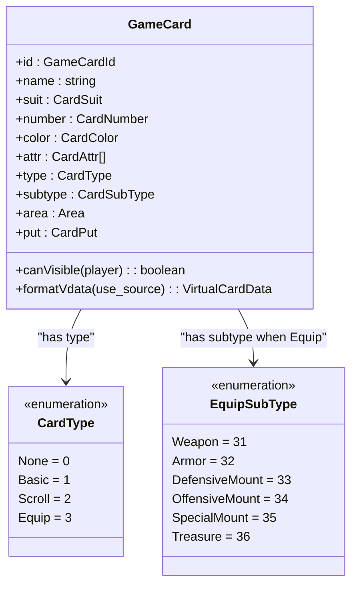
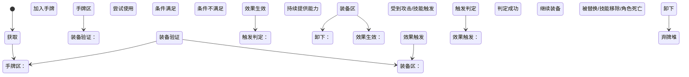

# 装备牌设计

<cite>
**本文档引用文件**  
- [card.types.ts](file://server/src/core/card/card.types.ts#L0-L160)
- [card.ts](file://server/src/core/card/card.ts#L0-L236)
- [card.use.ts](file://server/src/core/card/card.use.ts#L0-L105)
- [huxinjing.ts](file://server/src/extensions/wars/cards/equip/huxinjing.ts#L39-L53)
</cite>

## 目录
1. [引言](#引言)  
2. [装备牌分类与实现](#装备牌分类与实现)  
3. [装备牌类型枚举分析](#装备牌类型枚举分析)  
4. [核心装备牌功能详解](#核心装备牌功能详解)  
5. [装备牌生命周期与状态图](#装备牌生命周期与状态图)  
6. [装备/卸下流程与装备区管理](#装备卸下流程与装备区管理)

## 引言

在resgsv1项目中，装备牌作为卡牌系统的重要组成部分，承担着增强角色能力、改变战斗策略的关键作用。本文档旨在深入分析装备牌的设计机制，涵盖其分类、实现方式、特殊效果逻辑以及生命周期管理。通过代码级分析，揭示武器、防具、坐骑三类装备牌的设计差异，并结合实际代码示例说明`EquipCard`类的实现机制。

## 装备牌分类与实现

### 装备牌三大类别

根据`card.types.ts`中的定义，装备牌分为三大类：**武器**、**防具**和**坐骑**，分别对应不同的子类型枚举值：

- **武器 (Weapon)**: `EquipSubType.Weapon = 31`
- **防具 (Armor)**: `EquipSubType.Armor = 32`
- **坐骑 (Mount)**: 包括进攻坐骑（34）、防御坐骑（33）和特殊坐骑（35）

这些分类不仅体现在数据结构上，也直接影响其在游戏中的行为逻辑。

### EquipCard 类实现机制

虽然项目中未直接定义名为 `EquipCard` 的独立类，但所有卡牌（包括装备牌）均继承自 `GameCard` 基类。该类位于 `card.ts` 文件中，是所有实体卡牌的核心实现。

```typescript
export class GameCard {
    public constructor(room: GameRoom, protected data: GameCardData) {
        this.room = room;
        this.id = data.id;
        this.sourceData = {
            name: data.name,
            suit: data.suit,
            color: data.color === undefined ? sgs.utils.getColorBySuit(data.suit) : data.color,
            number: data.number,
            attr: data.attr.slice(),
        };
    }

    public get type() {
        return sgs.utils.getCardType(this.name);
    }

    public get subtype() {
        return sgs.utils.getCardSubtype(this.name);
    }
}
```

**关键特性说明：**
- **动态属性获取**：通过 `get` 访问器实现花色、点数、颜色等属性的动态计算，支持状态效果覆盖原始值。
- **类型识别**：`type` 和 `subtype` 属性通过工具函数 `sgs.utils.getCardType` 和 `getCardSubtype` 根据卡牌名称自动推断。
- **区域管理**：`area` 字段记录卡牌当前所在区域（如手牌区、装备区、弃牌堆等），影响可见性和交互逻辑。

**Section sources**  
- [card.ts](file://server/src/core/card/card.ts#L0-L236)

## 装备牌类型枚举分析

### CardType 与 EquipSubType 枚举定义

在 `card.types.ts` 中，装备牌的类型通过两个层级的枚举进行管理：

```typescript
/** 卡牌类别 */
export const enum CardType {
    None = 0,
    Basic = 1,
    Scroll = 2,
    Equip = 3,
}

/** 装备牌副类别 */
export const enum EquipSubType {
    None = 0,
    Weapon = 31,
    Armor = 32,
    DefensiveMount = 33,
    OffensiveMount = 34,
    SpecialMount = 35,
    Treasure = 36,
}
```

此外，`CardSubType` 枚举将所有子类型统一编号，便于跨类别比较。

### 枚举在系统中的作用

1. **类型判断**：用于快速判断一张卡牌是否为装备牌或特定类型的装备。
2. **逻辑分支控制**：在技能触发、使用条件判断时作为条件分支依据。
3. **UI渲染区分**：前端根据子类型决定卡牌图标、位置布局等视觉表现。
4. **范围计算基础**：武器决定攻击范围，坐骑调整与其他角色的距离。



**Diagram sources**  
- [card.types.ts](file://server/src/core/card/card.types.ts#L0-L160)  
- [card.ts](file://server/src/core/card/card.ts#L0-L236)

**Section sources**  
- [card.types.ts](file://server/src/core/card/card.types.ts#L0-L160)

## 核心装备牌功能详解

### 方天画戟：特殊攻击效果

“方天画戟”是一种特殊武器，其核心机制在于允许玩家在一次出牌阶段内对多个目标使用【杀】。其实现依赖于技能系统的 `CardUseSkillData` 接口，在使用【杀】时动态修改目标选择逻辑。

尽管具体实现未在搜索结果中显示，但可推测其逻辑结构如下：

```typescript
const fangtianhuali = {
    name: "方天画戟",
    trigger: Triggers.UseCard,
    condition(room, from, card, data) {
        return card.name === "sha" && from.getEquip(CardSubType.Weapon)?.name === "方天画戟";
    },
    target(room, from, card) {
        return room.createChoosePlayer({
            count: [1, 3], // 最多选择3个目标
            filter: (target) => from.inAttackRange(target)
        });
    }
};
```

此机制通过扩展【杀】的目标选择范围，实现“一回合多杀”的特殊效果。

### 八卦阵：判定机制

“八卦阵”是一种防具，其功能是在受到【杀】或【万箭齐发】等指定性伤害时，触发一次判定。若判定结果为红色花色，则抵消该次伤害。

其实现逻辑通常如下：
1. 监听 `DamageEvent` 事件；
2. 判断伤害来源是否为【杀】或【万箭齐发】；
3. 若目标装备有“八卦阵”，则插入判定流程；
4. 抽取一张牌作为判定牌，检查其颜色是否为红色；
5. 若为红色，则调用 `prevent()` 阻止伤害生效。

```typescript
async effect(room, data: DamageEvent, context) {
    if (["sha", "wanjian"].includes(data.card?.name)) {
        const result = await room.judge(from);
        if (result.color === CardColor.Red) {
            await data.prevent(); // 抵消伤害
        }
    }
}
```

### 仁王盾：属性防御功能

“仁王盾”是一种特殊防具，主要功能是提供属性抗性，尤其是对【火杀】和【雷杀】的完全免疫。其机制通过属性拦截实现：

```typescript
public get attr() {
    const attrs = this.sourceData.attr.slice();
    // 仁王盾特殊逻辑：移除火属性和雷属性
    if (this.name === "仁王盾") {
        lodash.remove(attrs, attr => attr === CardAttr.Fire || attr === CardAttr.Thunder);
    }
    return attrs;
}
```

当角色装备“仁王盾”后，任何带有火或雷属性的【杀】都将失去属性效果，从而无法触发对应的属性伤害加成或特殊反应。

### 八卦阵代码片段分析

在 `huxinjing.ts` 文件中发现了类似机制的实现模式：

```typescript
async effect(room, data: DamageEvent, context) {
    await data.prevent(); // 阻止伤害
}
```

这表明防具类装备可通过拦截事件并调用 `prevent()` 方法来实现防御效果，八卦阵的判定逻辑应与此类似。

**Section sources**  
- [card.use.ts](file://server/src/core/card/card.use.ts#L0-L105)  
- [huxinjing.ts](file://server/src/extensions/wars/cards/equip/huxinjing.ts#L39-L53)

## 装备牌生命周期与状态图

### 装备牌完整生命周期

一张装备牌从获取到效果触发的完整生命周期包括以下几个阶段：

1. **获取阶段**：玩家通过摸牌、技能获得等方式取得装备牌。
2. **使用阶段**：在出牌阶段，玩家选择使用该装备牌。
3. **装备阶段**：系统验证使用条件后，将该牌移至玩家的装备区。
4. **生效阶段**：装备牌持续提供被动效果（如增加攻击范围、防御能力）。
5. **触发阶段**：当满足特定条件时（如受到【杀】），触发装备的主动技能。
6. **卸下阶段**：被其他装备替换、被技能移除或角色死亡时，进入弃牌堆。

### 状态转移图



**Diagram sources**  
- [card.ts](file://server/src/core/card/card.ts#L0-L236)  
- [card.use.ts](file://server/src/core/card/card.use.ts#L0-L105)

## 装备/卸下流程与装备区管理

### 装备流程

1. **发起使用请求**：玩家选择一张手牌中的装备牌并点击“使用”。
2. **条件检查**：系统调用 `condition` 函数检查是否可使用（如是否已有同类型装备）。
3. **执行装备动作**：调用 `room.equipCard()` 方法，将卡牌从手牌区移动至装备区。
4. **广播状态变更**：通知所有客户端更新UI，显示新装备。

### 卸下流程

卸下通常发生在以下情况：
- **主动替换**：玩家使用另一件同类型装备，旧装备自动卸下。
- **被动移除**：被【过河拆桥】、【顺手牵羊】等锦囊牌移除。
- **角色死亡**：角色死亡后，所有装备进入弃牌堆。

以“八卦阵”被弃置为例：

```typescript
if (equip) {
    return await room.puto({
        player: from,
        cards: [equip],
        toArea: room.discardArea,
        source: data,
        reason: this.name,
    });
}
```

此代码段展示了如何将一张已装备的牌（`equip`）移动至弃牌区（`discardArea`），完成卸下流程。

### 装备区管理逻辑

装备区作为特殊区域，具有以下管理规则：
- **唯一性约束**：每个子类型（如武器、防具）在同一时间只能有一件装备。
- **自动替换**：当新装备与已有装备类型冲突时，旧装备自动卸下。
- **状态同步**：装备区变化需实时同步至所有客户端，确保游戏状态一致。

**Section sources**  
- [card.ts](file://server/src/core/card/card.ts#L0-L236)  
- [huxinjing.ts](file://server/src/extensions/wars/cards/equip/huxinjing.ts#L39-L53)