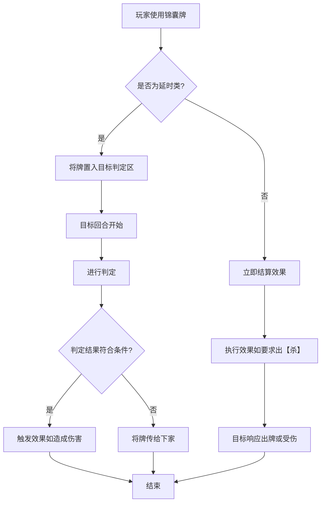

# 锦囊牌设计

<cite>
**本文档引用的文件**  
- [lang_cards.ts](file://server/src/extensions/lang/lang_cards.ts)
- [icard.ts](file://server/src/core/card/icard.ts)
- [card.types.ts](file://server/src/core/card/card.types.ts)
- [xunyou.ts](file://server/src/extensions/wars/generals/power/xunyou.ts)
- [luyusheng.js](file://server/build/extensions/wars/generals/zongheng/luyusheng.js)
</cite>

## 目录
1. [引言](#引言)  
2. [锦囊牌分类与机制](#锦囊牌分类与机制)  
3. [TrickCard 类实现分析](#trickcard-类实现分析)  
4. [TrickCardType 枚举定义](#trickcardtype-枚举定义)  
5. [作用范围与目标选择规则](#作用范围与目标选择规则)  
6. [连锁反应与反制机制](#连锁反应与反制机制)  
7. [执行流程活动图](#执行流程活动图)  
8. [结论](#结论)

## 引言
锦囊牌是《三国杀》类游戏中策略性极强的一类卡牌，分为延时类与非延时类两种。在 resgsv1 项目中，锦囊牌的设计通过类型系统、事件触发机制与状态管理实现了复杂的交互逻辑。本文将深入分析其分类机制、核心类实现、作用范围与执行流程，帮助开发者理解其设计原理。

## 锦囊牌分类与机制

锦囊牌根据生效时机可分为两类：**延时类锦囊**和**非延时类锦囊**。

### 延时类锦囊
延时类锦囊（如“闪电”、“乐不思蜀”）不会立即生效，而是被置入目标角色的**判定区**，在特定时机（通常是回合开始或结束时）进行判定后才触发效果。

- **闪电**：使用后置入使用者判定区。每回合判定一次，若结果为黑桃2-9，则造成3点雷电伤害，否则传给下家。
- **乐不思蜀**：对其他角色使用，若判定结果不为红桃，则目标跳过出牌阶段。

### 非延时类锦囊
非延时类锦囊（如“无懈可击”、“南蛮入侵”）在使用后立即结算效果。

- **无懈可击**：用于抵消其他锦囊牌或另一张“无懈可击”的效果。
- **南蛮入侵**：所有其他角色需打出【杀】，否则受到1点伤害。

**Section sources**  
- [lang_cards.ts](file://server/src/extensions/lang/lang_cards.ts#L48-L68)

## TrickCard 类实现分析

虽然未直接提供 `TrickCard` 类的源码，但可通过其使用上下文推断其实现结构。锦囊牌作为 `ICard` 的子类，继承了基础属性并扩展了效果逻辑。

### 无懈可击的反制逻辑
“无懈可击”通过事件拦截机制实现反制。当一张锦囊牌即将生效时，系统会触发一个可被“无懈可击”响应的事件。

```typescript
// 伪代码示例：无懈可击的反制机制
class WuXieKeJi extends TrickCard {
    onUse(room: Room, target: Player, source: Player) {
        // 监听即将生效的锦囊牌事件
        const pendingEffect = room.getPendingEffect();
        if (pendingEffect) {
            // 抵消原效果
            pendingEffect.cancel();
            // 可被另一张无懈可击抵消
            room.addCounterEffect(this, target);
        }
    }
}
```

### 乐不思蜀的状态添加机制
“乐不思蜀”通过将自身置入目标的**判定区**来实现延时效果，并绑定一个触发器，在目标回合开始时自动判定。

```typescript
// 伪代码示例：乐不思蜀的延时机制
class LeBuSiShu extends DelayedTrickCard {
    onUse(room: Room, target: Player, source: Player) {
        // 将牌置入目标判定区
        target.judgeArea.add(this);
        // 注册回合开始时的判定事件
        const effect = room.addEffect('lebusishu.delay', target);
        effect.setData('target', target);
    }
}
```

### 闪电的延时判定效果
“闪电”的判定逻辑更为复杂，涉及牌的传递与伤害判定。

```typescript
// 伪代码示例：闪电的判定逻辑
class ShanDian extends DelayedTrickCard {
    onJudge(result: Card) {
        if (result.suit === Suit.Spade && result.number >= 2 && result.number <= 9) {
            // 造成3点雷电伤害
            this.target.takeDamage(3, DamageType.Thunder);
        } else {
            // 传递给下家
            const nextPlayer = this.target.getNext();
            nextPlayer.judgeArea.add(this);
        }
    }
}
```

**Section sources**  
- [icard.ts](file://server/src/core/card/icard.ts#L0-L46)  
- [xunyou.ts](file://server/src/extensions/wars/generals/power/xunyou.ts#L63-L97)

## TrickCardType 枚举定义

在 `card.types.ts` 文件中，`CardType` 枚举定义了卡牌的类型，其中明确区分了锦囊牌。

```typescript
/** 卡牌类型 */
export const enum CardType {
    Basic = 1,        // 基本牌
    Trick = 2,        // 锦囊牌
    Equip = 3,        // 装备牌
    DelayedTrick = 4, // 延时锦囊牌
    // ... 其他类型
}
```

此外，`CardSubType` 进一步细分了锦囊牌的子类型：

```typescript
/** 卡牌子类型 */
export const enum CardSubType {
    NormalTrick = 21,     // 普通锦囊牌
    DelayedTrick = 22,    // 延时锦囊牌
    // ... 其他子类型
}
```

该枚举在锦囊系统中起到核心作用：
- **类型判断**：通过 `card.type === CardType.Trick` 判断是否为锦囊牌。
- **效果分发**：不同子类型触发不同的结算逻辑。
- **UI展示**：根据类型渲染不同的卡牌边框与图标。

**Section sources**  
- [card.types.ts](file://server/src/core/card/card.types.ts#L124-L159)

## 作用范围与目标选择规则

锦囊牌的作用范围和目标选择由其描述和代码逻辑共同决定。

| 锦囊牌 | 使用时机 | 使用目标 | 作用范围 |
|--------|----------|----------|----------|
| 南蛮入侵 | 出牌阶段 | 所有其他角色 | 全局 |
| 无懈可击 | 任何时机 | 一张锦囊牌 | 单体/反制 |
| 乐不思蜀 | 出牌阶段 | 一名其他角色 | 单体 |
| 闪电 | 出牌阶段 | 你 | 自身 |
| 五谷丰登 | 出牌阶段 | 所有角色 | 全局 |

目标选择通常通过 `createChoosePlayer` 方法实现，允许玩家在符合条件的角色中进行选择。

```typescript
// 示例：创建目标选择器
const targetSelector = room.createChoosePlayer({
    filter: (player) => player !== from, // 排除自己
    canConfirm: (selected) => selected.length === 1 // 必须选择一人
});
```

**Section sources**  
- [lang_cards.ts](file://server/src/extensions/lang/lang_cards.ts#L83-L92)

## 连锁反应与反制机制

锦囊牌系统支持复杂的连锁反应，尤其是“无懈可击”的反制链。

### 反制链机制
当一张锦囊牌被使用时，任何玩家可打出“无懈可击”进行抵消。若有人对“无懈可击”再使用“无懈可击”，则原效果恢复。此过程可无限循环，直至一方不再响应。

### 技能联动
部分武将技能可与锦囊牌联动。例如，荀彧的“奇策”技能允许其将所有手牌当任意普通锦囊牌使用。

```typescript
// 示例：荀彧的奇策技能
prompt: `奇策，你可以将所有手牌当任意普通锦囊牌（目标数不能大于你的手牌数）`
```

这通过虚拟卡牌（VirtualCard）机制实现，动态生成符合规则的锦囊牌。

**Section sources**  
- [xunyou.ts](file://server/src/extensions/wars/generals/power/xunyou.ts#L63-L97)

## 执行流程活动图

以下活动图展示了锦囊牌从使用到效果结算的完整流程。



**Diagram sources**  
- [luyusheng.js](file://server/build/extensions/wars/generals/zongheng/luyusheng.js#L114-L155)  
- [lang_cards.ts](file://server/src/extensions/lang/lang_cards.ts#L48-L68)

## 结论
resgsv1 中的锦囊牌设计通过清晰的类型划分、事件驱动的执行机制与灵活的状态管理，实现了《三国杀》中复杂多变的策略交互。延时类与非延时类锦囊的区分确保了不同结算时机的正确处理，而“无懈可击”的反制链和武将技能的联动则极大丰富了游戏的策略深度。该设计模式具有良好的扩展性，便于新增卡牌与技能。