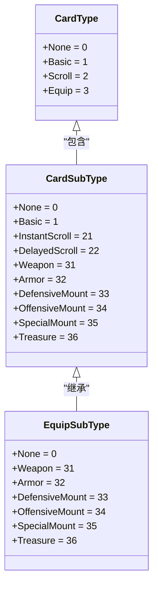
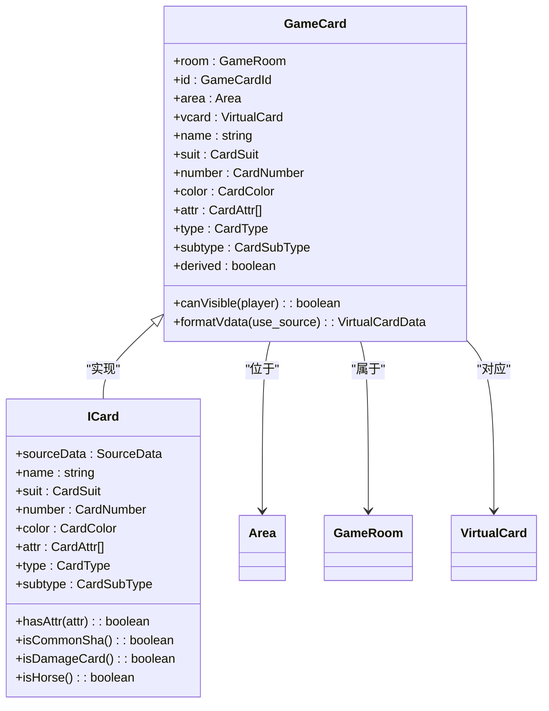
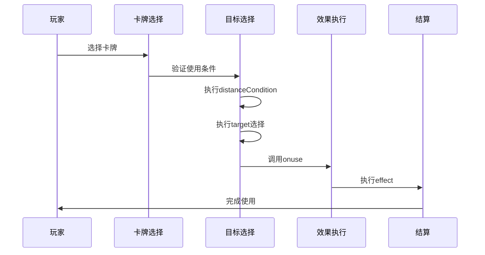
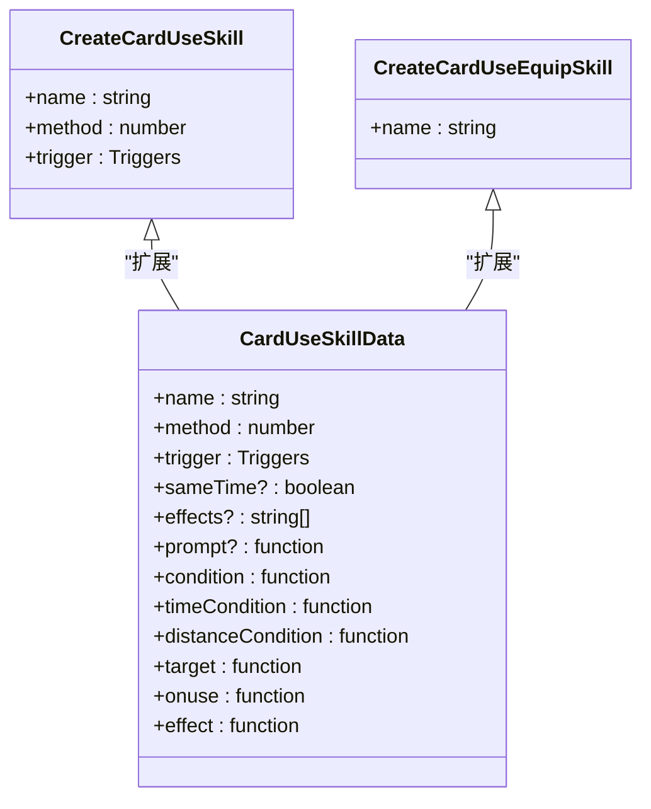
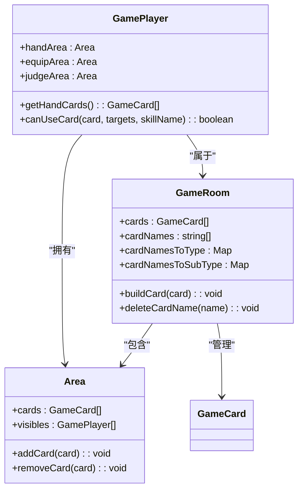
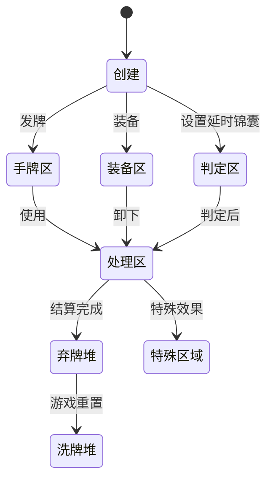

# 卡牌系统设计

<cite>
**本文档引用文件**  
- [card.ts](file://server/src/core/card/card.ts)
- [card.types.ts](file://server/src/core/card/card.types.ts)
- [card.use.ts](file://server/src/core/card/card.use.ts)
- [icard.ts](file://server/src/core/card/icard.ts)
- [room.ts](file://server/src/core/room/room.ts)
</cite>

## 目录
1. [引言](#引言)
2. [卡牌类型体系](#卡牌类型体系)
3. [卡牌基类设计](#卡牌基类设计)
4. [卡牌使用逻辑处理](#卡牌使用逻辑处理)
5. [卡牌与角色及装备区交互](#卡牌与角色及装备区交互)
6. [具体卡牌实现示例](#具体卡牌实现示例)
7. [卡牌生命周期状态图](#卡牌生命周期状态图)

## 引言

卡牌系统是resgsv1游戏的核心机制之一，负责管理所有卡牌的创建、使用、效果结算和状态流转。本系统采用面向对象的设计模式，通过继承和接口实现不同类型卡牌的统一管理和差异化行为。卡牌系统与角色、区域、事件等模块紧密协作，构成了完整的游戏逻辑闭环。

**Section sources**
- [card.ts](file://server/src/core/card/card.ts#L1-L237)
- [card.types.ts](file://server/src/core/card/card.types.ts#L1-L161)

## 卡牌类型体系

### 卡牌分类结构

卡牌系统采用多层分类体系，通过枚举类型定义卡牌的类别和子类别：



**Diagram sources**
- [card.types.ts](file://server/src/core/card/card.types.ts#L50-L100)

### 基本牌
基本牌是游戏中最基础的卡牌类型，包括：
- **杀**：攻击类卡牌，可造成伤害
- **闪**：防御类卡牌，可抵消"杀"
- **桃**：回复类卡牌，可恢复体力

### 装备牌
装备牌分为多个子类别：
- **武器**：提升攻击范围和能力
- **防具**：提供防御加成
- **坐骑**：分为进攻和防御坐骑，影响角色间距离
- **宝物**：特殊功能装备

### 锦囊牌
锦囊牌分为两类：
- **非延时锦囊**：立即生效的效果
- **延时锦囊**：需放置在角色判定区，下回合生效

**Section sources**
- [card.types.ts](file://server/src/core/card/card.types.ts#L50-L120)

## 卡牌基类设计

### GameCard类结构

卡牌基类`GameCard`采用组合继承模式，核心设计如下：



**Diagram sources**
- [card.ts](file://server/src/core/card/card.ts#L1-L237)
- [icard.ts](file://server/src/core/card/icard.ts#L1-L47)

### 核心属性与方法

#### 属性设计
- **id**：卡牌唯一标识符
- **area**：当前所处区域（手牌区、装备区、判定区等）
- **vcard**：对应的虚拟卡牌对象
- **sourceData**：原始卡牌数据快照

#### 动态属性获取
卡牌的属性值可通过游戏状态进行动态修改：

```typescript
public get name() {
    const name = this.room
        .getStates(StateEffectType.Regard_CardData, [
            this,
            'name',
            this.sourceData.name,
        ])
        .at(-1) as string;
    if (
        this.room.hasMark('wars.aozhan') &&
        this.sourceData.name === 'tao' &&
        !name
    ) {
        return 'aozhan';
    }
    return name ? name : this.sourceData.name;
}
```

此设计支持"鏖战"等特殊状态下的卡牌名称变更。

#### 可见性控制
```typescript
public canVisible(player: GamePlayer) {
    if (this.put === CardPut.Up) return true;
    if (this.area && this.area.visibles.includes(player)) return true;
    const v = !!this.visibles.find((v) => v.includes(player.playerId));
    if (v) return true;
    return this.room
        .getStates(StateEffectType.FieldCardEyes, [player, this])
        .some((v) => v);
}
```

**Section sources**
- [card.ts](file://server/src/core/card/card.ts#L1-L237)

## 卡牌使用逻辑处理

### 卡牌使用流程



**Diagram sources**
- [card.use.ts](file://server/src/core/card/card.use.ts#L1-L106)

### CardUseSkillData接口

卡牌使用技能的核心接口定义了完整的使用流程：



**Diagram sources**
- [card.use.ts](file://server/src/core/card/card.use.ts#L1-L106)

### 使用流程关键方法

#### 条件检测
```typescript
condition: (
    room: GameRoom,
    from: GamePlayer,
    card: VirtualCard,
    data: EventData
) => boolean | VirtualCard
```
在卡牌使用前进行条件验证，可返回false阻止使用或返回修改后的虚拟卡牌。

#### 距离检测
```typescript
distanceCondition: (
    room: GameRoom,
    from: GamePlayer,
    target: GamePlayer,
    card: VirtualCard
) => boolean
```
验证攻击距离是否满足要求。

#### 目标选择
```typescript
target: (
    room: GameRoom,
    from: GamePlayer,
    card: VirtualCard
) => ChoosePlayerData
```
定义目标选择的规则和限制。

#### 效果执行
```typescript
effect: (
    room: GameRoom,
    target: TargetListItem | TargetCardListItem,
    data: UseCardEvent | UseCardToCardEvent | UseCardSpecialEvent
) => Promise<void>
```
执行卡牌的核心效果逻辑。

**Section sources**
- [card.use.ts](file://server/src/core/card/card.use.ts#L1-L106)

## 卡牌与角色及装备区交互

### 区域管理机制



**Diagram sources**
- [room.ts](file://server/src/core/room/room.ts#L398-L436)
- [card.ts](file://server/src/core/card/card.ts#L1-L237)

### 卡牌创建与注册

当新卡牌被创建时，房间会自动注册卡牌信息：

```typescript
public buildCard(card: GameCard) {
    if (!card) return;
    this.cards.push(card);
    if (!this.cardNames.includes(card.name) && !card.derived) {
        const name = card.name;
        this.cardNames.push(name);
        const type = sgs.utils.getCardType(name);
        if (this.cardNamesToType.has(type)) {
            this.cardNamesToType.get(type).push(name);
        } else {
            this.cardNamesToType.set(type, [name]);
        }
        const subtype = sgs.utils.getCardSubtype(name);
        if (this.cardNamesToSubType.has(subtype)) {
            this.cardNamesToSubType.get(subtype).push(name);
        } else {
            this.cardNamesToSubType.set(subtype, [name]);
        }
    }
}
```

### 使用过程中的区域转移

卡牌使用时会经历以下区域转移：

```typescript
await this.room.moveCards({
    move_datas: [
        {
            cards: this.card.subcards,
            toArea: this.room.processingArea,
            reason: MoveCardReason.Use,
            animation: true,
            viewas: this.card.vdata,
            label: {
                text: '#Move_Use',
                values: [{ type: 'player', value: this.from.playerId }],
            },
        },
    ],
    source: this,
    reason: 'use',
});
```

**Section sources**
- [room.ts](file://server/src/core/room/room.ts#L398-L436)
- [event.use.ts](file://server/src/core/event/types/event.use.ts#L935-L972)

## 具体卡牌实现示例

### '桃'卡牌实现

```typescript
// 桃卡牌的name属性获取
public get name() {
    const name = this.room
        .getStates(StateEffectType.Regard_CardData, [
            this,
            'name',
            this.sourceData.name,
        ])
        .at(-1) as string;
    // 鏖战模式下桃变为鏖战
    if (
        this.room.hasMark('wars.aozhan') &&
        this.sourceData.name === 'tao' &&
        !name
    ) {
        return 'aozhan';
    }
    return name ? name : this.sourceData.name;
}
```

### '闪'卡牌特性

```typescript
// 在ICard基类中定义的通用方法
public isCommonSha() {
    return (
        this.name === 'sha' &&
        !this.attr.includes(CardAttr.Fire) &&
        !this.attr.includes(CardAttr.Thunder)
    );
}

public isDamageCard() {
    return sgs.utils.isDamageCard(this.name);
}
```

### '明光铠'装备牌实现

虽然没有直接代码，但基于装备牌设计模式，'明光铠'作为防具应具有以下特征：
- 子类型为`CardSubType.Armor`
- 放置在角色的装备区
- 提供特定的防御效果
- 可能具有特殊属性（如`CardAttr.Recastable`）

**Section sources**
- [card.ts](file://server/src/core/card/card.ts#L1-L237)
- [icard.ts](file://server/src/core/card/icard.ts#L1-L47)

## 卡牌生命周期状态图



**Diagram sources**
- [event.use.ts](file://server/src/core/event/types/event.use.ts#L935-L972)
- [card.ts](file://server/src/core/card/card.ts#L1-L237)

卡牌从创建到最终进入弃牌堆的完整生命周期包括：
1. **创建**：卡牌对象被实例化
2. **分配**：卡牌被分配到不同区域
3. **使用**：卡牌从手牌区移动到处理区
4. **结算**：执行卡牌效果
5. **回收**：进入弃牌堆等待重新洗牌