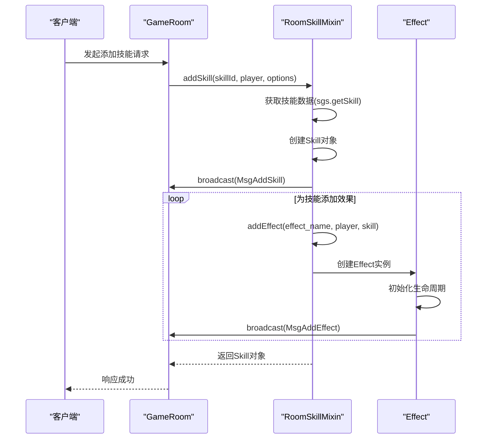
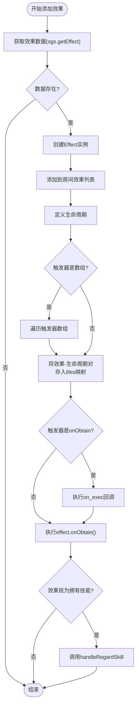
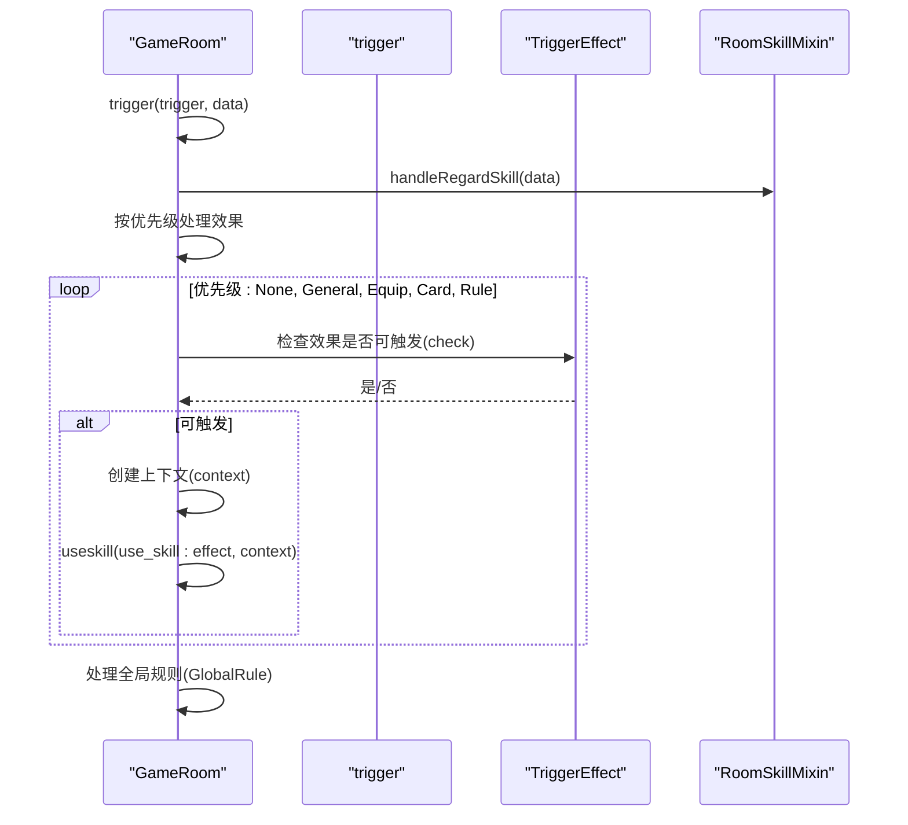

# 执行中协调

<cite>
**本文档中引用的文件**  
- [room.skill.ts](file://server/src/core/room/mixins/room.skill.ts)
- [room.ts](file://server/src/core/room/room.ts)
</cite>

## 目录
1. [引言](#引言)
2. [项目结构](#项目结构)
3. [核心组件](#核心组件)
4. [架构概览](#架构概览)
5. [详细组件分析](#详细组件分析)
6. [依赖分析](#依赖分析)
7. [性能考虑](#性能考虑)
8. [故障排除指南](#故障排除指南)
9. [结论](#结论)

## 引言
本文档详细阐述了resgsv1项目中技能执行过程中的协调机制，重点聚焦于房间级技能管理器如何在多技能并发执行场景下进行状态管理与并发控制。文档深入分析了`room.skill.ts`文件中实现的技能队列管理、执行优先级处理、事件广播机制以及技能连锁反应的嵌套执行逻辑。通过代码示例和序列图，展示了技能执行中状态变更的具体实现，旨在为开发者提供一个清晰、全面的技术参考。

## 项目结构
resgsv1项目采用典型的客户端-服务器架构。服务器端（`server`目录）是本分析的核心，其`src/core/room`目录下的`room.ts`文件定义了游戏房间的核心逻辑，而`mixins`子目录中的`room.skill.ts`文件则专门负责技能相关的功能。`room.skill.ts`通过`RoomSkillMixin`类为`GameRoom`提供了技能和效果的增删、管理及触发能力。客户端（`client`目录）主要负责用户界面和动画资源。

**Section sources**
- [room.skill.ts](file://server/src/core/room/mixins/room.skill.ts#L0-L405)
- [room.ts](file://server/src/core/room/room.ts#L0-L1522)

## 核心组件
`RoomSkillMixin`类是技能执行协调的核心。它提供了`addSkill`、`removeSkill`、`addEffect`和`removeEffect`等关键方法，用于管理游戏中的技能和效果。这些方法不仅负责创建和销毁对象，还通过`broadcast`方法向客户端广播状态变更，确保了服务器与客户端的状态同步。

**Section sources**
- [room.skill.ts](file://server/src/core/room/mixins/room.skill.ts#L15-L405)

## 架构概览

```mermaid
graph TB
subgraph "服务器端"
Room[GameRoom]
SkillMixin[RoomSkillMixin]
Effect[Effect]
TriggerEffect[TriggerEffect]
StateEffect[StateEffect]
Event[EventProcess]
end
subgraph "客户端"
UI[用户界面]
end
Room --> SkillMixin : "包含"
SkillMixin --> Effect : "创建"
Effect --> TriggerEffect : "继承"
Effect --> StateEffect : "继承"
Room --> Event : "触发"
Event --> SkillMixin : "调用"
Room --> UI : "广播消息"
```

**Diagram sources**
- [room.skill.ts](file://server/src/core/room/mixins/room.skill.ts#L15-L405)
- [room.ts](file://server/src/core/room/room.ts#L0-L1522)

## 详细组件分析

### 技能与效果管理分析

`RoomSkillMixin`类通过`addSkill`和`addEffect`方法实现了技能和效果的生命周期管理。

#### 添加技能


**Diagram sources**
- [room.skill.ts](file://server/src/core/room/mixins/room.skill.ts#L15-L45)

#### 添加效果
`addEffect`方法是技能执行逻辑的核心。它根据效果类型（`Trigger`或`State`）创建相应的`TriggerEffect`或`StateEffect`实例，并将其注册到房间的全局效果列表中。最关键的是，它会解析效果的`lifecycle`（生命周期），并将其与特定的事件触发器（如`onObtain`、`onLose`）关联起来，从而实现事件驱动的技能执行。



**Diagram sources**
- [room.skill.ts](file://server/src/core/room/mixins/room.skill.ts#L100-L200)

### 技能执行与并发控制分析
技能的并发执行由`GameRoom`的`trigger`方法协调。该方法根据预设的优先级（`PriorityType`）对不同类型的技能效果进行排序和处理。



**Diagram sources**
- [room.ts](file://server/src/core/room/room.ts#L853-L882)
- [room.skill.ts](file://server/src/core/room/mixins/room.skill.ts#L15-L405)

### 技能连锁反应处理逻辑
技能连锁反应通过`lifes`映射和`handleRegardSkill`方法实现。当一个事件（如`onObtain`）被触发时，`trigger`方法会检查`lifes`映射中是否有与该事件关联的生命周期。如果有，则执行相应的`on_exec`回调，这可能导致新的技能被添加（例如，通过`addSkill`），从而形成连锁反应。

例如，在`caocao.ts`文件中，曹操的技能在`TurnStart`时会移除之前获得的技能，这正是通过在`lifecycle`中定义`on_exec`回调来实现的。

**Section sources**
- [room.skill.ts](file://server/src/core/room/mixins/room.skill.ts#L300-L350)
- [caocao.ts](file://server/src/extensions/wars/generals/lords/caocao.ts#L418-L452)

## 依赖分析

```mermaid
classDiagram
class GameRoom {
+skills : Skill[]
+effects : Effect[]
+trigger_effects_priority : Map~PriorityType, TriggerEffect[]~
+lifes : Map~Triggers, {before : [], after : []}~
+addSkill()
+removeSkill()
+addEffect()
+removeEffect()
+trigger()
+handleRegardSkill()
}
class RoomSkillMixin {
+addSkill()
+removeSkill()
+addEffect()
+removeEffect()
+handleRegardSkill()
}
class Skill {
+id : number
+player : GamePlayer
+data : SkillData
+options : SkillOptions
+effects : Effect[]
}
class Effect {
+id : number
+room : GameRoom
+player : GamePlayer
+data : EffectData
+fromSkill : Skill
+check()
+getContext()
+onObtain()
+onLose()
}
class TriggerEffect {
<<extends>>
}
class StateEffect {
<<extends>>
}
GameRoom --> RoomSkillMixin : "混入"
GameRoom --> Skill : "包含"
GameRoom --> Effect : "包含"
Effect <|-- TriggerEffect
Effect <|-- StateEffect
RoomSkillMixin --> Skill : "创建"
RoomSkillMixin --> Effect : "创建"
```

**Diagram sources**
- [room.skill.ts](file://server/src/core/room/mixins/room.skill.ts#L15-L405)
- [room.ts](file://server/src/core/room/room.ts#L0-L1522)

## 性能考虑
技能执行的性能主要受`trigger`方法中循环和`check`函数的影响。`trigger_effects_priority`的Map结构确保了按优先级处理的效率。然而，`handleRegardSkill`方法在每次触发时都会遍历所有玩家和效果，这在大规模游戏中可能成为性能瓶颈，建议对其进行优化，例如通过缓存或更精细的触发条件来减少不必要的计算。

## 故障排除指南
当遇到技能未按预期触发的问题时，应检查以下几点：
1.  **事件触发器是否匹配**：确认技能效果的`lifecycle`中定义的`trigger`与实际触发的事件类型一致。
2.  **检查条件是否满足**：`Effect`的`check()`方法必须返回`true`，技能才会被激活。
3.  **优先级设置**：高优先级的技能可能会阻止低优先级技能的执行，检查`PriorityType`的设置。
4.  **生命周期执行**：确保`on_exec`回调没有抛出异常，这可能会中断整个触发流程。

**Section sources**
- [room.skill.ts](file://server/src/core/room/mixins/room.skill.ts#L100-L200)
- [room.ts](file://server/src/core/room/room.ts#L853-L882)

## 结论
resgsv1项目通过`RoomSkillMixin`和`GameRoom`的协同工作，构建了一个强大且灵活的技能执行系统。该系统通过事件驱动、优先级队列和生命周期管理，有效地协调了多个技能的并发执行，支持复杂的技能连锁反应。其设计模式清晰，但`handleRegardSkill`等方法在性能上仍有优化空间。整体而言，这是一个结构良好、功能完备的技能管理系统。