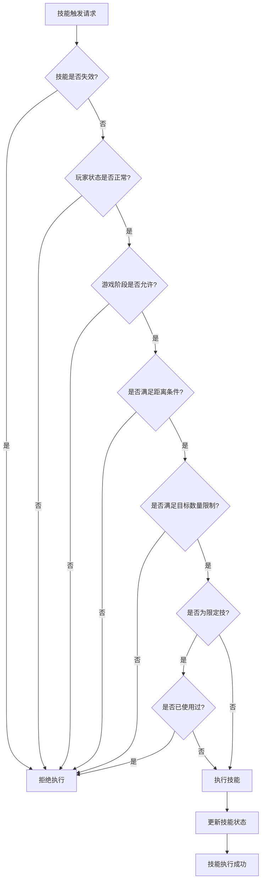

# 执行前处理

<cite>
**本文档引用文件**   
- [effect.ts](file://server/src/core/skill/effect.ts#L42-L119)
- [player.ts](file://server/src/core/player/player.ts#L916-L949)
- [room.ts](file://server/src/core/room/room.ts#L1117-L1150)
- [effect.ts](file://server/src/core/skill/effect.ts#L258-L293)
- [room.ts](file://server/src/core/room/room.ts#L672-L699)
</cite>

## 目录
1. [技能执行前条件验证机制](#技能执行前条件验证机制)  
2. [玩家技能状态管理](#玩家技能状态管理)  
3. [技能目标选择逻辑](#技能目标选择逻辑)  
4. [技能条件验证代码示例](#技能条件验证代码示例)  
5. [技能执行前处理流程图](#技能执行前处理流程图)

## 技能执行前条件验证机制

在resgsv1系统中，技能执行前的条件验证是一个多层次、多维度的综合检查过程。该机制确保只有满足所有前置条件的技能才能被成功触发和执行。

### 玩家状态验证

系统首先检查玩家的基本状态是否允许技能执行。这包括：
- **存活状态**：死亡玩家无法执行任何技能
- **回合状态**：技能通常只能在自己的回合内或特定时机触发
- **特殊状态**：如翻面、休整等状态会限制技能使用

### 游戏阶段验证

技能的触发受到当前游戏阶段的严格限制。系统通过`PhaseEvent`和`TurnEvent`来判断当前所处的阶段，确保技能只能在允许的阶段被使用。例如，某些技能只能在出牌阶段使用，而另一些则可能在判定阶段或结束阶段触发。

### 技能冷却时间验证

系统通过标记（Mark）机制来管理技能的冷却时间。对于限定技，系统会检查玩家是否已设置对应的限制标记：

```typescript
// 限定技验证逻辑
if (this.isLimit) {
    const limit = this.player?.getMark<string>(`@limit:${this.id}`);
    if (!limit || limit === '@limit-false') return false;
}
```

此代码段展示了如何通过`getMark`方法检查技能的使用状态，确保限定技不会被重复使用。

### 技能失效状态检查

技能可能因为多种原因而失效，系统通过`_invalids`数组来记录这些失效原因：

```typescript
/** 技能是否失效 */
public get isInvalid() {
    if (this.hasTag(SkillTag.Eternal)) return false;
    return (
        this._invalids.length > 0 ||
        this.room
            .getStates(StateEffectType.Skill_Invalidity, [this])
            .some((v) => v)
    );
}
```

当技能处于失效状态时，`isInvalid`属性返回`true`，阻止技能的执行。

**Section sources**
- [effect.ts](file://server/src/core/skill/effect.ts#L42-L82)

## 玩家技能状态管理

player.ts文件中实现了完整的玩家技能状态管理体系，通过多种机制确保技能状态的准确性和一致性。

### 技能状态数据结构

玩家技能状态主要通过以下属性进行管理：
- `_invalids`：记录技能失效的原因数组
- `regardSkills`：存储因技能而视为拥有的技能映射
- 各种标签（Tag）：用于标识技能类型和特性

### 权限校验机制

在技能执行前，系统会进行严格的权限校验，确保玩家有资格使用该技能：

```typescript
// 主副将技权限校验
if (this.hasTag(SkillTag.Head)) {
    if (
        this.skill &&
        this.player &&
        this.skill.sourceGeneral !== this.player.head
    )
        return false;
}
if (this.hasTag(SkillTag.Deputy)) {
    if (
        this.skill &&
        this.player &&
        this.skill.sourceGeneral !== this.player.deputy
    )
        return false;
}
```

这段代码确保主将技只能由主将使用，副将技只能由副将使用，维护了游戏的平衡性。

### 技能生命周期管理

系统通过生命周期事件来管理技能的状态变化。例如，在曹操的技能实现中：

```typescript
lifecycle: [
    {
        trigger: EventTriggers.TurnStart,
        priority: 'before',
        async on_exec(room, data: TurnEvent) {
            if (data.player === this.player) {
                // 回合开始时清理技能
                const skills = this.getData<Skill[]>(`${this.name}.skills`) ?? [];
                for (const skill of skills) {
                    await skill.removeSelf();
                }
            }
        },
    },
]
```

这种机制确保技能状态在适当的时机被正确初始化或清理。

**Section sources**
- [effect.ts](file://server/src/core/skill/effect.ts#L79-L119)
- [player.ts](file://server/src/core/player/player.ts#L916-L949)

## 技能目标选择逻辑

技能目标选择是技能执行前处理的重要环节，系统支持多种目标选择模式。

### 单目标选择

对于单目标技能，系统通过简单的条件判断来确定目标：

```typescript
// 距离检测
const pass = this.room
    .getStates(StateEffectType.TargetMod_PassDistanceCheck, [this, _card, target])
    .some((v) => v);
if (!pass) {
    const check = use_skill.distanceCondition.call(
        use_skill,
        this.room,
        this,
        target,
        _card
    );
    if (!check) return false;
}
```

### 多目标选择

多目标技能需要更复杂的逻辑来处理目标数量限制：

```typescript
// 目标数量检测
const uses = this.getMark<number>(`__${card.name}_times`) ?? 0;
if (uses >= times) return false;
```

系统通过标记来记录已选择的目标数量，确保不超过技能规定的上限。

### 区域目标处理

对于影响区域的技能，系统通过距离计算来确定影响范围：

```typescript
/** 与其他角色的距离 */
public distanceTo(to: GamePlayer) {
    return this.room.distance(this, to);
}

/** 攻击范围内是否包含 */
public rangeOf(to: GamePlayer) {
    if (to === this) return false;
    return this.range >= this.distanceTo(to);
}
```

这些方法共同构成了区域目标选择的基础。

**Section sources**
- [player.ts](file://server/src/core/player/player.ts#L916-L949)
- [room.ts](file://server/src/core/room/room.ts#L1117-L1150)

## 技能条件验证代码示例

以下是技能条件验证的具体实现代码，展示了如何处理复杂的前置条件组合。

### 复合条件验证

```typescript
public check(data?: EventData) {
    // 技能失效不能发动
    if (this.isInvalid) return false;
    if (this.skill && !this.skill.check()) return false;
    
    // 主副将技验证
    const hd = this.skill &&
        this.room
            .getStates(StateEffectType.IgnoreHeadAndDeputy, [this])
            .some((v) => v);
    if (!hd) {
        if (this.hasTag(SkillTag.Head)) {
            if (this.skill && this.player && 
                this.skill.sourceGeneral !== this.player.head)
                return false;
        }
    }
    
    // 限定技验证
    if (this.isLimit) {
        const limit = this.player?.getMark<string>(`@limit:${this.id}`);
        if (!limit || limit === '@limit-false') return false;
    }
    
    // 阵法技验证
    if (this.isArray) {
        if (this.room.aliveCount < 4) return false;
    }
    
    return true;
}
```

### 国战化身耦合检测

```typescript
// 国战化身耦合检测
if (this.skill && this.skill.getData('huashen_source')) {
    const general = this.skill.getData('huashen_source');
    if (this.room.getData(`huashen_cost_${general.id}`))
        return false;
    if (this.hasTag())
        return false;
}
```

这些代码展示了如何将多个验证条件组合在一起，形成完整的技能前置条件检查体系。

**Section sources**
- [effect.ts](file://server/src/core/skill/effect.ts#L258-L293)

## 技能执行前处理流程图



**Diagram sources**
- [effect.ts](file://server/src/core/skill/effect.ts#L42-L82)
- [room.ts](file://server/src/core/room/room.ts#L672-L699)