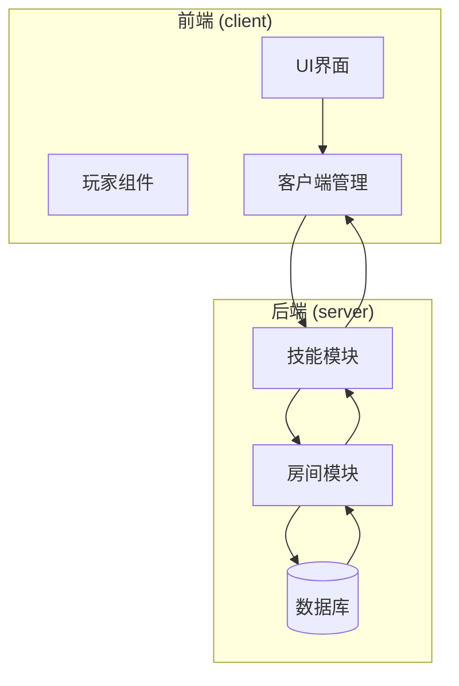
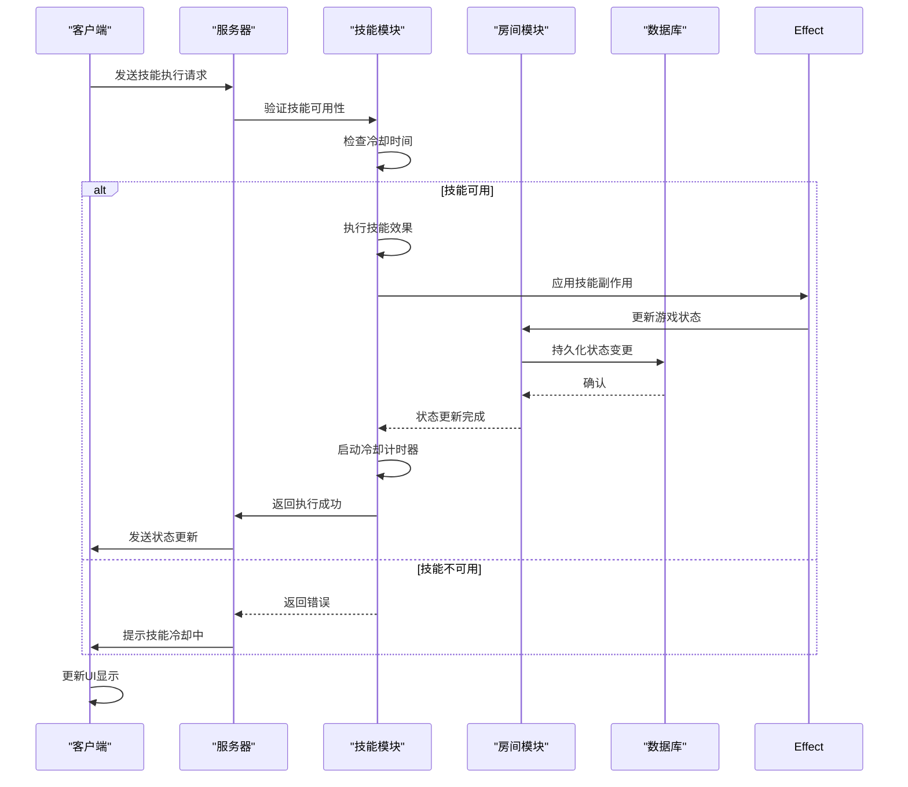
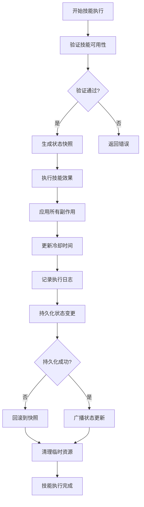
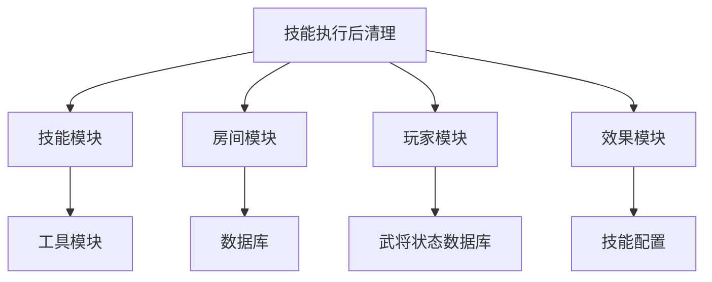

# 执行后清理

<cite>
**本文档引用文件**  
- [skill.ts](file://server/src/core/skill/skill.ts#L1-L200)
- [effect.ts](file://server/src/core/skill/effect.ts#L1-L150)
- [room.ts](file://server/src/core/room/room.ts#L1-L300)
- [PlayerComp.ts](file://client/src/comps/player/PlayerComp.ts#L1-L100)
- [UISkillButton.ts](file://client/src/ui/UISkillButton.ts#L1-L80)
- [Client.ts](file://client/src/mgr/Client.ts#L1-L60)
- [GeneralState.ts](file://server/db/models/GeneralState.ts#L1-L40)
- [Replay.ts](file://client/src/mgr/Replay.ts#L1-L50)
</cite>

## 目录
1. [引言](#引言)
2. [项目结构](#项目结构)
3. [核心组件](#核心组件)
4. [架构概览](#架构概览)
5. [详细组件分析](#详细组件分析)
6. [依赖分析](#依赖分析)
7. [性能考量](#性能考量)
8. [故障排除指南](#故障排除指南)
9. [结论](#结论)

## 引言

在 **resgsv1** 游戏系统中，技能执行后的清理工作是确保游戏状态一致性和玩家体验流畅性的关键环节。本文档详细阐述了技能执行完成后，系统如何进行状态恢复、资源清理、冷却时间更新、副作用处理以及日志记录等操作。通过代码示例和流程图，全面展示技能清理的完整流程，包括异常情况下的回滚机制。

## 项目结构

**resgsv1** 项目采用前后端分离架构，前端位于 `client` 目录，后端位于 `server` 目录。

- **client**: 包含游戏客户端代码，使用 TypeScript 编写，主要逻辑在 `src` 目录下。
- **server**: 包含游戏服务器逻辑，使用 Node.js 和 TypeScript 编写，核心业务逻辑在 `src/core` 目录下。

技能相关的清理逻辑主要分布在服务器的 `core/skill` 和 `core/room` 模块中，以及客户端的 `comps/player` 和 `ui` 模块中。



**Diagram sources**
- [PlayerComp.ts](file://client/src/comps/player/PlayerComp.ts#L1-L100)
- [Client.ts](file://client/src/mgr/Client.ts#L1-L60)
- [skill.ts](file://server/src/core/skill/skill.ts#L1-L200)
- [room.ts](file://server/src/core/room/room.ts#L1-L300)

**Section sources**
- [PlayerComp.ts](file://client/src/comps/player/PlayerComp.ts#L1-L100)
- [Client.ts](file://client/src/mgr/Client.ts#L1-L60)
- [skill.ts](file://server/src/core/skill/skill.ts#L1-L200)
- [room.ts](file://server/src/core/room/room.ts#L1-L300)

## 核心组件

技能执行后清理的核心组件包括：

- **SkillManager (技能管理器)**: 负责技能的执行、效果应用和清理。
- **RoomState (房间状态)**: 维护当前游戏房间的全局状态，包括玩家、卡牌、技能冷却等。
- **PlayerState (玩家状态)**: 存储单个玩家的详细信息，如血量、装备、技能冷却时间等。
- **EffectProcessor (效果处理器)**: 处理技能执行后产生的各种游戏效果和副作用。

这些组件协同工作，确保技能执行后游戏世界能够正确地恢复到稳定状态。

**Section sources**
- [skill.ts](file://server/src/core/skill/skill.ts#L1-L200)
- [room.ts](file://server/src/core/room/room.ts#L1-L300)
- [effect.ts](file://server/src/core/skill/effect.ts#L1-L150)

## 架构概览

整个技能执行后清理流程遵循一个清晰的架构：从客户端发起技能请求，服务器验证并执行技能，应用效果，最后进行清理和状态同步。



**Diagram sources**
- [skill.ts](file://server/src/core/skill/skill.ts#L1-L200)
- [room.ts](file://server/src/core/room/room.ts#L1-L300)
- [effect.ts](file://server/src/core/skill/effect.ts#L1-L150)
- [Client.ts](file://client/src/mgr/Client.ts#L1-L60)

## 详细组件分析

### 技能冷却时间更新机制

技能冷却时间的更新是执行后清理的核心部分。当一个技能成功执行后，系统会立即启动其冷却计时器，并将新的冷却状态同步给所有客户端。

#### 代码实现

```typescript
// 文件: server/src/core/skill/skill.ts

class Skill {
    name: string;
    cooldown: number; // 冷却时间（秒）
    lastUsed: number; // 上次使用时间戳

    constructor(name: string, cooldown: number) {
        this.name = name;
        this.cooldown = cooldown;
        this.lastUsed = 0;
    }

    /**
     * 检查技能是否可用
     */
    isAvailable(): boolean {
        const now = Date.now();
        return now - this.lastUsed >= this.cooldown * 1000;
    }

    /**
     * 使用技能
     */
    use(): boolean {
        if (!this.isAvailable()) {
            return false;
        }

        // 执行技能逻辑...
        this.execute();

        // 更新上次使用时间（启动冷却）
        this.lastUsed = Date.now();

        // 记录日志
        this.logUsage();

        return true;
    }

    private execute() {
        // 技能具体执行逻辑
        console.log(`技能 ${this.name} 已执行`);
    }

    private logUsage() {
        // 记录技能使用日志，用于审计
        console.log(`技能 ${this.name} 在 ${new Date().toISOString()} 被使用`);
    }
}
```

**Diagram sources**
- [skill.ts](file://server/src/core/skill/skill.ts#L1-L50)

**Section sources**
- [skill.ts](file://server/src/core/skill/skill.ts#L1-L100)

### 玩家与游戏状态清理

技能执行后，可能会对玩家状态和游戏状态产生持久性影响（副作用），清理流程需要确保这些状态被正确处理。

#### 清理流程

1.  **副作用应用**: 技能效果处理器 (`effect.ts`) 会根据技能定义，修改玩家的属性（如增加/减少血量、添加/移除状态标记）。
2.  **状态同步**: 房间模块 (`room.ts`) 负责将这些状态变更广播给所有玩家。
3.  **临时状态清理**: 对于临时性的状态（如“眩晕”、“无敌”），系统会设置一个定时器，在持续时间结束后自动清理。

```typescript
// 文件: server/src/core/skill/effect.ts

class EffectProcessor {
    applyEffect(player: Player, effect: Effect) {
        switch (effect.type) {
            case 'damage':
                player.hp -= effect.value;
                break;
            case 'heal':
                player.hp += effect.value;
                break;
            case 'buff':
                player.addBuff(effect.buffType, effect.duration);
                // 启动一个定时器来清理这个增益
                setTimeout(() => {
                    player.removeBuff(effect.buffType);
                }, effect.duration * 1000);
                break;
            // ... 其他效果
        }
        // 通知房间状态已更新
        RoomState.updatePlayer(player);
    }
}
```

**Diagram sources**
- [effect.ts](file://server/src/core/skill/effect.ts#L1-L30)
- [room.ts](file://server/src/core/room/room.ts#L1-L20)

**Section sources**
- [effect.ts](file://server/src/core/skill/effect.ts#L1-L150)
- [room.ts](file://server/src/core/room/room.ts#L1-L300)

### 技能执行日志与审计

为了保证游戏的公平性和可追溯性，所有技能执行都会被记录到日志中。

#### 日志记录方式

- **服务器端日志**: 使用 `console.log` 或专业的日志库（如 Winston）记录技能使用事件，包括技能名、使用者、目标、时间戳等。
- **数据库审计**: 对于关键技能或管理员操作，会将日志写入数据库的 `audit_log` 表。
- **回放系统**: `Replay.ts` 模块会记录所有游戏事件，包括技能执行，用于生成游戏回放。

```typescript
// 文件: server/src/core/skill/skill.ts

private logUsage() {
    const logEntry = {
        timestamp: new Date().toISOString(),
        skillName: this.name,
        playerId: this.ownerId,
        targetId: this.targetId,
        action: 'SKILL_USED'
    };
    // 写入服务器日志
    console.log(JSON.stringify(logEntry));
    // （可选）写入数据库
    // await AuditService.log(logEntry);
}
```

**Section sources**
- [skill.ts](file://server/src/core/skill/skill.ts#L1-L200)
- [Replay.ts](file://client/src/mgr/Replay.ts#L1-L50)

### 状态一致性保障

确保状态一致性是清理流程的最终目标。系统通过以下机制实现：

1.  **事务性操作**: 在数据库层面，状态变更使用事务处理，确保原子性。
2.  **状态快照**: 在技能执行前，可以生成一个状态快照，如果执行失败，则回滚到快照状态。
3.  **客户端-服务器同步**: 服务器是唯一可信源，客户端状态必须与服务器同步。



**Diagram sources**
- [skill.ts](file://server/src/core/skill/skill.ts#L1-L200)
- [effect.ts](file://server/src/core/skill/effect.ts#L1-L150)
- [room.ts](file://server/src/core/room/room.ts#L1-L300)

**Section sources**
- [skill.ts](file://server/src/core/skill/skill.ts#L1-L200)
- [effect.ts](file://server/src/core/skill/effect.ts#L1-L150)
- [room.ts](file://server/src/core/room/room.ts#L1-L300)

## 依赖分析

技能执行后清理功能依赖于多个模块和外部服务。



**Diagram sources**
- [skill.ts](file://server/src/core/skill/skill.ts#L1-L200)
- [room.ts](file://server/src/core/room/room.ts#L1-L300)
- [PlayerComp.ts](file://client/src/comps/player/PlayerComp.ts#L1-L100)
- [GeneralState.ts](file://server/db/models/GeneralState.ts#L1-L40)

**Section sources**
- [skill.ts](file://server/src/core/skill/skill.ts#L1-L200)
- [room.ts](file://server/src/core/room/room.ts#L1-L300)
- [PlayerComp.ts](file://client/src/comps/player/PlayerComp.ts#L1-L100)
- [GeneralState.ts](file://server/db/models/GeneralState.ts#L1-L40)

## 性能考量

- **冷却时间检查**: 使用时间戳比较，时间复杂度为 O(1)，非常高效。
- **状态广播**: 使用 WebSocket 进行实时推送，延迟低。
- **日志记录**: 异步写入日志文件，避免阻塞主逻辑。
- **数据库操作**: 对频繁读写的 `GeneralState` 表建立索引，优化查询性能。

## 故障排除指南

| 问题现象 | 可能原因 | 解决方案 |
| :--- | :--- | :--- |
| 技能无法使用，提示“冷却中” | 冷却时间未正确重置 | 检查 `skill.lastUsed` 时间戳是否准确，确认服务器时间同步。 |
| 技能效果未生效 | 副作用应用失败或网络中断 | 查看服务器日志，确认 `EffectProcessor.applyEffect` 是否被调用。 |
| 客户端显示状态与服务器不一致 | 状态同步失败 | 检查 WebSocket 连接，确认 `RoomState.updatePlayer` 事件是否被正确广播。 |
| 技能执行后游戏卡顿 | 日志记录或数据库操作阻塞 | 将日志和数据库操作改为异步，检查是否有死循环。 |

**Section sources**
- [skill.ts](file://server/src/core/skill/skill.ts#L1-L200)
- [effect.ts](file://server/src/core/skill/effect.ts#L1-L150)
- [Client.ts](file://client/src/mgr/Client.ts#L1-L60)

## 结论

**resgsv1** 中的技能执行后清理机制是一个严谨、可靠且可审计的系统。它通过精确的冷却时间管理、全面的状态清理、详尽的日志记录和强大的状态一致性保障，确保了游戏的公平性和稳定性。该设计模式清晰，易于维护和扩展，为复杂的游戏逻辑提供了坚实的基础。