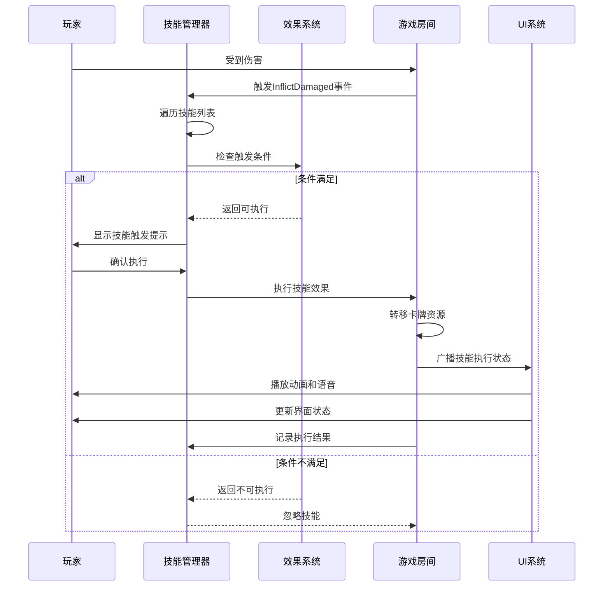

# 技能执行流程

<cite>
**本文档中引用的文件**   
- [room.skill.ts](file://server/src/core/room/mixins/room.skill.ts)
- [caocao.ts](file://server/src/extensions/wars/generals/standard/wei/caocao.ts)
- [event.damage.ts](file://server/src/core/event/types/event.damage.ts)
- [lang.ts](file://server/src/extensions/lang/lang.ts)
</cite>

## 目录
1. [技能执行流程概述](#技能执行流程概述)
2. [技能执行的事务性处理机制](#技能执行的事务性处理机制)
3. [房间级技能管理器实现](#房间级技能管理器实现)
4. [用户交互流程与UI反馈](#用户交互流程与ui反馈)
5. [曹操'奸雄'技能执行示例](#曹操奸雄技能执行示例)
6. [技能执行序列图](#技能执行序列图)

## 技能执行流程概述

技能执行流程是resgsv1游戏系统中的核心机制之一，负责处理游戏中所有技能的触发、执行和状态管理。该流程从技能触发开始，经过条件验证、效果执行，到最终的状态清理和反馈，形成一个完整的事务性处理闭环。技能执行不仅涉及单个技能的逻辑处理，还需要协调多个技能的并发执行，确保游戏状态的一致性和公平性。

技能执行流程主要由房间级技能管理器（RoomSkillMixin）负责协调，该管理器维护着当前房间内所有技能和效果的生命周期。当特定游戏事件发生时，如玩家受到伤害、使用卡牌等，系统会触发相应的技能检测机制，判断是否有技能需要响应。一旦确定技能可以执行，系统将启动完整的执行流程，包括权限验证、资源消耗、效果应用和状态更新等步骤。

**Section sources**
- [room.skill.ts](file://server/src/core/room/mixins/room.skill.ts#L1-L405)

## 技能执行的事务性处理机制

技能执行采用事务性处理机制，确保技能从触发到完成的整个过程具有原子性、一致性、隔离性和持久性（ACID）特性。这一机制通过三个关键阶段实现：执行前的条件验证、执行中的状态变更和执行后的清理工作。

### 执行前的条件验证

在技能执行前，系统会进行严格的条件验证，确保技能执行的合法性和有效性。验证过程主要包括：
1. **拥有者验证**：确认技能拥有者是否具备执行资格
2. **触发时机验证**：检查当前游戏状态是否符合技能触发条件
3. **资源验证**：确认执行技能所需的资源（如体力、手牌等）是否充足
4. **冲突验证**：检测是否存在与其他技能的冲突

以曹操的"奸雄"技能为例，其条件验证逻辑在`can_trigger`函数中实现：
```typescript
can_trigger(room, player, data) {
    return (
        this.isOwner(player) &&
        data.is(sgs.DataType.DamageEvent) &&
        player === data.to &&
        data.channel?.hasSubCards()
    );
}
```
该验证确保只有技能拥有者在受到伤害且伤害来源有对应卡牌时才能触发技能。

### 执行中的状态变更

技能执行过程中，系统会进行一系列状态变更操作，这些变更被设计为可逆的，以便在异常情况下进行回滚。主要状态变更包括：
1. **技能状态更新**：标记技能为"执行中"状态
2. **效果应用**：将技能效果添加到游戏状态中
3. **资源转移**：执行卡牌获取、体力变化等资源操作
4. **事件广播**：向所有玩家广播技能执行状态

### 执行后的清理工作

技能执行完成后，系统会进行必要的清理工作，确保游戏状态的整洁和一致性：
1. **状态重置**：将技能状态恢复为"待机"状态
2. **效果清理**：移除临时效果或标记
3. **日志记录**：记录技能执行的详细信息用于回放和调试
4. **后续触发**：检查是否有其他技能因本次执行而被触发

**Section sources**
- [room.skill.ts](file://server/src/core/room/mixins/room.skill.ts#L1-L405)
- [event.damage.ts](file://server/src/core/event/types/event.damage.ts#L39-L76)

## 房间级技能管理器实现

房间级技能管理器（RoomSkillMixin）是技能执行系统的核心组件，负责协调和管理房间内所有技能的生命周期。该管理器通过一系列方法实现技能的添加、移除、查询和执行，确保多个技能能够并发执行而不产生冲突。

### 技能管理器架构

技能管理器采用分层架构设计，主要包括以下组件：
- **技能容器**：存储房间内所有技能实例
- **效果容器**：管理所有技能效果，包括触发效果和状态效果
- **优先级队列**：根据效果优先级组织触发效果的执行顺序
- **生命周期管理器**：跟踪技能和效果的生命周期事件

```mermaid
classDiagram
class GameRoom {
+skills : Skill[]
+effects : Effect[]
+trigger_effects : TriggerEffect[]
+state_effects : StateEffect[]
+trigger_effects_priority : Map<PriorityType, TriggerEffect[]>
+lifes : Map<EventTriggers, {before : Effect[], after : Effect[]}>
+hasregard_effects : Effect[]
}
class RoomSkillMixin {
+addSkill(skillId, player, options)
+removeSkill(skill)
+addEffect(effect_name, player, fromSkill)
+removeEffect(effect)
+getSkill(id)
+getEffect(id)
+handleRegardSkill(data)
}
GameRoom --> RoomSkillMixin : "混入"
```

**Diagram sources**
- [room.skill.ts](file://server/src/core/room/mixins/room.skill.ts#L1-L405)

### 并发执行协调机制

技能管理器通过以下机制协调多个技能的并发执行：
1. **优先级系统**：不同技能效果根据其优先级类型（PriorityType）被分配到不同的执行队列中
2. **事件驱动**：技能执行由游戏事件驱动，确保执行时机的准确性
3. **状态隔离**：每个技能的效果在执行时保持状态隔离，避免相互干扰
4. **顺序保证**：在同一优先级队列中的效果按添加顺序执行

技能管理器还实现了"视为拥有技能"的特殊机制，允许某些效果动态地为玩家添加临时技能。这种机制在处理如国战左慈的化身等复杂技能时尤为重要。

**Section sources**
- [room.skill.ts](file://server/src/core/room/mixins/room.skill.ts#L1-L405)

## 用户交互流程与UI反馈

技能执行过程中的用户交互和UI反馈机制对于提升游戏体验至关重要。系统通过多层次的反馈机制，确保玩家能够清晰地了解技能执行的每个阶段。

### 交互流程设计

技能执行的用户交互流程遵循以下步骤：
1. **触发提示**：当技能满足触发条件时，系统向玩家显示技能触发提示
2. **选择确认**：对于可选技能，玩家需要确认是否执行
3. **执行动画**：技能执行时播放相应的动画效果
4. **结果展示**：明确展示技能执行的结果和影响

### UI反馈机制

系统通过多种方式提供UI反馈：
1. **视觉反馈**：使用动画、高亮等视觉效果突出技能执行过程
2. **音频反馈**：播放技能特有的音效和语音
3. **文字提示**：在游戏日志中显示技能执行的详细信息
4. **状态更新**：实时更新玩家界面中的相关状态信息

以曹操的"奸雄"技能为例，其UI反馈包括：
- 受到伤害时播放"宁教我负天下人，休教天下人负我！"的语音
- 显示卡牌获取的动画效果
- 在游戏日志中记录"曹操通过'奸雄'技能获得了X张牌"

**Section sources**
- [lang.ts](file://server/src/extensions/lang/lang.ts#L0-L21)
- [room.skill.ts](file://server/src/core/room/mixins/room.skill.ts#L1-L405)

## 曹操'奸雄'技能执行示例

曹操的"奸雄"技能是技能执行流程的典型示例，完整展示了从触发到完成的全过程。该技能的描述为："当你受到伤害后，你可以获得造成此伤害的牌。"

### 技能定义与配置

"奸雄"技能在系统中的定义如下：
```typescript
export const jianxiong = sgs.Skill({
    name: 'wars.caocao.jianxiong',
});

jianxiong.addEffect(
    sgs.TriggerEffect({
        priorityType: PriorityType.General,
        trigger: EventTriggers.InflictDamaged,
        forced: 'cost',
        auto_log: 1,
        can_trigger(room, player, data) {
            return (
                this.isOwner(player) &&
                data.is(sgs.DataType.DamageEvent) &&
                player === data.to &&
                data.channel?.hasSubCards()
            );
        },
        async cost(room, data: DamageEvent, context) {
            const { from } = context;
            return await room.obtainCards({
                player: from,
                cards: data.channel?.subcards,
                source: data,
                reason: this.name,
            });
        },
    })
);
```

### 完整执行流程

1. **触发阶段**：当曹操受到伤害时，系统检测到`InflictDamaged`事件
2. **条件验证**：执行`can_trigger`函数，验证曹操是否为伤害目标且伤害来源有对应卡牌
3. **执行准备**：系统准备执行技能，向曹操显示技能触发提示
4. **资源获取**：调用`room.obtainCards`方法，将造成伤害的卡牌转移给曹操
5. **状态更新**：更新游戏状态，记录技能执行结果
6. **反馈展示**：播放语音、动画，更新UI界面

### 实际游戏场景

假设张飞对曹操使用【杀】造成1点伤害：
1. 张飞出【杀】，曹操未使用【闪】抵消
2. 系统触发伤害事件，检测到曹操的"奸雄"技能满足触发条件
3. 系统提示曹操可以选择发动"奸雄"技能
4. 曹操确认发动技能
5. 系统将张飞使用的【杀】转移给曹操
6. 播放"宁教我负天下人，休教天下人负我！"的语音
7. 游戏日志记录："曹操通过'奸雄'技能获得了1张【杀】"

**Section sources**
- [caocao.ts](file://server/src/extensions/wars/generals/standard/wei/caocao.ts#L0-L43)
- [lang.ts](file://server/src/extensions/lang/lang.ts#L0-L21)

## 技能执行序列图

以下序列图展示了技能执行过程中各组件的交互顺序：



**Diagram sources**
- [room.skill.ts](file://server/src/core/room/mixins/room.skill.ts#L1-L405)
- [event.damage.ts](file://server/src/core/event/types/event.damage.ts#L39-L76)