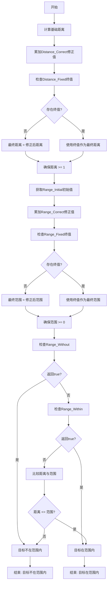
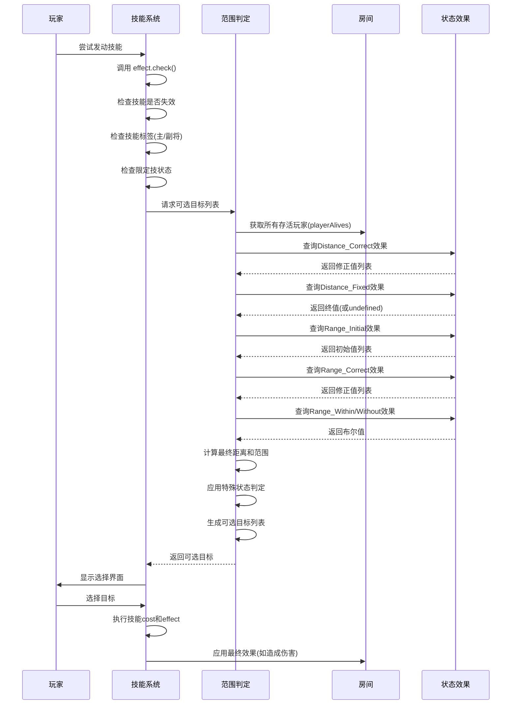

# 作用范围逻辑

<cite>
**本文档引用文件**  
- [effect.ts](file://server/src/core/skill/effect.ts)
- [skill.types.ts](file://server/src/core/skill/skill.types.ts)
- [dongzhuo.ts](file://server/src/extensions/wars/generals/power/dongzhuo.ts)
</cite>

## 目录
1. [引言](#引言)
2. [作用范围计算机制](#作用范围计算机制)
3. [距离与攻击范围的判定逻辑](#距离与攻击范围的判定逻辑)
4. [玩家状态与装备对范围的影响](#玩家状态与装备对范围的影响)
5. [范围缓存与性能优化策略](#范围缓存与性能优化策略)
6. [实际案例分析：董卓“酒池”技能](#实际案例分析董卓酒池技能)
7. [执行流程时序图](#执行流程时序图)
8. [结论](#结论)

## 引言

在 `resgsv1` 游戏系统中，技能效果的作用范围是决定技能能否发动、影响哪些目标的核心机制之一。该机制不仅涉及基础的距离计算，还融合了角色位置、装备属性、特殊状态、技能标签等多种因素。本文将深入解析 `effect.ts` 中关于作用范围的算法实现，结合 `skill.types.ts` 定义的状态效果类型，详细阐述从范围判定到效果应用的完整流程，并以董卓的“酒池”技能为例进行具体说明。

**Section sources**
- [effect.ts](file://server/src/core/skill/effect.ts#L1-L465)
- [skill.types.ts](file://server/src/core/skill/skill.types.ts#L309-L527)

## 作用范围计算机制

技能作用范围的计算是一个多阶段、多条件过滤的复杂过程，主要由 `Effect` 类及其子类 `TriggerEffect` 和 `StateEffect` 共同完成。其核心流程包括：**距离计算、区域判定、条件过滤和状态检查**。

### 距离计算基础

游戏中的距离计算基于玩家在游戏桌上的相对座次。默认情况下，相邻玩家的距离为1，依此类推。`StateEffectType.Distance_Correct` 和 `StateEffectType.Distance_Fixed` 是影响距离计算的关键状态类型。

- **Distance_Correct (距离修正值)**：此类型的效果会为特定玩家对之间的距离增加一个修正值。所有修正值会被累加到基础距离上。
- **Distance_Fixed (距离终值)**：此类型的效果会直接覆盖基础距离和所有修正值，直接返回一个固定的终值。这通常用于实现“无视距离”或“强制距离为N”的效果。

### 区域判定逻辑

在确定了目标玩家与施法者之间的距离后，系统会根据技能定义的攻击范围（Range）来判断目标是否在有效区域内。攻击范围的计算同样依赖于状态效果系统。

- **Range_Initial (攻击范围初始值)**：通常由武器技能提供，定义了玩家的基础攻击范围。如果有多个此类效果，系统会取最大值。
- **Range_Correct (攻击范围修正值)**：对初始攻击范围进行加减修正。
- **Range_Fixed (攻击范围终值)**：直接设定最终的攻击范围，可以是正无穷（表示无限范围）。
- **Range_Within (视为在攻击范围内)**：如果此效果返回 `true`，则目标玩家必定在施法者的攻击范围内，无需进行距离检测。
- **Range_Without (视为不在攻击范围内)**：如果此效果返回 `true`，则目标玩家必定不在施法者的攻击范围内，此效果的优先级高于 `Range_Within`。

### 条件过滤与状态检查

除了距离和范围，技能发动还需通过一系列条件过滤。`Effect` 类的 `check` 方法是这一过程的核心。

```typescript
public check(data?: EventData) {
    // 技能失效不能发动
    if (this.isInvalid) return false;
    // 检查所属技能是否可发动
    if (this.skill && !this.skill.check()) return false;
    // 主将技/副将技检查
    if (this.hasTag(SkillTag.Head)) {
        if (this.skill && this.player && this.skill.sourceGeneral !== this.player.head) return false;
    }
    // 限定技检查
    if (this.isLimit) {
        const limit = this.player?.getMark<string>(`@limit:${this.id}`);
        if (!limit || limit === '@limit-false') return false;
    }
    // 阵法技检查
    if (this.isArray) {
        if (this.room.aliveCount < 4) return false;
    }
    return true;
}
```

**Section sources**
- [effect.ts](file://server/src/core/skill/effect.ts#L50-L100)
- [skill.types.ts](file://server/src/core/skill/skill.types.ts#L462-L527)

## 距离与攻击范围的判定逻辑

距离与攻击范围的判定是两个独立但又紧密关联的计算过程。

### 距离判定流程

1.  **获取基础距离**：根据玩家座次计算 `from` 到 `to` 的基础距离。
2.  **应用距离修正**：遍历所有激活的 `StateEffectType.Distance_Correct` 效果，将修正值累加到基础距离上。
3.  **应用距离终值**：检查是否存在 `StateEffectType.Distance_Fixed` 效果，如果存在，则直接使用其返回的终值。
4.  **最终距离**：确保最终距离不小于1（与其他角色的最小距离）。

### 攻击范围判定流程

1.  **获取攻击范围初始值**：遍历所有激活的 `StateEffectType.Range_Initial` 效果，取最大值作为初始攻击范围。
2.  **应用攻击范围修正**：遍历所有激活的 `StateEffectType.Range_Correct` 效果，将修正值累加到初始攻击范围上。
3.  **应用攻击范围终值**：检查是否存在 `StateEffectType.Range_Fixed` 效果，如果存在，则直接使用其返回的终值。
4.  **特殊状态判定**：
    *   检查 `StateEffectType.Range_Without`，如果返回 `true`，则目标不在范围内。
    *   检查 `StateEffectType.Range_Within`，如果返回 `true`，则目标在范围内。
5.  **最终判定**：比较 `from` 到 `to` 的最终距离与 `from` 的最终攻击范围。如果距离小于或等于攻击范围，则目标在作用范围内。



**Diagram sources**
- [effect.ts](file://server/src/core/skill/effect.ts#L50-L100)
- [skill.types.ts](file://server/src/core/skill/skill.types.ts#L309-L527)

## 玩家状态与装备对范围的影响

玩家的特殊状态和装备是影响作用范围的重要动态因素。

### 装备影响

装备，尤其是武器，是改变攻击范围最直接的方式。例如，一把攻击范围为3的武器会通过 `StateEffectType.Range_Initial` 将玩家的初始攻击范围设置为3。防具或坐骑可能通过 `StateEffectType.Distance_Correct` 来增加或减少其他角色到该玩家的距离。

### 特殊状态影响

特殊状态通过激活特定的 `StateEffect` 来改变范围判定。

- **“酒池”技能**：虽然代码中未直接体现“酒池”，但类似技能可能通过 `StateEffectType.Range_Within` 将所有存活玩家视为在攻击范围内，实现“全场范围”的效果。
- **“闭月”或“反馈”**：这类技能可能通过 `StateEffectType.Distance_Fixed` 将特定目标的距离设为0或1，实现“无视距离”或“强制近距离”的效果。
- **“隐身”或“免疫”**：可以通过 `StateEffectType.Range_Without` 将自己对所有技能视为“不在攻击范围内”，实现免疫效果。

这些状态效果在 `room.getStates()` 方法中被查询，并在 `check` 和范围判定过程中被应用。

**Section sources**
- [effect.ts](file://server/src/core/skill/effect.ts#L100-L150)
- [skill.types.ts](file://server/src/core/skill/skill.types.ts#L462-L527)

## 范围缓存与性能优化策略

在每回合进行大量技能判定时，频繁的距离和范围计算会带来性能开销。`resgsv1` 系统通过以下策略进行优化：

### 状态效果缓存

系统通过 `room.getStates()` 方法来获取所有激活的 `StateEffect`。这个方法内部很可能对状态效果进行了缓存或索引，避免了每次判定时都遍历整个效果列表。例如，可以按 `StateEffectType` 进行分组存储，这样在需要 `Range_Correct` 效果时，可以直接从对应的分组中获取，而无需遍历所有效果。

### 逻辑短路

在 `check` 方法中，系统采用了逻辑短路策略。例如，如果技能已经失效 (`this.isInvalid`)，则直接返回 `false`，不再进行后续的主副将检查、限定技检查等，从而节省了不必要的计算。

### 选择器预计算

在技能发动前，`getSelectors` 方法会预先计算出所有可选的目标和牌。这个过程会应用所有范围和条件过滤逻辑，生成一个最终的可选列表。这避免了在用户选择时进行实时计算，提升了交互响应速度。

## 实际案例分析：董卓“酒池”技能

虽然在提供的 `dongzhuo.ts` 文件中，董卓的技能为“横征”、“暴凌”和“崩坏”，并未直接包含“酒池”，但我们可以基于现有机制，推断一个典型的“酒池”类技能的作用范围计算过程。

假设“酒池”技能的效果是：**在你的出牌阶段，你可以对任意一名其他角色使用【杀】，且此【杀】无视距离和防具。**

### 作用范围计算过程

1.  **技能发动检查**：`check` 方法首先确认技能未失效，且当前处于董卓的出牌阶段。
2.  **目标筛选**：系统需要确定哪些角色可以作为【杀】的目标。
    *   **距离计算**：正常情况下，【杀】的使用受攻击范围限制。但“酒池”技能会添加一个 `StateEffectType.Range_Within` 的状态效果。
    *   **特殊条件判断**：`Range_Within` 的判定函数会返回 `true` 对于所有其他存活玩家。这意味着，无论他们与董卓的实际距离是多少，系统都会判定他们“在攻击范围内”。
    *   **防具无视**：这通常通过在【杀】结算时，临时添加一个 `StateEffectType.Prohibit_Defense` 效果来实现，使目标无法使用【闪】响应。
3.  **结果**：最终，所有其他存活玩家都会被包含在可选目标列表中，实现了“全场范围”的效果。

```typescript
// 伪代码示例：模拟“酒池”技能的范围判定
const jiuChiEffect = sgs.StateEffect({
    type: StateEffectType.Range_Within,
    Range_Within: (this: StateEffect, from: GamePlayer, to: GamePlayer) => {
        // 如果是“酒池”技能的拥有者对其他角色
        return this.isOwner(from) && from !== to;
    }
});
```

**Section sources**
- [dongzhuo.ts](file://server/src/extensions/wars/generals/power/dongzhuo.ts#L1-L231)
- [effect.ts](file://server/src/core/skill/effect.ts#L50-L100)

## 执行流程时序图

以下时序图展示了从范围计算到效果应用的完整执行流程。



**Diagram sources**
- [effect.ts](file://server/src/core/skill/effect.ts#L50-L150)
- [dongzhuo.ts](file://server/src/extensions/wars/generals/power/dongzhuo.ts#L1-L231)

## 结论

`resgsv1` 中的作用范围逻辑是一个高度模块化和可扩展的系统。它通过将距离、范围、条件等要素解耦为独立的“状态效果”（`StateEffect`），实现了极大的灵活性。开发者可以通过定义不同的状态效果函数，轻松实现各种复杂的范围规则，如无视距离、全场范围、条件性范围等。同时，系统通过逻辑短路和潜在的状态缓存机制，保证了在复杂局面下的性能表现。理解这一机制对于开发新技能或调试现有技能行为至关重要。