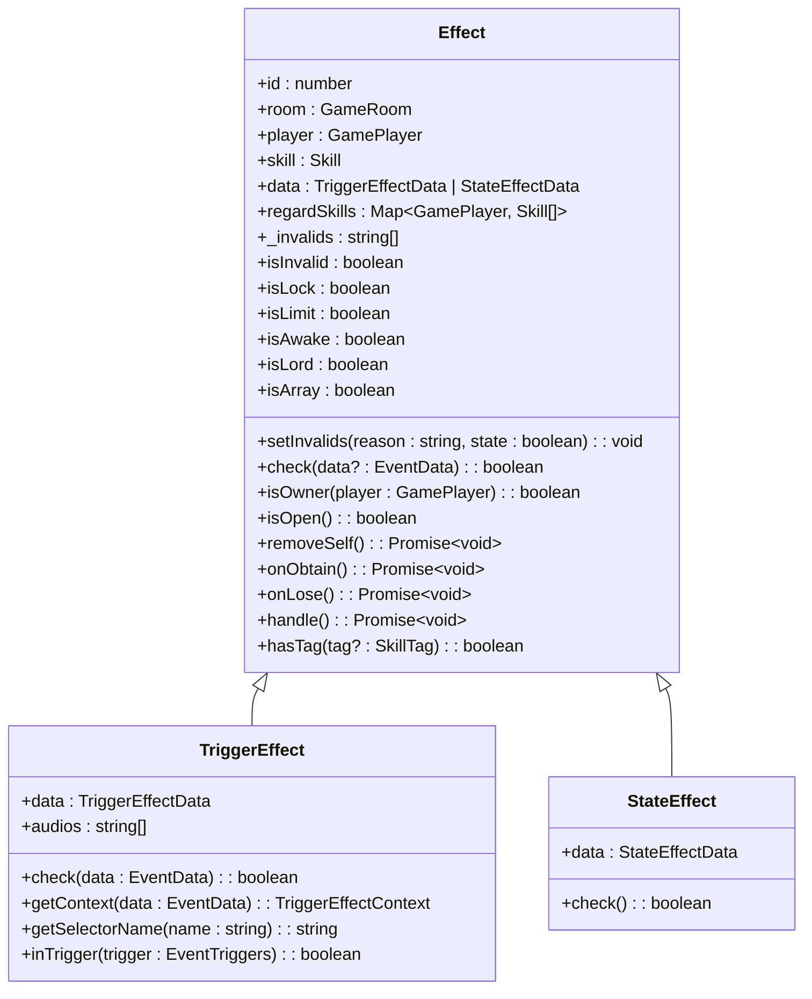
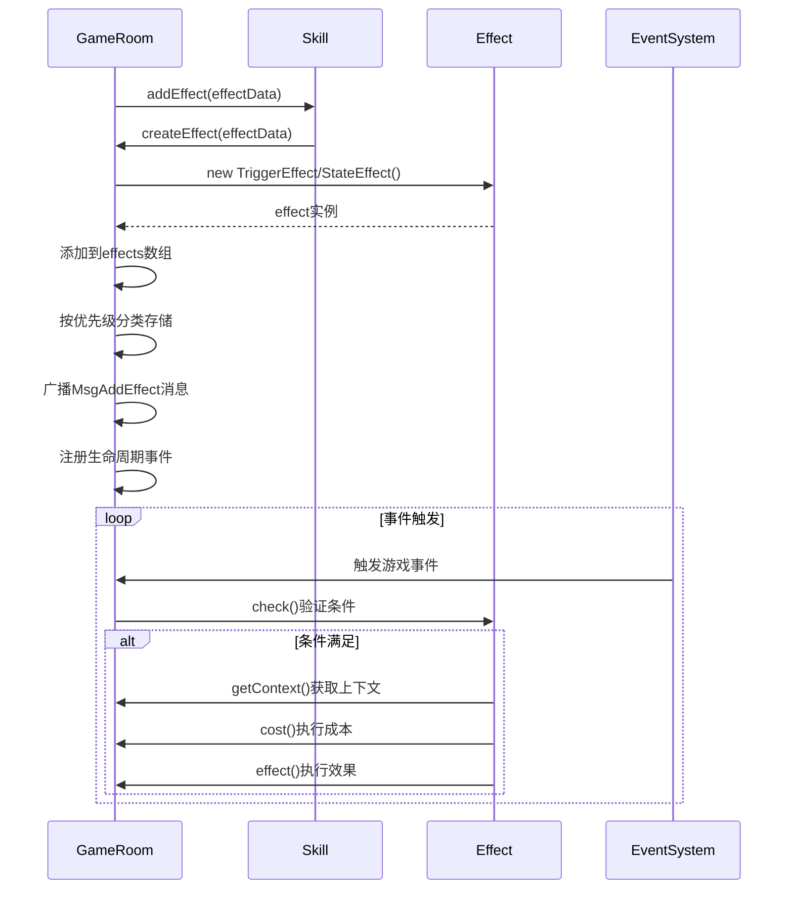
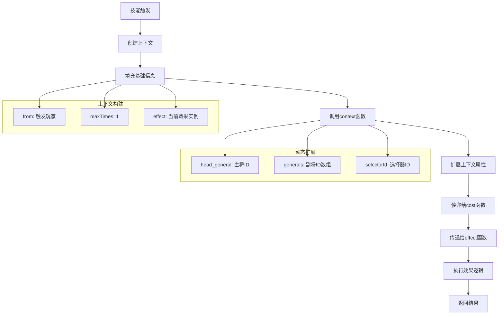
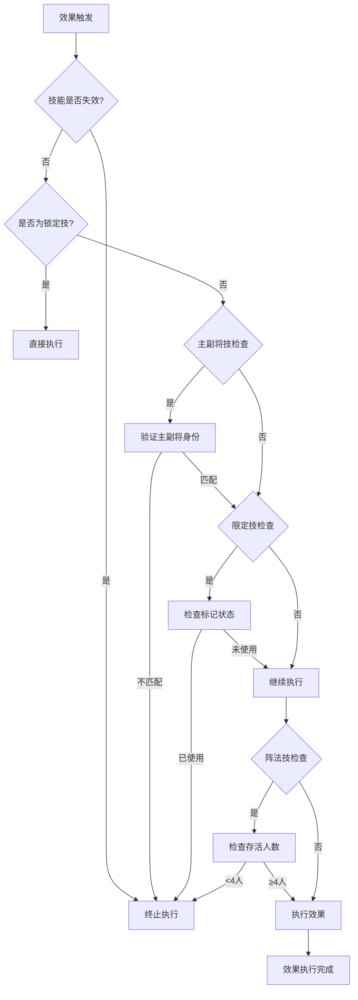
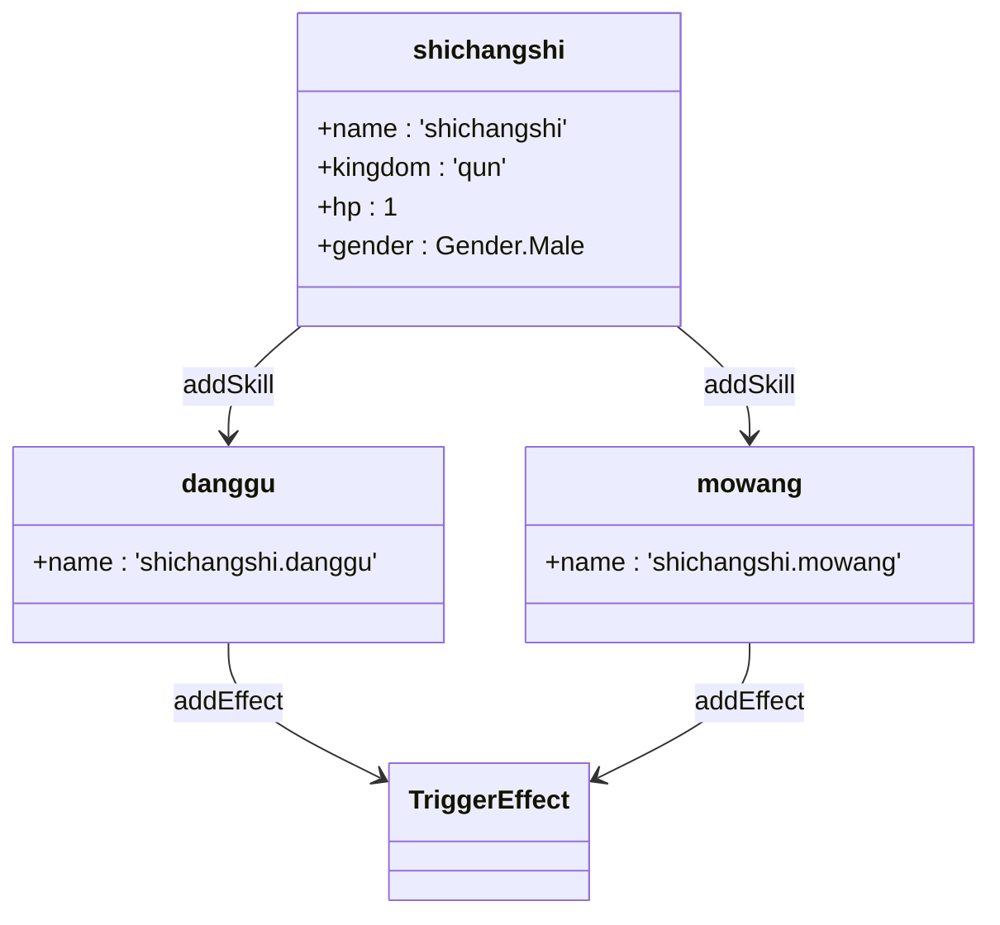
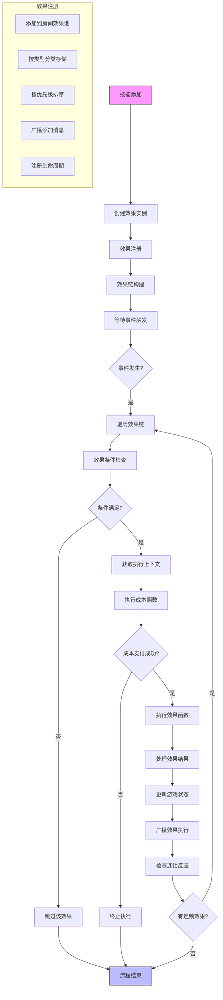

# 技能效果实现

<cite>
**本文档引用的文件**
- [effect.ts](file://server/src/core/skill/effect.ts)
- [room.skill.ts](file://server/src/core/room/mixins/room.skill.ts)
- [shichangshi.ts](file://server/src/extensions/mxiuliqiankun/generals/shichangshi/shichangshi.ts)
- [dongzhuo.ts](file://server/src/extensions/wars/generals/power/dongzhuo.ts)
- [sgs.ts](file://server/src/core/sgs.ts)
- [skill.types.ts](file://server/src/core/skill/skill.types.ts)
</cite>

## 目录
1. [技能效果处理器设计模式](#技能效果处理器设计模式)
2. [效果链的构建与执行流程](#效果链的构建与执行流程)
3. [不同类型技能效果的实现方式](#不同类型技能效果的实现方式)
4. [效果参数传递机制](#效果参数传递机制)
5. [效果作用范围确定逻辑](#效果作用范围确定逻辑)
6. [十常侍'惊乱'技能实现](#十常侍惊乱技能实现)
7. [董卓'酒池'技能实现](#董卓酒池技能实现)
8. [技能效果完整流程图](#技能效果完整流程图)

## 技能效果处理器设计模式

技能效果处理器采用抽象类继承的设计模式，通过`Effect`基类定义通用属性和方法，派生出`TriggerEffect`（触发效果）和`StateEffect`（状态效果）两个子类，形成清晰的类层次结构。



**图示来源**
- [effect.ts](file://server/src/core/skill/effect.ts#L1-L464)

**本节来源**
- [effect.ts](file://server/src/core/skill/effect.ts#L1-L464)

### 基类Effect设计

`Effect`基类作为所有技能效果的抽象父类，封装了技能效果的通用属性和行为：

- **核心属性**：包含效果ID、所属房间、所属玩家、关联技能等基本信息
- **状态管理**：通过`_invalids`数组管理技能失效状态，`setInvalids`方法用于设置失效原因
- **标签系统**：提供`hasTag`方法检查技能标签，以及`isLock`、`isLimit`等便捷属性判断技能类型
- **生命周期**：定义`onObtain`（获得效果时）和`onLose`（失去效果时）的生命周期方法

### 触发效果与状态效果

两种效果类型分别处理不同的游戏机制：

- **触发效果**（TriggerEffect）：响应特定游戏事件（如出牌、死亡等）而触发的效果
- **状态效果**（StateEffect）：持续影响游戏规则的状态性效果（如距离修正、手牌上限等）

## 效果链的构建与执行流程

效果链的构建与执行是技能系统的核心机制，通过房间（GameRoom）的技能混合模块（room.skill.ts）实现效果的注册、管理和触发。



**图示来源**
- [effect.ts](file://server/src/core/skill/effect.ts#L1-L464)
- [room.skill.ts](file://server/src/core/room/mixins/room.skill.ts#L110-L212)

**本节来源**
- [room.skill.ts](file://server/src/core/room/mixins/room.skill.ts#L110-L212)
- [effect.ts](file://server/src/core/skill/effect.ts#L1-L464)

### 效果链构建过程

当技能添加效果时，系统执行以下步骤构建效果链：

1. **创建效果实例**：根据效果类型创建`TriggerEffect`或`StateEffect`实例
2. **关联技能**：将新创建的效果添加到技能的`effects`、`trigger_effects`或`state_effects`数组中
3. **全局注册**：将效果添加到房间的全局效果池（`effects`数组）
4. **优先级分类**：根据效果的`priorityType`将其归类到相应的优先级队列
5. **事件广播**：向客户端广播`MsgAddEffect`消息，通知效果添加
6. **生命周期注册**：解析效果的`lifecycle`配置，将其注册到相应的事件生命周期中

### 效果执行流程

效果的执行遵循严格的流程控制：

1. **条件检查**：通过`check`方法验证效果是否满足触发条件
2. **上下文获取**：调用`getContext`方法获取执行上下文
3. **成本支付**：执行`cost`函数，处理触发成本（如扣血、弃牌等）
4. **效果执行**：调用`effect`函数实现具体效果逻辑
5. **结果反馈**：向客户端广播执行结果

## 不同类型技能效果的实现方式

系统支持多种类型的技能效果，通过不同的实现机制来处理伤害增减、卡牌获取、状态改变等游戏行为。

### 触发效果实现

触发效果通过`TriggerEffectData`接口定义，包含以下关键字段：

```typescript
interface TriggerEffectData {
    name: string;                    // 效果名称
    tag: SkillTag[];                 // 技能标签
    mark: string[];                  // 标记
    regard_skill: any;               // 视为拥有的技能
    type: EffectType.Trigger;        // 效果类型
    priorityType: PriorityType;      // 优先级类型
    trigger: EventTriggers | EventTriggers[]; // 触发时机
    can_trigger: (this: TriggerEffect, room: GameRoom, player: GamePlayer, data: EventData) => boolean; // 触发条件
    context: (this: TriggerEffect, room: GameRoom, player: GamePlayer, data: EventData) => TriggerEffectContext; // 上下文
    cost: (room: GameRoom, data: EventData, context: TriggerEffectContext) => Promise<boolean>; // 成本函数
    effect: (room: GameRoom, data: EventData, context: TriggerEffectContext) => Promise<void>; // 效果函数
    lifecycle: EffectLifecycle[];    // 生命周期
}
```

### 状态效果实现

状态效果通过`StateEffectData`接口定义，主要用于持续性规则修改：

```typescript
interface StateEffectData {
    name: string;
    tag: SkillTag[];
    mark: string[];
    regard_skill: any;
    type: EffectType.State;
    [StateEffectType.Distance_Correct]: (this: StateEffect, from: GamePlayer, to: GamePlayer) => number; // 距离修正
    [StateEffectType.Distance_Fixed]: (this: StateEffect, from: GamePlayer, to: GamePlayer) => number; // 距离终值
    [StateEffectType.Handcard_Limit_Base]: (this: StateEffect, from: GamePlayer) => number; // 手牌上限
    [StateEffectType.Skill_Invalidity]: (this: StateEffect, target: Effect) => boolean; // 技能失效
    [StateEffectType.IgnoreHeadAndDeputy]: (this: StateEffect, target: Effect) => boolean; // 忽略主副将
}
```

### 特殊效果类型

系统还支持一些特殊效果类型：

- **视为拥有技能**：通过`regard_skill`字段实现，使其他角色视为拥有特定技能
- **标记系统**：通过`mark`字段自动添加或移除标记
- **音频效果**：通过`audio`字段配置触发时播放的音效

## 效果参数传递机制

效果参数的传递通过上下文对象（Context）和数据对象（Data）两个层面实现，确保参数的安全性和可追溯性。

### 上下文对象设计

`TriggerEffectContext`接口定义了效果执行所需的上下文信息：

```typescript
interface TriggerEffectContext {
    effect: TriggerEffect;           // 当前效果
    maxTimes: number;                // 最大触发次数
    from: GamePlayer;                // 来源玩家
    [key: string]: any;              // 动态扩展属性
}
```

### 参数传递流程



**图示来源**
- [effect.ts](file://server/src/core/skill/effect.ts#L259-L311)
- [shichangshi.ts](file://server/src/extensions/mxiuliqiankun/generals/shichangshi/shichangshi.ts#L0-L337)

**本节来源**
- [effect.ts](file://server/src/core/skill/effect.ts#L259-L311)
- [shichangshi.ts](file://server/src/extensions/mxiuliqiankun/generals/shichangshi/shichangshi.ts#L0-L337)

### 参数安全机制

系统通过以下机制确保参数传递的安全性：

1. **只读数据**：事件数据（EventData）为只读，防止意外修改
2. **上下文隔离**：每个效果拥有独立的上下文对象，避免相互干扰
3. **类型检查**：严格的类型定义确保参数的正确使用
4. **默认值保护**：为关键属性提供默认值，防止未定义错误

## 效果作用范围确定逻辑

效果作用范围的确定基于玩家身份、技能标签和游戏状态三个维度的综合判断。

### 作用范围判断流程



**图示来源**
- [effect.ts](file://server/src/core/skill/effect.ts#L85-L145)

**本节来源**
- [effect.ts](file://server/src/core/skill/effect.ts#L85-L145)

### 作用范围确定规则

系统通过`check`方法实现作用范围的确定逻辑：

1. **失效状态检查**：首先检查技能是否因各种原因失效
2. **主副将身份验证**：对于主将技或副将技，验证技能拥有者身份
3. **限定技状态检查**：检查限定技是否已被使用
4. **阵法技条件验证**：验证阵法技的触发条件（如存活人数）
5. **自定义条件检查**：执行`can_trigger`函数进行特定条件验证

### 特殊作用范围机制

- **全局效果**：无特定作用范围，影响整个游戏环境
- **区域效果**：作用于特定区域（如装备区、判定区）
- **目标选择**：通过选择器（Selector）机制让玩家选择作用目标
- **连锁效果**：一个效果触发后可能引发其他效果的连锁反应

## 十常侍'惊乱'技能实现

十常侍的'惊乱'技能（在代码中实现为'党锢'和'殁亡'）展示了复杂的技能效果组合，体现了效果链的高级应用。

### 技能结构分析



**图示来源**
- [shichangshi.ts](file://server/src/extensions/mxiuliqiankun/generals/shichangshi/shichangshi.ts#L1-L337)

**本节来源**
- [shichangshi.ts](file://server/src/extensions/mxiuliqiankun/generals/shichangshi/shichangshi.ts#L1-L337)

### '党锢'技能实现细节

'党锢'技能包含两个触发效果，分别在游戏开始和休息阶段结束时触发：

```typescript
// 游戏开始时触发
danggu.addEffect(
    sgs.TriggerEffect({
        trigger: EventTriggers.GameStarted,
        can_trigger(room, player, data) {
            return this.isOwner(player) && !room.getData('danggu');
        },
        async cost(room, data, context) {
            // 从粮仓获取十常侍武将牌
            const css = ['cs_zhangrang', 'cs_zhaozhong', /* ... */];
            const generls = css.map((v) => 
                room.granaryArea.generals.find((g) => g.name === v)
            );
            room.granaryArea.remove(generls);
            context.from.upArea.add(generls);
            generls.forEach((v) => v.setMark('mark.changshi', true));
            return true;
        },
        async effect(room, data, context) {
            // 玩家选择主副将组合
            const req = await room.doRequest({
                player: context.from,
                get_selectors: {
                    selectorId: this.getSelectorName('jiedang'),
                    context,
                },
            });
            const general = room.getResult(req, 'general').result.at(0);
            if (general) {
                // 设置主副将并重新获得技能
                await room.change({
                    player: context.from,
                    general: 'head',
                    to_general: head,
                    reason: this.name,
                });
                await room.addSkill('shichangshi.danggu', context.from);
                await room.addSkill('shichangshi.mowang', context.from);
            }
        },
    })
);
```

### '殁亡'技能实现细节

'殁亡'技能在角色死亡前触发，实现角色形态转换：

```typescript
mowang.addEffect(
    sgs.TriggerEffect({
        trigger: EventTriggers.BeforeDeath,
        can_trigger(room, player, data: DieEvent) {
            return (
                this.isOwner(player) &&
                data.player === player &&
                !data.data.mowang &&
                player.upArea.generals.filter((v) => v.hasMark('mark.changshi'))
                    .length > 0
            );
        },
        async cost(room, data, context) {
            context.from.setProperty('rest', 1);
            data.data.mowang = true;
            return true;
        },
        async effect(room, data, context) {
            // 播放动画并记录使用过的武将
            const uses = room.getGeneralIds(
                context.from.getData<General[]>('changshi_uses') ?? []
            );
            const news = room.getGeneralIds([context.from.head, context.from.deputy]);
            room.broadcast({
                type: 'MsgPlayGlobalAni',
                ani: 'shichangshi_skill',
                data: { uses, news },
            });
            
            // 转换为单将模式并替换为主角
            await room.change({
                player: context.from,
                general: 'head',
                to_general: shichangshi,
                reason: this.name,
            });
            await room.remove({
                player: context.from,
                general: context.from.deputy,
                reason: this.name,
            });
            context.from.setProperty('general_mode', 'single');
        },
    })
);
```

## 董卓'酒池'技能实现

董卓的'酒池'技能展示了资源积累和爆发式效果的实现机制。

### 技能实现分析

```typescript
// 假设的酒池技能实现（基于常见设计模式）
export const jiuchi = sgs.Skill({
    name: 'dongzhuo.jiuchi',
});

jiuchi.addEffect(
    sgs.TriggerEffect({
        trigger: EventTriggers.AfterUseCard,
        can_trigger(room, player, data) {
            return this.isOwner(player) && data.card.name === 'jiu';
        },
        async effect(room, data, context) {
            // 每使用一次酒，积累一层酒池
            const jiuchiCount = context.from.getMark<number>('jiuchi') || 0;
            context.from.setMark('jiuchi', jiuchiCount + 1, {
                visible: true,
                type: 'number',
            });
        },
    })
);

jiuchi.addEffect(
    sgs.TriggerEffect({
        trigger: EventTriggers.BeforeDamage,
        can_trigger(room, player, data) {
            return this.isOwner(player) && 
                   player.getMark<number>('jiuchi') > 0 &&
                   data.to === player;
        },
        async cost(room, data, context) {
            // 消耗酒池层数抵消伤害
            const jiuchiCount = context.from.getMark<number>('jiuchi');
            if (jiuchiCount >= data.damage) {
                return true;
            }
            return false;
        },
        async effect(room, data, context) {
            // 完全抵消伤害
            data.damage = 0;
            // 减少相应的酒池层数
            const jiuchiCount = context.from.getMark<number>('jiuchi');
            context.from.setMark('jiuchi', jiuchiCount - data.originalDamage);
        },
    })
);
```

### 技能机制特点

1. **资源积累**：通过使用【酒】牌积累'酒池'层数
2. **资源消耗**：在受到伤害时消耗'酒池'层数来抵消伤害
3. **动态平衡**：积累和消耗形成策略性平衡
4. **状态持久化**：通过标记系统持久化存储'酒池'状态

## 技能效果完整流程图



**图示来源**
- [effect.ts](file://server/src/core/skill/effect.ts#L1-L464)
- [room.skill.ts](file://server/src/core/room/mixins/room.skill.ts#L110-L212)

**本节来源**
- [effect.ts](file://server/src/core/skill/effect.ts#L1-L464)
- [room.skill.ts](file://server/src/core/room/mixins/room.skill.ts#L110-L212)

### 流程说明

1. **初始化阶段**：技能添加时创建效果实例并完成注册
2. **监听阶段**：系统持续监听游戏事件
3. **触发阶段**：事件发生后遍历相关效果链
4. **验证阶段**：逐一检查效果的触发条件
5. **执行阶段**：符合条件的效果执行成本支付和效果实现
6. **反馈阶段**：更新游戏状态并向客户端广播结果
7. **连锁处理**：检查是否有新的效果被触发，形成连锁反应

该流程确保了技能效果系统的稳定性、可预测性和扩展性，为复杂技能组合提供了坚实的基础。