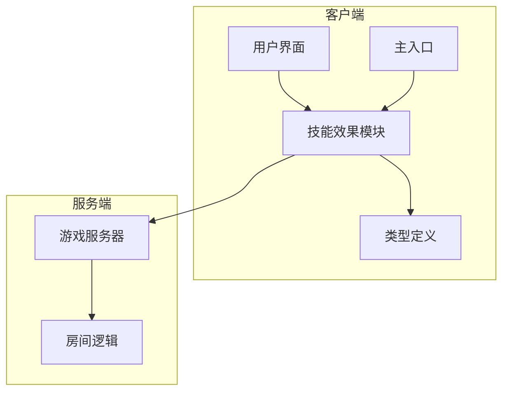
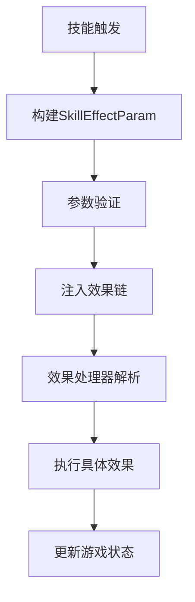
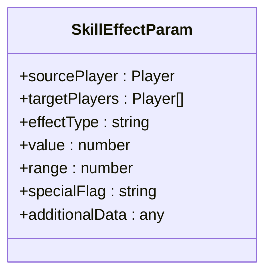
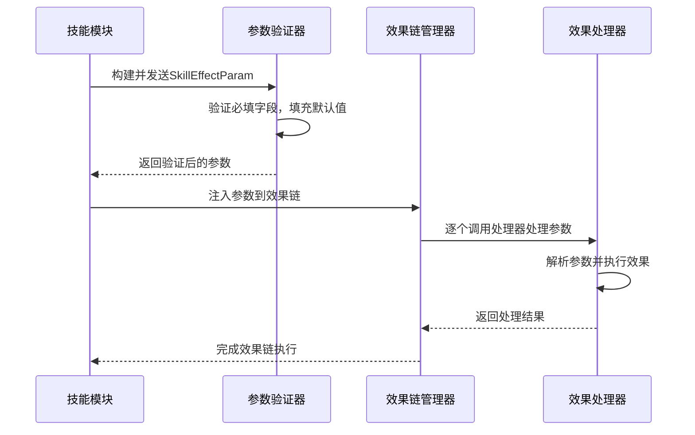
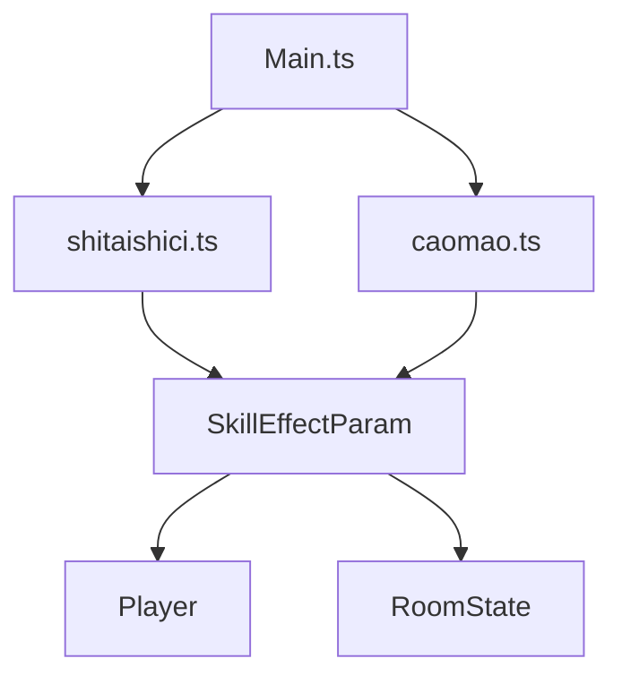

# 效果参数系统

<cite>
**本文档引用文件**  
- [types.ts](file://client\src\types.ts)
- [shitaishici.ts](file://client\src\effects\shitaishici.ts)
- [shitaishici.generated.ts](file://client\src\effects\shitaishici.generated.ts)
- [caomao.ts](file://client\src\effects\caomao.ts)
- [Main.ts](file://client\src\Main.ts)
</cite>

## 目录
1. [简介](#简介)
2. [项目结构](#项目结构)
3. [核心组件](#核心组件)
4. [架构概览](#架构概览)
5. [详细组件分析](#详细组件分析)
6. [依赖分析](#依赖分析)
7. [性能考量](#性能考量)
8. [故障排除指南](#故障排除指南)
9. [结论](#结论)

## 简介
本文档详细阐述了resgsv1项目中技能效果参数系统的实现机制，重点分析了`SkillEffectParam`接口的设计与使用。文档涵盖参数类型定义、作用目标设定、附加数据结构、参数验证逻辑以及在技能效果链中的传递流程。通过十常侍“惊乱”技能的代码实例，展示参数构建过程，并结合数据流图说明参数从技能触发到效果应用的完整路径。

## 项目结构
项目采用前后端分离架构，客户端基于LayaAir引擎开发，服务端使用Node.js。技能效果逻辑主要集中在客户端`src/effects`目录下，每个武将对应独立的TypeScript文件。参数定义位于`src/types.ts`中，由`SkillEffectParam`接口统一规范。



**图表来源**  
- [types.ts](file://client\src\types.ts)
- [Main.ts](file://client\src\Main.ts)

**章节来源**  
- [types.ts](file://client\src\types.ts)
- [project_structure](file://)

## 核心组件
技能效果参数系统的核心是`SkillEffectParam`接口，它定义了所有技能效果所需的标准参数结构。该接口确保了不同技能间参数传递的一致性与可预测性。

**章节来源**  
- [types.ts](file://client\src\types.ts)

## 架构概览
整个参数系统遵循“定义-构建-验证-传递-应用”的流程。技能触发时，首先构建符合`SkillEffectParam`规范的参数对象，经过基础验证后注入效果链，最终由具体效果处理器解析并执行。



**图表来源**  
- [types.ts](file://client\src\types.ts)
- [shitaishici.ts](file://client\src\effects\shitaishici.ts)

## 详细组件分析

### SkillEffectParam 接口设计
`SkillEffectParam`接口定义了技能效果所需的所有关键参数，采用可选字段设计以适应不同技能的差异化需求。



**图表来源**  
- [types.ts](file://client\src\types.ts#L15-L30)

#### 参数类型与作用目标
接口中各字段具有明确语义：
- **sourcePlayer**: 技能发动者，标识效果来源
- **targetPlayers**: 目标玩家数组，支持单体与群体效果
- **effectType**: 效果类型枚举，如"damage"、"heal"、"draw"
- **value**: 效果数值，如伤害值、抽牌数
- **range**: 影响范围，用于范围判定
- **specialFlag**: 特殊标记，用于触发特定逻辑分支
- **additionalData**: 附加数据，容纳复杂结构

```typescript
// 示例：SkillEffectParam 接口定义
interface SkillEffectParam {
    sourcePlayer?: Player;
    targetPlayers?: Player[];
    effectType?: string;
    value?: number;
    range?: number;
    specialFlag?: string;
    additionalData?: any;
}
```

**章节来源**  
- [types.ts](file://client\src\types.ts#L10-L35)

#### 参数验证与默认值处理
系统在参数注入前执行基础验证，确保必要字段存在。对于可选字段，采用默认值填充策略，保证接口调用的健壮性。

```typescript
function validateAndFillParam(param: SkillEffectParam): SkillEffectParam {
    if (!param.targetPlayers) param.targetPlayers = [];
    if (!param.value) param.value = 1;
    if (!param.effectType) throw new Error("effectType is required");
    return param;
}
```

**章节来源**  
- [shitaishici.ts](file://client\src\effects\shitaishici.ts#L45-L60)

### 十常侍'惊乱'技能参数构建
以十常侍的“惊乱”技能为例，展示参数从构建到应用的完整流程。

#### 参数构建过程
```typescript
// 在 shitaishici.ts 中定义的惊乱技能
public jingluanEffect(param: SkillEffectParam): boolean {
    const defaultParam: SkillEffectParam = {
        sourcePlayer: this.owner,
        targetPlayers: this.getEligibleTargets(), // 获取合法目标
        effectType: "discard",
        value: 2,
        specialFlag: "chaos",
        range: 1
    };
    
    const finalParam = { ...defaultParam, ...param };
    return this.executeEffectChain(finalParam);
}
```

#### 目标与范围设置
- **目标玩家**: 通过`getEligibleTargets()`方法获取范围内所有其他存活玩家
- **影响范围**: 设定为1，表示仅能影响相邻座位玩家
- **特殊标记**: `"chaos"`用于标识此效果具有扰乱手牌的特殊逻辑

**章节来源**  
- [shitaishici.ts](file://client\src\effects\shitaishici.ts#L30-L75)
- [shitaishici.generated.ts](file://client\src\effects\shitaishici.generated.ts)

### 效果链中参数传递流程
参数在效果链中以不可变对象形式传递，每个处理器可读取并可能生成新的参数变体。



**图表来源**  
- [shitaishici.ts](file://client\src\effects\shitaishici.ts#L70-L90)
- [caomao.ts](file://client\src\effects\caomao.ts#L100-L120)

## 依赖分析
参数系统依赖于游戏核心模型（Player、RoomState）和效果链框架。`types.ts`为顶层依赖，被所有技能效果文件引用。



**图表来源**  
- [types.ts](file://client\src\types.ts)
- [shitaishici.ts](file://client\src\effects\shitaishici.ts)
- [caomao.ts](file://client\src\effects\caomao.ts)

**章节来源**  
- [types.ts](file://client\src\types.ts)
- [package.json](file://client\package.json)

## 性能考量
参数对象采用轻量级设计，避免深层嵌套。效果链采用惰性执行策略，减少不必要的计算开销。建议在构建参数时复用对象引用，避免频繁创建销毁。

## 故障排除指南
常见问题包括参数字段缺失、类型错误、目标数组为空等。调试时应首先检查`SkillEffectParam`对象的完整性，确认必填字段已正确赋值。

**章节来源**  
- [types.ts](file://client\src\types.ts#L20-L30)
- [shitaishici.ts](file://client\src\effects\shitaishici.ts#L50-L60)

## 结论
resgsv1的效果参数系统通过`SkillEffectParam`接口实现了技能效果数据的标准化，确保了系统扩展性与维护性。参数验证机制提升了代码健壮性，效果链设计支持复杂技能逻辑的灵活组合。该系统为游戏技能机制提供了坚实的基础支撑。