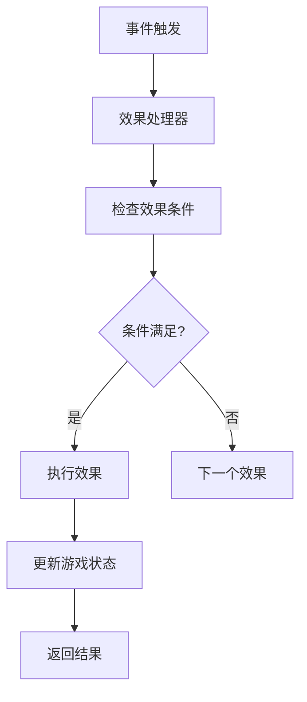
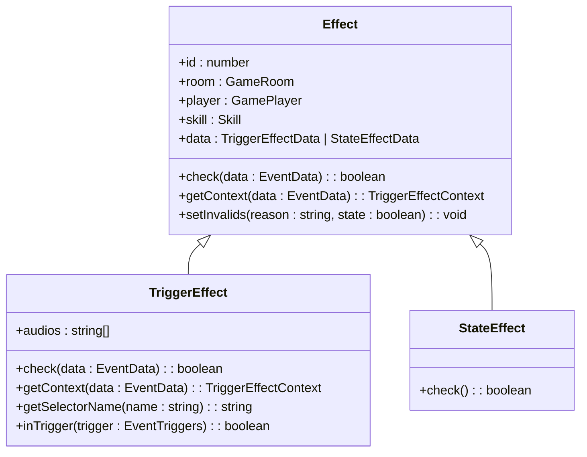
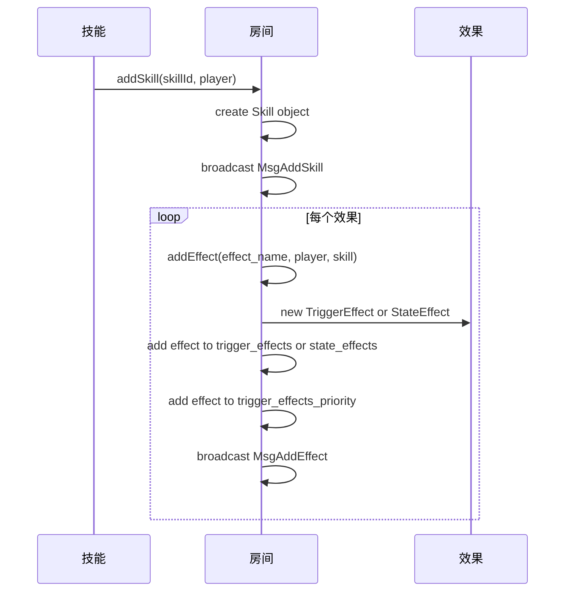
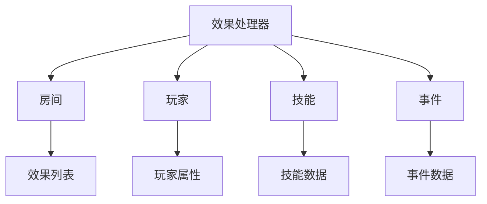

# 效果处理器设计

<cite>
**本文档引用的文件**   
- [effect.ts](file://server/src/core/skill/effect.ts)
- [room.skill.ts](file://server/src/core/room/mixins/room.skill.ts)
- [room.ts](file://server/src/core/room/room.ts)
- [sgs.ts](file://server/src/core/sgs.ts)
</cite>

## 目录
1. [简介](#简介)
2. [项目结构](#项目结构)
3. [核心组件](#核心组件)
4. [架构概述](#架构概述)
5. [详细组件分析](#详细组件分析)
6. [依赖分析](#依赖分析)
7. [性能考虑](#性能考虑)
8. [故障排除指南](#故障排除指南)
9. [结论](#结论)

## 简介
本文档详细介绍了resgsv1项目中技能效果处理器的设计与实现。重点分析了Effect类的设计模式、效果链的构建机制、执行流程以及异常处理。文档还解释了EffectProcessor如何通过责任链模式处理不同类型的效果，并深入探讨了效果优先级队列的实现原理。通过实际代码示例，展示了“惊乱”技能的效果链构建过程，包括效果的注册、排序和执行。此外，提供了序列图来展示从技能触发到效果处理器处理的完整调用流程，说明各组件间的交互关系。

## 项目结构
项目结构分为客户端和服务器端两大部分。客户端主要包含动画资源、配置文件、通用库和源代码。服务器端则包含核心逻辑、数据库、中间件、模型、路由、脚本和工具。核心逻辑位于`server/src/core`目录下，包括卡牌、事件、武将、玩家、房间、技能和效果等模块。

**Section sources**
- [effect.ts](file://server/src/core/skill/effect.ts)
- [room.skill.ts](file://server/src/core/room/mixins/room.skill.ts)

## 核心组件
核心组件包括Effect类、TriggerEffect类和StateEffect类。Effect类是所有效果的基类，定义了效果的基本属性和方法。TriggerEffect类用于处理触发式效果，而StateEffect类用于处理状态式效果。

**Section sources**
- [effect.ts](file://server/src/core/skill/effect.ts#L1-L465)

## 架构概述
效果处理器采用责任链模式来处理不同类型的效果。当一个事件触发时，效果处理器会按照优先级顺序检查所有注册的效果，并执行符合条件的效果。效果优先级队列确保了高优先级的效果先于低优先级的效果执行。



**Diagram sources**
- [room.ts](file://server/src/core/room/room.ts#L1117-L1150)
- [effect.ts](file://server/src/core/skill/effect.ts#L374-L417)

## 详细组件分析

### Effect类分析
Effect类是所有效果的基类，定义了效果的基本属性和方法。它包括效果ID、所属房间、所属玩家、所属技能等属性，以及检查效果条件、获取上下文、设置无效状态等方法。



**Diagram sources**
- [effect.ts](file://server/src/core/skill/effect.ts#L1-L465)

**Section sources**
- [effect.ts](file://server/src/core/skill/effect.ts#L1-L465)

### 效果链构建机制
效果链的构建机制通过`addEffect`方法实现。当一个技能被添加时，相关的所有效果也会被添加到游戏中。效果按照优先级分类存储在`trigger_effects_priority`映射中，确保高优先级的效果先于低优先级的效果执行。



**Diagram sources**
- [room.skill.ts](file://server/src/core/room/mixins/room.skill.ts#L77-L112)
- [effect.ts](file://server/src/core/skill/effect.ts#L1-L465)

**Section sources**
- [room.skill.ts](file://server/src/core/room/mixins/room.skill.ts#L77-L112)
- [effect.ts](file://server/src/core/skill/effect.ts#L1-L465)

### “惊乱”技能效果链示例
“惊乱”技能的效果链构建过程包括效果的注册、排序和执行。首先，技能被添加到玩家身上，然后相关的效果被注册到游戏中。效果按照优先级排序，并在适当的时机执行。

```typescript
// 示例代码：惊乱技能的效果链构建
const jingluanSkill = await room.addSkill('jingluan', player);
const jingluanEffect = await room.addEffect('jingluan_effect', player, jingluanSkill);
```

**Section sources**
- [room.skill.ts](file://server/src/core/room/mixins/room.skill.ts#L77-L112)
- [effect.ts](file://server/src/core/skill/effect.ts#L1-L465)

## 依赖分析
效果处理器依赖于房间、玩家、技能和事件等核心组件。房间负责管理所有效果的生命周期，玩家是效果的拥有者，技能定义了效果的行为，事件触发了效果的执行。



**Diagram sources**
- [room.ts](file://server/src/core/room/room.ts#L1117-L1150)
- [effect.ts](file://server/src/core/skill/effect.ts#L374-L417)

**Section sources**
- [room.ts](file://server/src/core/room/room.ts#L1117-L1150)
- [effect.ts](file://server/src/core/skill/effect.ts#L374-L417)

## 性能考虑
效果处理器的性能主要受效果数量和优先级队列的影响。为了优化性能，建议尽量减少不必要的效果注册，并合理设置效果的优先级。此外，避免在效果检查和执行过程中进行复杂的计算或I/O操作。

## 故障排除指南
常见问题包括效果未触发、效果执行顺序错误和效果条件检查失败。解决这些问题的方法包括检查效果的触发条件、优先级设置和生命周期定义。确保效果的`can_trigger`函数正确实现，并且效果的优先级设置合理。

**Section sources**
- [effect.ts](file://server/src/core/skill/effect.ts#L374-L417)
- [room.ts](file://server/src/core/room/room.ts#L1117-L1150)

## 结论
本文档详细介绍了resgsv1项目中技能效果处理器的设计与实现。通过责任链模式和优先级队列，效果处理器能够高效地处理不同类型的效果。Effect类的设计模式提供了灵活的扩展性，使得新的效果可以轻松地添加到游戏中。未来的工作可以进一步优化性能，提高效果处理器的响应速度和稳定性。