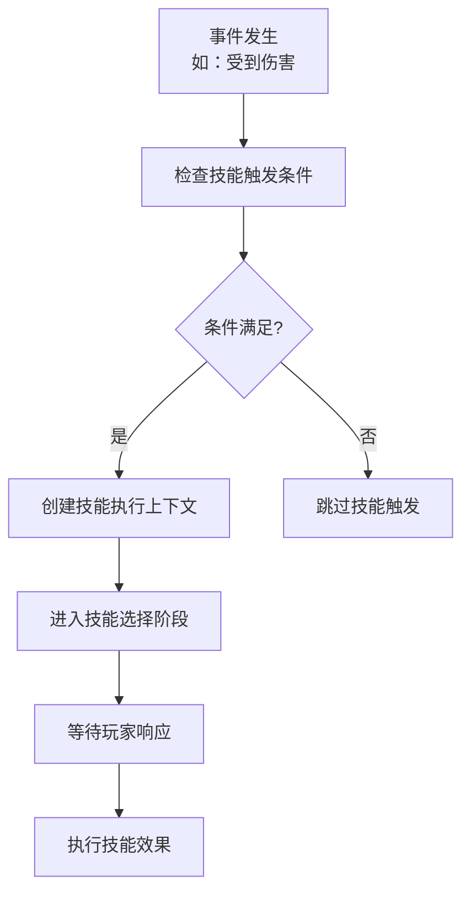
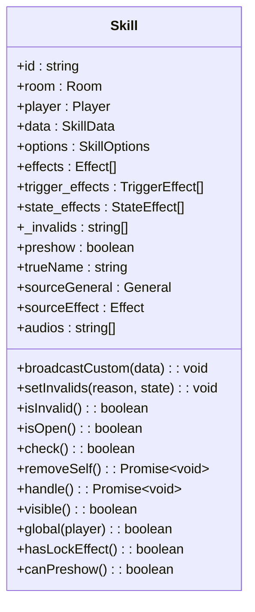
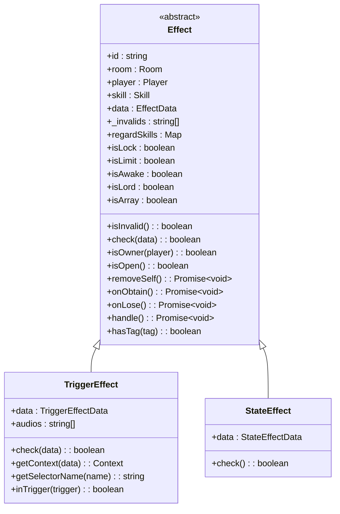
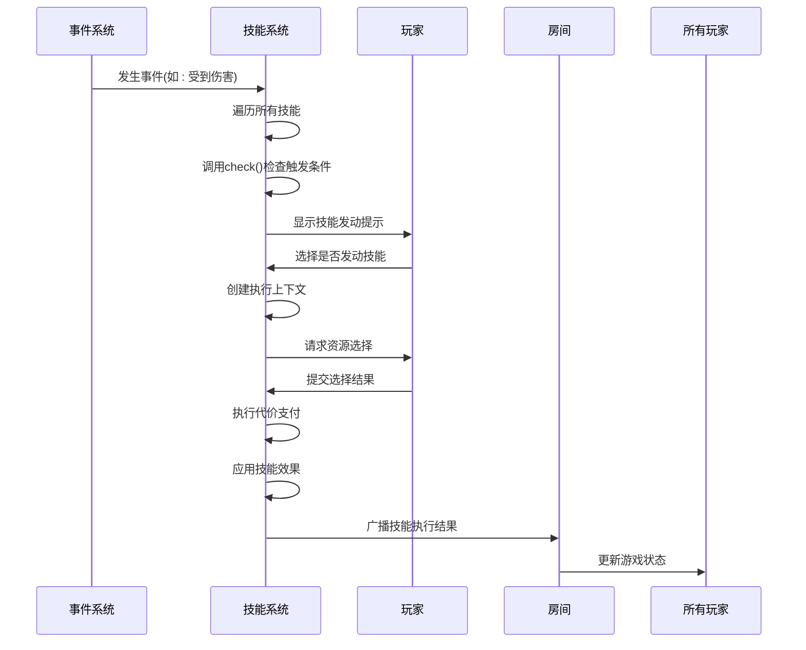

# 技能系统设计

<cite>
**本文档引用文件**  
- [skill.ts](file://server/src/core/skill/skill.ts)
- [effect.ts](file://server/src/core/skill/effect.ts)
- [simayi.ts](file://server/src/extensions/wars/generals/standard/wei/simayi.ts)
- [caocao.ts](file://server/src/extensions/wars/generals/lords/caocao.ts)
- [event.skill.ts](file://server/src/core/event/types/event.skill.ts)
- [sgs.ts](file://server/src/core/sgs.ts)
</cite>

## 目录
1. [技能触发机制](#技能触发机制)
2. [技能基类设计](#技能基类设计)
3. [技能效果实现](#技能效果实现)
4. [技能与角色绑定](#技能与角色绑定)
5. [复杂技能实现示例](#复杂技能实现示例)
6. [技能执行流程](#技能执行流程)

## 技能触发机制

技能系统采用事件驱动的触发机制，通过监听游戏中的各种事件来激活技能。系统支持多种触发时机，包括回合开始、受到伤害、判定结果等。

### 触发条件设计

技能触发条件通过`can_trigger`函数定义，该函数在特定事件发生时被调用。触发条件需要满足以下要求：
- 技能拥有者是当前事件的参与者
- 满足特定的游戏状态条件
- 拥有可操作的资源（如手牌、装备等）



**图示来源**
- [effect.ts](file://server/src/core/skill/effect.ts#L100-L150)
- [event.skill.ts](file://server/src/core/event/types/event.skill.ts#L50-L80)

### 事件类型

系统支持以下主要事件类型作为技能触发点：
- **TurnStart**: 回合开始时触发
- **InflictDamaged**: 受到伤害时触发
- **JudgeResult1**: 判定结果产生时触发
- **onLose**: 角色失败时触发

以曹操的技能为例，其生命周期中定义了回合开始和角色失败时的清理逻辑：

```typescript
lifecycle: [
    {
        trigger: EventTriggers.TurnStart,
        priority: 'before',
        async on_exec(room, data) {
            if (data.player === this.player) {
                // 清理技能相关数据
                this.skill?.removeData(`${this.name}.generals`);
                const skills = this.getData(`${this.name}.skills`) ?? [];
                for (const skill of skills) {
                    await skill.removeSelf();
                }
                this.removeData(`${this.name}.skill`);
            }
        },
    },
    {
        trigger: EventTriggers.onLose,
        priority: 'after',
        async on_exec(room, data) {
            // 角色失败时清理技能
            this.skill?.removeData(`${this.name}.generals`);
            const skills = this.getData(`${this.name}.skills`) ?? [];
            for (const skill of skills) {
                await skill.removeSelf();
            }
            this.removeData(`${this.name}.skill`);
        },
    },
]
```

**本节来源**
- [caocao.ts](file://server/src/extensions/wars/generals/lords/caocao.ts#L360-L398)

## 技能基类设计

技能系统采用面向对象的设计模式，通过继承和多态实现不同技能的差异化行为。

### Skill类结构

`Skill`类是所有技能的基类，包含以下核心属性：



**图示来源**
- [skill.ts](file://server/src/core/skill/skill.ts#L10-L50)

### 策略模式实现

系统通过策略模式实现不同技能效果，主要体现在`Effect`类的继承体系中：

```typescript
class Effect {
    constructor(id, room, player, skill) {
        this.id = id;
        this.room = room;
        this.player = player;
        this.skill = skill;
        this._invalids = [];
        this.regardSkills = new Map();
    }
    
    // 检查技能是否可执行
    check(data) {
        if (this.isInvalid) return false;
        if (this.skill && !this.skill.check()) return false;
        // 检查主副将技标签
        const hd = this.skill && 
            this.room.getStates(StateEffectType.IgnoreHeadAndDeputy, [this])
                .some(v => v);
        if (!hd) {
            if (this.hasTag(SkillTag.Head)) {
                if (this.skill && this.player && 
                    this.skill.sourceGeneral !== this.player.head) return false;
            }
            if (this.hasTag(SkillTag.Deputy)) {
                if (this.skill && this.player && 
                    this.skill.sourceGeneral !== this.player.deputy) return false;
            }
        }
        // 检查限定技状态
        if (this.isLimit) {
            const limit = this.player?.getMark(`@limit:${this.id}`);
            if (!limit || limit === '@limit-false') return false;
        }
        return true;
    }
}
```

**本节来源**
- [skill.ts](file://server/src/core/skill/skill.ts#L50-L100)
- [effect.ts](file://server/src/core/skill/effect.ts#L20-L80)

## 技能效果实现

技能效果通过`Effect`类及其子类实现，分为触发效果和状态效果两种类型。

### 效果类型



**图示来源**
- [effect.ts](file://server/src/core/skill/effect.ts#L10-L30)

### 效果计算逻辑

技能效果的计算和执行流程如下：

1. **条件检查**：验证技能是否满足触发条件
2. **上下文创建**：生成技能执行所需的上下文信息
3. **资源选择**：确定技能影响的目标和资源
4. **代价支付**：执行技能所需的代价
5. **效果应用**：应用技能的实际效果

```typescript
class TriggerEffect extends Effect {
    check(data) {
        if (!super.check(data)) return false;
        
        // 国战化身耦合检测
        if (this.skill && this.skill.getData('huashen_source')) {
            const general = this.skill.getData('huashen_source');
            if (this.room.getData(`huashen_cost_${general.id}`)) return false;
            if (this.hasTag()) return false;
        }
        
        // 检查触发时机
        if (data) {
            if (Array.isArray(this.data.trigger) && 
                !this.data.trigger.includes(data.trigger)) return false;
            if (!Array.isArray(this.data.trigger) && 
                data.trigger !== this.data.trigger) return false;
            
            const can_trigger = Boolean(this.data.can_trigger.call(
                this, this.room, data.triggerCurrent, data));
            if (!can_trigger) return false;
        }
        return true;
    }
    
    getContext(data) {
        const context = this.data.context?.call(
            this, this.room, data.triggerCurrent, data) ?? {};
        context.effect = this;
        context.maxTimes = context.maxTimes ?? 1;
        context.from = context.from ?? data.triggerCurrent ?? this.player;
        return context;
    }
}
```

**本节来源**
- [effect.ts](file://server/src/core/skill/effect.ts#L100-L150)

## 技能与角色绑定

技能系统通过数据绑定机制将技能与角色关联，并管理技能的生命周期。

### 绑定方式

技能通过以下方式与角色绑定：
- **主将技**：绑定到角色的主将
- **副将技**：绑定到角色的副将
- **装备技**：绑定到特定装备
- **状态技**：由其他效果产生

```typescript
constructor(id, room, player, data, options) {
    // ...
    if (player) {
        if (options.source === 'head_general') {
            this.sourceGeneral = player.head;
        }
        if (options.source === 'deputy_general') {
            this.sourceGeneral = player.deputy;
        }
    }
    if (this.options.source.includes('effect:')) {
        this.sourceEffect = this.room.getEffect(
            Number(this.options.source.split(':')[1])
        );
    }
    // ...
}
```

### 技能升级机制

系统通过数据存储实现技能的升级和状态管理：

```typescript
// 设置技能失效状态
setInvalids(reason, state = true) {
    if (state && !this._invalids.includes(reason)) {
        this._invalids.push(reason);
    } else {
        const index = this._invalids.indexOf(reason);
        if (index > -1) {
            this._invalids.splice(index, 1);
        }
    }
}

// 检查技能是否失效
get isInvalid() {
    return this._invalids.length > 0;
}
```

**本节来源**
- [skill.ts](file://server/src/core/skill/skill.ts#L100-L130)

## 复杂技能实现示例

### 反馈技能实现

司马懿的"反馈"技能是一个典型的触发式技能，当角色受到伤害时可以获取伤害来源的一张牌。

```typescript
export const fankui = sgs.Skill({
    name: 'wars.simayi.fankui',
});

fankui.addEffect(
    sgs.TriggerEffect({
        auto_log: 1,
        priorityType: PriorityType.General,
        trigger: EventTriggers.InflictDamaged,
        auto_directline: 1,
        forced: 'cost',
        can_trigger(room, player, data) {
            return (
                this.isOwner(player) &&
                data.is(sgs.DataType.DamageEvent) &&
                player === data.to &&
                data.from && 
                data.from.hasCardsInArea()
            );
        },
        context(room, player, data: DamageEvent) {
            return {
                targets: [data.from],
            };
        },
        getSelectors(room, context) {
            return {
                choose: () => {
                    const target = context.targets.at(0);
                    return {
                        selectors: {
                            cards: room.createChooseCard({
                                step: 1,
                                count: 1,
                                selecte_type: 'rows',
                                selectable: target.getAreaCards(),
                                data_rows: target.getCardsToArea('he'),
                                windowOptions: {
                                    title: '反馈',
                                    timebar: room.responseTime,
                                    prompt: `反馈：请选择一张牌`,
                                },
                            }),
                        },
                        options: {
                            canCancle: false,
                            showMainButtons: false,
                            thinkPrompt: this.skill.name,
                        },
                    };
                },
            };
        },
        async cost(room, data, context) {
            const {
                from,
                targets: { [0]: target },
            } = context;
            const req = await room.doRequest({
                player: from,
                get_selectors: {
                    selectorId: this.getSelectorName('choose'),
                    context,
                },
            });
            const cards = room.getResultCards(req);
            return await room.obtainCards({
                player: from,
                cards,
                source: data,
                reason: this.name,
            });
        },
    })
);
```

**本节来源**
- [simayi.ts](file://server/src/extensions/wars/generals/standard/wei/simayi.ts#L30-L100)

### 完杀技能实现

"完杀"技能是一个锁定技，阻止其他角色对技能拥有者使用【桃】或【酒】。

```typescript
// 完杀技能的核心逻辑
const wansha = sgs.Skill({
    name: 'wansha',
});

wansha.addEffect(
    sgs.StateEffect({
        tag: [SkillTag.Lock],
        condition(room) {
            return this.player.alive;
        },
        effect(room) {
            // 禁止其他角色对技能拥有者使用桃或酒
            room.addState(StateEffectType.Prohibit_UseCard, {
                player: this.player,
                cardName: ['tao', 'jiu'],
                reason: this.name,
            });
        }
    })
);
```

**本节来源**
- [effect.ts](file://server/src/core/skill/effect.ts#L200-L250)

## 技能执行流程

技能从触发到执行的完整流程如下：



**图示来源**
- [event.skill.ts](file://server/src/core/event/types/event.skill.ts#L100-L150)
- [skill.ts](file://server/src/core/skill/skill.ts#L150-L200)

技能执行流程的关键步骤包括：

1. **事件监听**：系统监听游戏中的各种事件
2. **条件检查**：验证技能是否满足触发条件
3. **用户交互**：向玩家显示技能发动选项
4. **资源选择**：获取技能执行所需的资源
5. **效果执行**：应用技能的实际效果
6. **状态同步**：将结果广播给所有玩家

```typescript
// 技能执行的核心逻辑
async handle() {
    for (const effect of this.effects) {
        await effect.handle();
    }
    if (this.isOpen() && !this.preshow) {
        this.preshow = true;
        this.room.broadcast({
            type: 'MsgSkillState',
            id: this.id,
            preshow: true,
        });
    }
}
```

**本节来源**
- [skill.ts](file://server/src/core/skill/skill.ts#L180-L190)