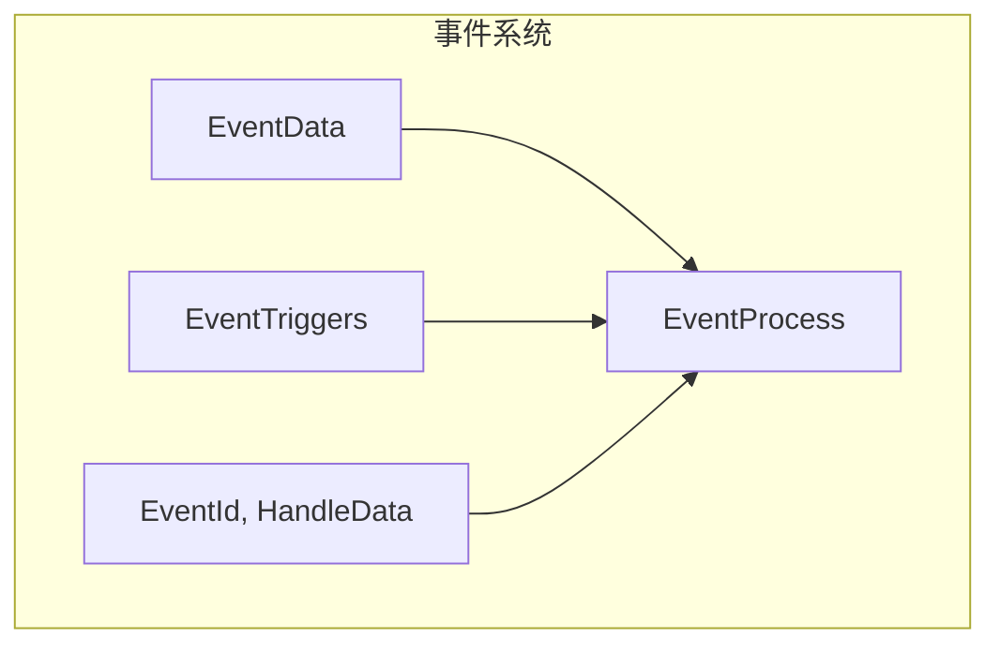
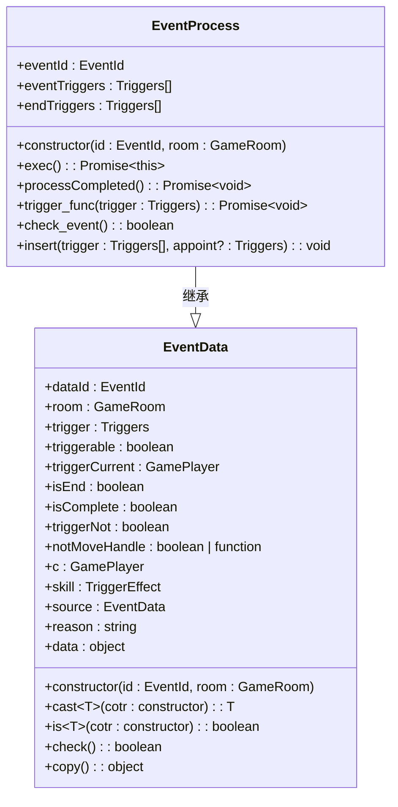
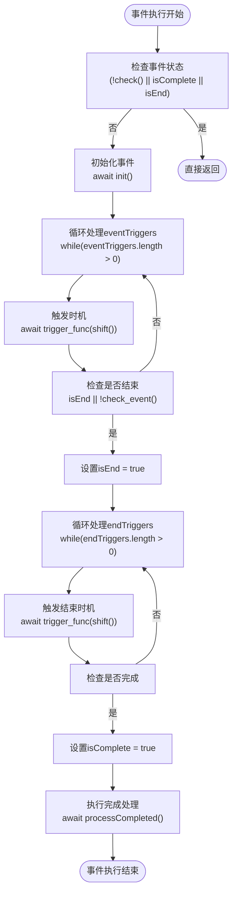
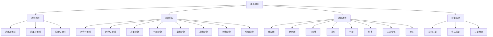

# 事件驱动机制

<cite>
**本文档引用的文件**
- [event.ts](file://server/src/core/event/event.ts#L0-L168)
- [data.ts](file://server/src/core/event/data.ts#L0-L76)
- [triggers.ts](file://server/src/core/event/triggers.ts#L0-L171)
- [event.types.ts](file://server/src/core/event/event.types.ts#L0-L18)
- [event.use.ts](file://server/src/core/event/types/event.use.ts#L490-L530)
</cite>

## 目录
1. [简介](#简介)
2. [项目结构](#项目结构)
3. [核心组件](#核心组件)
4. [架构概述](#架构概述)
5. [详细组件分析](#详细组件分析)
6. [依赖分析](#依赖分析)
7. [性能考虑](#性能考虑)
8. [故障排除指南](#故障排除指南)
9. [结论](#结论)

## 简介
本文档详细介绍了resgsv1项目中技能触发系统的事件驱动架构。该系统通过事件发布、订阅和广播机制，实现了游戏逻辑的解耦和模块化。文档将深入分析事件系统的实现原理，包括事件监听器的管理、回调函数的执行流程，以及事件系统与技能系统的集成方式。

## 项目结构
resgsv1项目的事件系统主要位于服务器端的`server/src/core/event`目录下。该目录包含了事件系统的核心组件，包括事件数据定义、事件处理流程、事件类型枚举和各种具体的事件类型实现。



**图示来源**
- [event.ts](file://server/src/core/event/event.ts#L0-L168)
- [data.ts](file://server/src/core/event/data.ts#L0-L76)
- [triggers.ts](file://server/src/core/event/triggers.ts#L0-L171)

**本节来源**
- [event.ts](file://server/src/core/event/event.ts#L0-L168)
- [triggers.ts](file://server/src/core/event/triggers.ts#L0-L171)

## 核心组件
事件驱动系统的核心组件包括事件数据基类`EventData`、事件处理流程基类`EventProcess`以及事件时机枚举`EventTriggers`。这些组件共同构成了事件系统的骨架，为技能触发和其他游戏机制提供了基础支持。

**本节来源**
- [data.ts](file://server/src/core/event/data.ts#L0-L76)
- [event.ts](file://server/src/core/event/event.ts#L0-L168)
- [triggers.ts](file://server/src/core/event/triggers.ts#L0-L171)

## 架构概述
事件驱动架构采用观察者模式，通过定义一系列标准化的事件时机，实现了游戏逻辑的模块化和可扩展性。当特定游戏状态发生时，系统会自动触发相应的事件，由注册的监听器进行处理。



**图示来源**
- [data.ts](file://server/src/core/event/data.ts#L0-L76)
- [event.ts](file://server/src/core/event/event.ts#L0-L168)

## 详细组件分析
### 事件数据组件分析
`EventData`类是所有事件数据的基类，它定义了事件的基本属性和通用方法。该类通过泛型和类型检查机制，确保了事件数据的安全性和可扩展性。

#### 类图分析


**图示来源**
- [data.ts](file://server/src/core/event/data.ts#L0-L76)
- [event.ts](file://server/src/core/event/event.ts#L0-L168)

**本节来源**
- [data.ts](file://server/src/core/event/data.ts#L0-L76)
- [event.ts](file://server/src/core/event/event.ts#L0-L168)

### 事件处理流程分析
`EventProcess`类是事件处理的核心，它定义了事件的执行流程和时机管理机制。该类通过两个触发器队列（eventTriggers和endTriggers）来管理事件的生命周期。

#### 执行流程分析


**图示来源**
- [event.ts](file://server/src/core/event/event.ts#L0-L168)

**本节来源**
- [event.ts](file://server/src/core/event/event.ts#L0-L168)

### 事件时机系统分析
事件时机系统通过`EventTriggers`枚举定义了游戏中所有可能的事件触发点。这些时机涵盖了从游戏开始到结束的各个阶段，以及各种游戏动作的前后时刻。

#### 时机分类分析


**图示来源**
- [triggers.ts](file://server/src/core/event/triggers.ts#L0-L171)

**本节来源**
- [triggers.ts](file://server/src/core/event/triggers.ts#L0-L171)

## 依赖分析
事件系统与其他游戏组件存在紧密的依赖关系，主要体现在与房间管理、玩家管理、技能系统和卡牌系统的交互上。

```mermaid
graph TB
EventSystem[事件系统] --> Room[GameRoom]
EventSystem --> Player[GamePlayer]
EventSystem --> Skill[Skill]
EventSystem --> Card[GameCard]
Room --> EventSystem : 触发事件
Player --> EventSystem : 作为触发者
Skill --> EventSystem : 技能效果
Card --> EventSystem : 卡牌操作
subgraph "事件系统内部"
EventData --> EventProcess
EventData --> EventTypes
EventProcess --> Triggers
EventTypes --> EventData
end
```

**图示来源**
- [event.ts](file://server/src/core/event/event.ts#L0-L168)
- [data.ts](file://server/src/core/event/data.ts#L0-L76)
- [triggers.ts](file://server/src/core/event/triggers.ts#L0-L171)

**本节来源**
- [event.ts](file://server/src/core/event/event.ts#L0-L168)
- [data.ts](file://server/src/core/event/data.ts#L0-L76)
- [triggers.ts](file://server/src/core/event/triggers.ts#L0-L171)

## 性能考虑
事件驱动系统在设计时考虑了性能优化，主要体现在以下几个方面：
1. 通过异步处理避免阻塞主线程
2. 使用轻量级的事件对象减少内存开销
3. 采用队列机制批量处理事件
4. 提供事件过滤机制减少不必要的处理

虽然这些优化措施有效提升了系统性能，但在高并发场景下仍需注意事件队列的长度控制和内存管理。

## 故障排除指南
在使用事件驱动系统时，可能会遇到以下常见问题：

1. **事件未触发**：检查事件时机是否正确，确认监听器已正确注册
2. **事件重复触发**：检查事件处理逻辑，确保没有重复添加触发器
3. **事件顺序错误**：使用`insert`方法指定触发顺序，或检查事件依赖关系
4. **内存泄漏**：确保事件完成后正确清理引用，避免循环引用

**本节来源**
- [event.ts](file://server/src/core/event/event.ts#L0-L168)
- [data.ts](file://server/src/core/event/data.ts#L0-L76)

## 结论
resgsv1的事件驱动机制通过精心设计的架构，实现了游戏逻辑的高度模块化和可扩展性。该系统不仅支持基本的游戏流程控制，还为复杂的技能触发提供了灵活的基础设施。通过标准化的事件时机和清晰的处理流程，开发者可以轻松实现各种游戏规则和特殊效果，为玩家提供丰富多样的游戏体验。