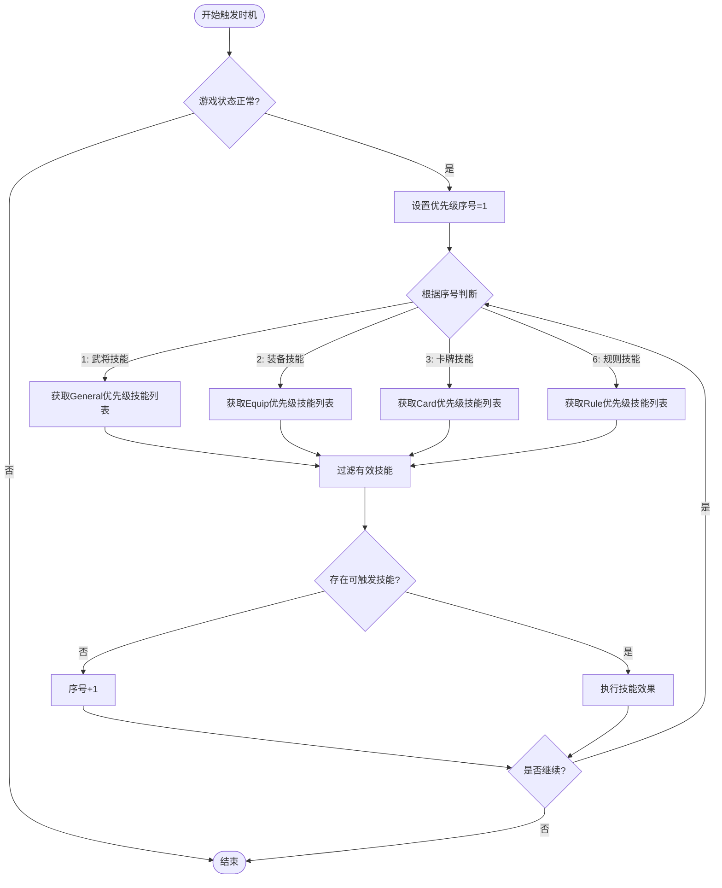
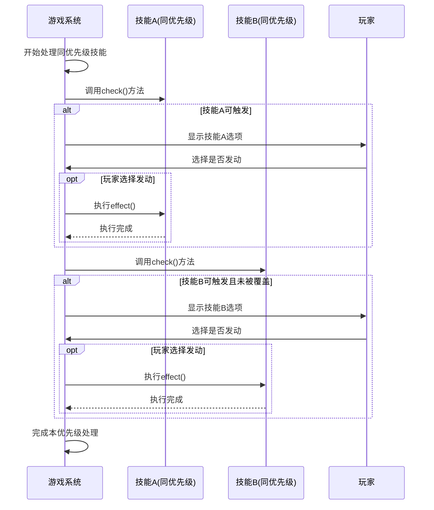
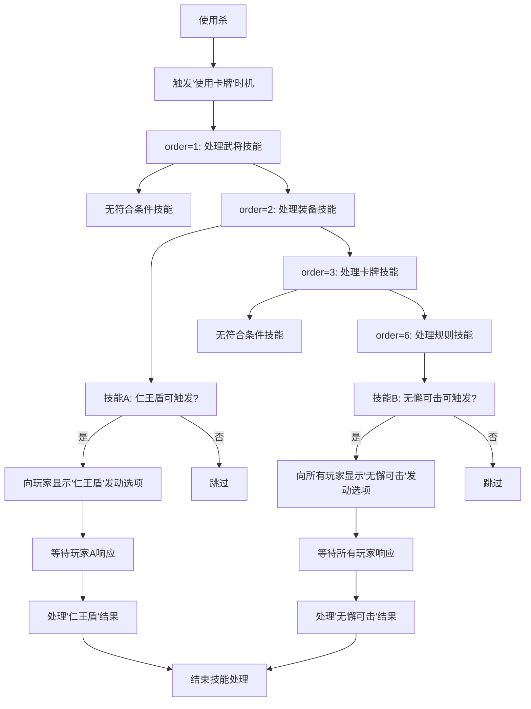

# 优先级管理

<cite>
**本文档引用文件**  
- [skill.types.ts](file://server/src/core/skill/skill.types.ts#L37-L51)
- [room.ts](file://server/src/core/room/room.ts#L733-L769)
- [skill.ts](file://server/src/core/skill/skill.ts#L1-L246)
</cite>

## 目录
1. [技能优先级机制概述](#技能优先级机制概述)  
2. [优先级类型与取值范围](#优先级类型与取值范围)  
3. [优先级执行顺序处理逻辑](#优先级执行顺序处理逻辑)  
4. [相同优先级技能处理策略](#相同优先级技能处理策略)  
5. [高优先级技能抢占示例](#高优先级技能抢占示例)  
6. [最佳实践建议](#最佳实践建议)

## 技能优先级机制概述

在resgsv1系统中，技能触发优先级是决定多个技能执行顺序的核心机制。该机制通过`priorityType`属性对不同类型的技能进行分类，并在事件触发时按照预设的优先级顺序依次处理。系统确保高优先级技能能够优先响应游戏事件，从而实现复杂的游戏逻辑控制。

**Section sources**  
- [skill.types.ts](file://server/src/core/skill/skill.types.ts#L37-L51)
- [room.ts](file://server/src/core/room/room.ts#L733-L769)

## 优先级类型与取值范围

技能优先级由`PriorityType`枚举定义，包含以下七种类型，按数值递增表示优先级升高：

```mermaid
classDiagram
class PriorityType {
+None = 0
+General
+Equip
+Card
+Rule
+GlobalRule
+Refresh
}
note right of PriorityType
优先级数值越高，执行顺序越靠前
end note
```

**Diagram sources**  
- [skill.types.ts](file://server/src/core/skill/skill.types.ts#L37-L51)

**Section sources**  
- [skill.types.ts](file://server/src/core/skill/skill.types.ts#L37-L51)

### 优先级类型说明

| 优先级类型 | 说明 |
|-----------|------|
| **None** | 无优先级，最低级别 |
| **General** | 武将技能，基础角色能力 |
| **Equip** | 装备技能，随装备生效 |
| **Card** | 卡牌技能，依附于特定卡牌 |
| **Rule** | 规则技能，影响游戏基本规则 |
| **GlobalRule** | 全局规则技能，最高规则权限 |
| **Refresh** | 刷新处理技能，用于状态更新 |

## 优先级执行顺序处理逻辑

系统在处理技能触发时，采用分层轮询机制，严格按照优先级顺序执行：



**Diagram sources**  
- [room.ts](file://server/src/core/room/room.ts#L733-L769)

**Section sources**  
- [room.ts](file://server/src/core/room/room.ts#L733-L769)

### 执行流程关键点

1. **分层处理**：系统按`order`变量从1开始递增，逐层处理不同优先级的技能
2. **过滤检查**：每层都会调用`check()`方法验证技能是否满足触发条件
3. **中断机制**：当某层存在可触发技能时，优先执行该层技能，不会继续向下处理更低优先级技能
4. **状态保持**：通过`data.triggerable`标志位控制整个触发流程的可继续性

## 相同优先级技能处理策略

当多个技能具有相同优先级时，系统采用以下策略进行处理：

### 执行顺序规则

- **同优先级内顺序**：在同一优先级层级内，技能按照其在`trigger_effects_priority`映射表中的存储顺序执行
- **玩家响应顺序**：对于需要玩家响应的技能，按照玩家座位顺序（顺时针）依次询问
- **自动执行优先**：`forced: 'mute'`类型的技能优先于`forced: 'cost'`类型执行

### 冲突解决机制



**Diagram sources**  
- [room.ts](file://server/src/core/room/room.ts#L733-L769)
- [skill.ts](file://server/src/core/skill/skill.ts#L1-L246)

**Section sources**  
- [room.ts](file://server/src/core/room/room.ts#L733-L769)

## 高优先级技能抢占示例

### 场景描述

假设游戏中存在以下两个技能：
- **技能A**：装备技能"仁王盾"，优先级为`Equip(2)`
- **技能B**：规则技能"无懈可击"，优先级为`Rule(4)`

当有玩家对目标使用【杀】时，两个技能都可能被触发。

### 执行流程分析



**Diagram sources**  
- [room.ts](file://server/src/core/room/room.ts#L733-L769)

**Section sources**  
- [room.ts](file://server/src/core/room/room.ts#L733-L769)

### 抢占效果说明

1. **时间差优势**：虽然"仁王盾"先被检测，但"无懈可击"作为更高优先级技能仍然可以在后续被触发
2. **逻辑覆盖**：即使"仁王盾"已生效，"无懈可击"仍可将其抵消，体现了高优先级技能的权威性
3. **用户体验**：系统确保所有可能的高优先级技能都有机会被玩家选择发动

## 最佳实践建议

### 优先级设置原则

1. **合理分配**：根据技能影响力合理设置优先级，避免过度集中
2. **避免冲突**：相同功能类型的技能应保持相近优先级，减少逻辑冲突
3. **预留空间**：为未来扩展预留优先级数值空间

### 开发注意事项

- **明确标注**：在技能定义时清晰标注`priorityType`属性
- **测试验证**：充分测试多技能并发场景下的执行顺序
- **文档记录**：维护优先级使用规范文档，确保团队一致性

### 常见问题规避

| 问题类型 | 解决方案 |
|---------|----------|
| **优先级混乱** | 建立统一的优先级分配标准 |
| **技能被忽略** | 检查`check()`方法逻辑是否正确 |
| **执行顺序异常** | 验证`trigger_effects_priority`映射表的构建过程 |
| **性能问题** | 优化`check()`方法的计算复杂度 |

**Section sources**  
- [skill.types.ts](file://server/src/core/skill/skill.types.ts#L37-L51)
- [room.ts](file://server/src/core/room/room.ts#L733-L769)
- [skill.ts](file://server/src/core/skill/skill.ts#L1-L246)