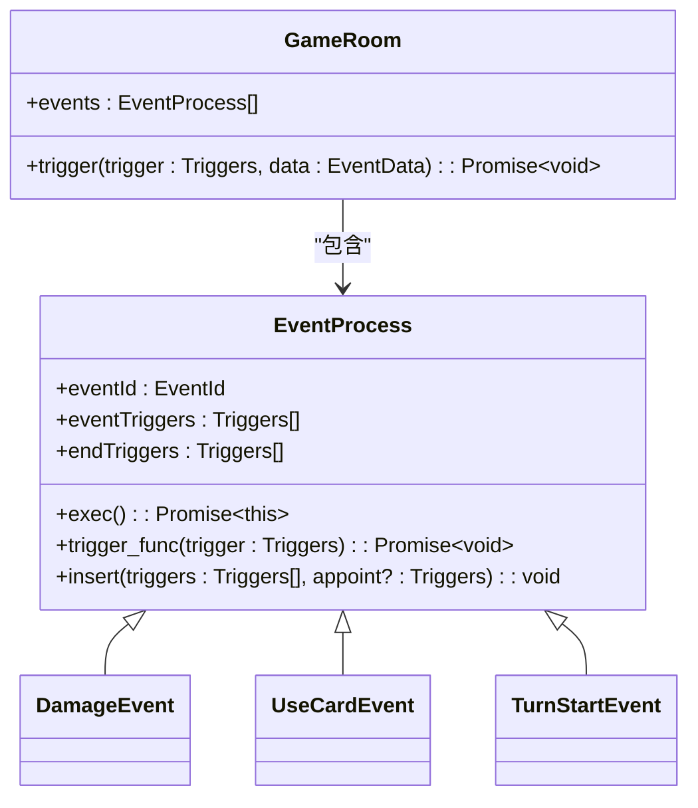
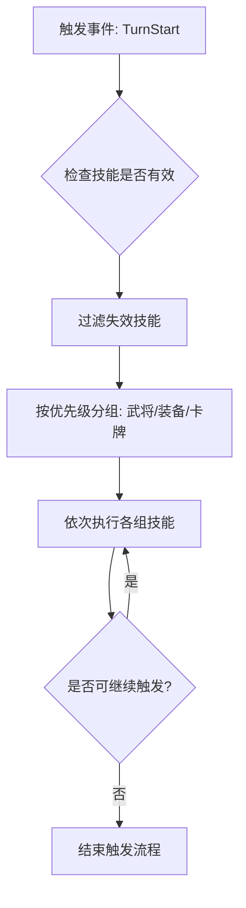
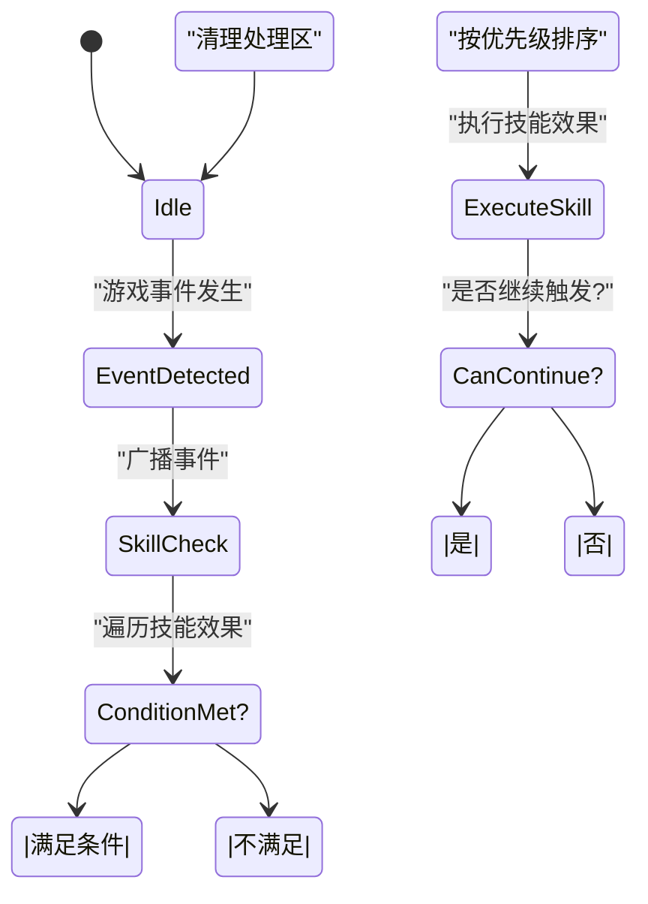

# 技能触发设计

<cite>
**本文档引用文件**  
- [event.ts](file://server/src/core/event/event.ts)
- [triggers.ts](file://server/src/core/event/triggers.ts)
- [effect.ts](file://server/src/core/skill/effect.ts)
- [room.ts](file://server/src/core/room/room.ts)
- [lang_mobile.ts](file://server/src/extensions/lang/lang_mobile.ts)
- [lang2.ts](file://server/src/extensions/lang/lang2.ts)
</cite>

## 目录
1. [技能触发系统概述](#技能触发系统概述)  
2. [事件驱动架构](#事件驱动架构)  
3. [事件监听与触发机制](#事件监听与触发机制)  
4. [触发条件与优先级处理](#触发条件与优先级处理)  
5. [实际技能配置示例](#实际技能配置示例)  
6. [技能触发状态图](#技能触发状态图)  

## 技能触发系统概述

技能触发机制是resgsv1游戏系统中的核心逻辑之一，采用事件驱动架构实现。系统通过监听游戏中的各类事件（如“回合开始”、“受到伤害”、“使用卡牌”等），在满足特定条件时自动触发对应技能。该机制支持复杂的条件判断、优先级排序与冲突解决，确保技能逻辑的准确执行。

技能触发系统主要由事件系统、技能效果管理器和房间逻辑三部分构成。事件系统负责定义和分发游戏事件；技能效果管理器注册并管理所有可触发的技能；房间逻辑则协调事件与技能之间的交互流程。

**Section sources**  
- [event.ts](file://server/src/core/event/event.ts#L1-L168)
- [triggers.ts](file://server/src/core/event/triggers.ts#L1-L171)

## 事件驱动架构

resgsv1采用基于事件的响应式架构，所有游戏行为均以事件形式进行建模。核心事件类 `EventProcess` 定义了事件的基本结构和执行流程。



**Diagram sources**  
- [event.ts](file://server/src/core/event/event.ts#L1-L168)

### 事件生命周期

每个事件实例在创建后进入执行流程，其生命周期包括：
1. 初始化（`init`）：设置事件源并加入事件队列
2. 主流程触发（`eventTriggers`）：按顺序执行注册的触发时机
3. 结束流程触发（`endTriggers`）：事件结束后执行收尾操作
4. 完成处理（`processCompleted`）：清理处理区卡牌并移除自身

事件的执行受游戏状态控制，仅在 `GameState.Gaming` 状态下运行，确保逻辑安全性。

**Section sources**  
- [event.ts](file://server/src/core/event/event.ts#L1-L168)

## 事件监听与触发机制

技能的触发依赖于事件监听机制。系统通过 `TriggerEffect` 类实现技能与事件的绑定，每个技能效果可监听一个或多个事件时机。

### 事件监听注册

技能效果在初始化时通过 `data.trigger` 字段声明其监听的事件时机。例如：

```typescript
const feedbackEffect: TriggerEffectData = {
    name: '反馈',
    trigger: EventTriggers.InflictDamage1,
    can_trigger: (room, player, data) => {
        return player === data.to;
    },
    context: () => ({ maxTimes: 1 })
};
```

上述配置表示“反馈”技能在“受到伤害时1”这一时机被检测，且仅当目标为自己时可触发。

### 事件分发流程

当游戏发生特定行为时，房间（GameRoom）会调用 `trigger` 方法广播事件。该方法按优先级顺序检查所有注册的技能效果：



**Diagram sources**  
- [room.ts](file://server/src/core/room/room.ts#L667-L704)

**Section sources**  
- [room.ts](file://server/src/core/room/room.ts#L667-L769)
- [effect.ts](file://server/src/core/skill/effect.ts#L341-L377)

## 触发条件与优先级处理

系统通过多层机制确保技能触发的准确性和公平性。

### 条件判断

技能是否可触发由 `check` 方法综合判断，包括：
- 技能是否失效（`isInvalid`）
- 所属武将是否匹配（主将/副将技）
- 是否为限定技且已使用
- 自定义条件函数（`can_trigger`）

```typescript
public check(data?: EventData): boolean {
    if (this.isInvalid) return false;
    if (this.skill && !this.skill.check()) return false;
    if (this.isLimit) {
        const limit = this.player?.getMark<string>(`@limit:${this.id}`);
        if (!limit || limit === '@limit-false') return false;
    }
    if (data) {
        if (!this.data.trigger.includes(data.trigger)) return false;
        const can_trigger = Boolean(this.data.can_trigger.call(this, this.room, data.triggerCurrent, data));
        if (!can_trigger) return false;
    }
    return true;
}
```

### 优先级处理

系统定义了五类技能优先级，按顺序依次处理：
1. **None**：无优先级技能
2. **General**：武将技能（最高优先）
3. **Equip**：装备技能
4. **Card**：卡牌技能
5. **Rule**：规则技能（最低优先）

此机制确保武将技能优先于装备技能执行，避免逻辑冲突。

**Section sources**  
- [effect.ts](file://server/src/core/skill/effect.ts#L341-L377)
- [room.ts](file://server/src/core/room/room.ts#L733-L769)

## 实际技能配置示例

### 司马懿 - 反馈

“反馈”技能在受到伤害时触发，允许玩家获得伤害来源的一张牌。

```typescript
['wars.simayi.fankui']: {
    name: '反馈',
    desc: '当你受到伤害后，你可以获得伤害来源的一张牌。',
    desc2: '当你受到伤害后，你可获得对你造成伤害的角色的一张牌。',
    data: {
        trigger: EventTriggers.InflictDamaged,
        can_trigger: (room, player, data) => {
            return player === data.to && data.from !== undefined;
        },
        context: () => ({ maxTimes: 1, targets: [] })
    } as TriggerEffectData
}
```

- **触发时机**：`InflictDamaged`（受到伤害后）
- **触发条件**：当前玩家是伤害目标且存在伤害来源
- **执行效果**：弹出选择界面，从来源角色处获得一张牌

### 十常侍 - 乱政

“乱政”技能在每轮开始时触发，强制所有其他角色弃置一张牌。

```typescript
['shichangshi.luanzheng']: {
    name: '乱政',
    desc: '每轮开始时，其他所有角色须弃置一张牌。',
    data: {
        trigger: EventTriggers.CircleStarted,
        can_trigger: (room, player) => {
            return room.currentCircle === player;
        },
        async effect(room, context, data) {
            const targets = room.getOthers(context.from);
            for (const target of targets) {
                await room.chooseToDiscard(target, 1, 'he');
            }
        }
    } as TriggerEffectData
}
```

- **触发时机**：`CircleStarted`（每轮开始时）
- **触发条件**：当前轮到该角色
- **执行效果**：对除自己外的所有角色执行弃牌选择

**Section sources**  
- [lang2.ts](file://server/src/extensions/lang/lang2.ts#L2033-L2054)
- [lang_mobile.ts](file://server/src/extensions/lang/lang_mobile.ts#L0-L10)

## 技能触发状态图



**Diagram sources**  
- [event.ts](file://server/src/core/event/event.ts#L1-L168)
- [room.ts](file://server/src/core/room/room.ts#L667-L769)