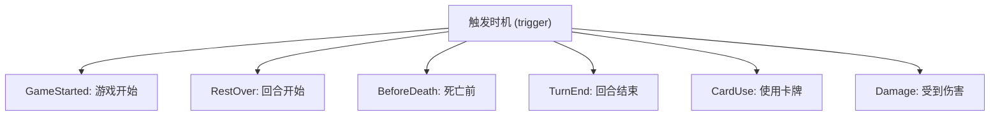
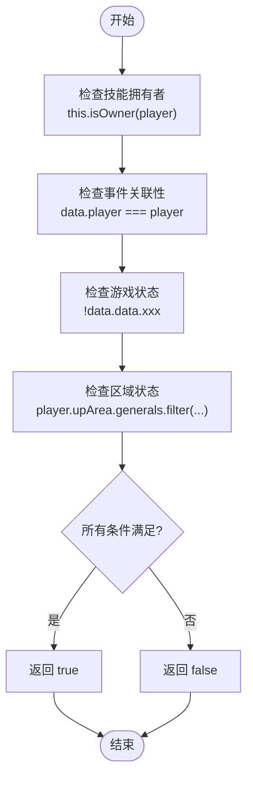
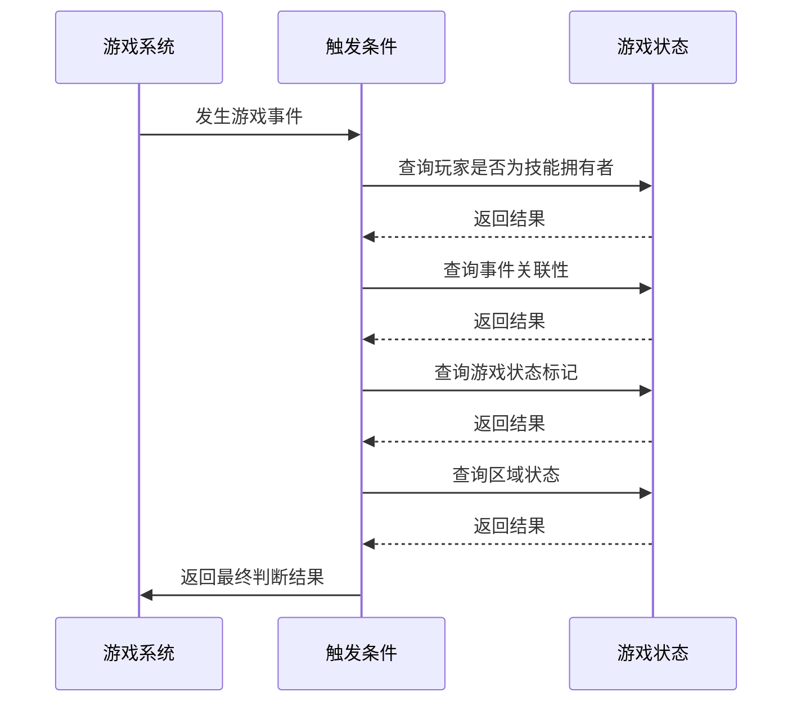

# 触发条件配置

<cite>
**本文档引用文件**   
- [shichangshi.ts](file://server/src/extensions/mxiuliqiankun/generals/shichangshi/shichangshi.ts)
</cite>

## 目录
1. [简介](#简介)
2. [触发条件配置概述](#触发条件配置概述)
3. [触发时机（triggeredOn）详解](#触发时机triggeredon详解)
4. [触发条件（filter）详解](#触发条件filter详解)
5. [实际技能案例分析](#实际技能案例分析)
6. [条件判断函数执行逻辑](#条件判断函数执行逻辑)
7. [最佳实践与总结](#最佳实践与总结)

## 简介
本文档深入解析resgsv1项目中技能触发条件的配置方式，重点介绍如何定义技能的触发时机和触发条件。通过十常侍的“党锢”和“殁亡”技能的实际代码示例，展示触发条件的编写方法和最佳实践。

## 触发条件配置概述
在resgsv1项目中，技能的触发条件通过`TriggerEffect`配置对象实现。每个技能可以添加多个触发效果，每个触发效果包含触发事件、条件判断、消耗和效果执行等部分。

**Section sources**
- [shichangshi.ts](file://server/src/extensions/mxiuliqiankun/generals/shichangshi/shichangshi.ts#L0-L337)

## 触发时机triggeredOn详解
触发时机通过`trigger`属性定义，指定技能在何种游戏事件发生时被激活。项目中使用`EventTriggers`枚举来定义各种游戏事件。



**Diagram sources**
- [shichangshi.ts](file://server/src/extensions/mxiuliqiankun/generals/shichangshi/shichangshi.ts#L0-L337)

**Section sources**
- [shichangshi.ts](file://server/src/extensions/mxiuliqiankun/generals/shichangshi/shichangshi.ts#L0-L337)

## 触发条件filter详解
触发条件通过`can_trigger`函数定义，该函数返回布尔值，决定技能是否应该触发。函数接收三个参数：room（游戏房间）、player（玩家）和data（事件数据）。



**Diagram sources**
- [shichangshi.ts](file://server/src/extensions/mxiuliqiankun/generals/shichangshi/shichangshi.ts#L0-L337)

**Section sources**
- [shichangshi.ts](file://server/src/extensions/mxiuliqiankun/generals/shichangshi/shichangshi.ts#L0-L337)

## 实际技能案例分析
### 十常侍的“党锢”技能
“党锢”技能包含两个触发效果：游戏开始时和回合开始时。

```typescript
danggu.addEffect(
    sgs.TriggerEffect({
        trigger: EventTriggers.GameStarted,
        can_trigger(room, player, data) {
            return this.isOwner(player) && !room.getData('danggu');
        },
        // ... 其他配置
    })
);
```

此技能在游戏开始时触发，条件是：玩家是技能拥有者且游戏数据中没有'danggu'标记。

```typescript
danggu.addEffect(
    sgs.TriggerEffect({
        trigger: EventTriggers.RestOver,
        can_trigger(room, player, data: TurnEvent) {
            return (
                this.isOwner(player) &&
                data.player === player &&
                !data.data.danggu &&
                player.upArea.generals.filter((v) => v.hasMark('mark.changshi'))
                    .length > 0
            );
        },
        // ... 其他配置
    })
);
```

此技能在回合开始时触发，条件是：玩家是技能拥有者、事件与玩家相关、没有'danggu'标记且上阵区有带“常侍”标记的武将。

### 十常侍的“殁亡”技能
“殁亡”技能在死亡前和回合结束时触发。

```typescript
mowang.addEffect(
    sgs.TriggerEffect({
        trigger: EventTriggers.BeforeDeath,
        can_trigger(room, player, data: DieEvent) {
            return (
                this.isOwner(player) &&
                data.player === player &&
                !data.data.mowang &&
                player.upArea.generals.filter((v) => v.hasMark('mark.changshi'))
                    .length > 0
            );
        },
        // ... 其他配置
    })
);
```

此技能在死亡前触发，条件与“党锢”类似，但增加了防止重复触发的'mowang'标记检查。

```typescript
mowang.addEffect(
    sgs.TriggerEffect({
        trigger: EventTriggers.TurnEnd,
        can_trigger(room, player, data: TurnEvent) {
            return this.isOwner(player) && data.player === player;
        },
        // ... 其他配置
    })
);
```

此技能在回合结束时触发，条件更简单，只要玩家是技能拥有者即可。

**Section sources**
- [shichangshi.ts](file://server/src/extensions/mxiuliqiankun/generals/shichangshi/shichangshi.ts#L0-L337)

## 条件判断函数执行逻辑
条件判断函数的执行逻辑遵循以下流程：



**Diagram sources**
- [shichangshi.ts](file://server/src/extensions/mxiuliqiankun/generals/shichangshi/shichangshi.ts#L0-L337)

**Section sources**
- [shichangshi.ts](file://server/src/extensions/mxiuliqiankun/generals/shichangshi/shichangshi.ts#L0-L337)

## 最佳实践与总结
1. **明确触发时机**：选择合适的`EventTriggers`枚举值作为触发时机。
2. **精确条件判断**：在`can_trigger`函数中组合多个条件，确保技能只在预期情况下触发。
3. **状态管理**：使用`data.data.xxx`标记防止技能重复触发。
4. **区域检查**：利用`player.upArea.generals.filter()`等方法检查特定区域的状态。
5. **标记使用**：通过`hasMark('mark.xxx')`检查武将标记状态。

通过合理配置触发时机和触发条件，可以实现复杂而精确的技能逻辑，提升游戏的策略性和趣味性。

**Section sources**
- [shichangshi.ts](file://server/src/extensions/mxiuliqiankun/generals/shichangshi/shichangshi.ts#L0-L337)