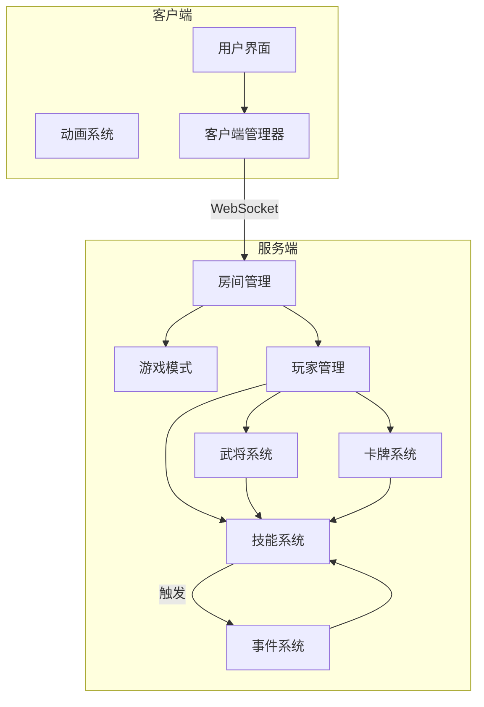
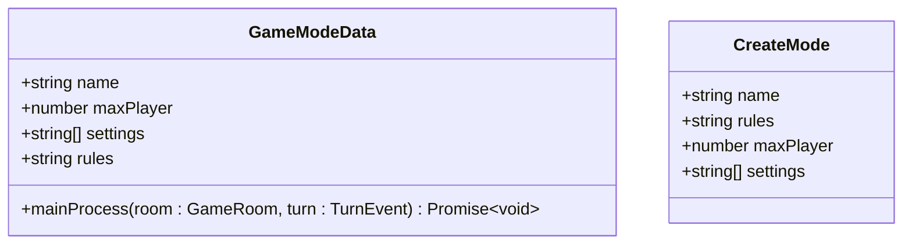
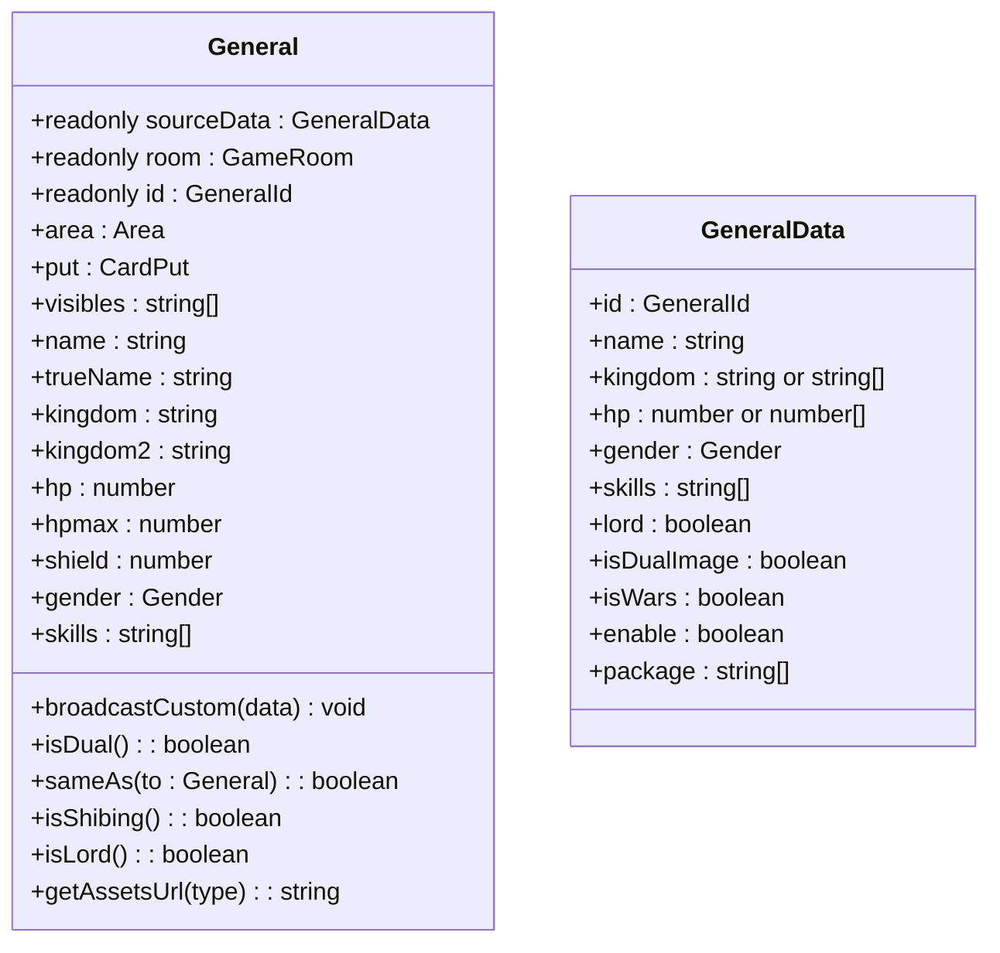
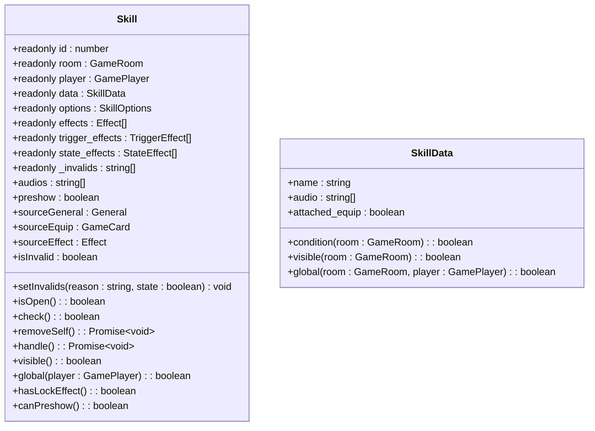
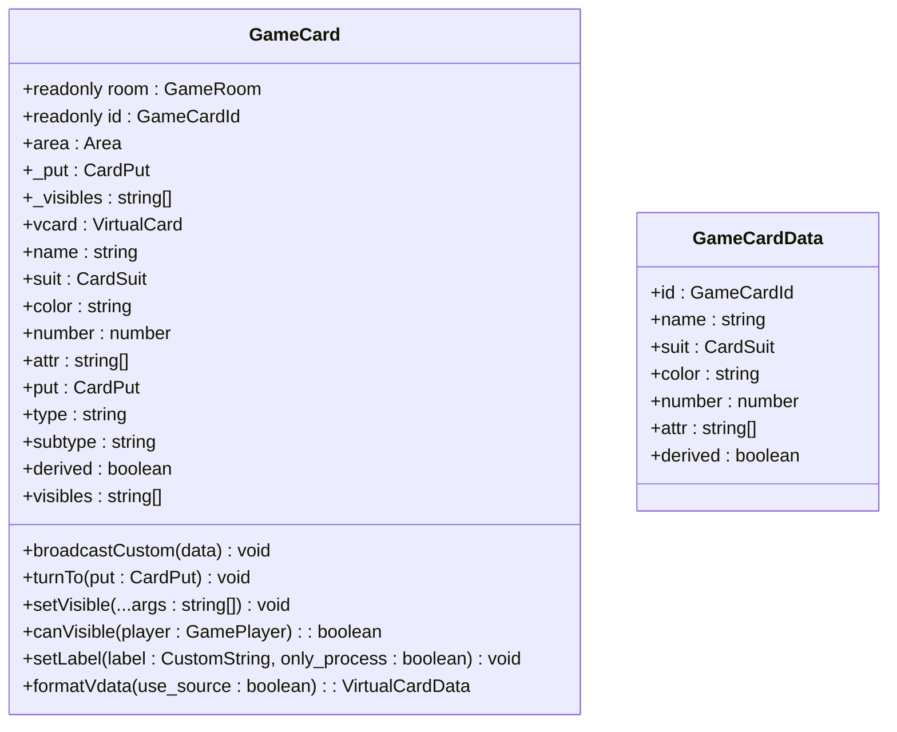
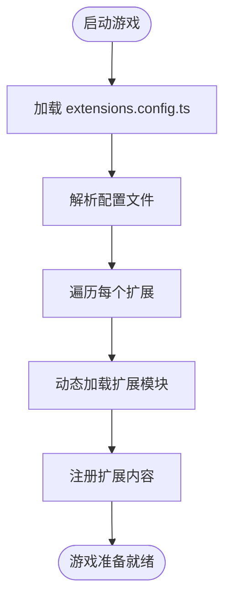
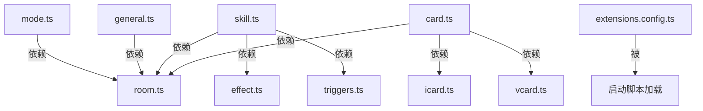

# 核心功能技术设计

<cite>
**本文档引用的文件**  
- [mode.ts](file://server/src/core/mode/mode.ts)
- [general.ts](file://server/src/core/general/general.ts)
- [skill.ts](file://server/src/core/skill/skill.ts)
- [card.ts](file://server/src/core/card/card.ts)
- [extensions.config.ts](file://server/src/core/extensions.config.ts)
</cite>

## 目录
1. [引言](#引言)
2. [项目结构](#项目结构)
3. [核心组件](#核心组件)
4. [架构概览](#架构概览)
5. [详细组件分析](#详细组件分析)
6. [依赖分析](#依赖分析)
7. [性能考量](#性能考量)
8. [故障排除指南](#故障排除指南)
9. [结论](#结论)

## 引言
本文档旨在深入解析resgsv1项目中核心游戏功能的技术设计与实现机制。重点涵盖游戏模式、角色系统（武将/英雄）、技能系统、卡牌系统以及扩展机制的实现原理。通过类图、序列图和代码示例，全面揭示系统内部的交互逻辑与设计思想，为开发者提供详尽的技术参考。

## 项目结构
resgsv1项目采用前后端分离的架构，主要分为`client`（客户端）和`server`（服务端）两大模块。服务端负责核心游戏逻辑、状态管理和规则执行，而客户端则专注于用户界面渲染、动画表现和用户交互。

- **client**: 包含前端资源，如动画、UI组件、脚本和配置文件。
- **server**: 包含后端逻辑，包括核心游戏机制、数据库交互、房间管理、扩展系统等。

核心游戏逻辑位于`server/src/core`目录下，主要包括`mode`（模式）、`general`（武将）、`skill`（技能）、`card`（卡牌）、`event`（事件）和`player`（玩家）等模块。

**Section sources**
- [mode.ts](file://server/src/core/mode/mode.ts)
- [general.ts](file://server/src/core/general/general.ts)
- [skill.ts](file://server/src/core/skill/skill.ts)
- [card.ts](file://server/src/core/card/card.ts)

## 核心组件
本节将介绍构成游戏核心的几个关键组件：游戏模式、武将、技能和卡牌。这些组件共同定义了游戏的玩法、规则和交互方式。

**Section sources**
- [mode.ts](file://server/src/core/mode/mode.ts)
- [general.ts](file://server/src/core/general/general.ts)
- [skill.ts](file://server/src/core/skill/skill.ts)
- [card.ts](file://server/src/core/card/card.ts)

## 架构概览


**Diagram sources**
- [mode.ts](file://server/src/core/mode/mode.ts)
- [general.ts](file://server/src/core/general/general.ts)
- [skill.ts](file://server/src/core/skill/skill.ts)
- [card.ts](file://server/src/core/card/card.ts)

## 详细组件分析
本节将对每个核心组件进行深入的技术剖析，包括其设计原理、关键属性和交互逻辑。

### 游戏模式设计
游戏模式（Game Mode）决定了游戏的基本规则和流程。在resgsv1中，游戏模式通过`GameModeData`接口进行定义。

#### 游戏模式接口分析


**Diagram sources**
- [mode.ts](file://server/src/core/mode/mode.ts#L5-L29)

`GameModeData`接口定义了游戏模式的核心属性：
- **name**: 模式名称，如“标准模式”、“战争模式”。
- **maxPlayer**: 最大玩家数量。
- **settings**: 额外的设置项。
- **rules**: 特定于该模式的规则技能。
- **mainProcess**: 主流程逻辑，用于确定下一个回合的玩家。如果不实现，则使用默认的顺时针轮转机制。

`CreateMode`类型用于创建新模式，它继承了`GameModeData`的大部分属性，并允许`rules`字段既可以是字符串，也可以是`SkillData`对象，提供了更大的灵活性。

例如，`wars`（战争模式）和`standard`（标准模式）都是通过实现此接口来定义其独特规则的。

**Section sources**
- [mode.ts](file://server/src/core/mode/mode.ts#L5-L29)

### 角色系统（武将/英雄）设计
武将系统是游戏的核心，每个武将都拥有独特的属性、技能和势力。

#### 武将类分析


**Diagram sources**
- [general.ts](file://server/src/core/general/general.ts#L0-L195)

`General`类封装了武将的所有信息和行为：
- **sourceData**: 存储武将的原始数据，包括ID、名称、势力、体力、技能等。
- **属性访问器**: 提供了对武将属性的便捷访问，如`name`、`hp`、`skills`等。
- **势力判断**: `isDual()`方法判断是否为双势力武将，`sameAs()`方法判断两个武将是否势力相同。
- **资源管理**: `getAssetsUrl()`方法根据武将名称和类型（如头像、死亡音效）生成资源路径。

武将的构造函数负责初始化这些数据，并根据`kingdom`和`hp`字段的类型（单值或数组）进行相应的处理。

**Section sources**
- [general.ts](file://server/src/core/general/general.ts#L0-L195)

### 技能系统工作原理
技能系统是游戏策略性的核心，它定义了武将的特殊能力和互动方式。

#### 技能类分析


**Diagram sources**
- [skill.ts](file://server/src/core/skill/skill.ts#L0-L245)

`Skill`类是技能的运行时实例，其关键特性包括：
- **生命周期**: 技能在构造时被初始化，并通过`handle()`方法执行其效果。
- **状态管理**: `_invalids`数组记录了导致技能失效的原因，`isInvalid`属性判断技能是否可用。
- **发动条件**: `check()`方法综合判断技能是否可以发动，包括预亮状态、失效状态和自定义条件。
- **效果与触发**: `effects`数组包含所有效果，分为`trigger_effects`（触发效果）和`state_effects`（状态效果）。
- **可见性与全局性**: `visible()`和`global()`方法决定了技能对其他玩家的可见性和影响范围。

技能的`data`字段包含了其静态定义，如音效、发动条件和可见性规则。

**Section sources**
- [skill.ts](file://server/src/core/skill/skill.ts#L0-L245)

### 卡牌系统设计
卡牌系统是游戏交互的基础，每张卡牌都有其类型、属性和行为。

#### 卡牌类分析


**Diagram sources**
- [card.ts](file://server/src/core/card/card.ts#L0-L236)

`GameCard`类代表一张游戏中的卡牌：
- **动态属性**: `name`、`suit`、`color`、`number`等属性可以通过游戏中的状态效果（如`Regard_CardData`）被动态修改。
- **放置与可见性**: `_put`字段表示卡牌的朝向（正面/背面），`_visibles`数组记录了哪些玩家可以看见这张牌。`canVisible()`方法综合判断卡牌对特定玩家的可见性。
- **虚拟卡牌**: `vcard`字段指向一个虚拟卡牌，用于表示卡牌的衍生或转化。
- **格式化**: `formatVdata()`方法将当前卡牌的状态转换为虚拟卡牌数据，用于技能效果的计算。

**Section sources**
- [card.ts](file://server/src/core/card/card.ts#L0-L236)

### 扩展机制实现
扩展机制允许游戏动态加载新的内容，如新的武将、卡牌和模式。

#### 扩展配置分析


**Diagram sources**
- [extensions.config.ts](file://server/src/core/extensions.config.ts#L0-L10)

扩展机制的核心是`extensions.config.ts`文件，它导出一个扩展列表：
```typescript
export default [
    'standard@1.0',
    'shenhua@1.0',
    'yijiang@1.0',
    'mlongxuexuanhuang@1.0',
    'mxiuliqiankun@1.0',
    'wars@1.0',
    'doudizhu@1.0',
    'lang@1.0',
];
```
系统在启动时会读取此配置，并根据列表中的名称和版本号动态加载对应的扩展模块（位于`server/src/extensions/`目录下）。每个扩展模块（如`wars`）都包含自己的`extension.config.js`和`index.ts`，用于定义其特有的武将、卡牌和规则。这种方式实现了游戏内容的模块化和可插拔性。

**Section sources**
- [extensions.config.ts](file://server/src/core/extensions.config.ts#L0-L10)

## 依赖分析


**Diagram sources**
- [mode.ts](file://server/src/core/mode/mode.ts)
- [general.ts](file://server/src/core/general/general.ts)
- [skill.ts](file://server/src/core/skill/skill.ts)
- [card.ts](file://server/src/core/card/card.ts)
- [extensions.config.ts](file://server/src/core/extensions.config.ts)

## 性能考量
- **对象池**: 对于频繁创建和销毁的实体（如卡牌、技能实例），应考虑使用对象池来减少垃圾回收压力。
- **事件系统**: 事件触发和监听机制应优化，避免不必要的遍历和检查。
- **动态属性计算**: `GameCard`的`name`、`suit`等属性的动态计算可能影响性能，应确保`getStates`方法的高效性。
- **网络同步**: `broadcastCustom`和`propertyChanges`等机制用于同步状态，应尽量减少不必要的广播。

## 故障排除指南
- **技能无法发动**: 检查`check()`方法的返回值，确认`preshow`、`isInvalid`和`condition`是否满足。
- **卡牌属性不正确**: 检查`Regard_CardData`状态是否被正确应用，或`sourceData`是否初始化正确。
- **扩展未加载**: 确认`extensions.config.ts`中的扩展名称拼写正确，且对应的扩展目录存在。
- **游戏流程异常**: 检查`mainProcess`函数的实现，确保`turn`参数被正确修改。

**Section sources**
- [skill.ts](file://server/src/core/skill/skill.ts#L150-L160)
- [card.ts](file://server/src/core/card/card.ts#L30-L50)
- [extensions.config.ts](file://server/src/core/extensions.config.ts#L0-L10)
- [mode.ts](file://server/src/core/mode/mode.ts#L20-L25)

## 结论
resgsv1项目通过清晰的模块化设计，实现了复杂的游戏逻辑。其核心在于`GameRoom`作为中心枢纽，协调`Player`、`General`、`Skill`和`Card`等组件的交互。事件驱动的技能系统和动态属性的卡牌系统为游戏提供了高度的策略性和可变性。通过`extensions.config.ts`实现的扩展机制，使得游戏内容可以轻松地进行扩展和维护。整体架构设计合理，为开发新功能和优化性能提供了坚实的基础。