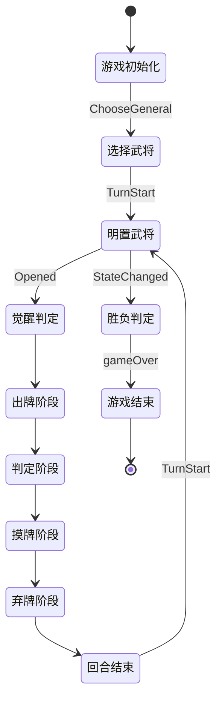

# 战争模式

<cite>
**本文档中引用的文件**  
- [index.ts](file://server/src/extensions/wars/index.ts)
- [rules.ts](file://server/src/extensions/wars/rules.ts)
- [mingguangkai.ts](file://server/src/extensions/wars/cards/equip/mingguangkai.ts)
- [sanjianliangrendao.ts](file://server/src/extensions/wars/cards/equip/sanjianliangrendao.ts)
- [wuliujian.ts](file://server/src/extensions/wars/cards/equip/wuliujian.ts)
</cite>

## 目录
1. [引言](#引言)  
2. [战争模式核心规则](#战争模式核心规则)  
3. [阵营系统与胜利条件](#阵营系统与胜利条件)  
4. [特殊装备卡牌机制](#特殊装备卡牌机制)  
5. [武将觉醒与标记系统](#武将觉醒与标记系统)  
6. [模式初始化与规则注册](#模式初始化与规则注册)  
7. [战争模式状态机](#战争模式状态机)  
8. [大规模战斗场景支持](#大规模战斗场景支持)

## 引言

战争模式（Wars Mode）是基于国战规则扩展的一种大规模对抗玩法，支持最多10名玩家参与。该模式引入了双将系统、阵营对抗、特殊装备与觉醒机制，增强了策略深度与团队协作。本文档详细解析战争模式的实现原理，涵盖核心规则、特殊卡牌、技能触发、阵营管理及状态流转逻辑。

**本节不分析具体源码文件，因此无引用来源。**

## 战争模式核心规则

战争模式在标准国战基础上进行了多项扩展，其核心规则包括双将选择、回合明置、势力判定、击杀奖惩与胜负判定。

### 双将选择机制

在游戏开始前，每位玩家需从可用武将池中选择两名势力相同的武将作为主将与副将。该规则通过 `gamerule_choose_general` 触发效果实现。

```typescript
game_wars_rules.addEffect(
    sgs.TriggerEffect({
        name: 'gamerule_choose_general',
        trigger: EventTriggers.ChooseGeneral,
        can_trigger() { return true; },
        getSelectors(room, context) {
            return {
                choose_general: () => ({
                    selectors: {
                        general: {
                            type: 'general',
                            step: 1,
                            count: 2,
                            selectable: room.getGenerals(context.generals),
                            filter: (item, selected) => {
                                if (selected.length === 0) {
                                    return !item.isDual() && item.sameAs(selected[0]);
                                } else if (selected.length === 1) {
                                    return item.kingdom !== 'ye' && item.sameAs(selected[0]);
                                }
                                return false;
                            }
                        }
                    }
                })
            };
        },
        async cost(room, data) {
            const reqs = await room.doRequestAll(/* 请求选择武将 */);
            reqs.forEach(v => {
                const result = v.result.results.general.result as General[];
                v.player.setProperty('_head', result[0].id);
                v.player.setProperty('_deputy', result[1].id);
            });
            return true;
        }
    })
);
```

**Section sources**  
- [index.ts](file://server/src/extensions/wars/index.ts#L211-L250)

### 回合开始明置武将

每名玩家在回合开始时，若仍有暗置武将牌，必须选择明置主将、副将或全部。此规则由 `gamerule_open_general` 实现。

```typescript
game_wars_rules.addEffect(
    sgs.TriggerEffect({
        name: 'gamerule_open_general',
        trigger: EventTriggers.TurnStart,
        can_trigger(room, player, data) {
            const { player: current } = data;
            return current === player && current.hasNoneOpen();
        },
        async cost(room, data, context) {
            // 提供选项：明置主将、副将或全部
            const handles = [
                openHead.check() ? 'openHead' : '!openHead',
                openDeputy.check() ? 'openDeputy' : '!openDeputy',
                openAll.check() ? 'openAll' : '!openAll'
            ];
            // 玩家选择后执行明置
            if (result.includes('openHead')) await room.open(openHead);
            // ...
        }
    })
);
```

**Section sources**  
- [index.ts](file://server/src/extensions/wars/index.ts#L351-L394)

## 阵营系统与胜利条件

战争模式采用“势力”作为阵营标识，玩家通过明置武将牌获得势力归属。胜利条件基于所有存活玩家是否属于同一势力。

### 阵营归属判定

当玩家明置武将牌时，系统自动为其赋予势力。若主副将势力相同，则玩家归属该势力；若不同，则为“无势力”（none）。

```typescript
game_wars_rules.addEffect(
    sgs.TriggerEffect({
        name: 'gamerule_change_kingdom',
        trigger: EventTriggers.StateChanged,
        can_trigger(room, player, data) {
            return data.is(sgs.DataType.OpenEvent) && data.player === player;
        },
        async cost(room, data, context) {
            from.definWarsKindom(); // 调用定义势力方法
            return true;
        }
    })
);
```

此外，特定武将（如刘备、曹操）在首回合明置主将时可“变身君主”，触发特殊效果并广播势力变更。

**Section sources**  
- [index.ts](file://server/src/extensions/wars/index.ts#L400-L478)

### 胜利条件判定

游戏结束条件由两个触发效果共同管理：`gamerule_gameover1` 和 `gamerule_gameover2`，分别监听“状态变更”与“确认身份”事件。

```typescript
game_wars_rules.addEffect(
    sgs.TriggerEffect({
        name: 'gamerule_gameover1',
        trigger: EventTriggers.StateChanged,
        can_trigger(room) {
            return (
                room.playerAlives.every(v => room.sameAsKingdom(v, room.playerAlives[0])) &&
                room.players.every(v => v.rest === 0)
            );
        },
        async cost(room, data, context) {
            await room.gameOver(
                room.getPlayerByFilter(v => room.sameAsKingdom(v, room.playerAlives[0]), true),
                this.name
            );
        }
    })
);
```

当所有存活玩家势力相同且无休息玩家时，游戏结束，该势力全员获胜。

**Section sources**  
- [index.ts](file://server/src/extensions/wars/index.ts#L750-L778)

## 特殊装备卡牌机制

战争模式引入了多件特殊装备卡牌，如“明光铠”、“三尖两刃刀”、“五龙剑”等，每件装备附带独特技能。

### 明光铠（mingguangkai）

明光铠为防具，提供两种被动技能：

1. **火属性攻击无效化**：当玩家成为【火杀】、【火攻】或【火焰连营】的目标时，可自动抵消该次攻击。
2. **连环状态免疫**：当玩家处于“小势力”且被连环时，可防止状态变更。

```typescript
mingguangkai_skill.addEffect(
    sgs.TriggerEffect({
        trigger: EventTriggers.BecomeTarget,
        can_trigger(room, player, data) {
            return (
                this.isOwner(player) &&
                data.card &&
                (data.card.name === 'huoshaolianying' ||
                 data.card.name === 'huogong' ||
                 (data.card.name === 'sha' && data.card.hasAttr(CardAttr.Fire))) &&
                data.current.target === player
            );
        },
        async cost(room, data) {
            return await data.cancleCurrent(); // 抵消目标
        }
    })
);
```

**Diagram sources**  
- [mingguangkai.ts](file://server/src/extensions/wars/cards/equip/mingguangkai.ts#L20-L40)

**Section sources**  
- [mingguangkai.ts](file://server/src/extensions/wars/cards/equip/mingguangkai.ts#L1-L70)

### 三尖两刃刀（sanjianliangrendao）

三尖两刃刀为武器，基础攻击范围为3，其技能可在造成【杀】伤害后触发：

- **追加伤害**：弃置一张手牌，选择距离为1的角色，对其造成1点普通伤害。

```typescript
sanjian_skill.addEffect(
    sgs.TriggerEffect({
        trigger: EventTriggers.CauseDamaged,
        can_trigger(room, player, data) {
            return (
                this.isOwner(player) &&
                player === data.from &&
                data.reason === 'sha' &&
                data.to.alive
            );
        },
        getSelectors(room, context) {
            return {
                skill_cost: () => ({
                    selectors: {
                        card: room.createDropCards(target, { count: 1 }),
                        player: room.createChoosePlayer({ filter: item => target.distanceTo(item) === 1 })
                    }
                })
            };
        },
        async effect(room, data, context) {
            await room.damage({
                from: context.from,
                to: context.targets[0],
                source: data,
                reason: this.name
            });
        }
    })
);
```

**Diagram sources**  
- [sanjianliangrendao.ts](file://server/src/extensions/wars/cards/equip/sanjianliangrendao.ts#L40-L80)

**Section sources**  
- [sanjianliangrendao.ts](file://server/src/extensions/wars/cards/equip/sanjianliangrendao.ts#L1-L111)

### 五龙剑（wuliujian）

五龙剑为武器，基础攻击范围为2。其特殊效果为：**对同势力角色的攻击范围+1**。

```typescript
wuliujian_skill.addEffect(
    sgs.StateEffect({
        [StateEffectType.Range_Initial](from) {
            if (this.isOwner(from)) return 2;
        },
        [StateEffectType.Range_Correct](from) {
            const room = this.room;
            if (!this.isOwner(from) && room.sameAsKingdom(this.player, from)) {
                return 1; // 范围修正+1
            }
        }
    })
);
```

此效果通过 `Range_Correct` 状态修正实现，动态调整攻击距离。

**Diagram sources**  
- [wuliujian.ts](file://server/src/extensions/wars/cards/equip/wuliujian.ts#L25-L40)

**Section sources**  
- [wuliujian.ts](file://server/src/extensions/wars/cards/equip/wuliujian.ts#L1-L40)

## 武将觉醒与标记系统

战争模式引入“标记”系统，当满足特定条件时，玩家可觉醒并获得特殊技能。

### 觉醒触发条件

觉醒由 `warsmark` 触发效果管理，监听“明置”事件。当前置条件包括：

- **先驱**：首名明置双将的玩家。
- **阴阳鱼**：主副将体力上限之和为小数（如3.5）。
- **珠联璧合**：主副将存在“珠联璧合”关系。

```typescript
export const warsmark = sgs.TriggerEffect({
    name: 'wars.mark',
    trigger: EventTriggers.Opened,
    can_trigger(room, player, data) {
        return data.player && player === data.player && player.hasHead() && player.hasDeputy();
    },
    async cost(room, data, context) {
        const from = context.from;
        // 先驱
        if (!room.getData('__xianqu')) {
            room.setData('__xianqu', true);
            await room.addSkill('wars.mark.xianqu', from, { showui: 'mark' });
        }
        // 阴阳鱼
        if ((head.hpmax + deputy.hpmax) % 1 !== 0) {
            await room.addSkill('wars.mark.yinyangyu', from, { showui: 'mark' });
        }
        // 珠联璧合
        if (sgs.utils.isRelationship(head.id, deputy.id)) {
            await room.addSkill('wars.mark.zhulianbihe', from, { showui: 'mark' });
        }
    }
});
```

**Section sources**  
- [rules.ts](file://server/src/extensions/wars/rules.ts#L400-L450)

### 觉醒技能示例：先驱

“先驱”技能允许玩家在出牌阶段选择一名有暗置武将的角色，观看其一张武将牌，并将手牌补至4张。

```typescript
xianqu.addEffect(
    sgs.TriggerEffect({
        trigger: EventTriggers.PlayPhaseProceeding,
        can_trigger(room, player) {
            return this.isOwner(player) &&
                   (player.getHandCards().length < 4 || room.players.some(v => v.hasNoneOpen()));
        },
        getSelectors(room, context) {
            return {
                skill_cost: () => ({
                    selectors: {
                        target: room.createChoosePlayer({ filter: item => item.hasNoneOpen() })
                    }
                })
            };
        }
    })
);
```

**Section sources**  
- [rules.ts](file://server/src/extensions/wars/rules.ts#L450-L500)

## 模式初始化与规则注册

战争模式通过 `index.ts` 文件注册为独立游戏模式，并加载专属规则、卡牌与武将。

### 模式定义

```typescript
export const mode_wars = sgs.GameMode({
    name: 'wars',
    maxPlayer: 10,
    settings: [],
    rules: game_wars_rules,
});
```

`game_wars_rules` 是一个技能对象，通过 `addEffect` 方法注册所有战争模式专属规则。

### 规则加载流程

1. 导入基础规则（如抽牌、弃牌阶段）。
2. 添加战争模式特有规则（如双将选择、明置、势力判定）。
3. 注册特殊技能（如“合纵”）。
4. 导出卡牌、武将、关系与规则模块。

```typescript
export * from './cards';
export * from './generals';
export * from './relationship';
export * from './rules';
```

**Section sources**  
- [index.ts](file://server/src/extensions/wars/index.ts#L750-L778)

## 战争模式状态机

战争模式的状态流转与标准模式不同，增加了“明置”与“觉醒”阶段。



**Diagram sources**  
- [index.ts](file://server/src/extensions/wars/index.ts#L750-L778)
- [rules.ts](file://server/src/extensions/wars/rules.ts#L400-L450)

## 大规模战斗场景支持

战争模式通过以下机制支持10人对战：

### 阵营通信与信息可见性

- **观看下家副将**：若开启 `watchNext` 设置，玩家可查看下家的副将信息。
- **后备区可见**：通过 `eyes_reserve` 状态效果，玩家可查看自己后备区的牌。

```typescript
export const eyes_reserve = sgs.StateEffect({
    [StateEffectType.FieldCardEyes](from, card) {
        if (this.isOwner(from) && card.area === from.room.reserveArea) {
            return true;
        }
    }
});
```

### 奥战机制（aozhan）

当满足特定条件（如存活人数≤3且无同势力玩家），触发“奥战”全局事件，播放特效并激活特殊规则。

```typescript
export const aozhan = sgs.TriggerEffect({
    name: 'wars.aozhan',
    trigger: EventTriggers.TurnStartBefore,
    can_trigger(room) {
        return room.aliveCount <= 3 && !hasSameKingdomPair(room.playerAlives);
    },
    async cost(room, data, context) {
        room.setMark('wars.aozhan', true);
        room.broadcast({ type: 'MsgPlayGlobalAni', ani: 'aozhan' });
        // 播放背景动画与音乐
    }
});
```

**Section sources**  
- [rules.ts](file://server/src/extensions/wars/rules.ts#L350-L380)