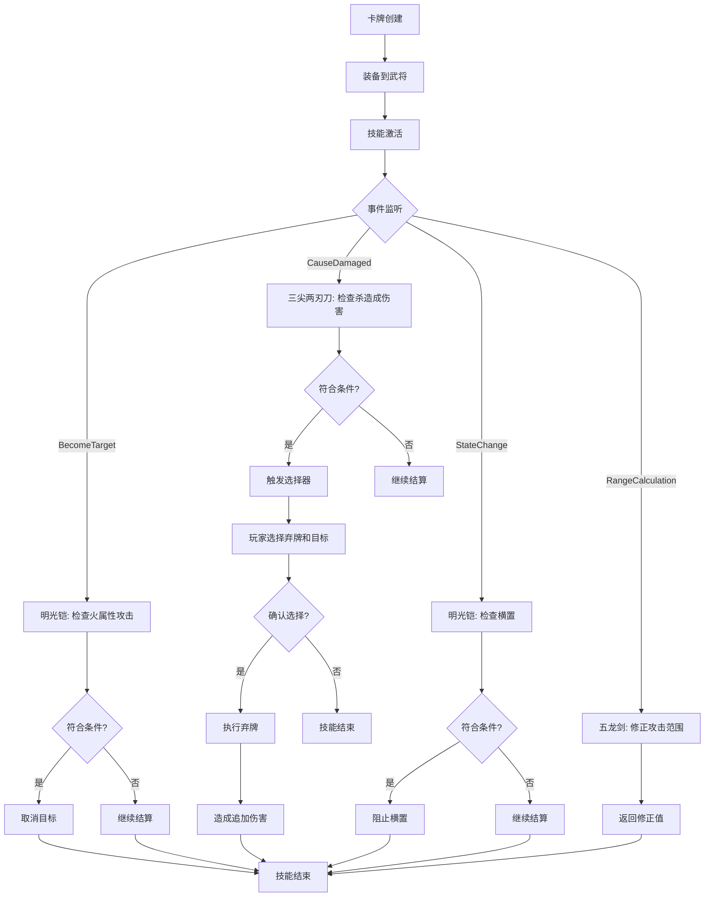

# 特殊卡牌系统

<cite>
**本文档引用文件**  
- [mingguangkai.ts](file://server/src/extensions/wars/cards/equip/mingguangkai.ts)
- [sanjianliangrendao.ts](file://server/src/extensions/wars/cards/equip/sanjianliangrendao.ts)
- [wuliujian.ts](file://server/src/extensions/wars/cards/equip/wuliujian.ts)
- [lang_cards.ts](file://server/src/extensions/lang/lang_cards.ts)
</cite>

## 目录
1. [引言](#引言)
2. [明光铠：防御强化机制](#明光铠防御强化机制)
3. [三尖两刃刀：攻击范围扩展与追加伤害](#三尖两刃刀攻击范围扩展与追加伤害)
4. [五龙剑：元素属性叠加系统](#五龙剑元素属性叠加系统)
5. [特殊卡牌通用实现机制](#特殊卡牌通用实现机制)
6. [特殊卡牌生命周期流程图](#特殊卡牌生命周期流程图)
7. [与武将技能系统的协同机制](#与武将技能系统的协同机制)
8. [平衡性设计分析](#平衡性设计分析)

## 引言

在战争模式中，特殊装备卡牌为玩家提供了超越基础规则的战略深度。本文档详细解析三张核心特殊装备卡牌——**明光铠**、**三尖两刃刀**和**五龙剑**的实现机制。通过分析其代码结构、效果触发逻辑、技能联动方式及平衡性设计，揭示这些卡牌如何通过继承与重写机制实现独特功能，并与武将技能系统深度集成，创造出丰富的战术组合。

## 明光铠防御强化机制

### 功能描述
明光铠是一张防具类装备卡牌，提供双重锁定技保护：
1.  **火属性攻击免疫**：当持有者成为【火烧连营】、【火攻】或火属性【杀】的目标时，自动取消该目标。
2.  **小势力角色保护**：若持有者为小势力角色，其副将牌无法被其他角色横置。

### 代码实现分析
明光铠的实现位于 `mingguangkai.ts` 文件中，其核心是通过附加一个名为 `mingguangkai_skill` 的技能来实现。

**Section sources**
- [mingguangkai.ts](file://server/src/extensions/wars/cards/equip/mingguangkai.ts#L15-L70)

#### 属性定义
```typescript
// 定义卡牌基础数据
sgs.setCardData('mingguangkai', {
    type: CardType.Equip,       // 装备卡
    subtype: CardSubType.Armor, // 防具子类型
    rhyme: 'ai',                // 韵脚，用于分类或动画
});
```

#### 技能效果一：火属性攻击免疫
该效果通过监听 `EventTriggers.BecomeTarget` 事件实现。当一个卡牌使用事件（`UseCardEvent`）的目标被设定时，此技能进行检查。

```typescript
mingguangkai_skill.addEffect(
    sgs.TriggerEffect({
        trigger: EventTriggers.BecomeTarget,
        can_trigger(room, player, data: UseCardEvent) {
            return (
                this.isOwner(player) && // 确保技能属于当前玩家
                data.card && // 确保有卡牌数据
                (data.card.name === 'huoshaolianying' || // 火烧连营
                 data.card.name === 'huogong' ||         // 火攻
                 (data.card.name === 'sha' &&            // 普通杀
                  data.card.hasAttr(CardAttr.Fire))) &&  // 且具有火属性
                data.current.target === player           // 当前目标是持有者
            );
        },
        async cost(room, data: UseCardEvent, context) {
            return await data.cancleCurrent(); // 取消当前目标
        },
    })
);
```
**关键逻辑**：`data.cancleCurrent()` 方法直接从目标列表中移除持有者，使其免疫该次攻击。

#### 技能效果二：防止横置
该效果监听 `EventTriggers.StateChange` 事件，当玩家状态（如横置状态）即将改变时触发。

```typescript
mingguangkai_skill.addEffect(
    sgs.TriggerEffect({
        trigger: EventTriggers.StateChange,
        can_trigger(room, player, data: ChainEvent) {
            return (
                this.isOwner(player) &&
                data.is(sgs.DataType.ChainEvent) && // 确保数据类型正确
                data.player === player &&           // 状态改变的是持有者
                player.isSmallKingdom() &&          // 持有者是小势力角色
                data.to_state === true              // 即将被横置
            );
        },
        async cost(room, data: ChainEvent, context) {
            return await data.prevent(); // 阻止状态改变
        },
    })
);
```
**关键逻辑**：`data.prevent()` 方法阻止了横置操作的执行。

## 三尖两刃刀攻击范围扩展与追加伤害

### 功能描述
三尖两刃刀是一张武器类装备卡牌，提供两种能力：
1.  **攻击范围**：3。
2.  **追加伤害**：当使用者使用【杀】对目标造成伤害后，可弃置一张手牌，对距离该目标为1的另一名角色造成1点普通伤害。

### 代码实现分析
三尖两刃刀的实现位于 `sanjianliangrendao.ts` 文件中。

**Section sources**
- [sanjianliangrendao.ts](file://server/src/extensions/wars/cards/equip/sanjianliangrendao.ts#L1-L111)

#### 属性与范围定义
```typescript
// 定义卡牌基础数据
sgs.setCardData('sanjianliangrendao', {
    type: CardType.Equip,
    subtype: CardSubType.Weapon,
    rhyme: 'ao',
});

// 定义攻击范围
sanjian_skill.addEffect(
    sgs.StateEffect({
        [StateEffectType.Range_Initial](from) {
            if (this.isOwner(from)) {
                return 3; // 初始攻击范围为3
            }
        },
    })
);
```

#### 技能效果：追加伤害
该效果监听 `EventTriggers.CauseDamaged` 事件，即当伤害被造成后触发。

```typescript
sanjian_skill.addEffect(
    sgs.TriggerEffect({
        trigger: EventTriggers.CauseDamaged,
        getSelectors(room, context) {
            const from = context.from;
            const target = context.targets.at(0);
            return {
                skill_cost: () => {
                    return {
                        selectors: {
                            card: room.createDropCards(target, { // 选择要弃置的牌
                                step: 1,
                                count: 1,
                                selectable: from.getHandCards(),
                            }),
                            player: room.createChoosePlayer({ // 选择新目标
                                step: 2,
                                count: 1,
                                filter(item, selected) {
                                    return target && target.distanceTo(item) === 1; // 距离目标为1
                                },
                            }),
                        },
                        options: {
                            canCancle: true,
                            prompt: `三尖两刃刀：你可以弃置一张手牌并选择一个角色，对他造成1点普通伤害`,
                        },
                    };
                },
            };
        },
        can_trigger(room, player, data: DamageEvent) {
            return (
                this.isOwner(player) &&
                player === data.from && // 持有者是伤害来源
                data.reason === 'sha' && // 伤害由【杀】造成
                data.to.alive // 目标仍然存活
            );
        },
        context(room, player, data: DamageEvent) {
            return {
                targets: [data.to], // 将原伤害目标传入上下文
            };
        },
        async cost(room, data: UseCardEvent, context) {
            const { from, cards } = context;
            return await room.dropCards({ // 执行弃牌
                player: from,
                cards,
                source: data,
                reason: this.name,
            });
        },
        async effect(room, data, context) {
            const {
                from,
                targets: [target],
            } = context;
            await room.damage({ // 对新目标造成伤害
                from,
                to: target,
                source: data,
                reason: this.name,
            });
        },
    })
);
```
**关键逻辑**：`getSelectors` 定义了交互流程（弃牌+选人），`cost` 执行弃牌，`effect` 执行追加伤害。

## 五龙剑元素属性叠加系统

### 功能描述
五龙剑是一张武器类装备卡牌，其攻击范围具有动态修正特性：
1.  **基础攻击范围**：2。
2.  **范围修正**：当使用者对同势力角色造成伤害时，攻击范围+1。

### 代码实现分析
五龙剑的实现位于 `wuliujian.ts` 文件中。

**Section sources**
- [wuliujian.ts](file://server/src/extensions/wars/cards/equip/wuliujian.ts#L1-L40)

#### 属性与范围定义
```typescript
// 定义卡牌基础数据
sgs.setCardData('wuliujian', {
    type: CardType.Equip,
    subtype: CardSubType.Weapon,
    rhyme: 'an',
});

// 定义动态攻击范围
wuliujian_skill.addEffect(
    sgs.StateEffect({
        [StateEffectType.Range_Initial](from) {
            if (this.isOwner(from)) {
                return 2; // 基础攻击范围为2
            }
        },
        [StateEffectType.Range_Correct](from) {
            const room = this.room;
            if (!this.isOwner(from) && room.sameAsKingdom(this.player, from)) {
                return 1; // 对同势力角色，范围+1
            }
        },
    })
);
```
**关键逻辑**：`Range_Initial` 设置基础范围，`Range_Correct` 在计算最终攻击范围时提供修正值。`room.sameAsKingdom(this.player, from)` 检查目标是否与使用者同势力。

## 特殊卡牌通用实现机制

### 继承与重写模式
所有特殊卡牌均遵循统一的实现模式：
1.  **继承基础卡牌类**：通过 `sgs.CardUseEquip` 创建卡牌实例，继承基础装备卡牌的所有属性和行为。
2.  **定义附加技能**：创建一个与卡牌同名的 `sgs.Skill`，并通过 `attached_equip` 属性将其与卡牌绑定。
3.  **重写use方法**：通过向技能中添加 `TriggerEffect` 或 `StateEffect` 来重写或扩展卡牌的默认行为。

### 数据结构差异
与普通卡牌相比，特殊卡牌的数据结构包含额外的属性和状态管理：
-   **额外属性字段**：如 `rhyme`（韵脚）用于关联特定动画或音效。
-   **状态管理**：通过 `StateEffect` 管理动态属性（如攻击范围），通过 `TriggerEffect` 管理事件响应逻辑。
-   **技能联动**：`attached_equip` 字段建立了卡牌与技能的强关联，确保技能仅在卡牌被装备时激活。

## 特殊卡牌生命周期流程图



**Diagram sources**
- [mingguangkai.ts](file://server/src/extensions/wars/cards/equip/mingguangkai.ts)
- [sanjianliangrendao.ts](file://server/src/extensions/wars/cards/equip/sanjianliangrendao.ts)
- [wuliujian.ts](file://server/src/extensions/wars/cards/equip/wuliujian.ts)

## 与武将技能系统的协同机制

特殊卡牌的设计深度融入了武将技能系统，创造了强大的战术组合：
-   **技能联动**：卡牌技能与武将技能共享事件触发系统。例如，一个武将的技能可能在“造成伤害后”触发，而三尖两刃刀的追加伤害同样在此事件后触发，两者可以形成连招。
-   **状态共享**：卡牌技能可以读取武将的属性（如 `isSmallKingdom()`）来决定效果，实现了卡牌与武将身份的深度绑定。
-   **战术多样性**：明光铠为小势力武将提供了生存保障，三尖两刃刀增强了输出武将的清场能力，五龙剑则优化了团队协作的攻击范围。这种设计鼓励玩家根据武将特性选择合适的装备，构建多样化的战术体系。

## 平衡性设计分析

三张卡牌的平衡性设计体现在其效果的强度与限制上：
-   **明光铠**：提供了强大的防御能力，但仅针对火属性攻击，且第二效果仅对小势力角色有效，限制了其泛用性。
-   **三尖两刃刀**：追加伤害需要消耗一张手牌作为代价，且新目标必须与原目标距离为1，这要求玩家有良好的手牌管理和位置控制。
-   **五龙剑**：范围加成仅对同势力角色有效，这鼓励团队合作，但在单人作战或对抗异势力时效果减弱。

这种设计确保了每张卡牌都有其独特的优势场景，避免了“万能卡牌”的出现，维持了游戏的策略深度和平衡性。