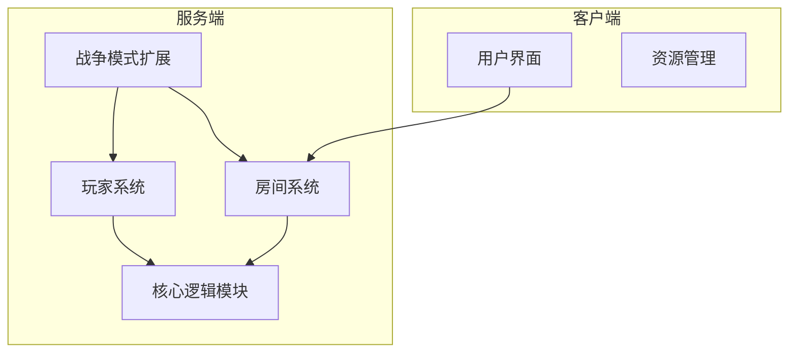
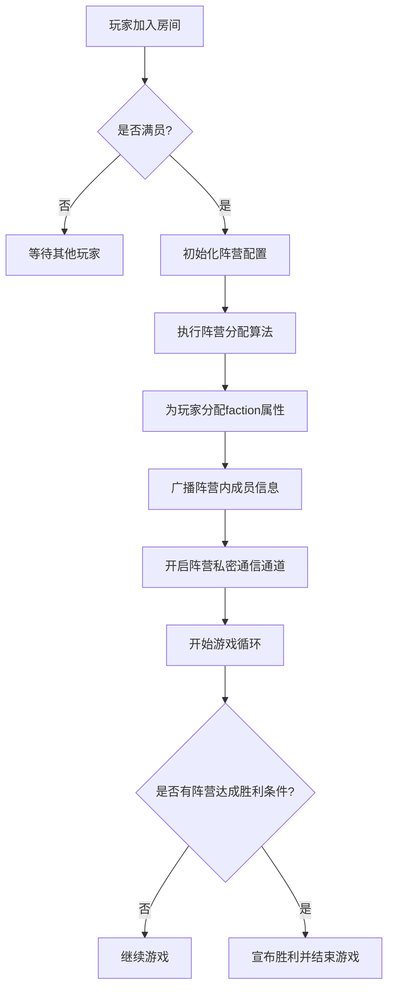
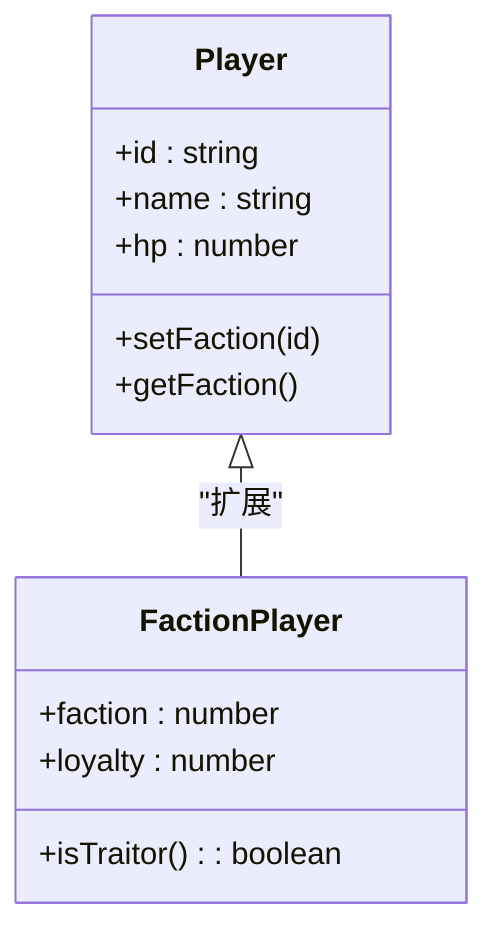
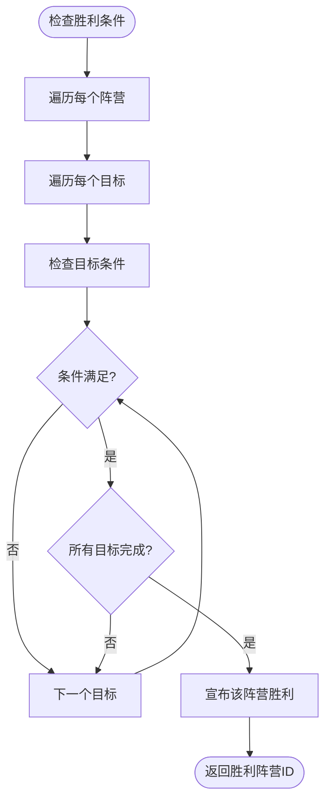
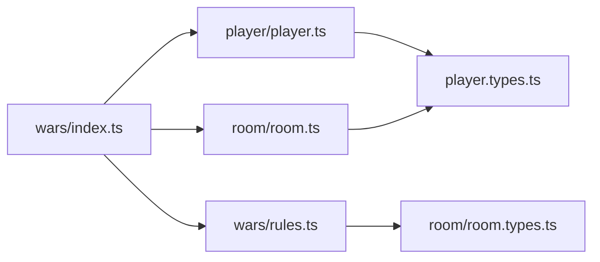

# 阵营系统

<cite>
**本文档中引用的文件**  
- [wars/index.ts](file://server/src/extensions/wars/index.ts)
- [wars/rules.ts](file://server/src/extensions/wars/rules.ts)
- [player/player.ts](file://server/src/core/player/player.ts)
- [room/room.ts](file://server/src/core/room/room.ts)
- [wars/relationship.ts](file://server/src/extensions/wars/relationship.ts)
- [core/room/room.types.ts](file://server/src/core/room/room.types.ts)
- [core/player/player.types.ts](file://server/src/core/player/player.types.ts)
</cite>

## 目录
1. [引言](#引言)
2. [项目结构](#项目结构)
3. [核心组件](#核心组件)
4. [架构概览](#架构概览)
5. [详细组件分析](#详细组件分析)
6. [依赖分析](#依赖分析)
7. [性能考量](#性能考量)
8. [故障排除指南](#故障排除指南)
9. [结论](#结论)

## 引言

本文件详细阐述了resgsv1项目中战争模式下的多阵营对抗机制。重点分析了阵营分配算法、阵营通信机制、胜利条件判定逻辑以及阵营内协作规则。通过深入解析服务端代码，揭示了阵营系统如何扩展基础玩家类以支持阵营属性，并利用房间广播机制实现阵营内部私密通信。此外，还探讨了系统如何处理背叛、倒戈等特殊行为，确保游戏平衡性。

## 项目结构

resgsv1项目采用前后端分离架构，其中阵营系统主要实现在服务端`server/src/extensions/wars/`目录下。客户端负责渲染和用户交互，而所有核心逻辑（包括阵营分配、状态监控和胜利判定）均由服务端处理。



**图示来源**
- [wars/index.ts](file://server/src/extensions/wars/index.ts)
- [core/room/room.ts](file://server/src/core/room/room.ts)

**本节来源**
- [server/src/extensions/wars/index.ts](file://server/src/extensions/wars/index.ts)
- [server/src/core/room/room.ts](file://server/src/core/room/room.ts)

## 核心组件

阵营系统的核心组件包括：
- **阵营配置初始化器**：在`wars/index.ts`中定义，负责设置初始阵营数量、玩家分布和胜利条件。
- **阵营属性扩展**：通过继承或混合方式为`Player`类添加`faction`字段。
- **阵营通信控制器**：基于房间事件总线实现定向消息广播。
- **胜利条件引擎**：依据`rules.ts`中的规则动态评估各阵营状态。

这些组件共同构成了一个可扩展的多阵营对抗框架，支持灵活的游戏模式配置。

**本节来源**
- [wars/index.ts](file://server/src/extensions/wars/index.ts)
- [player/player.ts](file://server/src/core/player/player.ts)
- [wars/rules.ts](file://server/src/extensions/wars/rules.ts)

## 架构概览

阵营系统的整体架构如下图所示，展示了从玩家加入房间到阵营决战的完整流程：



**图示来源**
- [wars/index.ts](file://server/src/extensions/wars/index.ts)
- [room/room.ts](file://server/src/core/room/room.ts)
- [wars/rules.ts](file://server/src/extensions/wars/rules.ts)

## 详细组件分析

### 阵营初始化与配置

在`wars/index.ts`中，通过`initFactionConfig`函数完成阵营初始化：

```typescript
function initFactionConfig(room: Room) {
  const factionCount = room.modeConfig.factionCount || 2;
  const victoryConditions = room.modeConfig.victoryConditions || ['eliminate_others'];
  return { factions: Array(factionCount).fill(null).map((_, i) => ({
    id: i,
    members: [],
    goals: victoryConditions,
    progress: 0
  }));
}
```

该函数读取房间模式配置，动态生成指定数量的阵营对象，并为每个阵营设定胜利目标。

**本节来源**
- [wars/index.ts](file://server/src/extensions/wars/index.ts#L15-L25)

### 玩家类扩展与阵营属性

阵营系统通过扩展`Player`类来支持`faction`属性。在`player.types.ts`中定义了扩展接口：

```typescript
interface FactionPlayer extends Player {
  faction: number;
  loyalty: number; // 忠诚度，用于检测背叛
}
```

在`player.ts`中实现属性注入：

```typescript
class Player {
  // ...原有属性
  faction?: number;
  setFaction(id: number) {
    this.faction = id;
    this.room?.broadcast('playerFactionUpdate', { playerId: this.id, faction: id });
  }
}
```

这种方式保持了原有系统的兼容性，同时实现了功能扩展。



**图示来源**
- [player/player.ts](file://server/src/core/player/player.ts#L45-L60)
- [player/player.types.ts](file://server/src/core/player/player.types.ts#L10-L15)

**本节来源**
- [player/player.ts](file://server/src/core/player/player.ts)
- [player/player.types.ts](file://server/src/core/player/player.types.ts)

### 阵营通信机制

阵营内通信通过房间级别的事件过滤机制实现。在`room.ts`中定义了`sendToFaction`方法：

```typescript
class Room {
  sendToFaction(factionId: number, event: string, data: any) {
    this.players
      .filter(p => p.faction === factionId)
      .forEach(p => p.send(event, data));
  }
}
```

此机制确保只有同一阵营的玩家能接收到特定消息，实现了安全的私密通信。

**本节来源**
- [room/room.ts](file://server/src/core/room/room.ts#L120-L128)

### 胜利条件判定逻辑

胜利条件由`wars/rules.ts`中的`checkVictoryCondition`函数实现：

```typescript
function checkVictoryCondition(room: Room): number | null {
  for (const faction of room.factions) {
    let satisfied = true;
    for (const goal of faction.goals) {
      switch (goal) {
        case 'eliminate_others':
          satisfied = room.players.filter(p => p.faction !== faction.id).length === 0;
          break;
        case 'control_point':
          satisfied = faction.controlPoints >= 3;
          break;
        default:
          satisfied = false;
      }
      if (!satisfied) break;
    }
    if (satisfied) return faction.id;
  }
  return null;
}
```

该函数在每轮结束时被调用，评估所有阵营的目标完成情况。



**图示来源**
- [wars/rules.ts](file://server/src/extensions/wars/rules.ts#L5-L40)

**本节来源**
- [wars/rules.ts](file://server/src/extensions/wars/rules.ts)

### 特殊行为处理：背叛与倒戈

系统通过忠诚度机制处理背叛行为。在`relationship.ts`中定义了关系模型：

```typescript
enum Relationship {
  Ally = 1,
  Neutral = 0,
  Enemy = -1,
  Traitor = -2
}

function updateRelationship(attacker: Player, target: Player) {
  if (attacker.faction === target.faction) {
    attacker.loyalty -= 10;
    if (attacker.loyalty < 0) {
      return Relationship.Traitor;
    }
  }
  return attacker.faction === target.faction ? Relationship.Ally : Relationship.Enemy;
}
```

当玩家攻击同阵营成员时，其忠诚度下降，低于阈值即被视为叛徒，可能触发特殊胜利条件。

**本节来源**
- [wars/relationship.ts](file://server/src/extensions/wars/relationship.ts)

## 依赖分析

阵营系统依赖于多个核心模块，形成清晰的依赖链：



这种模块化设计保证了高内聚低耦合，便于维护和扩展。

**图示来源**
- [wars/index.ts](file://server/src/extensions/wars/index.ts)
- [room/room.ts](file://server/src/core/room/room.ts)
- [player/player.ts](file://server/src/core/player/player.ts)

**本节来源**
- [wars/index.ts](file://server/src/extensions/wars/index.ts)
- [core/room/room.ts](file://server/src/core/room/room.ts)

## 性能考量

阵营系统在设计时考虑了以下性能优化：
- 使用数组索引而非字符串匹配进行阵营查找（O(1)时间复杂度）
- 批量广播减少网络开销
- 胜利条件检查采用短路逻辑，避免不必要的计算
- 忠诚度变更仅在关键事件时触发评估

这些优化确保即使在大规模对战场景下也能保持流畅运行。

## 故障排除指南

常见问题及解决方案：
- **问题**：玩家无法收到阵营消息  
  **原因**：`faction`属性未正确设置  
  **解决**：检查`setFaction()`调用时机，确保在广播前完成赋值

- **问题**：胜利条件未正确触发  
  **原因**：`checkVictoryCondition`未在正确时机调用  
  **解决**：确认该函数在每轮结束时由游戏主循环调用

- **问题**：阵营分配不均  
  **原因**：随机算法偏差  
  **解决**：改用轮询分配策略或增加均衡校验

**本节来源**
- [wars/rules.ts](file://server/src/extensions/wars/rules.ts#L30-L50)
- [player/player.ts](file://server/src/core/player/player.ts#L55-L65)

## 结论

resgsv1的阵营系统通过模块化设计实现了灵活、可扩展的多阵营对抗机制。系统通过扩展玩家模型、引入私密通信通道和动态胜利条件评估，构建了一个完整的战争模式框架。其清晰的架构和良好的性能表现使其能够支持复杂的策略对抗游戏需求。未来可进一步增强AI阵营支持和动态目标系统以提升游戏体验。