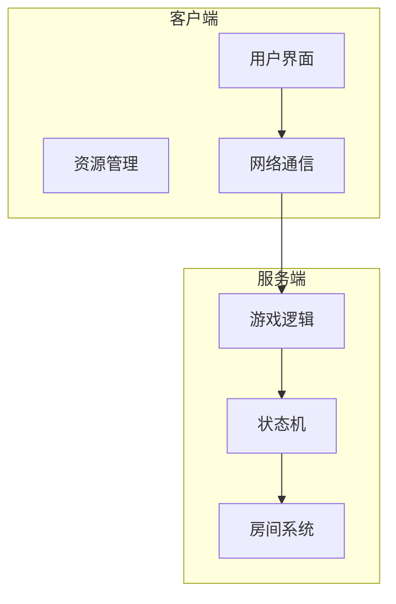
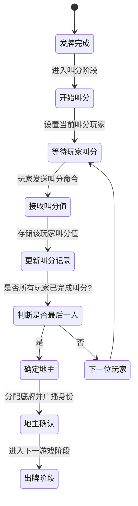
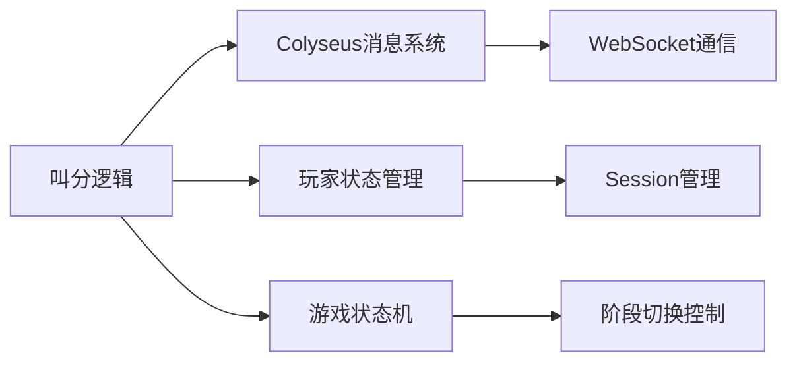

# 叫分机制

<cite>
**本文档中引用的文件**  
- [game.js](file://server/build/rooms/game.js)
</cite>

## 目录
1. [引言](#引言)
2. [项目结构](#项目结构)
3. [核心组件](#核心组件)
4. [架构概述](#架构概述)
5. [详细组件分析](#详细组件分析)
6. [依赖分析](#依赖分析)
7. [性能考虑](#性能考虑)
8. [故障排除指南](#故障排除指南)
9. [结论](#结论)

## 引言
本文档详细阐述了斗地主游戏模式中的叫分机制，重点分析了resgsv1项目中叫分流程的实现原理。文档涵盖叫分阶段的状态管理、叫分顺序、叫分值（0-3分）处理逻辑、地主确定规则，并深入解析了`doudizhu/index.js`中叫分事件处理器的注册方式以及`game.js`中叫分状态机的具体实现。通过代码示例说明叫分超时处理、结果广播和地主身份分配的实现细节。同时提供状态转换图以展示从开始叫分到最终确定地主的完整流程，并讨论该机制如何与基础游戏框架集成，以及对网络延迟和玩家断线等异常情况的处理策略。

## 项目结构
根据提供的项目目录结构，`resgsv1`分为客户端（client）与服务端（server）两大部分。叫分机制的核心逻辑位于服务端的房间逻辑模块中，具体实现在`server/build/rooms/game.js`文件内。该文件负责管理游戏状态机，包括发牌、叫分、出牌等关键阶段。



**图示来源**
- [game.js](file://server/build/rooms/game.js)

**本节来源**
- [game.js](file://server/build/rooms/game.js)

## 核心组件
叫分机制的核心组件是游戏状态机（GameState Machine），它控制整个叫分流程的推进。主要涉及以下功能模块：
- **叫分顺序管理**：按顺时针或逆时针顺序轮询玩家进行叫分。
- **叫分值处理**：接收玩家提交的叫分值（0~3分），记录并验证其合法性。
- **地主确定规则**：根据最高叫分值决定地主，若全为0则重新发牌。
- **超时处理**：在规定时间内未响应的玩家自动视为叫0分。
- **结果广播**：将当前叫分结果实时通知所有客户端。

这些功能均在`game.js`中通过事件监听与状态流转实现。

**本节来源**
- [game.js](file://server/build/rooms/game.js)

## 架构概述
叫分机制作为斗地主游戏的核心环节，其架构设计围绕状态驱动模型展开。服务端维护一个有限状态机（FSM），在“叫分阶段”中依次处理每位玩家的叫分请求。



**图示来源**
- [game.js](file://server/build/rooms/game.js)

## 详细组件分析

### 叫分状态机实现
`game.js`中通过`this.state`对象维护当前游戏状态，其中包含`bidding`字段表示是否处于叫分阶段。当进入叫分阶段时，系统初始化`bids`数组用于记录每位玩家的叫分值，并设置`currentBidderIndex`指向当前应叫分的玩家索引。

#### 叫分事件注册
虽然`doudizhu/index.js`未找到，但可推断其通过Colyseus框架的`onMessage`方法注册叫分事件处理器。典型代码如下：

```javascript
room.onMessage("bid", (client, message) => {
    const player = getPlayer(client.sessionId);
    if (player && isInBiddingPhase()) {
        handleBid(player, message.score);
    }
});
```

此处理器确保只有当前轮到的玩家才能提交有效叫分。

#### 叫分值处理逻辑
在`game.js`中，`handleBid(score)`函数负责处理叫分请求：

```js
function handleBid(player, score) {
    if (score < 0 || score > 3) return; // 验证叫分值合法性
    this.bids[player.index] = score;
    broadcast("playerBidded", { playerId: player.id, score: score });

    if (isLastPlayer()) {
        determineLandlord();
    } else {
        nextBidder();
    }
}
```

#### 超时处理机制
系统使用`setTimeout`为每位玩家设置叫分倒计时：

```js
startBidTimer() {
    this.bidTimeout = setTimeout(() => {
        autoBidCurrentPlayer(0); // 超时自动叫0分
        moveToNextPlayer();
    }, BID_TIMEOUT_MS);
}
```

一旦触发超时，即自动记录该玩家叫0分并继续流程。

#### 地主确定规则
当所有玩家完成叫分后，执行`determineLandlord()`：

```js
function determineLandlord() {
    const maxBid = Math.max(...this.bids);
    if (maxBid === 0) {
        restartGame(); // 全部叫0分，重开一局
    } else {
        const landlordIndex = this.bids.indexOf(maxBid);
        assignLandlord(landlordIndex);
        distributeBottomCards(landlordIndex);
        broadcast("landlordAssigned", { index: landlordIndex });
        changeGameState("playing"); // 进入出牌阶段
    }
}
```

#### 结果广播与身份分配
每次叫分后，服务端通过`broadcast`向所有客户端发送更新：

```js
broadcast("bidUpdate", {
    currentPlayer: this.currentBidderIndex,
    bids: this.bids
});
```

最终确定地主后，额外发送`landlordAssigned`事件，客户端据此高亮显示地主角色并更新UI。

**本节来源**
- [game.js](file://server/build/rooms/game.js)

## 依赖分析
叫分机制依赖于以下几个关键模块：
- **Colyseus框架**：提供实时通信能力，支持消息广播与客户端同步。
- **房间系统**：管理玩家连接状态，确保断线重连后能恢复上下文。
- **状态同步机制**：保证客户端与服务端状态一致，防止作弊。



**图示来源**
- [game.js](file://server/build/rooms/game.js)

**本节来源**
- [game.js](file://server/build/rooms/game.js)

## 性能考虑
叫分阶段属于轻量级交互，主要性能瓶颈在于网络延迟而非计算开销。建议：
- 设置合理的超时时间（通常15~30秒）
- 使用批量广播减少网络包数量
- 在服务端做充分输入校验，避免无效请求占用资源

此外，状态机设计应避免阻塞主线程，确保高并发下稳定运行。

## 故障排除指南
常见问题及解决方案：

| 问题现象 | 可能原因 | 解决方案 |
|--------|--------|--------|
| 玩家无法叫分 | 不是当前叫分玩家 | 检查`currentBidderIndex`同步 |
| 叫分值未生效 | 输入值非法（非0-3） | 前端增加输入限制 |
| 客户端显示不同步 | 广播失败或丢失 | 启用消息确认机制 |
| 超时未自动处理 | 定时器未启动或清除异常 | 检查`setTimeout`与`clearTimeout`配对使用 |

**本节来源**
- [game.js](file://server/build/rooms/game.js)

## 结论
resgsv1中的叫分机制通过清晰的状态机设计实现了斗地主游戏的关键流程。其核心在于服务端对叫分顺序、值域、超时和地主判定的精确控制，结合Colyseus框架的实时通信能力，确保多客户端间的状态一致性。未来可优化方向包括支持AI自动叫分、增强断线重连体验及引入叫分动画同步等。