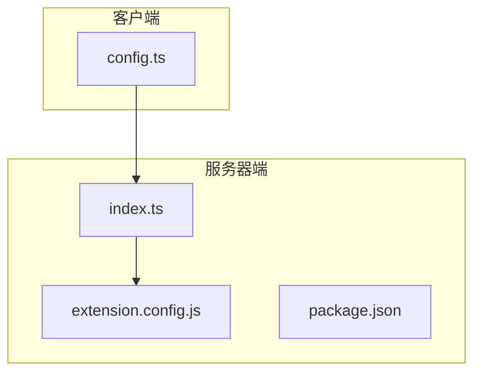
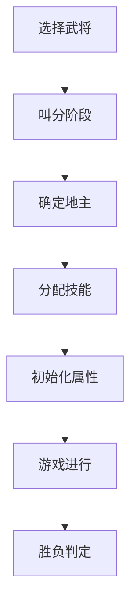
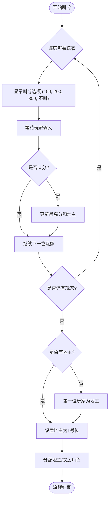
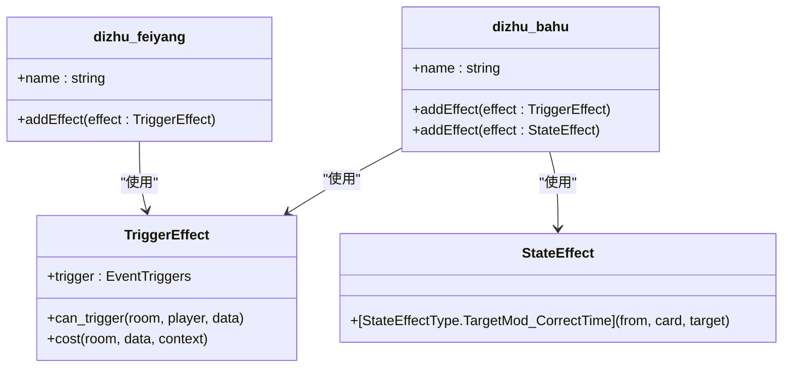
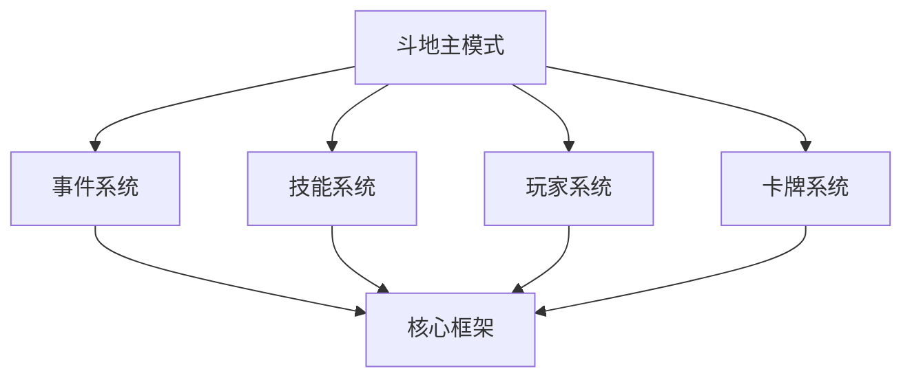

# 斗地主模式

<cite>
**本文档中引用的文件**   
- [index.ts](file://server/src/extensions/doudizhu/index.ts#L0-L529)
- [extension.config.js](file://server/src/extensions/doudizhu/extension.config.js#L0-L14)
- [config.ts](file://client/src/config.ts#L780-L829)
</cite>

## 目录
1. [简介](#简介)
2. [项目结构](#项目结构)
3. [核心组件](#核心组件)
4. [架构概述](#架构概述)
5. [详细组件分析](#详细组件分析)
6. [依赖分析](#依赖分析)
7. [性能考虑](#性能考虑)
8. [故障排除指南](#故障排除指南)
9. [结论](#结论)

## 简介
本文档详细介绍了resgsv1项目中斗地主游戏模式的实现原理。斗地主是一种流行的三人纸牌游戏，其中一名玩家扮演“地主”，对抗另外两名作为“农民”的玩家。本文档将深入分析斗地主模式的核心规则、游戏流程、状态管理和特殊技能机制。通过代码示例和架构图，我们将展示该模式如何在基础游戏框架上构建独特的游戏体验。

## 项目结构
斗地主模式的实现主要位于服务器端的`extensions/doudizhu`目录下。该目录包含核心逻辑文件`index.ts`、配置文件`extension.config.js`以及相关的包配置。客户端的`config.ts`文件中也包含了斗地主模式的测试配置。这种分离的结构使得游戏逻辑与客户端配置解耦，便于维护和扩展。

**图示来源**
- [index.ts](file://server/src/extensions/doudizhu/index.ts#L0-L529)
- [extension.config.js](file://server/src/extensions/doudizhu/extension.config.js#L0-L14)
- [config.ts](file://client/src/config.ts#L780-L829)

**章节来源**
- [index.ts](file://server/src/extensions/doudizhu/index.ts#L0-L529)

## 核心组件
斗地主模式的核心组件包括游戏规则`game_doudizhu_rules`、游戏模式定义`mode_doudizhu`以及两个地主专属技能`dizhu_feiyang`和`dizhu_bahu`。`game_doudizhu_rules`是一个复合技能，通过添加多个效果来实现斗地主特有的游戏流程，如叫分、选将、初始化属性和胜负判定。`mode_doudizhu`则定义了游戏模式的基本参数，如最大玩家数为3人。

**章节来源**
- [index.ts](file://server/src/extensions/doudizhu/index.ts#L0-L529)

## 架构概述
斗地主模式的架构基于事件驱动的设计模式。游戏流程由一系列事件触发器（TriggerEffect）控制，这些触发器在特定游戏事件（如选择武将、角色确认等）发生时被激活。整个流程从`ChooseGeneral`事件开始，经过叫分、选将、技能分配、属性初始化，最终到`ConfirmRole`事件进行胜负判定。这种架构使得游戏逻辑清晰且易于扩展。

**图示来源**
- [index.ts](file://server/src/extensions/doudizhu/index.ts#L0-L529)

## 详细组件分析

### 叫分与地主确定流程分析
叫分阶段是斗地主模式的核心机制之一。当`ChooseGeneral`事件触发时，系统会为每位玩家提供一个选择器，允许他们叫出100、200或300分，或选择“不叫”。系统会遍历所有玩家，记录最高分，并将最高分的玩家确定为地主。如果所有玩家都选择“不叫”，则默认第一位玩家为地主。确定地主后，系统会将其座位调整为1号位，并为其他玩家分配“农民”角色。

**图示来源**
- [index.ts](file://server/src/extensions/doudizhu/index.ts#L87-L158)

**章节来源**
- [index.ts](file://server/src/extensions/doudizhu/index.ts#L87-L158)

### 地主专属技能分析
斗地主模式为地主角色提供了两个专属技能：`飞扬`和`跋扈`。`飞扬`是一个触发技能，在判定阶段开始时，如果地主的判定区有牌，他可以选择弃置两张手牌来移除一张判定区的牌。`跋扈`是一个状态技能，包含两个效果：在准备阶段开始时，地主自动摸一张牌；同时，地主使用【杀】的次数上限增加1次。这些技能通过`TriggerEffect`和`StateEffect`实现，增强了地主角色的优势。

**图示来源**
- [index.ts](file://server/src/extensions/doudizhu/index.ts#L361-L519)

**章节来源**
- [index.ts](file://server/src/extensions/doudizhu/index.ts#L361-L519)

### 游戏流程与胜负判定分析
斗地主模式的游戏流程通过一系列规则效果实现。在`ChooseGeneralAfter`事件后，系统会为地主添加专属技能。在`InitProperty`事件中，系统会初始化所有玩家的属性，地主的体力上限和当前体力会额外+1。胜负判定在`ConfirmRole`事件中进行，当地主死亡或所有农民死亡时，游戏结束。农民死亡后，存活的农民可以选择摸两张牌或回复一点体力作为奖励。

**章节来源**
- [index.ts](file://server/src/extensions/doudizhu/index.ts#L156-L364)

## 依赖分析
斗地主模式依赖于基础游戏框架提供的核心模块，如事件系统（EventTriggers）、技能系统（Skill）、玩家系统（GamePlayer）和数据类型定义。通过`import`语句，该模式引入了`../../core/event/triggers`、`../../core/skill/skill.types`等核心模块。这种设计使得斗地主模式能够重用基础框架的功能，同时实现自己的游戏逻辑。

**图示来源**
- [index.ts](file://server/src/extensions/doudizhu/index.ts#L0-L32)

**章节来源**
- [index.ts](file://server/src/extensions/doudizhu/index.ts#L0-L32)

## 性能考虑
斗地主模式的实现考虑了性能优化。代码中使用了异步函数（async/await）来处理网络请求和延迟，避免阻塞主线程。例如，在确定地主后，使用`await room.delay(1)`来实现短暂的延迟，确保客户端有足够时间更新UI。此外，代码逻辑清晰，避免了不必要的计算和循环，保证了游戏的流畅运行。

## 故障排除指南
在调试斗地主模式时，常见的问题包括叫分逻辑错误、技能未正确添加和胜负判定失效。建议首先检查`game_doudizhu_rules`中各个`TriggerEffect`的`trigger`事件是否正确。其次，验证`can_trigger`函数的返回值是否符合预期。最后，确保所有异步操作都使用了`await`关键字，以防止逻辑执行顺序错误。

**章节来源**
- [index.ts](file://server/src/extensions/doudizhu/index.ts#L0-L529)

## 结论
斗地主模式通过巧妙地利用基础游戏框架的事件和技能系统，成功实现了一个完整且富有策略性的游戏体验。其模块化的设计使得代码易于维护和扩展。通过分析其核心组件和流程，我们可以看到一个复杂游戏模式是如何从简单的规则和效果构建起来的。这种设计模式为开发其他游戏模式提供了宝贵的参考。