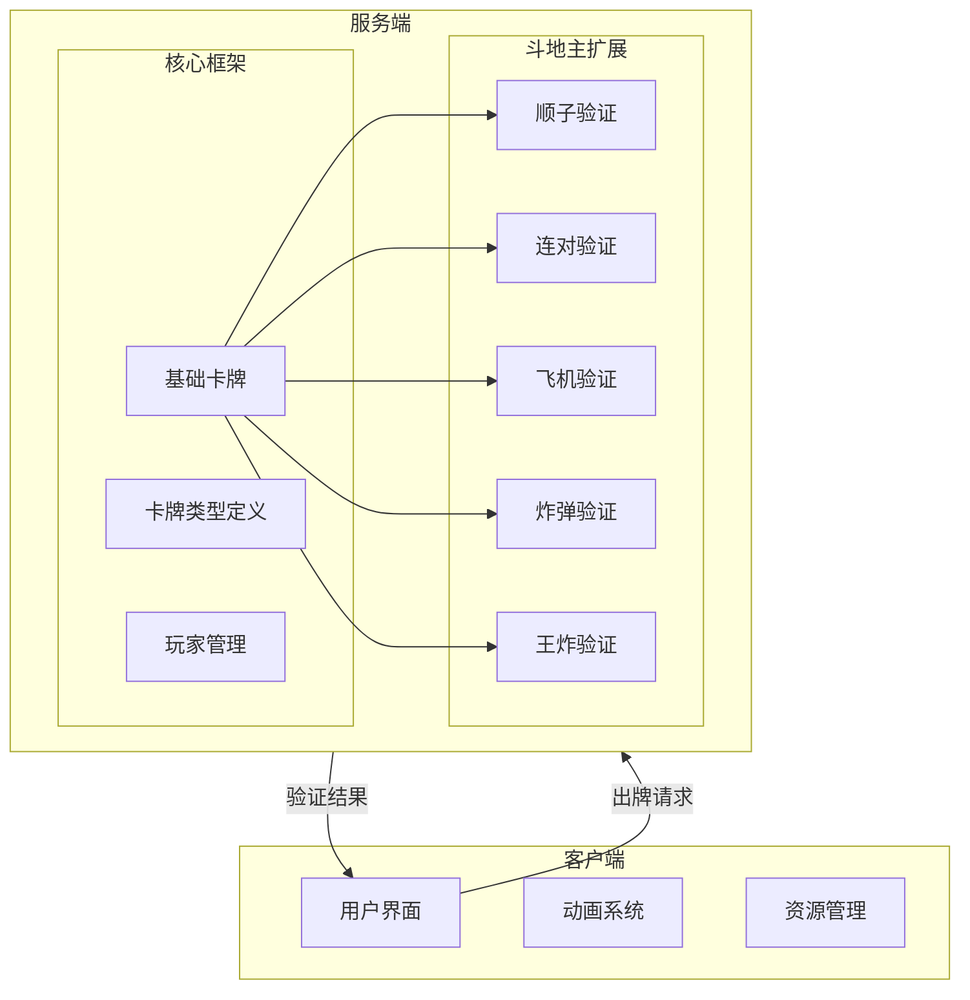
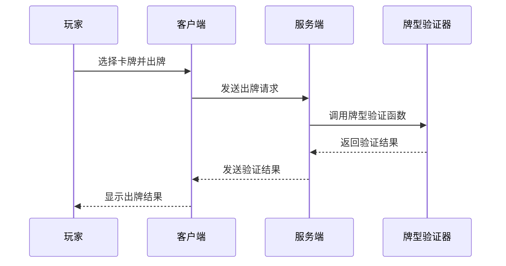
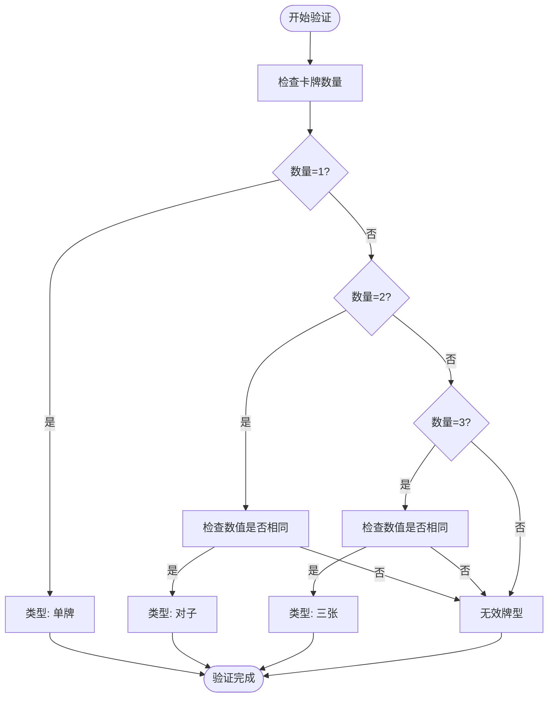
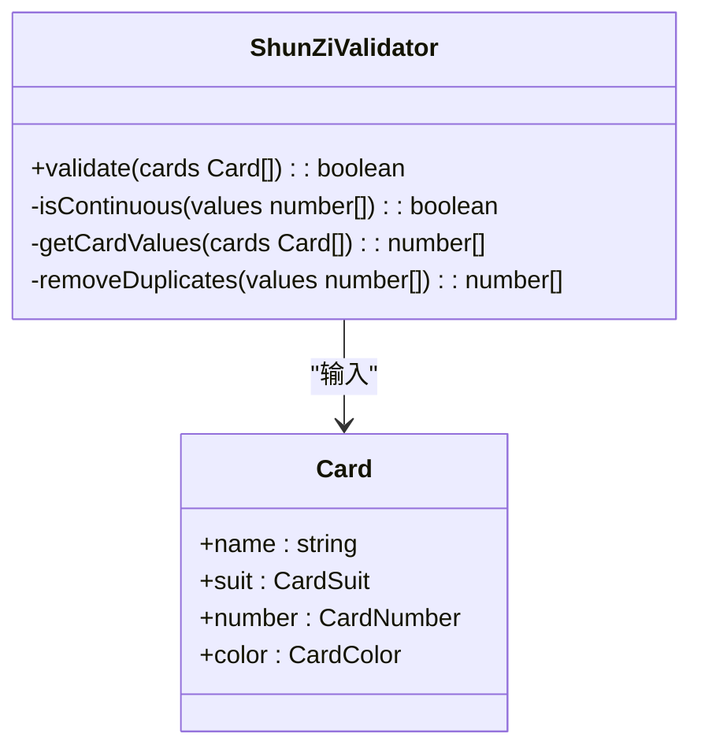
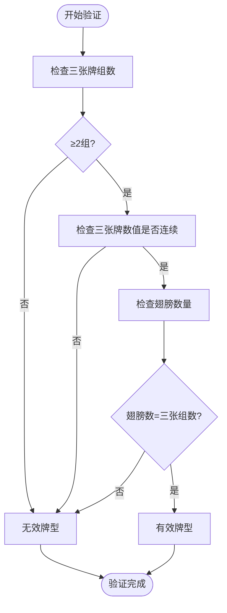
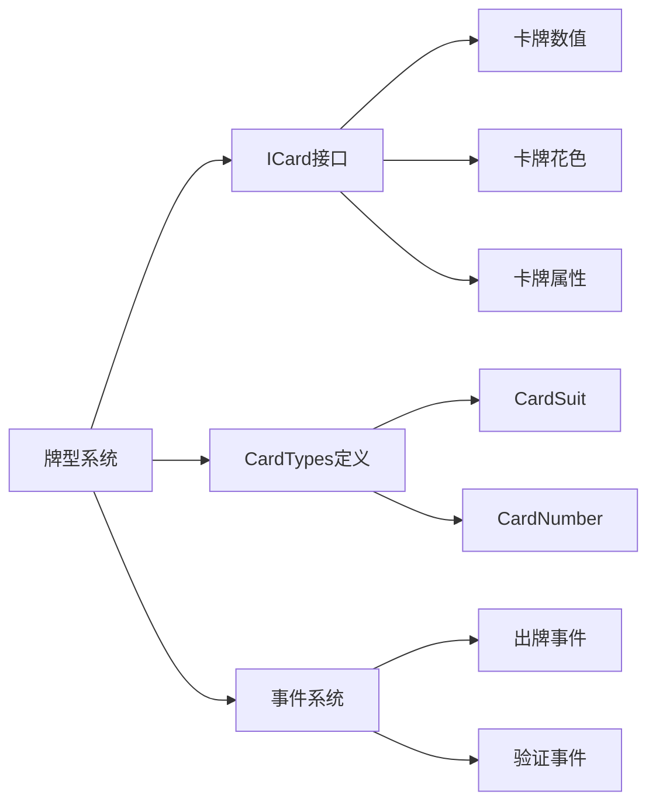

# 牌型系统

<cite>
**本文档引用文件**  
- [zhadan.ts](file://server/src/extensions/doudizhu/cards/zhadan.ts)
- [wangzha.ts](file://server/src/extensions/doudizhu/cards/wangzha.ts)
- [shunzi.ts](file://server/src/extensions/doudizhu/cards/shunzi.ts)
- [feiji.ts](file://server/src/extensions/doudizhu/cards/feiji.ts)
- [base.ts](file://server/src/core/card/base.ts)
- [card.types.ts](file://server/src/core/card/card.types.ts)
- [index.ts](file://server/src/extensions/doudizhu/index.ts)
</cite>

## 目录
1. [简介](#简介)
2. [项目结构](#项目结构)
3. [核心组件](#核心组件)
4. [架构概览](#架构概览)
5. [详细组件分析](#详细组件分析)
6. [依赖分析](#依赖分析)
7. [性能考虑](#性能考虑)
8. [故障排除指南](#故障排除指南)
9. [结论](#结论)

## 简介
本文档详细介绍了斗地主模式中的牌型系统实现，重点分析了resgsv1项目中各种牌型的验证逻辑。文档涵盖了基础牌型（单牌、对子、三张）、特殊牌型（顺子、连对、飞机、炸弹、王炸）的判断规则，并深入解析了关键文件如zhadan.ts、wangzha.ts和shunzi.ts中的核心算法。通过代码示例和流程图，全面展示牌型验证的完整过程及其在游戏框架中的集成方式。

## 项目结构
斗地主牌型系统主要位于服务器端的`server/src/extensions/doudizhu/cards/`目录下，每个牌型由独立的TypeScript文件实现。系统基于通用卡牌框架扩展，通过继承和重写方法来支持斗地主特有的规则。客户端负责UI渲染和用户交互，而服务端则处理牌型验证和游戏逻辑。



**图示来源**  
- [base.ts](file://server/src/core/card/base.ts)
- [shunzi.ts](file://server/src/extensions/doudizhu/cards/shunzi.ts)
- [feiji.ts](file://server/src/extensions/doudizhu/cards/feiji.ts)

**本节来源**  
- [index.ts](file://server/src/extensions/doudizhu/index.ts)

## 核心组件
牌型系统的核心是基于`ICard`接口和`VirtualCard`类构建的。所有牌型验证都围绕卡牌的数值(number)、花色(suit)、属性(attr)和名称(name)进行。系统通过`hasAttr`、`isCommonSha`等方法提供基础判断能力，并在此基础上实现斗地主特有的组合逻辑。

**本节来源**  
- [icard.ts](file://server/src/core/card/icard.ts)
- [vcard.ts](file://server/src/core/card/vcard.ts)

## 架构概览
整个牌型验证系统采用模块化设计，每个牌型作为一个独立模块实现。系统通过事件驱动机制触发验证流程，当玩家出牌时，服务端接收请求并调用相应的牌型验证函数。验证结果通过异步回调返回，确保游戏流程的顺畅。



**图示来源**  
- [index.ts](file://server/src/extensions/doudizhu/index.ts)
- [zhadan.ts](file://server/src/extensions/doudizhu/cards/zhadan.ts)

## 详细组件分析

### 基础牌型分析
基础牌型包括单牌、对子和三张，其实现基于卡牌数量和数值的简单匹配。



**图示来源**  
- [base.ts](file://server/src/core/card/base.ts)

### 特殊牌型分析

#### 顺子验证逻辑
顺子要求至少5张连续的单牌，数值从3到A（不包括2和大小王）。



**图示来源**  
- [shunzi.ts](file://server/src/extensions/doudizhu/cards/shunzi.ts)
- [card.types.ts](file://server/src/core/card/card.types.ts)

#### 炸弹验证逻辑
炸弹由四张相同数值的牌组成，是游戏中最强的普通牌型。

```typescript
// zhadan.ts 示例代码
function validateZhaDan(cards: Card[]): boolean {
    if (cards.length !== 4) return false;
    const firstValue = cards[0].number;
    return cards.every(card => card.number === firstValue);
}
```

**本节来源**  
- [zhadan.ts](file://server/src/extensions/doudizhu/cards/zhadan.ts)

#### 王炸验证逻辑
王炸由大王和小王组成，是游戏中最大的牌型，可以击败任何其他牌型。

```typescript
// wangzha.ts 示例代码
function validateWangZha(cards: Card[]): boolean {
    if (cards.length !== 2) return false;
    const hasBigKing = cards.some(card => card.name === 'big_king');
    const hasSmallKing = cards.some(card => card.name === 'small_king');
    return hasBigKing && hasSmallKing;
}
```

**本节来源**  
- [wangzha.ts](file://server/src/extensions/doudizhu/cards/wangzha.ts)

#### 飞机带翅膀验证逻辑
飞机要求至少两组连续的三张牌，"翅膀"可以是单牌或对子，数量必须与三张牌组数匹配。



**图示来源**  
- [feiji.ts](file://server/src/extensions/doudizhu/cards/feiji.ts)

## 依赖分析
牌型系统高度依赖核心卡牌框架提供的基础数据结构和方法。通过继承`ICard`接口，所有牌型都能访问统一的卡牌属性。系统还依赖事件机制来触发验证流程，确保各组件间的松耦合。



**图示来源**  
- [icard.ts](file://server/src/core/card/icard.ts)
- [card.types.ts](file://server/src/core/card/card.types.ts)
- [index.ts](file://server/src/extensions/doudizhu/index.ts)

## 性能考虑
牌型验证采用预排序和批量检查策略，确保在O(n)时间复杂度内完成。对于复杂的牌型如飞机，系统先验证主干（三张牌组）再验证翅膀，避免不必要的计算。内存方面，所有验证函数都采用无状态设计，不保留中间结果，减少内存占用。

## 故障排除指南
常见问题包括牌型误判和验证超时。对于误判问题，应检查卡牌数值映射表是否正确；对于性能问题，建议优化排序算法并增加缓存机制。调试时可启用详细日志记录，跟踪每一步验证过程。

**本节来源**  
- [zhadan.ts](file://server/src/extensions/doudizhu/cards/zhadan.ts)
- [shunzi.ts](file://server/src/extensions/doudizhu/cards/shunzi.ts)

## 结论
斗地主牌型系统通过模块化设计和清晰的继承关系，实现了高效可靠的牌型验证。系统不仅支持基础牌型，还能处理复杂的组合牌型，为游戏提供了坚实的技术基础。未来可考虑引入机器学习算法来优化出牌策略建议。