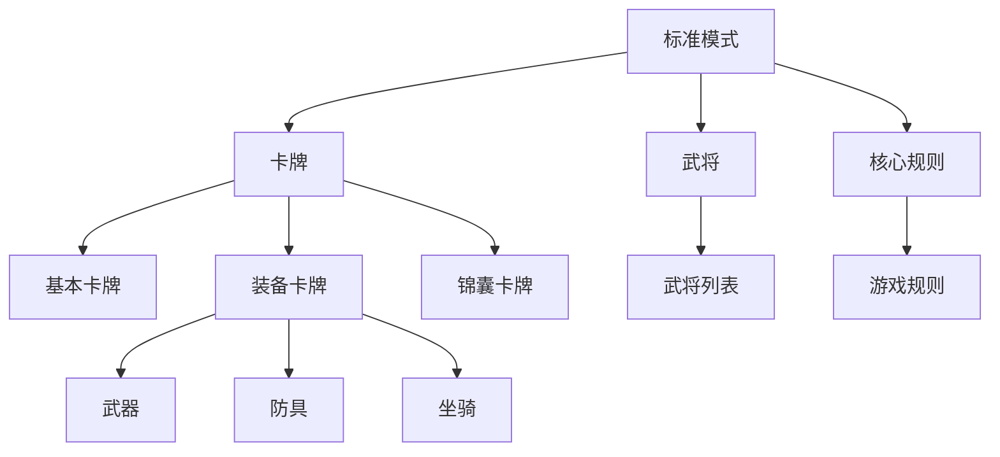
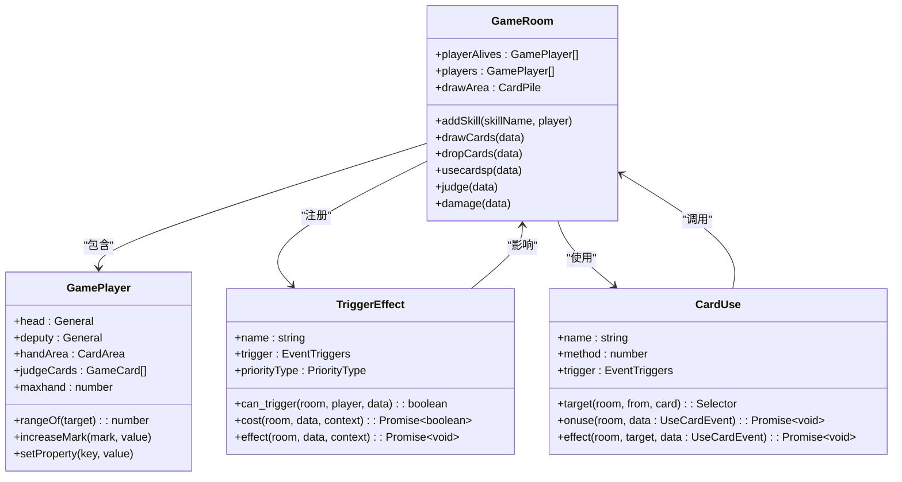
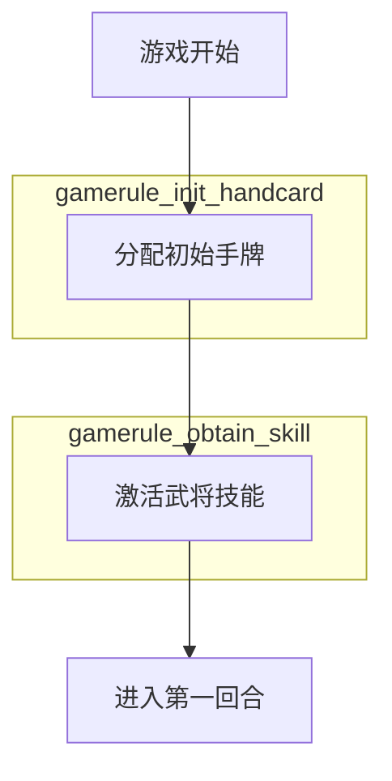
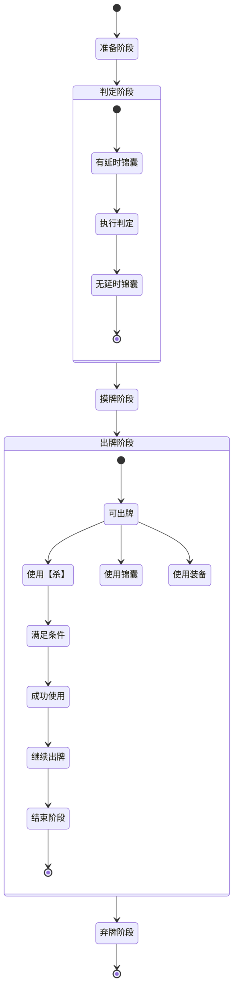
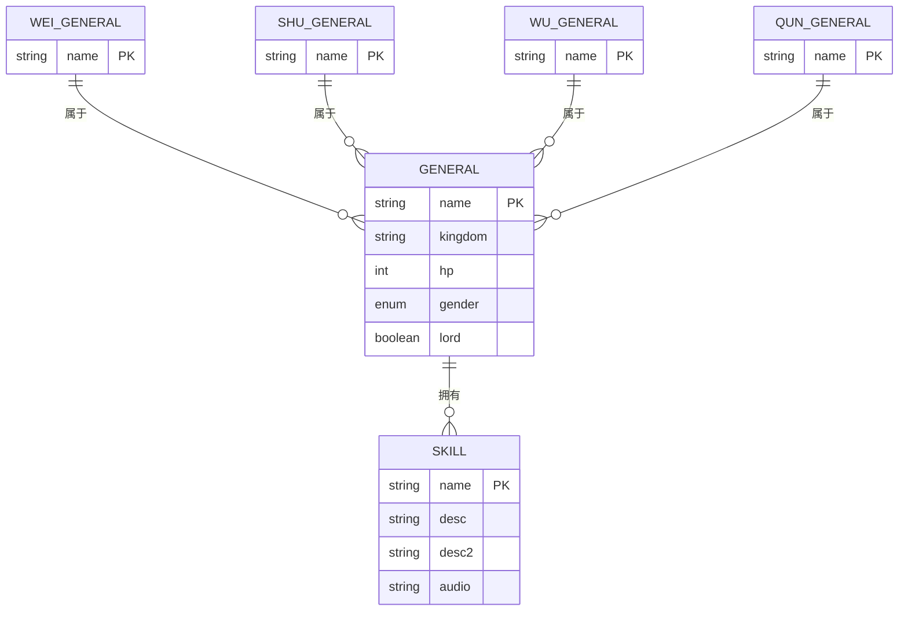
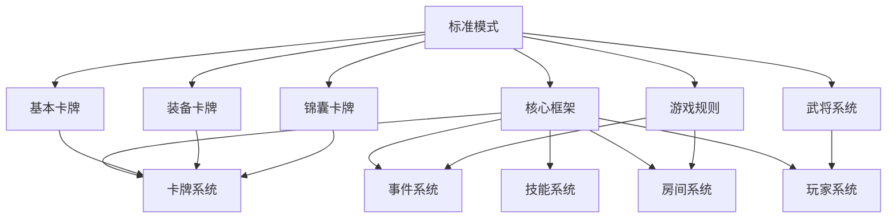

# 标准模式

<cite>
**本文档引用文件**  
- [index.ts](file://server/src/extensions/standard/index.ts)
- [sha.ts](file://server/src/extensions/standard/cards/basic/sha.ts)
- [baguazhen.ts](file://server/src/extensions/standard/cards/equip/baguazhen.ts)
- [wuxiekeji.ts](file://server/src/extensions/standard/cards/scroll/wuxiekeji.ts)
- [index.ts](file://server/src/extensions/standard/generals/index.ts)
- [sgs.ts](file://server/src/core/sgs.ts)
</cite>

## 目录
1. [简介](#简介)
2. [项目结构](#项目结构)
3. [核心组件](#核心组件)
4. [架构概览](#架构概览)
5. [详细组件分析](#详细组件分析)
6. [依赖分析](#依赖分析)
7. [性能考量](#性能考量)
8. [故障排除指南](#故障排除指南)
9. [结论](#结论)

## 简介
本文档详细介绍了resgsv1项目中“标准模式”的实现原理。重点分析了标准模式的核心规则，包括回合流程、卡牌使用、武将技能触发机制等。通过代码级分析，深入探讨了基础卡牌、装备卡牌和锦囊卡牌的具体实现方式，并结合状态机图展示游戏阶段的转换逻辑。

## 项目结构
标准模式的实现位于`server/src/extensions/standard/`目录下，采用模块化设计，分为卡牌、武将、选择器和核心规则等子模块。该结构清晰地分离了不同功能组件，便于维护和扩展。



**图示来源**  
- [index.ts](file://server/src/extensions/standard/index.ts#L1-L206)
- [generals/index.ts](file://server/src/extensions/standard/generals/index.ts#L1-L189)

**本节来源**  
- [index.ts](file://server/src/extensions/standard/index.ts#L1-L206)

## 核心组件
标准模式的核心由四大组件构成：游戏规则、卡牌系统、武将系统和事件系统。这些组件通过`sgs`全局对象进行注册和管理，形成完整的三国杀游戏逻辑。

**本节来源**  
- [sgs.ts](file://server/src/core/sgs.ts#L0-L991)
- [index.ts](file://server/src/extensions/standard/index.ts#L1-L206)

## 架构概览
标准模式采用基于事件驱动的架构设计，通过触发器（TriggerEffect）机制实现游戏流程的控制。整个游戏过程被划分为多个阶段，每个阶段由相应的事件触发器管理。



**图示来源**  
- [sgs.ts](file://server/src/core/sgs.ts#L0-L991)
- [index.ts](file://server/src/extensions/standard/index.ts#L1-L206)

## 详细组件分析

### 核心游戏规则分析
标准模式定义了完整的三国杀游戏流程，包括游戏初始化、判定阶段、摸牌阶段、出牌阶段和弃牌阶段等核心规则。

#### 游戏初始化规则
游戏开始时，系统会自动为每位玩家分配初始手牌并激活其武将技能。



**图示来源**  
- [index.ts](file://server/src/extensions/standard/index.ts#L15-L48)

**本节来源**  
- [index.ts](file://server/src/extensions/standard/index.ts#L15-L48)

#### 回合阶段规则
标准模式的回合流程严格遵循三国杀官方规则，分为五个阶段：准备阶段、判定阶段、摸牌阶段、出牌阶段和弃牌阶段。



**图示来源**  
- [index.ts](file://server/src/extensions/standard/index.ts#L50-L130)

**本节来源**  
- [index.ts](file://server/src/extensions/standard/index.ts#L50-L130)

### 卡牌系统分析

#### 基本卡牌：【杀】的实现
【杀】是游戏中最常用的基本攻击卡牌，其实现包含了距离判断、伤害计算和使用限制等核心逻辑。

```typescript
export const sha = sgs.CardUse({
    name: 'sha',
    method: 1,
    trigger: EventTriggers.PlayPhaseProceeding,
    timeCondition(room, from, card) {
        return 1;
    },
    distanceCondition(room, from, target, card) {
        return from.rangeOf(target);
    },
    target(room, from, card) {
        const count =
            room
                .getStates(StateEffectType.TargetMod_CardLimit, [from, card])
                .at(-1) ?? 1;
        return room.createChoosePlayer({
            count,
            filter(item, selected) {
                return from !== item;
            },
        });
    },
    async onuse(room, data: UseCardEvent) {
        const { from, card, source } = data;
        data.baseDamage = 1 + from.jiuState;
        from.setProperty('jiuState', 0);
        if (
            source.is(sgs.DataType.PhaseEvent) &&
            source.trigger === EventTriggers.PlayPhaseProceeding &&
            source.executor === from
        ) {
            const pass = room
                .getStates(StateEffectType.TargetMod_PassCountingTime, [
                    from,
                    card,
                    undefined,
                ])
                .some((v) => v);
            if (!pass) {
                from.increaseMark('__sha_times', 1);
            }
        }
    },
    async effect(room, target, data: UseCardEvent) {
        const { card, from, current, baseDamage = 1 } = data;
        let damageType = DamageType.None;
        if (card.hasAttr(CardAttr.Thunder)) {
            damageType = DamageType.Thunder;
        }
        if (card.hasAttr(CardAttr.Fire)) {
            damageType = DamageType.Fire;
        }
        await room.damage({
            from,
            to: current.target,
            number: baseDamage,
            damageType,
            channel: card,
            isChain: false,
            source: data,
            reason: this.name,
        });
    },
});
```

**图示来源**  
- [sha.ts](file://server/src/extensions/standard/cards/basic/sha.ts#L0-L80)

**本节来源**  
- [sha.ts](file://server/src/extensions/standard/cards/basic/sha.ts#L0-L80)

#### 装备卡牌：八卦阵的实现
八卦阵是一件防具装备，其技能允许持有者在需要使用或打出【闪】时进行判定，红色花色则视为成功使用。

```typescript
export const baguazhen_skill = sgs.Skill({
    name: 'baguazhen',
    attached_equip: 'baguazhen',
});

baguazhen_skill.addEffect(
    sgs.TriggerEffect({
        anim: 'baguazhen_skill',
        audio: ['baguazhen'],
        priorityType: PriorityType.Equip,
        trigger: EventTriggers.NeedUseCard1,
        auto_log: 1,
        forced: 'cost',
        can_trigger(room, player, data) {
            if (this.isOwner(player) && data.is(sgs.DataType.NeedUseCardData)) {
                return data.from === player && data.has('shan');
            }
        },
        async cost(room, data, context) {
            const { from } = context;
            return await room.judge({
                player: from,
                isSucc(result) {
                    return result.color === CardColor.Red;
                },
                source: data,
                reason: this.name,
            });
        },
        async effect(room, data: NeedUseCardData, context) {
            const { from } = context;
            const judge = context.cost as JudgeEvent;
            if (judge.success) {
                const shan = room.createVirtualCardByNone('shan');
                shan.custom.method = 1;
                data.used = await room.preUseCard(
                    Object.assign(
                        {
                            from,
                            card: shan,
                        },
                        data.copy()
                    )
                );
            }
        },
    })
);
```

**图示来源**  
- [baguazhen.ts](file://server/src/extensions/standard/cards/equip/baguazhen.ts#L0-L113)

**本节来源**  
- [baguazhen.ts](file://server/src/extensions/standard/cards/equip/baguazhen.ts#L0-L113)

#### 锦囊卡牌：无懈可击的实现
【无懈可击】是一张特殊的延时锦囊，可以抵消其他锦囊的效果，支持对同一势力角色群体生效。

```typescript
export const wuxiekeji = sgs.CardUse({
    name: 'wuxiekeji',
    method: 1,
    trigger: EventTriggers.CardEffectBefore,
    sameTime: true,
    prompt(room, from, card, context) {
        if (context.prompt) return context.prompt;
        else return '';
    },
    condition(room, from, card, data) {
        if (
            (data.is(sgs.DataType.UseCardEvent) &&
                data.card.type === CardType.Scroll) ||
            (data.is(sgs.DataType.UseCardSpecialEvent) &&
                data.card.type === CardType.Scroll) ||
            (data.is(sgs.DataType.UseCardToCardEvent) &&
                data.card.name === 'wuxiekeji')
        ) {
            return data.card;
        }
    },
    async effect(room, target, data: UseCardToCardEvent) {
        const { from, card, source } = data;
        if (source.is(sgs.DataType.UseCardEvent)) {
            source.current.offset = data;
        }
        if (source.is(sgs.DataType.UseCardToCardEvent)) {
            source.current.offset = data;
        }
        if (source.is(sgs.DataType.UseCardSpecialEvent)) {
            source.target.offset = data;
        }
        if (
            card.hasAttr(CardAttr.Country) &&
            source.is(sgs.DataType.UseCardEvent)
        ) {
            const to = source.current.target;
            const players = room
                .getPlayerByFilter((v) => room.sameAsKingdom(to, v))
                .filter((v) =>
                    source.targetList.find(
                        (tar) => tar.target === v && !tar.offset
                    )
                );
            if (players.length > 0) {
                const yon = await room.chooseYesOrNo(from, {
                    prompt: {
                        text: '@wuxiekeji_guo',
                        values: [
                            {
                                type: 'string',
                                value: to.kingdom,
                            },
                        ],
                    },
                    thinkPrompt: `@@wuxiekeji_guo`,
                });
                if (yon) {
                    players.forEach((v) => {
                        source.targetList.forEach((tar) => {
                            if (tar.target === v) {
                                tar.invalid = true;
                                tar.offset = data;
                            }
                        });
                    });
                }
            }
        }
    },
});
```

**图示来源**  
- [wuxiekeji.ts](file://server/src/extensions/standard/cards/scroll/wuxiekeji.ts#L0-L90)

**本节来源**  
- [wuxiekeji.ts](file://server/src/extensions/standard/cards/scroll/wuxiekeji.ts#L0-L90)

### 武将系统分析
标准模式包含了三国杀经典武将，每位武将都有独特的技能和属性配置。



**图示来源**  
- [generals/index.ts](file://server/src/extensions/standard/generals/index.ts#L1-L189)

**本节来源**  
- [generals/index.ts](file://server/src/extensions/standard/generals/index.ts#L1-L189)

## 依赖分析
标准模式依赖于核心框架提供的基础类和接口，通过模块化方式组织代码结构。



**图示来源**  
- [sgs.ts](file://server/src/core/sgs.ts#L0-L991)
- [index.ts](file://server/src/extensions/standard/index.ts#L1-L206)

**本节来源**  
- [sgs.ts](file://server/src/core/sgs.ts#L0-L991)
- [index.ts](file://server/src/extensions/standard/index.ts#L1-L206)

## 性能考量
标准模式在设计时考虑了性能优化，主要体现在以下几个方面：
- 使用Map数据结构存储各类对象，确保O(1)的查找效率
- 采用事件驱动架构，避免轮询带来的性能开销
- 通过批量操作减少数据库交互次数
- 利用对象池技术复用频繁创建的对象

## 故障排除指南
当标准模式出现异常时，可按以下步骤进行排查：

1. **检查游戏规则注册**：确认所有核心规则已正确注册到游戏房间
2. **验证卡牌配置**：检查卡牌数据是否完整，特别是type和subtype字段
3. **调试技能触发**：使用日志功能跟踪技能触发条件和执行流程
4. **审查事件监听**：确保事件监听器的优先级设置正确
5. **测试边界情况**：特别关注多层【无懈可击】嵌套、连锁反应等复杂场景

**本节来源**  
- [index.ts](file://server/src/extensions/standard/index.ts#L1-L206)
- [sgs.ts](file://server/src/core/sgs.ts#L0-L991)

## 结论
标准模式完整实现了三国杀经典玩法，通过模块化设计和事件驱动架构，构建了一个可扩展、易维护的游戏系统。该实现不仅忠实还原了原版游戏规则，还通过灵活的技能系统和卡牌机制，为后续扩展提供了坚实基础。