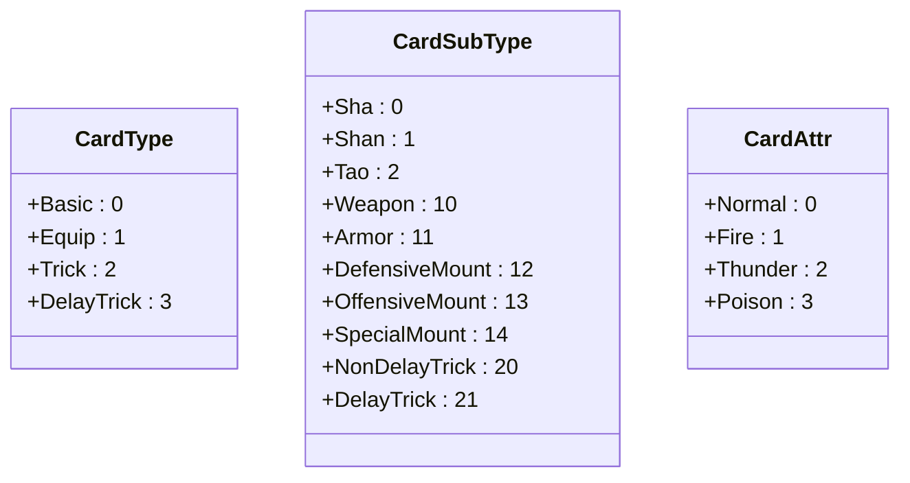
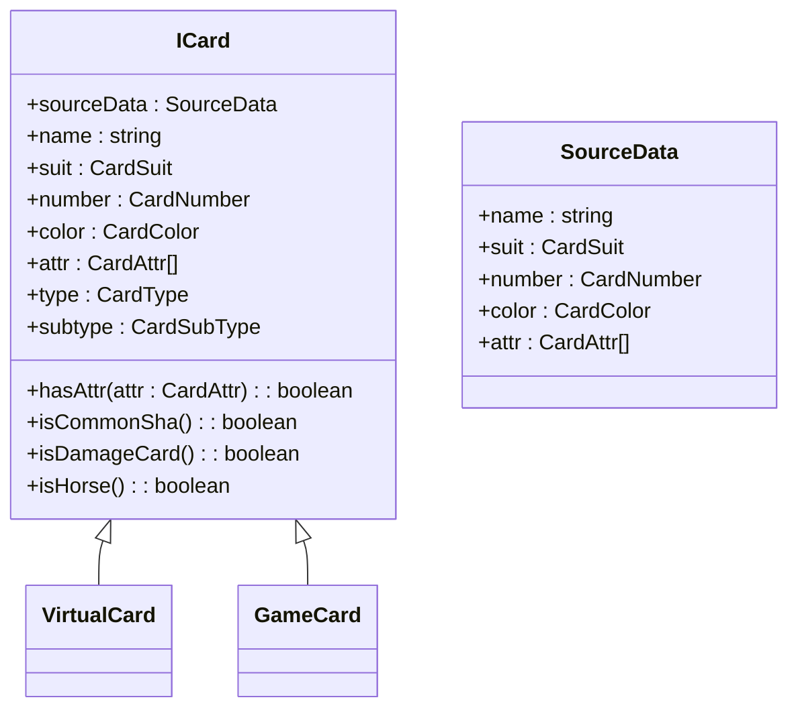
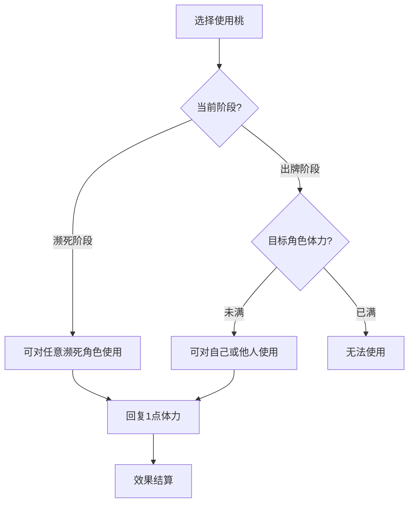
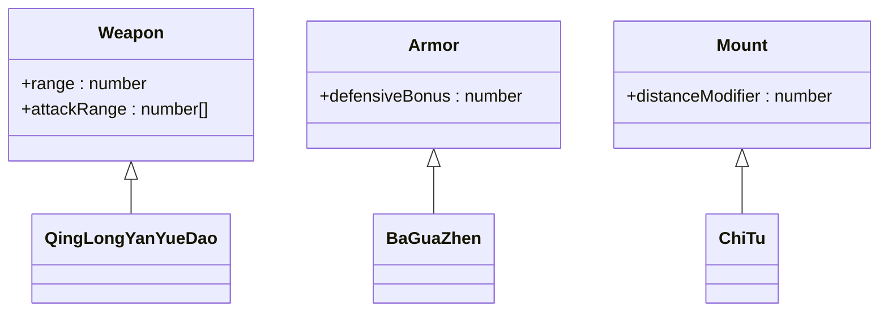
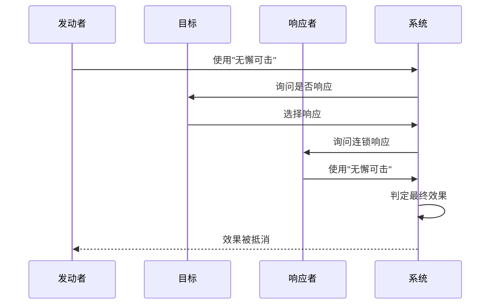
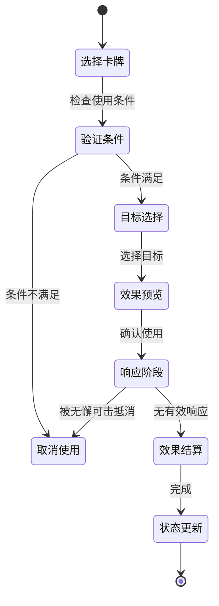

# 标准模式卡牌系统

<cite>
**本文档引用文件**   
- [icard.ts](file://server/src/core/card/icard.ts)
- [vcard.ts](file://server/src/core/card/vcard.ts)
- [card.ts](file://server/src/core/card/card.ts)
- [card.types.ts](file://server/src/core/card/card.types.ts)
- [room.ts](file://server/src/core/room/room.ts)
- [standard/cards](file://server/src/extensions/standard/cards)
- [enums.ts](file://server/src/core/enums.ts)
</cite>

## 目录
1. [引言](#引言)
2. [卡牌分类体系](#卡牌分类体系)
3. [卡牌基类设计](#卡牌基类设计)
4. [基础卡牌机制](#基础卡牌机制)
5. [装备卡牌机制](#装备卡牌机制)
6. [锦囊卡牌机制](#锦囊卡牌机制)
7. [卡牌使用流程](#卡牌使用流程)
8. [卡牌相互作用规则](#卡牌相互作用规则)

## 引言
本文件详细阐述了resgsv1项目中标准模式卡牌系统的实现原理。系统采用面向对象的设计模式，通过ICard基类定义卡牌核心属性与行为，派生出基础卡牌、装备卡牌和锦囊卡牌三大类别。卡牌系统与游戏房间、玩家管理等模块紧密集成，实现了完整的卡牌生命周期管理。

## 卡牌分类体系
卡牌系统采用三级分类体系，基于卡牌类型（CardType）、子类型（CardSubType）和属性（CardAttr）进行分类管理。

### 卡牌类型分类
系统定义了四大基础卡牌类型，存储于card.types.ts文件中：



**Diagram sources**
- [card.types.ts](file://server/src/core/card/card.types.ts)

**Section sources**
- [card.types.ts](file://server/src/core/card/card.types.ts)

### 分类体系实现
在room.ts中，游戏房间通过两个Map结构维护卡牌名称到类型和子类型的映射关系：

```typescript
// room.ts中的卡牌分类索引
public cardNamesToType: Map<CardType, string[]> = new Map();
public cardNamesToSubType: Map<CardSubType, string[]> = new Map();
```

当新卡牌加入游戏时，系统自动更新这些索引，便于快速查询特定类型的所有卡牌。

**Section sources**
- [room.ts](file://server/src/core/room/room.ts#L398-L436)

## 卡牌基类设计
卡牌系统的核心是ICard基类，定义了所有卡牌的通用属性和方法。

### ICard基类结构


**Diagram sources**
- [icard.ts](file://server/src/core/card/icard.ts)

**Section sources**
- [icard.ts](file://server/src/core/card/icard.ts)

### 核心属性说明
- **name**: 卡牌名称，如"sha"、"shan"、"tao"
- **suit**: 花色，包括黑桃、红桃、梅花、方块
- **number**: 点数，1-13
- **color**: 颜色，红色或黑色
- **attr**: 卡牌属性，可包含多个属性值
- **type**: 卡牌大类
- **subtype**: 卡牌子类

### 核心方法分析
```typescript
// 判断是否为普通杀
public isCommonSha() {
    return (
        this.name === 'sha' &&
        !this.attr.includes(CardAttr.Fire) &&
        !this.attr.includes(CardAttr.Thunder)
    );
}

// 判断是否为伤害类卡牌
public isDamageCard() {
    return sgs.utils.isDamageCard(this.name);
}

// 判断是否为坐骑类卡牌
public isHorse() {
    return (
        this.subtype === CardSubType.OffensiveMount ||
        this.subtype === CardSubType.DefensiveMount ||
        this.subtype === CardSubType.SpecialMount
    );
}
```

这些方法提供了卡牌行为的语义化判断，简化了游戏逻辑的实现。

## 基础卡牌机制
基础卡牌包括杀、闪、桃三种核心卡牌，构成了游戏的基本交互循环。

### 杀的伤害计算
杀卡牌的伤害计算涉及属性判断和目标选择：

```typescript
// 杀的属性判断
if (card.hasAttr(CardAttr.Fire)) {
    // 火杀造成额外伤害
    damage += 1;
} else if (card.hasAttr(CardAttr.Thunder)) {
    // 雷杀具有穿透效果
    canPierce = true;
}
```

普通杀（无属性）造成1点伤害，火杀造成2点伤害，雷杀具有特殊判定效果。

### 桃的回复机制
桃卡牌用于回复体力值，其使用受到严格限制：



**Diagram sources**
- [card.use.ts](file://server/src/core/card/card.use.ts)

### 闪的防御判定
闪卡牌作为防御手段，主要用于抵消杀的攻击：

```typescript
// 闪的响应逻辑
if (attackCard.name === 'sha') {
    if (defender.hasCard('shan')) {
        const response = await askForResponse(defender, 'shan');
        if (response) {
            // 成功防御
            removeAttackEffect();
        }
    }
}
```

闪的使用时机严格限定在受到杀的攻击时，体现了游戏的回合制特性。

## 装备卡牌机制
装备卡牌分为武器、防具和坐骑三类，提供持续性的属性加成。

### 装备属性加成


**Diagram sources**
- [standard/cards](file://server/src/extensions/standard/cards)

### 装备区替换逻辑
当玩家装备同类型卡牌时，新装备会替换旧装备：

```typescript
// 装备替换逻辑
public equipCard(card: EquipCard) {
    const existing = this.equipArea[card.subtype];
    if (existing) {
        // 移除旧装备效果
        this.removeEquipEffect(existing);
        // 旧装备进入弃牌堆
        this.discardPile.addCard(existing);
    }
    // 装备新卡牌
    this.equipArea[card.subtype] = card;
    // 应用新装备效果
    this.applyEquipEffect(card);
}
```

### 八卦阵判定机制
八卦阵作为特殊防具，提供概率性防御：

```typescript
// 八卦阵判定逻辑
public async baguaEffect(attackCard: Card) {
    if (this.hasEquip('baguazhen')) {
        const suit = await this.judgeSuit();
        if (suit === CardSuit.Spade || suit === CardSuit.Club) {
            // 黑色花色判定成功
            return true;
        }
    }
    return false;
}
```

判定成功时，八卦阵可以替代闪的效果，抵挡一次属性杀。

### 青龙偃月刀攻击范围
青龙偃月刀扩展了杀的攻击范围：

```typescript
// 武器攻击范围计算
public getAttackRange() {
    let range = 1;
    if (this.hasEquip('qinglongyanyuedao')) {
        range = 2;
    }
    return range;
}
```

装备青龙偃月刀后，玩家可以对距离为2的目标使用杀。

## 锦囊卡牌机制
锦囊卡牌分为延时类和非延时类，提供多样化的策略选择。

### 连锁反应处理


**Diagram sources**
- [trick.ts](file://server/src/core/card/trick.ts)

### 无懈可击响应机制
无懈可击作为万能响应卡，可以抵消任何锦囊效果：

```typescript
// 无懈可击响应链
public async handleTrickResponse(trickCard: TrickCard) {
    let finalEffect = true;
    while (true) {
        const response = await askForWuxie(trickCard);
        if (!response) break;
        finalEffect = !finalEffect;
    }
    return finalEffect;
}
```

响应链采用布尔值翻转机制，奇数次响应抵消效果，偶数次恢复效果。

### 过河拆桥弃牌逻辑
过河拆桥强制目标弃置一张手牌或装备：

```typescript
// 过河拆桥执行逻辑
public async guoheqiaqiaoEffect(target: Player) {
    const options = [
        ...target.handCards,
        ...Object.values(target.equipArea)
    ];
    const selected = await chooseCardFrom(target, options);
    if (selected.inHand) {
        target.discardHandCard(selected);
    } else {
        target.unequipCard(selected);
    }
}
```

## 卡牌使用流程
卡牌使用遵循严格的状态转换流程，确保游戏的公平性和一致性。



**Diagram sources**
- [card.use.ts](file://server/src/core/card/card.use.ts)

### 状态转换说明
1. **选择卡牌**: 玩家从手牌中选择要使用的卡牌
2. **验证条件**: 系统检查卡牌使用条件（距离、次数限制等）
3. **目标选择**: 玩家选择卡牌作用目标
4. **效果预览**: 显示卡牌预期效果
5. **响应阶段**: 其他玩家可进行响应（如无懈可击）
6. **效果结算**: 执行卡牌最终效果
7. **状态更新**: 更新游戏状态，卡牌进入弃牌堆

## 卡牌相互作用规则
卡牌之间存在复杂的相互作用规则，形成了丰富的策略层次。

### 优先级处理机制
当多个卡牌效果同时触发时，系统采用以下优先级规则：

```typescript
// 优先级枚举
enum EffectPriority {
    Immediate = 10,    // 即时效果
    Response = 20,     // 响应效果
    Delayed = 30,      // 延时效果
    Permanent = 40     // 永久效果
}

// 效果排序处理
public sortEffects(effects: GameEffect[]) {
    return effects.sort((a, b) => a.priority - b.priority);
}
```

响应效果（如无懈可击）优先级高于即时效果，确保响应机制的及时性。

### 相互作用示例
- **杀与闪**: 闪可以抵消杀的效果
- **杀与八卦阵**: 八卦阵可以替代闪进行防御
- **无懈可击与锦囊**: 无懈可击可以抵消任何锦囊效果
- **装备替换**: 同类型装备会相互替换

这些相互作用规则构成了游戏策略的核心，玩家需要根据局势灵活运用各种卡牌组合。