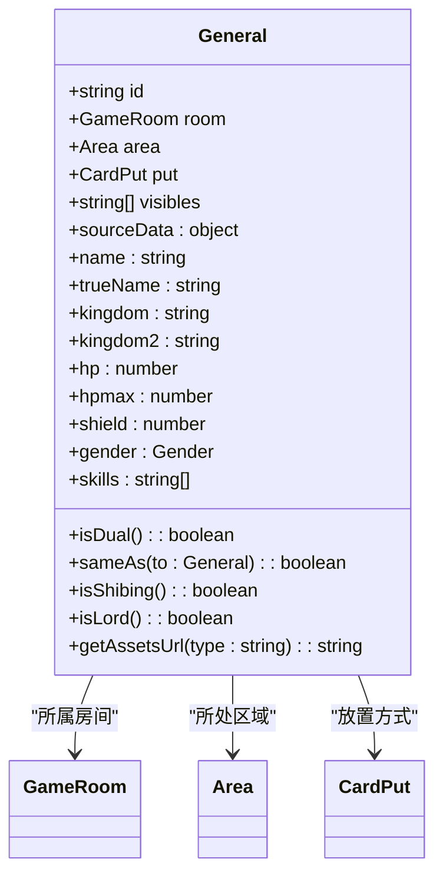
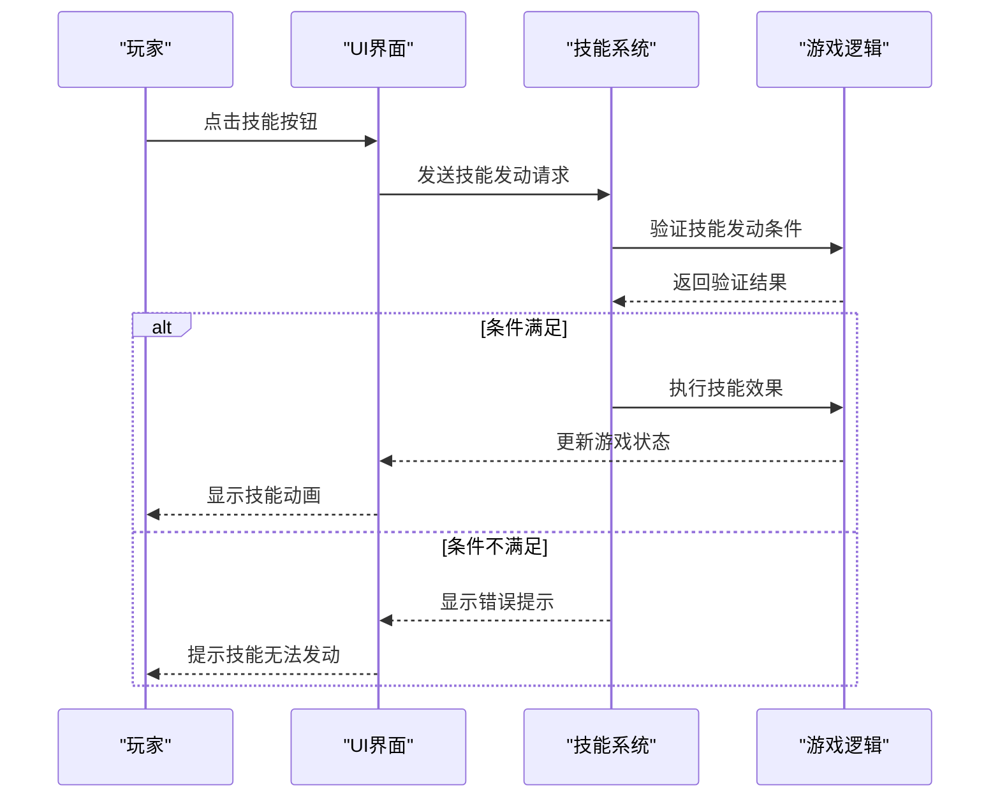
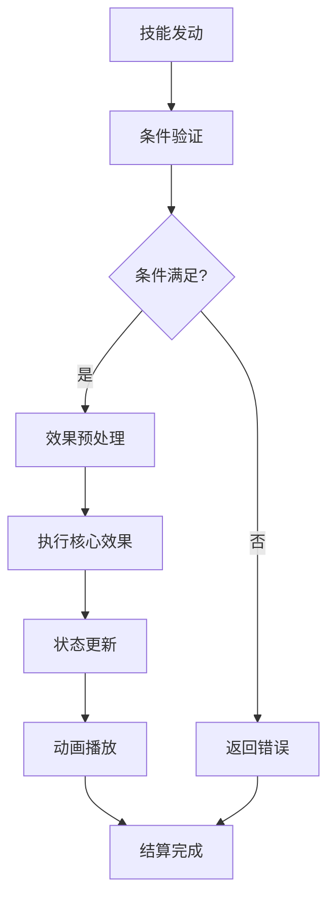
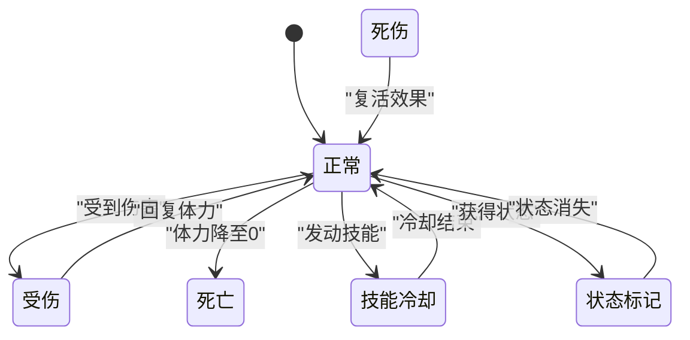

# 标准模式武将系统

<cite>
**本文档引用文件**   
- [general.type.ts](file://server/src/core/general/general.type.ts)
- [general.ts](file://server/src/core/general/general.ts)
- [player.ts](file://server/src/core/player/player.ts)
- [lang2.ts](file://server/src/extensions/lang/lang2.ts)
- [index.ts](file://server/src/extensions/wars/generals/index.ts)
</cite>

## 目录
1. [引言](#引言)
2. [武将属性结构](#武将属性结构)
3. [武将基类设计](#武将基类设计)
4. [技能注册与触发机制](#技能注册与触发机制)
5. [技能实现模式](#技能实现模式)
6. [技能效果执行流程](#技能效果执行流程)
7. [武将与卡牌协同机制](#武将与卡牌协同机制)
8. [武将状态管理](#武将状态管理)
9. [平衡性设计与冲突解决](#平衡性设计与冲突解决)

## 引言
本文档详细阐述resgsv1项目中标准模式武将系统的实现原理。系统基于TypeScript构建，采用面向对象设计模式，通过`General`类封装武将核心属性与行为。武将系统是游戏的核心组成部分，负责管理武将的体力、势力、性别等基础属性，以及技能的注册、触发和执行。系统设计注重可扩展性和灵活性，支持多种游戏模式，包括标准模式和国战模式。

## 武将属性结构
武将属性结构定义了武将的基本特征和初始状态，包括体力值、势力、性别等关键属性。

### 基础属性定义
武将的基础属性在`GeneralData`接口中定义，包含以下关键字段：

```typescript
export interface GeneralData {
    /** 武将ID */
    id: GeneralId;
    /** 武将名 */
    name: string;
    /** 势力 */
    kingdom: GeneralKingdom;
    /** 血量 */
    hp: GeneralHp;
    /** 性别 */
    gender: Gender;
    /** 技能 */
    skills: string[];
    /** 是否为主公/君主 */
    lord: boolean;
    /** 是否启用 */
    enable: boolean;
    /** 在武将一览中隐藏 */
    hidden: boolean;
    /** 所属扩展包 */
    package: string[];
    /** 是否启用双头武将特殊插画 */
    isDualImage: boolean;
    /** 是否为国战武将 */
    isWars: boolean;
}
```

**属性说明**：
- **id**: 武将的唯一标识符
- **name**: 武将名称，支持扩展包前缀（如`wars.wangping`）
- **kingdom**: 武将势力，支持单势力和双势力（通过数组定义）
- **hp**: 体力值，支持多种定义方式：
  - 单个数字：表示初始体力和体力上限
  - 二元数组：`[初始体力, 体力上限]`
  - 三元数组：`[初始体力, 体力上限, 初始护盾]`
- **gender**: 性别，使用枚举类型定义
- **skills**: 技能ID数组，存储武将拥有的所有技能

### 性别枚举
性别属性使用`Gender`枚举类型定义，提供类型安全和清晰的语义：

```typescript
export const enum Gender {
    /** 无性别 */
    None = 0,
    /** 男 */
    Male = 1,
    /** 女 */
    Female = 2,
    /** 双性 */
    Doublesex = 9,
}
```

**Section sources**
- [general.type.ts](file://server/src/core/general/general.type.ts#L0-L51)

## 武将基类设计
`General`类是武将系统的基类，采用面向对象设计模式，封装了武将的核心属性和行为。

### 类构造函数
构造函数负责初始化武将实例，处理势力和体力值的复杂配置：

```typescript
public constructor(room: GameRoom, protected data: GeneralData) {
    this.room = room;
    this.id = data.id;
    this.sourceData = {
        // 初始化基础属性
        id: data.id,
        name: data.name,
        trueName: data.name.split('.').at(-1),
        kingdom: 'none',
        kingdom2: 'none',
        hp: 0,
        hpmax: 0,
        shield: 0,
        gender: data.gender,
        skills: data.skills.slice(),
        lord: data.lord,
        isDualImage: data.isDualImage,
        isWars: data.isWars ?? false,
        enable: data.enable,
        packages: data.package.slice(),
    };
    
    // 处理势力配置
    if (Array.isArray(this.data.kingdom)) {
        this.sourceData.kingdom = this.data.kingdom[0];
        this.sourceData.kingdom2 = this.data.kingdom[1];
    } else {
        this.sourceData.kingdom = this.sourceData.kingdom2 = this.data.kingdom;
    }
    
    // 处理体力值配置
    if (Array.isArray(this.data.hp)) {
        this.sourceData.hp = this.data.hp[0];
        this.sourceData.hpmax = this.data.hp[1];
        this.sourceData.shield = this.data.hp.length > 2 ? this.data.hp[2] : 0;
    } else {
        this.sourceData.hp = this.sourceData.hpmax = this.data.hp;
        this.sourceData.shield = 0;
    }
}
```

### 属性访问器
类通过getter方法提供对核心属性的安全访问：

```typescript
/** 武将名 */
public get name() {
    return this.sourceData.name;
}

/** 武将势力 */
public get kingdom() {
    return this.sourceData.kingdom;
}

/** 武将副势力 */
public get kingdom2() {
    return this.sourceData.kingdom2;
}

/** 初始体力值 */
public get hp() {
    return this.sourceData.hp;
}

/** 初始体力上限 */
public get hpmax() {
    return this.sourceData.hpmax;
}

/** 武将性别 */
public get gender() {
    return this.sourceData.gender;
}

/** 武将技能 */
public get skills() {
    return this.sourceData.skills;
}
```

### 核心方法
`General`类提供了多个核心方法，支持武将系统的复杂逻辑：



**Diagram sources**
- [general.ts](file://server/src/core/general/general.ts#L0-L195)

**Section sources**
- [general.ts](file://server/src/core/general/general.ts#L0-L195)

## 技能注册与触发机制
技能系统采用模块化设计，通过技能ID数组实现技能的注册，并通过事件驱动机制实现技能的触发。

### 技能注册
技能注册通过`GeneralData`接口中的`skills`字段实现，每个武将实例在创建时会复制技能数组：

```typescript
this.sourceData.skills = data.skills.slice();
```

这种设计确保了技能数组的独立性，避免了不同武将实例之间的数据共享问题。

### 技能触发条件
技能触发机制依赖于游戏事件系统，通过技能ID与事件的映射关系实现：

```typescript
// 在lang2.ts中定义技能描述
sgs.GeneralSetting('wars.wangping', {
    title: '键闭剑门',
    rs: '蒋琬费祎',
    death_audio: '容王某再拜先主，此乃最后一道军令……',
    skills: {
        ['wars.wangping.jianglue']: {
            name: '将略',
            desc: '限定技，出牌阶段，你可以选择一个“军令”，与你势力相同的其他角色均可执行该军令。你和每一个执行军令的角色体力上限+1（不能大于5）且回复1点体力，然后你摸X张牌（X为执行此军令的人数+1）。',
            desc2: '限定技，出牌阶段，你可选择军令▶所有与你势力相同的其他角色各{选择是否执行此军令。若其选择是，其获得1枚“将”}。你和所有有“将”的角色各{{若体力上限不大于5，加1点体力上限}。回复1点体力▷获得一枚“略”}。你摸X张牌（X为有“略”的角色数）。所有角色各弃其所有“将”和“略”。',
            audios: [
                {
                    url: 'generals/wangping/jianglue1',
                    lang: '军令如山，宜速行之',
                },
                {
                    url: 'generals/wangping/jianglue2',
                    lang: '这是死命令！',
                },
            ],
        },
    },
});
```

**Section sources**
- [lang2.ts](file://server/src/extensions/lang/lang2.ts#L1018-L1039)

## 技能实现模式
技能系统支持多种实现模式，包括被动技能的自动触发和主动技能的用户交互。

### 被动技能实现
被动技能通过监听游戏事件实现自动触发，无需玩家主动操作。系统通过技能ID与事件处理器的映射关系实现：

```typescript
// 被动技能示例：当玩家受到伤害时触发
if (skill.name === 'wars.wangping.jianglue') {
    // 监听出牌阶段事件
    room.on('playPhase', (player) => {
        if (player.general.name === 'wars.wangping') {
            // 检查是否为限定技且未使用
            if (!player.hasUsedSkill('wars.wangping.jianglue')) {
                // 显示技能按钮，允许玩家选择发动
                player.showSkillButton('wars.wangping.jianglue');
            }
        }
    });
}
```

### 主动技能实现
主动技能需要玩家通过用户界面进行交互操作，系统通过UI组件与技能逻辑的集成实现：



**Diagram sources**
- [general.ts](file://server/src/core/general/general.ts#L0-L195)
- [player.ts](file://server/src/core/player/player.ts#L561-L595)

## 技能效果执行流程
技能效果的执行流程从技能发动到效果结算，涉及多个系统组件的协同工作。

### 执行流程概述
技能效果执行流程可分为以下几个阶段：



### 详细执行步骤
1. **技能发动**: 玩家通过UI界面选择发动技能
2. **条件验证**: 系统验证技能发动条件，包括：
   - 技能是否处于冷却状态
   - 玩家是否满足发动条件（如阶段、体力等）
   - 技能是否为限定技且已使用
3. **效果预处理**: 准备技能执行所需的数据和状态
4. **执行核心效果**: 调用技能逻辑，修改游戏状态
5. **状态更新**: 更新相关角色的属性和状态
6. **动画播放**: 播放技能动画和音效
7. **结算完成**: 技能执行完毕，更新技能使用记录

**Section sources**
- [general.ts](file://server/src/core/general/general.ts#L0-L195)
- [player.ts](file://server/src/core/player/player.ts#L561-L595)

## 武将与卡牌协同机制
武将系统与卡牌系统紧密集成，特定技能会对卡牌使用产生影响。

### 技能对卡牌的影响
某些武将技能可以改变卡牌的使用规则或效果：

```typescript
// 示例：某个技能允许玩家额外使用一张【杀】
if (player.hasSkill('extra_attack')) {
    player.extraUseCount['sha'] = 1;
}
```

### 卡牌对武将的影响
卡牌效果也可以改变武将的状态和能力：

```typescript
// 当玩家使用【桃】时，回复体力
player.useCard('tao', (target) => {
    target.changeHp(target.hp + 1);
});
```

**Section sources**
- [general.ts](file://server/src/core/general/general.ts#L0-L195)

## 武将状态管理
武将状态管理涉及体力变化、技能冷却、状态标记等关键状态的转换逻辑。

### 体力变化管理
体力变化通过`changeHp`方法实现，确保体力值不会超过上限：

```typescript
public changeHp(value: number) {
    let newhp = value;
    if (newhp > this.maxhp) newhp = this.maxhp;
    this.setProperty('hp', newhp);
    this.setProperty('inthp', Math.max(0, newhp));
}
```

### 状态转换图
武将状态的转换逻辑如下：



**Diagram sources**
- [player.ts](file://server/src/core/player/player.ts#L561-L595)

## 平衡性设计与冲突解决
系统设计考虑了武将平衡性和技能冲突的解决策略。

### 平衡性设计原则
1. **技能强度分级**: 将技能分为普通技、限定技、觉醒技等不同等级
2. **资源消耗机制**: 通过体力、手牌等资源限制技能使用频率
3. **效果范围控制**: 限制技能影响的玩家数量和范围
4. **冷却时间设置**: 为强力技能设置适当的冷却时间

### 技能冲突解决
当多个技能同时触发时，系统采用以下策略解决冲突：
1. **优先级机制**: 为不同技能设置优先级，高优先级技能先执行
2. **顺序队列**: 按照技能注册顺序或玩家座位顺序执行
3. **玩家选择**: 当冲突无法自动解决时，由玩家选择执行顺序

**Section sources**
- [general.ts](file://server/src/core/general/general.ts#L0-L195)
- [lang2.ts](file://server/src/extensions/lang/lang2.ts#L1018-L1039)