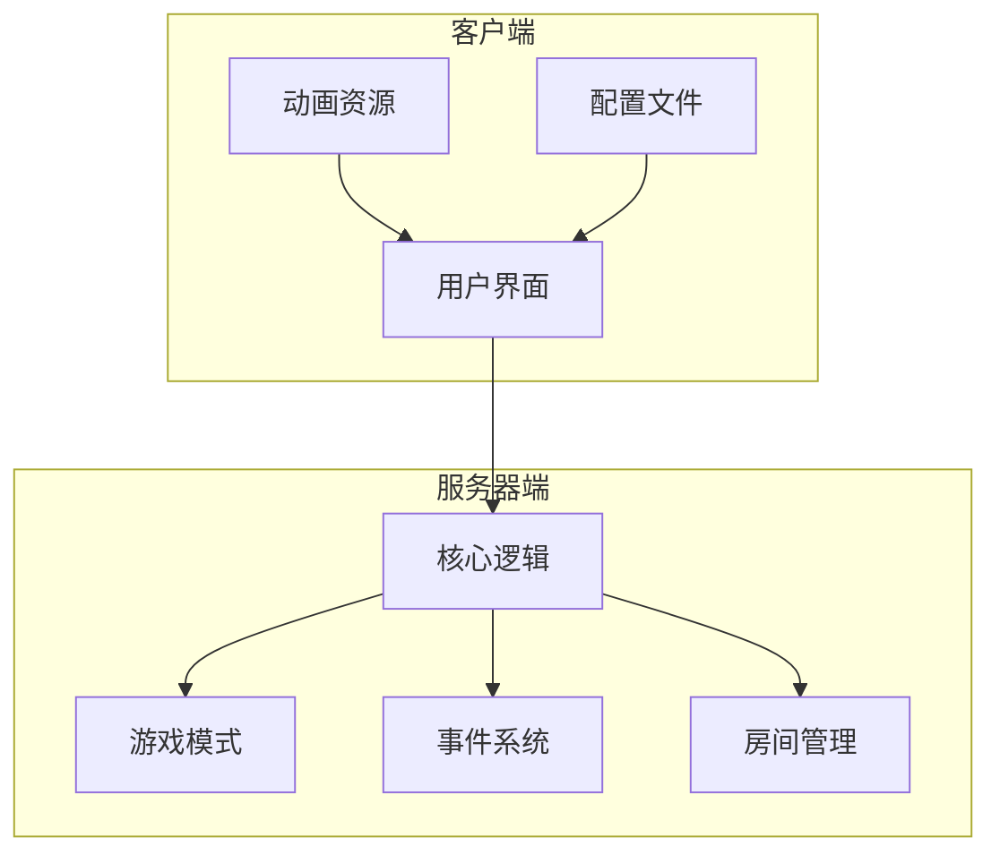
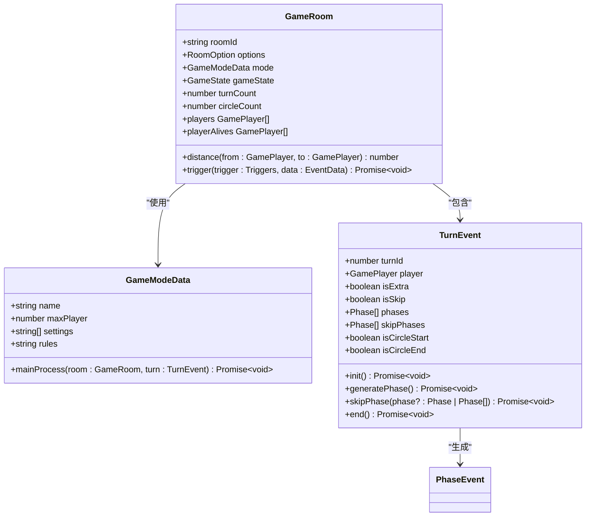
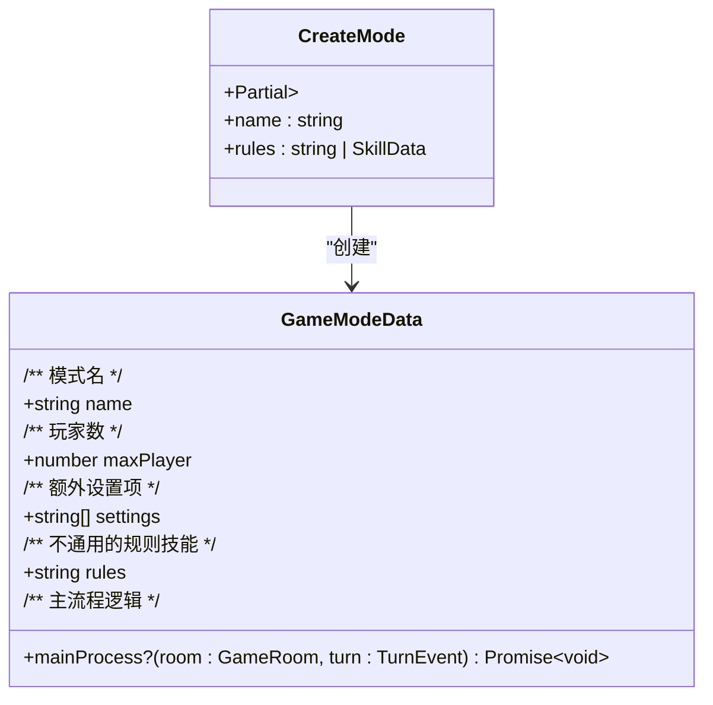
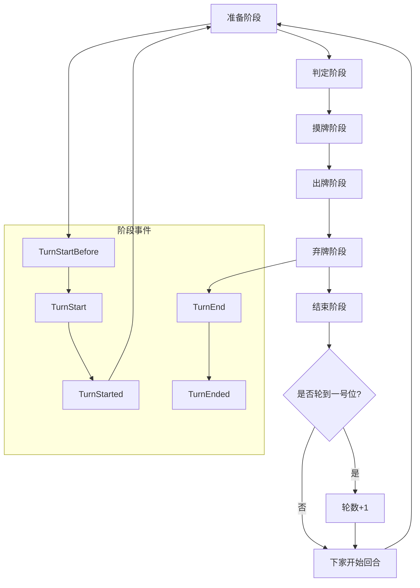
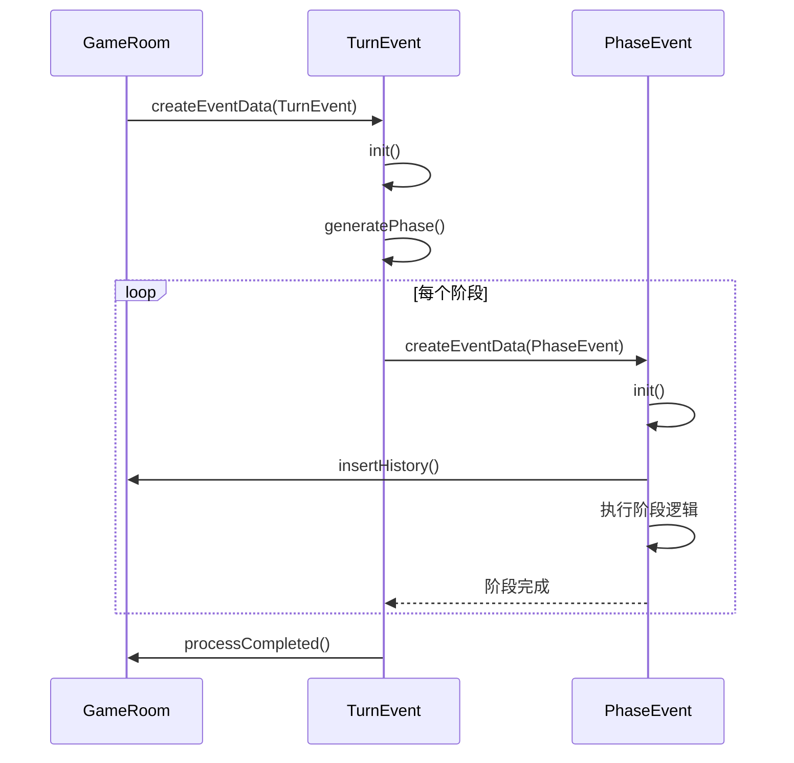
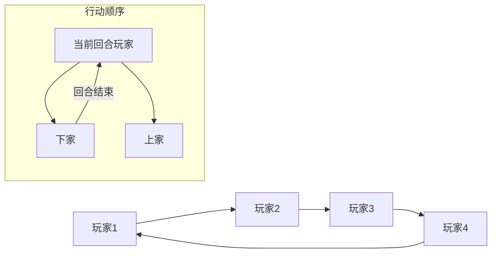
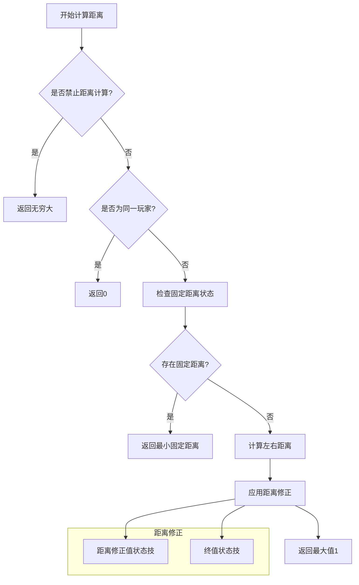
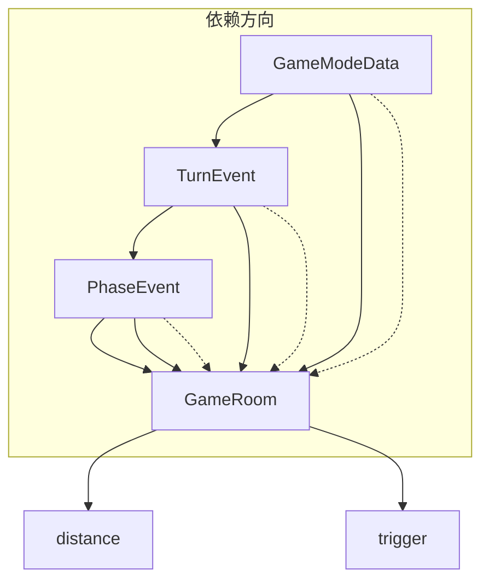

# 标准模式游戏规则

<cite>
**本文档引用的文件**   
- [mode.ts](file://server/src/core/mode/mode.ts)
- [event.turn.ts](file://server/src/core/event/types/event.turn.ts)
- [room.ts](file://server/src/core/room/room.ts)
</cite>

## 目录
1. [简介](#简介)
2. [项目结构](#项目结构)
3. [核心组件](#核心组件)
4. [架构概述](#架构概述)
5. [详细组件分析](#详细组件分析)
6. [依赖分析](#依赖分析)
7. [性能考虑](#性能考虑)
8. [故障排除指南](#故障排除指南)
9. [结论](#结论)

## 简介
本文档详细介绍了resgsv1项目中标准模式游戏规则的实现原理。重点分析了游戏的完整回合流程、模式基类设计、阶段转换机制、玩家行动顺序、距离计算算法以及游戏状态机等核心功能。通过代码示例和图表，全面展示了游戏规则系统的内部工作机制。

## 项目结构
resgsv1项目采用前后端分离架构，包含客户端和服务器端两个主要部分。服务器端实现了游戏核心逻辑，特别是游戏模式和规则系统。

**图示来源**
- [mode.ts](file://server/src/core/mode/mode.ts)
- [event.turn.ts](file://server/src/core/event/types/event.turn.ts)

**本节来源**
- [mode.ts](file://server/src/core/mode/mode.ts#L0-L28)
- [room.ts](file://server/src/core/room/room.ts#L0-L199)

## 核心组件
标准模式游戏规则的核心组件包括游戏模式定义、回合事件处理和房间管理。这些组件共同协作，实现了完整的卡牌游戏流程。

**本节来源**
- [mode.ts](file://server/src/core/mode/mode.ts#L0-L28)
- [event.turn.ts](file://server/src/core/event/types/event.turn.ts#L0-L305)

## 架构概述
游戏规则系统采用事件驱动架构，通过状态机管理游戏流程。主要组件包括模式管理器、回合控制器和房间处理器。

**图示来源**
- [mode.ts](file://server/src/core/mode/mode.ts#L0-L28)
- [event.turn.ts](file://server/src/core/event/types/event.turn.ts#L0-L305)
- [room.ts](file://server/src/core/room/room.ts#L0-L199)

## 详细组件分析

### 游戏模式基类分析
游戏模式基类`GameModeData`定义了标准模式的基本属性和行为，通过钩子函数控制游戏流程。

**图示来源**
- [mode.ts](file://server/src/core/mode/mode.ts#L0-L28)

**本节来源**
- [mode.ts](file://server/src/core/mode/mode.ts#L0-L28)

### 回合流程分析
游戏的完整回合流程由多个阶段组成，每个阶段都有特定的执行逻辑和触发时机。

**图示来源**
- [event.turn.ts](file://server/src/core/event/types/event.turn.ts#L0-L305)

**本节来源**
- [event.turn.ts](file://server/src/core/event/types/event.turn.ts#L0-L305)

### 阶段转换与异常处理
阶段转换通过事件系统实现，异常处理机制确保游戏流程的稳定性。

**图示来源**
- [event.turn.ts](file://server/src/core/event/types/event.turn.ts#L0-L305)

**本节来源**
- [event.turn.ts](file://server/src/core/event/types/event.turn.ts#L0-L305)

### 玩家行动顺序分析
玩家行动顺序由房间管理器维护，通过循环链表实现轮转机制。

**本节来源**
- [room.ts](file://server/src/core/room/room.ts#L1140-L1339)

### 距离计算算法分析
距离计算算法考虑了玩家位置、距离修正和固定距离等多种因素。

**图示来源**
- [room.ts](file://server/src/core/room/room.ts#L1140-L1339)

**本节来源**
- [room.ts](file://server/src/core/room/room.ts#L1140-L1339)

## 依赖分析
游戏规则系统各组件之间的依赖关系清晰，通过接口和事件进行通信。

**图示来源**
- [mode.ts](file://server/src/core/mode/mode.ts#L0-L28)
- [event.turn.ts](file://server/src/core/event/types/event.turn.ts#L0-L305)
- [room.ts](file://server/src/core/room/room.ts#L0-L199)

**本节来源**
- [mode.ts](file://server/src/core/mode/mode.ts#L0-L28)
- [event.turn.ts](file://server/src/core/event/types/event.turn.ts#L0-L305)
- [room.ts](file://server/src/core/room/room.ts#L0-L199)

## 性能考虑
游戏规则系统在设计时考虑了性能优化，主要体现在以下几个方面：
- 事件系统采用异步处理，避免阻塞主线程
- 距离计算缓存常用结果，减少重复计算
- 状态检查采用短路评估，提高判断效率
- 批量操作减少网络通信次数

## 故障排除指南
### 常见问题及解决方案
1. **回合无法正常进行**
   - 检查`TurnEvent`的`init`方法是否正确执行
   - 确认`generatePhase`方法是否生成了正确的阶段序列

2. **距离计算错误**
   - 验证玩家位置关系是否正确
   - 检查是否存在影响距离的状态技能

3. **阶段跳过异常**
   - 确认`skipPhases`数组是否被正确更新
   - 检查`skip`方法的调用条件

4. **事件触发失败**
   - 验证`trigger`方法的参数是否正确
   - 确认游戏状态是否为进行中

**本节来源**
- [event.turn.ts](file://server/src/core/event/types/event.turn.ts#L0-L305)
- [room.ts](file://server/src/core/room/room.ts#L0-L199)

## 结论
resgsv1项目中的标准模式游戏规则实现了一个完整、灵活且可扩展的游戏系统。通过事件驱动架构和清晰的组件划分，系统能够高效地处理复杂的卡牌游戏逻辑。游戏模式基类提供了良好的扩展性，允许通过钩子函数自定义游戏流程。回合管理系统确保了游戏的公平性和流畅性，而距离计算算法则为游戏策略提供了精确的数学基础。整体设计体现了高内聚、低耦合的原则，为后续功能扩展奠定了坚实的基础。