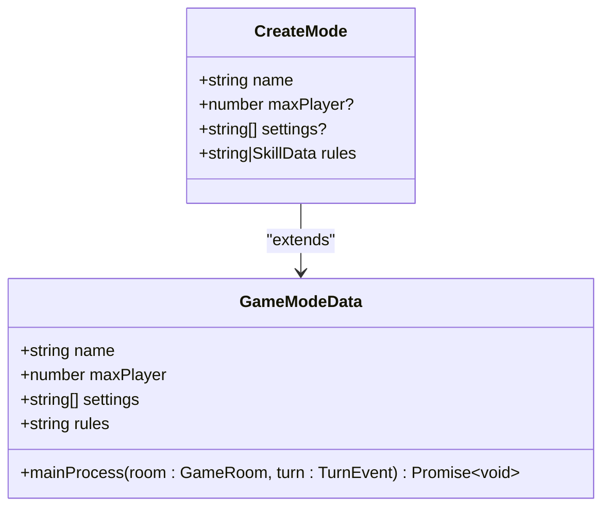
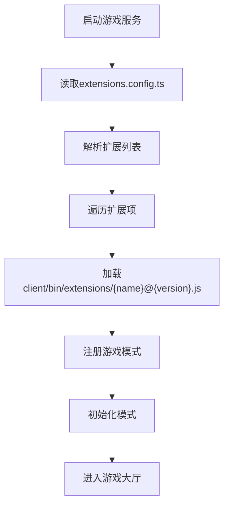
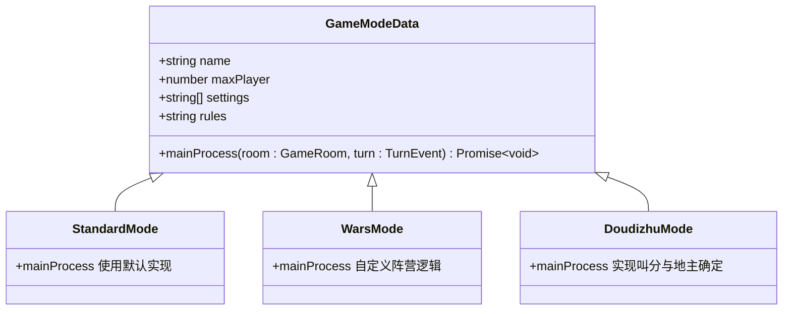
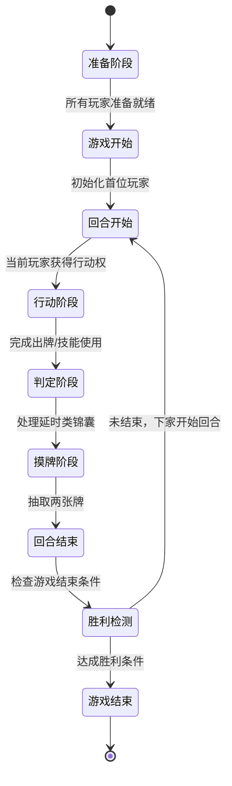
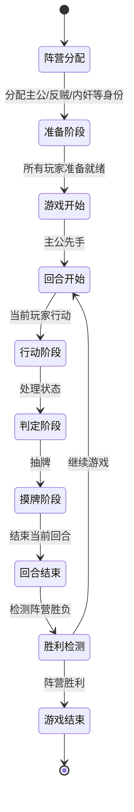
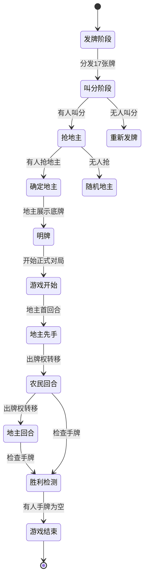

# 游戏模式设计

<cite>
**本文档引用的文件**  
- [mode.ts](file://server/src/core/mode/mode.ts#L0-L29)
- [extensions.config.ts](file://server/src/core/extensions.config.ts#L0-L10)
</cite>

## 目录
1. [引言](#引言)
2. [项目结构概览](#项目结构概览)
3. [核心组件分析](#核心组件分析)
4. [游戏模式抽象设计](#游戏模式抽象设计)
5. [扩展配置与加载机制](#扩展配置与加载机制)
6. [具体游戏模式实现](#具体游戏模式实现)
7. [状态机与阶段转换](#状态机与阶段转换)
8. [共享逻辑与特有逻辑分离策略](#共享逻辑与特有逻辑分离策略)
9. [结论](#结论)

## 引言
本文档旨在深入解析resgsv1项目中游戏模式的设计与实现机制。重点分析标准模式、战争模式和斗地主模式的规则差异与实现方式，揭示其背后的抽象设计思想与扩展机制。通过代码级分析与可视化图示，帮助开发者理解如何通过继承与多态支持多种游戏模式，并掌握模式特定规则的实现细节。

## 项目结构概览
项目采用前后端分离架构，`client`目录存放前端资源，`server`目录为后端服务。游戏核心逻辑位于`server/src/core`下，其中`mode`模块负责游戏模式的抽象与实现，`extensions`目录存放各扩展模式的具体实现。`extensions.config.ts`定义了所有可用的扩展包及其版本。

**Section sources**
- [extensions.config.ts](file://server/src/core/extensions.config.ts#L0-L10)

## 核心组件分析
游戏模式的核心组件包括：
- **GameModeData**：定义游戏模式的数据结构
- **CreateMode**：用于创建新模式的类型
- **mainProcess**：主流程逻辑函数，控制回合流转
- **extensions.config.ts**：扩展配置文件，声明可用模式

这些组件共同构成了可扩展的游戏模式框架。

**Section sources**
- [mode.ts](file://server/src/core/mode/mode.ts#L0-L29)

## 游戏模式抽象设计
### 模式接口定义
`GameModeData`接口是所有游戏模式的基础，包含以下关键字段：

```typescript
export interface GameModeData {
    /** 模式名 */
    name: string;
    /** 玩家数 */
    maxPlayer: number;
    /** 额外设置项 */
    settings: string[];
    /** 不通用的规则技能 */
    rules: string;
    /** 主流程逻辑 */
    mainProcess?: (room: GameRoom, turn: TurnEvent) => Promise<void>;
}
```

#### 字段说明
- **name**: 模式名称，如"standard"、"wars"等
- **maxPlayer**: 最大玩家数量限制
- **settings**: 模式特有的配置选项数组
- **rules**: 特有规则或技能描述
- **mainProcess**: 可选的主流程函数，用于自定义回合流转逻辑

### 创建模式类型
`CreateMode`类型基于`GameModeData`进行部分扩展，允许在创建新模式时灵活指定参数：

```typescript
export type CreateMode = Partial<Omit<GameModeData, 'name' | 'rules'>> & {
    name: string;
    rules: string | SkillData;
};
```

该设计支持通过组合已有属性快速构建新游戏模式实例。



**Diagram sources**
- [mode.ts](file://server/src/core/mode/mode.ts#L0-L29)

**Section sources**
- [mode.ts](file://server/src/core/mode/mode.ts#L0-L29)

## 扩展配置与加载机制
### 扩展配置文件
`extensions.config.ts`文件以数组形式声明了所有可用的游戏模式扩展包及其版本号：

```typescript
export default [
    'standard@1.0',
    'shenhua@1.0',
    'yijiang@1.0',
    'mlongxuexuanhuang@1.0',
    'mxiuliqiankun@1.0',
    'wars@1.0',
    'doudizhu@1.0',
    'lang@1.0',
];
```

每个条目遵循`{扩展名}@{版本号}`的命名规范，系统据此动态加载对应的扩展JS文件。

### 加载机制分析
系统通过解析配置文件中的字符串标识，从`client/bin/extensions/`目录下加载相应的`{name}@{version}.js`文件。这种设计实现了插件化架构，使得新增游戏模式无需修改核心代码，只需添加新的扩展包即可。



**Diagram sources**
- [extensions.config.ts](file://server/src/core/extensions.config.ts#L0-L10)

**Section sources**
- [extensions.config.ts](file://server/src/core/extensions.config.ts#L0-L10)

## 具体游戏模式实现
### 标准模式 (standard)
作为基础模式，标准模式遵循传统三国杀规则，使用默认的回合流转机制（无需重写`mainProcess`）。其配置如下：
- 名称：standard
- 最大玩家数：8人
- 规则：标准身份局规则
- 主流程：默认顺时针轮转

### 战争模式 (wars)
战争模式引入阵营对抗机制，需自定义`mainProcess`来处理阵营胜利条件与特殊回合逻辑：
- 名称：wars
- 最大玩家数：10人
- 规则：包含阵营划分、团队胜利条件等
- 主流程：需实现跨阵营的回合调度与胜利判定

### 斗地主模式 (doudizhu)
斗地主模式采用三人对抗制，包含叫分、抢地主等特殊阶段，必须重写`mainProcess`：
- 名称：doudizhu
- 最大玩家数：3人
- 规则：包含叫分机制、地主特权等
- 主流程：实现叫分阶段→确定地主→正式游戏的流转



**Diagram sources**
- [mode.ts](file://server/src/core/mode/mode.ts#L0-L29)

**Section sources**
- [mode.ts](file://server/src/core/mode/mode.ts#L0-L29)
- [extensions.config.ts](file://server/src/core/extensions.config.ts#L0-L10)

## 状态机与阶段转换
### 标准模式状态机


### 战争模式状态机


### 斗地主模式状态机


**Diagram sources**
- [mode.ts](file://server/src/core/mode/mode.ts#L0-L29)

## 共享逻辑与特有逻辑分离策略
### 分离原则
系统采用"约定优于配置"的设计理念，通过以下方式实现逻辑分离：

1. **共享逻辑**：由核心框架提供默认实现
   - 基础回合结构（开始→行动→判定→摸牌→结束）
   - 玩家管理
   - 房间状态同步
   - 基础事件分发

2. **特有逻辑**：通过`mainProcess`钩子注入
   - 自定义回合流转规则
   - 特殊阶段处理（如叫分）
   - 阵营胜利条件判定
   - 模式专属技能系统

### 实现机制
- **默认行为**：若未提供`mainProcess`，则使用标准顺时针轮转
- **扩展点**：通过`mainProcess`函数作为扩展入口，允许完全重写主流程
- **数据隔离**：每个模式的`settings`和`rules`独立存储，避免交叉污染
- **类型安全**：使用TypeScript接口确保模式数据结构一致性

这种设计既保证了基础功能的稳定性，又提供了足够的灵活性以支持多样化游戏模式。

**Section sources**
- [mode.ts](file://server/src/core/mode/mode.ts#L0-L29)

## 结论
resgsv1的游戏模式设计体现了良好的面向对象思想与插件化架构。通过`GameModeData`接口定义统一契约，利用`mainProcess`作为扩展点实现多态行为，配合`extensions.config.ts`的声明式配置，构建了一个高度可扩展的游戏模式系统。标准模式、战争模式和斗地主模式分别代表了从简单到复杂的三种实现层级，展示了框架的适应能力。未来新增游戏模式只需遵循既有规范，无需改动核心代码，极大提升了开发效率与系统可维护性。