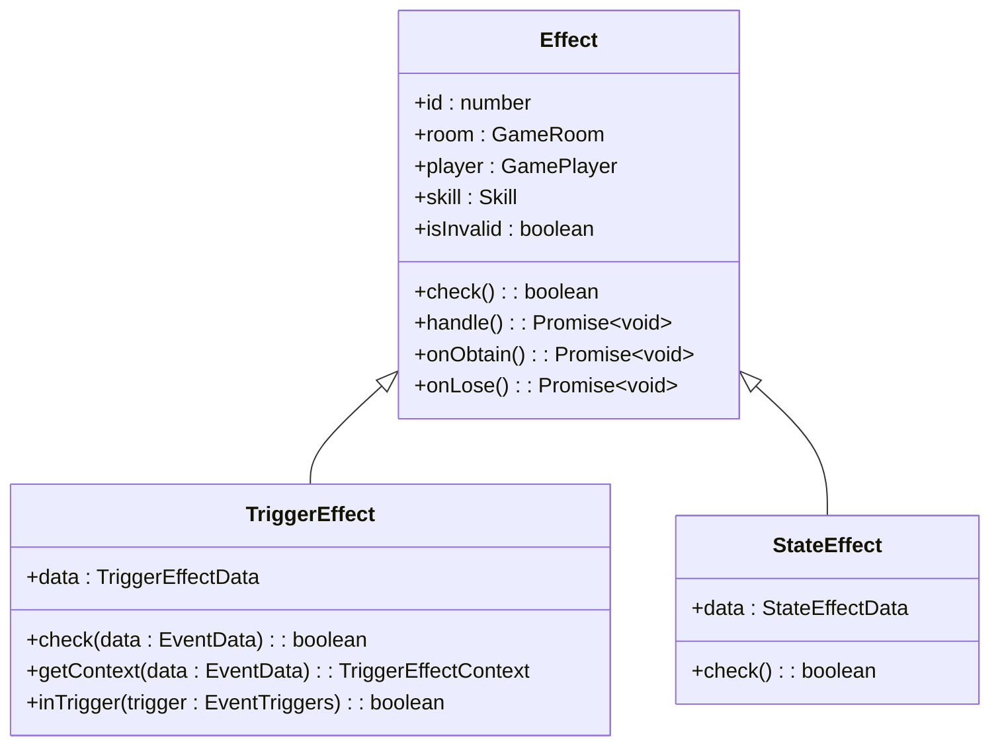
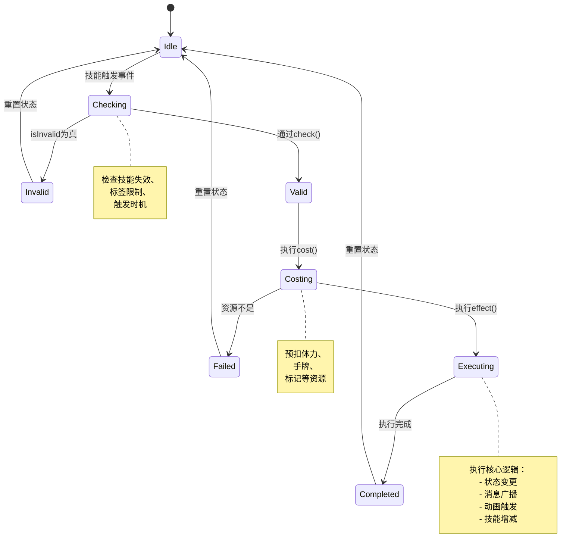

# 技能效果实现

<cite>
**本文档引用文件**  
- [effect.ts](file://server/src/core/skill/effect.ts)
- [shichangshi.ts](file://server/src/extensions/mxiuliqiankun/generals/shichangshi/shichangshi.ts)
- [shichangshi.ts](file://client/src/effects/shichangshi.ts)
</cite>

## 目录
1. [技能效果处理器设计](#技能效果处理器设计)  
2. [技能执行上下文机制](#技能执行上下文机制)  
3. '闭眼'技能实现示例：十常侍的“党锢”与“殁亡”  
4. [状态管理与生命周期](#状态管理与生命周期)  
5. [资源消耗与执行验证](#资源消耗与执行验证)  
6. [技能生命周期状态图](#技能生命周期状态图)

## 技能效果处理器设计

技能效果处理器是resgsv1系统中技能逻辑执行的核心组件，定义在`effect.ts`文件中。该处理器采用抽象类`Effect`作为基类，派生出`TriggerEffect`（触发型效果）和`StateEffect`（状态型效果）两种具体实现，分别处理事件驱动和持续状态类技能。

### 同步与异步效果处理

技能效果支持同步与异步混合处理模式。同步逻辑在`check`方法中完成条件判断，而异步操作通过`async effect`方法实现。例如，在技能发动前进行条件校验（同步），发动后执行卡牌抽取、角色变更等耗时操作（异步）。



**图示来源**  
- [effect.ts](file://server/src/core/skill/effect.ts#L1-L465)

**本节来源**  
- [effect.ts](file://server/src/core/skill/effect.ts#L1-L465)

## 技能执行上下文机制

技能执行上下文（`SkillContext`）封装了技能发动所需的全部环境信息，确保技能逻辑的独立性和可复用性。上下文对象通过`getContext`方法生成，包含以下关键字段：

- **from**: 技能发动者
- **maxTimes**: 技能可触发最大次数
- **head_general**: 主将ID（用于双将模式）
- **generals**: 可选副将列表
- **req_result**: 玩家选择结果

上下文数据在技能选择阶段由`get_selectors`动态生成，并通过`doRequest`方法提交至客户端进行交互选择。

```typescript
// 上下文生成示例
getContext(room, player, data) {
    return {
        from: player,
        maxTimes: 1,
        head_general: generals[0].id,
        generals: room.getGeneralIds(generals.slice(1, 5))
    };
}
```

**本节来源**  
- [shichangshi.ts](file://server/src/extensions/mxiuliqiankun/generals/shichangshi/shichangshi.ts#L50-L65)

## '闭眼'技能实现示例：十常侍的“党锢”与“殁亡”

十常侍的“党锢”与“殁亡”技能完整展示了技能效果从发动到完成的全过程，包含状态变更、消息广播和动画触发。

### “党锢”技能实现

“党锢”技能在游戏开始时自动触发，为玩家分配8名常侍武将，并允许其选择主副将组合。

```typescript
// 技能触发条件
can_trigger(room, player, data) {
    return this.isOwner(player) && !room.getData('danggu');
}

// 执行逻辑
async effect(room, data, context) {
    const { from } = context;
    room.setData('danggu', true);
    // 显示选择界面
    const req = await room.doRequest({
        player: from,
        get_selectors: {
            selectorId: this.getSelectorName('jiedang'),
            context
        }
    });
    const general = room.getResult(req, 'general').result[0];
    if (general) {
        // 变更主副将
        await room.change({
            player: from,
            general: 'head',
            to_general: head,
            reason: this.name
        });
        // 重新获得技能
        await room.addSkill('shichangshi.mowang', from);
    }
}
```

### “殁亡”技能实现

“殁亡”技能在玩家濒死时触发，播放动画并重置为单将模式。

```typescript
// 濒死触发
can_trigger(room, player, data: DieEvent) {
    return this.isOwner(player) && data.player === player && !data.data.mowang;
}

async effect(room, data, context) {
    const { from } = context;
    // 播放动画
    const uses = room.getGeneralIds(from.getData('changshi_uses') ?? []);
    const news = room.getGeneralIds([from.head, from.deputy]);
    room.broadcast({
        type: 'MsgPlayGlobalAni',
        ani: 'shichangshi_skill',
        data: { uses, news }
    });
    await room.delay(3.5);
    // 重置为十常侍
    await room.change({
        player: from,
        general: 'head',
        to_general: shichangshi,
        reason: this.name
    });
}
```

**本节来源**  
- [shichangshi.ts](file://server/src/extensions/mxiuliqiankun/generals/shichangshi/shichangshi.ts#L1-L338)

## 状态管理与生命周期

技能状态通过`_invalids`数组和`setInvalids`方法进行管理，支持多原因失效机制。技能生命周期由`lifecycle`字段定义，包含`onObtain`（获得时）、`onLose`（失去时）等钩子。

```typescript
// 技能失效检测
get isInvalid() {
    return this._invalids.length > 0 || 
           this.room.getStates(StateEffectType.Skill_Invalidity, [this]).some(v => v);
}

// 生命周期处理
onObtain() {
    this.data.mark.forEach(v => {
        this.player.setMark(v, true, { visible: true });
    });
}

onLose() {
    this.data.mark.forEach(v => {
        this.player.removeMark(v);
    });
}
```

**本节来源**  
- [effect.ts](file://server/src/core/skill/effect.ts#L40-L150)

## 资源消耗与执行验证

技能执行前需通过多重验证机制，确保合法性：

1. **技能状态验证**：检查`isInvalid`属性
2. **标签限制**：主将技、副将技、限定技等
3. **资源消耗**：通过`cost`方法预扣资源
4. **冷却时间**：通过标记`@limit:${skillId}`管理

```typescript
// 限定技管理
get isLimit() {
    return this.data.tag?.includes(SkillTag.Limit);
}

// 冷却标记设置
if (this.isLimit && this.player) {
    this.player.setMark(`@limit:${this.id}`, '@limit-true', { visible: false });
}
```

**本节来源**  
- [effect.ts](file://server/src/core/skill/effect.ts#L152-L180)

## 技能生命周期状态图



**图示来源**  
- [effect.ts](file://server/src/core/skill/effect.ts#L1-L465)
- [shichangshi.ts](file://server/src/extensions/mxiuliqiankun/generals/shichangshi/shichangshi.ts#L1-L338)

**本节来源**  
- [effect.ts](file://server/src/core/skill/effect.ts#L1-L465)
- [shichangshi.ts](file://server/src/extensions/mxiuliqiankun/generals/shichangshi/shichangshi.ts#L1-L338)