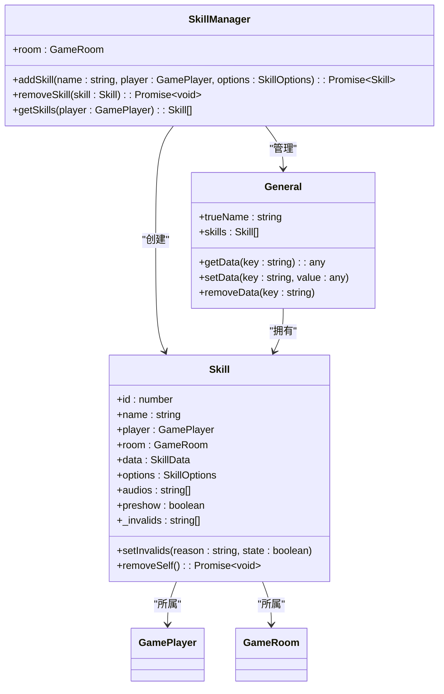

# 技能注册与管理

<cite>
**本文档引用文件**  
- [skill.ts](file://server/src/core/skill/skill.ts#L41-L90)
- [lang_mobile.ts](file://server/src/extensions/lang/lang_mobile.ts#L75-L101)
- [shichangshi.ts](file://server/src/extensions/mxiuliqiankun/generals/shichangshi/bilan.ts)
- [sgs.ts](file://server/src/core/sgs.ts#L967-L989)
- [RoomGameComp.ts](file://client/src/comps/room/RoomGameComp.ts#L793-L828)
- [UIAboutGeneral.ts](file://client/src/ui/UIAboutGeneral.ts#L106-L135)
- [room.types.ts](file://server/src/core/room/room.types.ts#L159-L182)
</cite>

## 目录
1. [技能系统概述](#技能系统概述)
2. [技能元数据结构定义](#技能元数据结构定义)
3. [技能注册机制](#技能注册机制)
4. [技能版本控制与异常处理](#技能版本控制与异常处理)
5. [技能管理类关系图](#技能管理类关系图)
6. [客户端技能展示逻辑](#客户端技能展示逻辑)

## 技能系统概述

本系统实现了完整的技能注册、管理与运行机制，支持主动、被动及触发式技能类型。技能系统通过服务端与客户端协同工作，确保技能数据的一致性与实时同步。核心功能包括技能定义、注册、状态管理、音频播放和UI展示。

**Section sources**
- [skill.ts](file://server/src/core/skill/skill.ts#L41-L90)
- [sgs.ts](file://server/src/core/sgs.ts#L967-L989)

## 技能元数据结构定义

技能元数据包含以下关键属性：

```json
{
  "name": "技能名称",
  "desc": "简要描述",
  "desc2": "详细描述",
  "audios": [
    {
      "url": "音频资源路径",
      "lang": "语音文本"
    }
  ],
  "type": "技能类型（主动/被动/触发）",
  "limit": "使用次数限制"
}
```

在代码中，`Skill` 类定义了技能的核心结构：

```typescript
class Skill {
    public readonly id: number;
    public readonly room: GameRoom;
    public readonly player: GamePlayer | undefined;
    public readonly data: SkillData;
    public readonly options: SkillOptions;
    public readonly audios: string[] = [];
    public preshow: boolean = true;
    private _invalids: string[] = [];
}
```

**Section sources**
- [skill.ts](file://server/src/core/skill/skill.ts#L41-L90)

## 技能注册机制

### 技能注册流程

技能注册通过 `room.addSkill()` 方法完成，具体流程如下：

1. 创建技能实例并分配唯一ID
2. 初始化技能音频资源
3. 将技能添加到房间的技能列表
4. 更新玩家技能数据

```typescript
const skill = await room.addSkill(skill_name, from, {
    source: this.name,
    showui: 'default',
});

if (skill) {
    const skills = this.getData<Skill[]>(`${this.name}.skills`) ?? [];
    skills.push(skill);
    this.setData(`${this.name}.skills`, skills);
}
```

### 实际注册示例：'庀材'技能

以史苌氏武将的'庀材'技能为例，其注册配置如下：

```typescript
sgs.GeneralSetting('cs_bilan', {
    title: '',
    rs: '',
    image_url: 'generals/shichangshi/bilan',
    death_audio: '无',
    skills: {
        ['cs_bilan.picai']: {
            name: '庀材',
            desc: '出牌阶段限一次，你可以进行判定，若判定结果与以此法进行判定的判定结果花色均不同，你可以重复此流程。然后你可以将所有生效的判定牌交给一名角色。',
            desc2: '出牌阶段限一次，你可判定▶若结果与你于此阶段内因执行此技能的消耗和效果而进行的判定的结果的花色均不同或你于此阶段内未因执行此技能的消耗或效果而判定过，你可重复此流程。你将所有的判定牌交给一名角色。\n◆此流程即“你判定。若结果与你于此阶段内因执行此技能的消耗和效果而进行的判定的结果的花色均不同，你可重复此流程”。在此流程中的判定流程结束之前，不会插入默认的系统将此判定牌置入弃牌堆的移动事件。',
            audios: [
                {
                    url: 'generals/shichangshi/picai1',
                    lang: '修得广厦千万，可庇汉室不倾！',
                },
            ],
        },
    },
});
```

该技能在游戏初始化时被自动注册，并通过 `sgs.loadTranslation()` 方法加载多语言支持。

**Section sources**
- [lang_mobile.ts](file://server/src/extensions/lang/lang_mobile.ts#L75-L101)
- [skill.ts](file://server/src/core/skill/skill.ts#L41-L90)

## 技能版本控制与异常处理

### 版本控制机制

系统通过技能ID的命名空间实现版本控制，格式为 `package.skill_name`。例如：
- `mobile.shichangshi.danggu`
- `cs_bilan.picai`

这种命名方式避免了不同扩展包之间的技能命名冲突。

### 重复检测机制

在注册新技能前，系统会检查是否存在同名技能：

```typescript
const existingSkill = room.skills.find(s => s.name === skill_name && s.player === target);
if (existingSkill) {
    await existingSkill.removeSelf();
}
```

### 异常处理

技能系统实现了完善的异常处理机制：

1. **生命周期管理**：在回合开始和失败时自动清理技能
2. **状态失效管理**：通过 `_invalids` 数组记录技能失效原因
3. **资源释放**：确保技能移除时正确释放相关资源

```typescript
lifecycle: [
    {
        trigger: EventTriggers.TurnStart,
        priority: 'before',
        async on_exec(room, data: TurnEvent) {
            if (data.player === this.player) {
                const skills = this.getData<Skill[]>(`${this.name}.skills`) ?? [];
                for (const skill of skills) {
                    await skill.removeSelf();
                }
                this.removeData(`${this.name}.skill`);
            }
        },
    },
    {
        trigger: EventTriggers.onLose,
        priority: 'after',
        async on_exec(room, data) {
            const skills = this.getData<Skill[]>(`${this.name}.skills`) ?? [];
            for (const skill of skills) {
                await skill.removeSelf();
            }
            this.removeData(`${this.name}.skill`);
        },
    },
]
```

**Section sources**
- [skill.ts](file://server/src/core/skill/skill.ts#L41-L90)
- [room.types.ts](file://server/src/core/room/room.types.ts#L159-L182)

## 技能管理类关系图



**Diagram sources**
- [skill.ts](file://server/src/core/skill/skill.ts#L41-L90)
- [room.types.ts](file://server/src/core/room/room.types.ts#L159-L182)

## 客户端技能展示逻辑

### 技能信息获取

客户端通过 `getSkills` 方法获取角色技能列表：

```typescript
const skillsAreas = [
    this.owner.selfseat.general_head.skills,
    this.owner.selfseat.general_deputy.skills,
] as const;

skillsAreas.forEach((area) => {
    const buttons = Array.from(area.children)
        .filter((child): child is UISkillButton => 
            child instanceof UISkillButton && child.visible
        );
        
    buttons.forEach((button) => {
        button.set(button.skill, 1);
    });
});
```

### UI展示处理

技能在UI上的展示逻辑如下：

```typescript
ui.skill.title.text = skill_name;
if (this.translation_type === 1) {
    ui.skill_t.text = sgs.getTranslation(`@desc:${name}`);
} else {
    ui.skill_t.text = sgs.getTranslation(`@desc2:${name}`);
}

// 处理概念链接
const reg = new RegExp(`${Object.keys(sgs.concept[sgs.lang]).join('|')}`, 'g');
ui.skill_t.text = ui.skill_t.text.replaceAll(reg, (match) => {
    return `<a href="${match}"><b>${match}</b></a>`;
});

// 添加音频按钮
const audio = sgs.skillAssets[name]?.audios ?? [];
audio?.forEach((a, i) => {
    const key = `@audio${i}:${name}`;
    const btn = UISkillAudio.create(
        `${skill_name + i}\n${sgs.getTranslation(key)}`
    );
    ui.list.addChild(btn);
});
```

**Section sources**
- [RoomGameComp.ts](file://client/src/comps/room/RoomGameComp.ts#L793-L828)
- [UIAboutGeneral.ts](file://client/src/ui/UIAboutGeneral.ts#L106-L135)