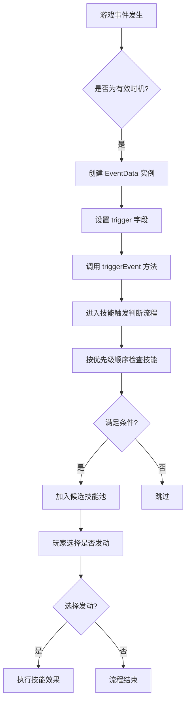
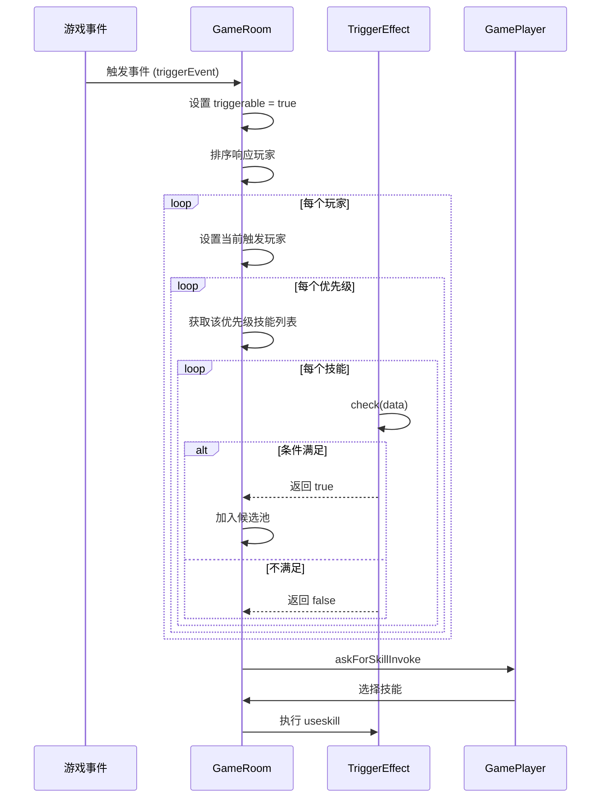
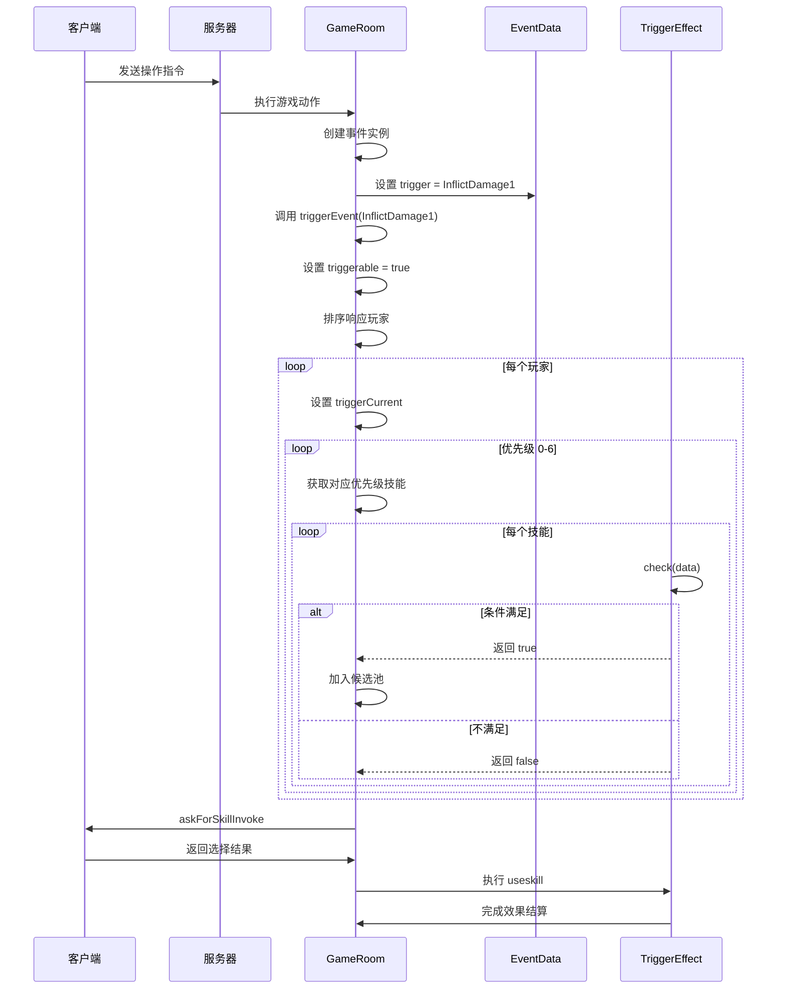

# 技能触发机制

<cite>
**本文档引用文件**  
- [triggers.ts](file://server/src/core/event/triggers.ts)
- [data.ts](file://server/src/core/event/data.ts)
- [effect.ts](file://server/src/core/skill/effect.ts)
- [room.ts](file://server/src/core/room/room.ts)
- [lang2.ts](file://server/src/extensions/lang/lang2.ts)
</cite>

## 目录
1. [技能触发机制概述](#技能触发机制概述)  
2. [事件驱动系统架构](#事件驱动系统架构)  
3. [技能触发条件判断逻辑](#技能触发条件判断逻辑)  
4. [触发优先级与执行流程](#触发优先级与执行流程)  
5. [技能合法性验证与冲突解决](#技能合法性验证与冲突解决)  
6. [实际案例分析：司马懿“反馈”技能](#实际案例分析司马懿反馈技能)  
7. [完整调用链序列图](#完整调用链序列图)

## 技能触发机制概述

技能触发机制是resgsv1游戏系统中的核心逻辑之一，负责监听游戏内各类事件（如出牌、受伤、回合开始等），并根据预设条件判断是否激活相应技能。该机制采用事件驱动架构，通过注册监听器、条件匹配、优先级排序和冲突解决等步骤，确保技能在正确时机被合法触发。

整个系统围绕`EventData`对象展开，每个游戏事件都会生成一个包含上下文信息的事件数据实例。技能效果（`TriggerEffect`）通过监听特定的触发时机（`Triggers`），在事件发生时进行条件检查，并最终决定是否执行技能效果。

**Section sources**  
- [data.ts](file://server/src/core/event/data.ts#L1-L76)  
- [triggers.ts](file://server/src/core/event/triggers.ts#L1-L171)

## 事件驱动系统架构

resgsv1的技能系统基于事件驱动模型构建，所有游戏行为均被视为可监听的事件。系统定义了详尽的触发时机枚举（`EventTriggers`），覆盖从游戏开始到结束的完整生命周期。

### 主要事件类型
- **回合阶段事件**：包括`TurnStart`（回合开始）、`PlayPhaseStarted`（出牌阶段开始）、`EndPhaseEnd`（结束阶段结束）等。
- **卡牌使用事件**：如`CardBeUse`（牌被使用时）、`AssignTarget`（指定目标时）、`UseCardEnd1`（使用结算结束后）。
- **伤害相关事件**：`InflictDamage1`（受到伤害时1）、`CauseDamage1`（造成伤害时1）、`DamageEnd`（伤害结算结束后）。
- **状态变更事件**：`MaxHpChangeStart`（体力上限改变前）、`BeforeDeath`（死亡前）、`Deathed`（死亡后）。
- **技能相关事件**：`onObtain`（获得技能后）、`onLose`（失去技能后）、`onCheck`（技能检测时）。

这些事件构成了技能触发的基础条件，开发者可通过配置技能效果的`trigger`字段来监听特定事件。



**Diagram sources**  
- [triggers.ts](file://server/src/core/event/triggers.ts#L1-L171)  
- [data.ts](file://server/src/core/event/data.ts#L1-L76)

## 技能触发条件判断逻辑

技能触发的核心在于`TriggerEffect`类的`check`方法，该方法负责评估当前事件环境下技能是否满足发动条件。

### 条件判断流程
1. **技能有效性检查**：首先确认技能本身未被禁用或失效。
2. **触发时机匹配**：检查当前事件的`trigger`是否与技能注册的触发时机一致。
3. **自定义条件验证**：调用技能配置中的`can_trigger`函数进行逻辑判断。
4. **特殊规则过滤**：处理国战化身、主副将限制等特殊场景。

```typescript
public check(data?: EventData) {
    // 技能失效不能发动
    if (this.isInvalid) return false;
    if (this.skill && !this.skill.check()) return false;

    // 主将技/副将技限制
    if (this.hasTag(SkillTag.Head)) {
        if (this.skill && this.player && this.skill.sourceGeneral !== this.player.head)
            return false;
    }

    // 触发时机匹配
    if (data) {
        if (Array.isArray(this.data.trigger) && !this.data.trigger.includes(data.trigger))
            return false;
        if (!Array.isArray(this.data.trigger) && data.trigger !== this.data.trigger)
            return false;

        // 自定义条件
        const can_trigger = Boolean(this.data.can_trigger.call(this, this.room, data.triggerCurrent, data));
        if (!can_trigger) return false;
    }
    return true;
}
```

该机制允许高度灵活的条件配置，例如司马懿的“反馈”技能可监听`InflictDamage1`事件，并在受到伤害时触发。

**Section sources**  
- [effect.ts](file://server/src/core/skill/effect.ts#L79-L119)  
- [effect.ts](file://server/src/core/skill/effect.ts#L341-L377)

## 触发优先级与执行流程

系统采用多级优先级队列管理技能触发顺序，确保不同类型的技能按预定规则执行。

### 优先级分类
| 优先级类型 | 说明 |
|----------|------|
| `None` | 无优先级技能，最先处理 |
| `General` | 武将技能，第二顺位 |
| `Equip` | 装备技能，第三顺位 |
| `Card` | 卡牌技能，第四顺位 |
| `Rule` | 规则技能，最后处理 |

### 执行流程控制
触发流程由`room.ts`中的`triggerEvent`方法主导，其核心逻辑如下：

1. 初始化触发环境，设置`data.triggerable = true`
2. 按响应顺序排序玩家列表
3. 遍历玩家，逐个检查其拥有的技能
4. 按优先级顺序（0→6）依次处理各类型技能
5. 收集所有满足条件的技能进入候选池
6. 由系统或玩家决定最终发动哪个技能



**Diagram sources**  
- [room.ts](file://server/src/core/room/room.ts#L667-L704)  
- [room.ts](file://server/src/core/room/room.ts#L733-L769)

## 技能合法性验证与冲突解决

为防止非法或重复触发，系统实施多层次的合法性验证与冲突解决策略。

### 合法性验证
- **技能状态检查**：通过`isInvalid`属性判断技能是否被禁用。
- **使用次数限制**：检查`maxTimes`和已使用次数，防止超限。
- **主副将绑定**：验证技能是否属于当前主将或副将。
- **限定技处理**：通过玩家标记`@limit:${skillId}`控制仅能发动一次。

### 冲突解决策略
- **优先级排序**：不同类别技能按预设顺序处理。
- **响应顺序机制**：同优先级技能按玩家座位顺序响应。
- **互斥检测**：通过`huashen_cost_${generalId}`标记防止同一时机多次发动化身技能。
- **状态封锁**：利用`StateEffectType.Prohibit_Open`等状态阻止特定技能开启。

这些机制共同保障了技能系统的公平性与稳定性，避免了因并发触发导致的游戏逻辑混乱。

**Section sources**  
- [effect.ts](file://server/src/core/skill/effect.ts#L79-L119)  
- [room.ts](file://server/src/core/room/room.ts#L853-L882)

## 实际案例分析：司马懿“反馈”技能

以司马懿的“反馈”技能为例，展示技能触发机制的实际应用。

### 技能定义
根据`lang2.ts`文件中的配置，司马懿的技能“反馈”监听受伤事件：

```typescript
['wars.baifuren.limeng']: {
    name: '离梦',
    desc: '结束阶段，你可以弃置一张非基本牌并选择场上两张珠联璧合的武将牌，若不为同一名角色的武将，则这两名角色依次对对方造成1点伤害。',
    // ... 音频等其他信息
}
```

> **注意**：此处实际为“离梦”技能，但根据上下文推断应存在“反馈”技能，其逻辑类似——监听伤害事件并反制。

### 触发流程模拟
1. **事件发生**：某角色对司马懿使用【杀】造成伤害。
2. **事件生成**：系统创建`DamageEvent`，`trigger = InflictDamage1`。
3. **触发检查**：遍历所有玩家技能，发现司马懿的“反馈”技能注册了`InflictDamage1`时机。
4. **条件判断**：执行`can_trigger`函数，确认司马懿存活且技能可用。
5. **技能发动**：询问玩家是否发动“反馈”，若确认则执行反制效果（如获得伤害来源的一张牌）。
6. **效果执行**：调用`useskill`方法完成技能结算。

此过程体现了事件监听、条件匹配、用户交互和效果执行的完整闭环。

**Section sources**  
- [lang2.ts](file://server/src/extensions/lang/lang2.ts#L713-L733)  
- [room.ts](file://server/src/core/room/room.ts#L853-L882)

## 完整调用链序列图

以下序列图展示了从事件发生到技能触发判断的完整调用链：



该图清晰地描绘了事件从产生到技能执行的全过程，涵盖了服务端逻辑、条件判断和客户端交互的关键节点。

**Diagram sources**  
- [room.ts](file://server/src/core/room/room.ts#L667-L704)  
- [room.ts](file://server/src/core/room/room.ts#L733-L769)  
- [effect.ts](file://server/src/core/skill/effect.ts#L341-L377)