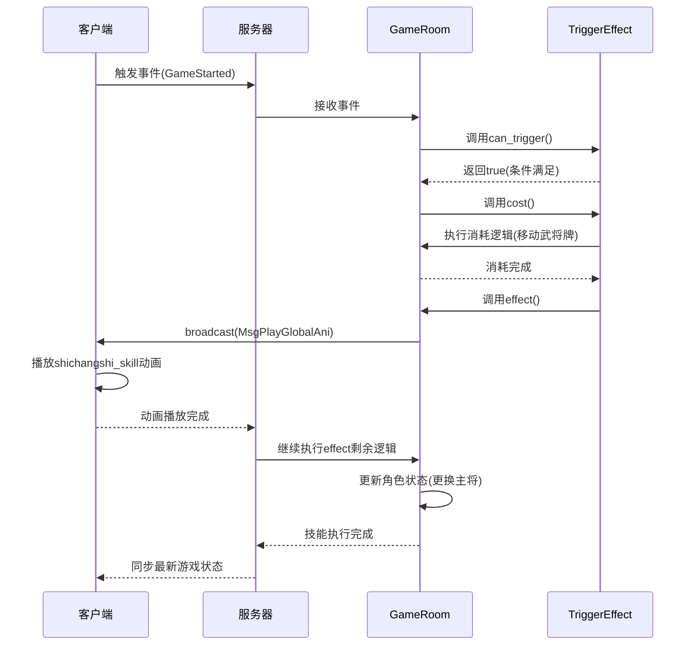

# 角色技能系统

<cite>
**本文档引用文件**   
- [shichangshi.ts](file://client/src/effects/shichangshi.ts)
- [shichangshi.ts](file://server/src/extensions/mxiuliqiankun/generals/shichangshi/shichangshi.ts)
- [general.ts](file://server/src/core/general/general.ts)
- [general.type.ts](file://server/src/core/general/general.type.ts)
</cite>

## 目录
1. [角色技能系统概述](#角色技能系统概述)
2. [角色与技能关联机制](#角色与技能关联机制)
3. [技能类型定义](#技能类型定义)
4. [技能注册与绑定](#技能注册与绑定)
5. [技能触发条件与执行顺序](#技能触发条件与执行顺序)
6. ['bilan'技能实现示例](#bilan技能实现示例)
7. [技能冷却、消耗与权限控制](#技能冷却消耗与权限控制)
8. [技能执行序列图](#技能执行序列图)

## 角色技能系统概述

角色技能系统是resgsv1项目中的核心机制之一，负责管理游戏中角色（武将）与其技能之间的关联和交互。该系统实现了主动技能、被动技能和触发式技能的完整生命周期管理，包括技能注册、绑定、触发判断、执行流程以及相关的动画效果展示。

系统主要由客户端和服务器端两部分组成：客户端负责技能动画的播放和用户界面的交互，而服务器端则负责技能逻辑的判定、执行和状态管理。通过这种前后端分离的架构设计，确保了游戏逻辑的准确性和用户体验的流畅性。

**Section sources**
- [shichangshi.ts](file://server/src/extensions/mxiuliqiankun/generals/shichangshi/shichangshi.ts#L1-L337)
- [general.ts](file://server/src/core/general/general.ts#L1-L195)

## 角色与技能关联机制

在resgsv1系统中，角色与技能的关联是通过`General`类和`Skill`对象共同实现的。每个角色（武将）在创建时会根据其定义的数据初始化包含的技能列表，并通过特定的方法将这些技能与角色实例进行绑定。

### 角色数据结构

`General`类定义了角色的基本属性和行为，其构造函数接收`GameRoom`实例和`GeneralData`数据对象作为参数。`GeneralData`接口包含了角色的所有基本信息，包括ID、名称、势力、体力值、性别、技能列表等。

```typescript
export interface GeneralData {
    id: GeneralId;
    name: string;
    kingdom: GeneralKingdom;
    hp: GeneralHp;
    gender: Gender;
    skills: string[];
    lord: boolean;
    enable: boolean;
    hidden: boolean;
    package: string[];
    isDualImage: boolean;
    isWars: boolean;
}
```

当创建一个新角色时，系统会从`GeneralData`中提取`skills`数组，将其复制到角色的`sourceData`中，从而建立初始的技能关联关系。

### 技能关联实现

技能的关联不仅限于初始化阶段，还可以在游戏过程中动态添加或移除。例如，在`shichangshi`角色的`danggu`技能效果中，可以看到通过`room.addSkill()`方法为角色重新获得技能：

```typescript
await room.addSkill('shichangshi.danggu', from, {
    source: 'danggu',
    showui: 'default',
});
```

这种动态关联机制使得角色的能力可以根据游戏进程发生变化，增加了策略深度和玩法多样性。

**Section sources**
- [general.ts](file://server/src/core/general/general.ts#L1-L195)
- [general.type.ts](file://server/src/core/general/general.type.ts#L1-L52)

## 技能类型定义

resgsv1系统中的技能分为三种主要类型：主动技能、被动技能和触发式技能。每种类型都有其独特的定义方式和执行特性。

### 主动技能

主动技能需要玩家手动触发，通常通过点击技能按钮来激活。这类技能在代码中表现为可调用的方法或命令，需要满足一定的使用条件（如能量值、冷却时间等）才能执行。

### 被动技能

被动技能是自动生效的，不需要玩家主动触发。它们通常改变角色的基础属性或提供持续性的效果。在系统中，被动技能往往在角色创建或状态改变时自动应用。

### 触发式技能

触发式技能是最复杂的类型，它们在特定的游戏事件发生时自动激活。系统通过事件监听机制来实现这类技能，具体定义在`TriggerEffect`中。以`shichangshi`角色的技能为例：

```typescript
export const danggu = sgs.Skill({
    name: 'shichangshi.danggu',
});

danggu.addEffect(
    sgs.TriggerEffect({
        trigger: EventTriggers.GameStarted,
        can_trigger(room, player, data) {
            return this.isOwner(player) && !room.getData('danggu');
        },
        // ... 其他配置
    })
);
```

这里的`trigger`字段指定了技能触发的事件类型（如`GameStarted`），而`can_trigger`函数则定义了触发条件。只有当所有条件都满足时，技能才会被执行。

**Section sources**
- [shichangshi.ts](file://server/src/extensions/mxiuliqiankun/generals/shichangshi/shichangshi.ts#L1-L337)

## 技能注册与绑定

技能的注册与绑定是角色技能系统的核心流程，确保了技能能够正确地与角色关联并在适当的时机执行。

### 技能注册

技能首先需要通过`sgs.Skill()`工厂函数进行注册，创建一个技能对象。这个过程定义了技能的基本属性，如名称、描述等。例如：

```typescript
export const danggu = sgs.Skill({
    name: 'shichangshi.danggu',
});
```

注册后的技能可以添加一个或多个效果（Effect），每个效果对应不同的触发条件和执行逻辑。

### 技能绑定

技能绑定发生在角色创建或状态变化时。系统通过`General`类的`addSkill`方法将技能与角色关联：

```typescript
shichangshi.addSkill(danggu);
shichangshi.addSkill(mowang);
```

这行代码将`danggu`和`mowang`两个技能添加到`shichangshi`角色中。绑定后，这些技能就成为了角色能力的一部分，可以在满足条件时被触发。

### getSkills方法实现

虽然在提供的代码片段中没有直接看到`getSkills`方法的实现，但从`General`类的设计可以看出，技能列表是通过`sourceData.skills`属性存储的。获取角色技能的方法本质上就是访问这个属性：

```typescript
public get skills() {
    return this.sourceData.skills;
}
```

这个只读属性返回角色当前拥有的所有技能名称数组，供其他系统组件查询使用。

**Section sources**
- [shichangshi.ts](file://server/src/extensions/mxiuliqiankun/generals/shichangshi/shichangshi.ts#L1-L337)
- [general.ts](file://server/src/core/general/general.ts#L1-L195)

## 技能触发条件与执行顺序

技能的触发条件和执行顺序是决定游戏平衡性和策略性的关键因素。系统通过精确的条件判断和有序的执行流程来保证技能行为的可预测性。

### 触发条件判断

每个触发式技能都有一个`can_trigger`函数，用于判断当前是否满足触发条件。这个函数接收三个参数：`room`（游戏房间）、`player`（目标玩家）和`data`（事件数据）。以`danggu`技能为例：

```typescript
can_trigger(room, player, data) {
    return this.isOwner(player) && !room.getData('danggu');
}
```

这个条件表示：只有当技能拥有者是当前玩家，并且房间中没有设置`danggu`标记时，技能才能触发。类似的，`mowang`技能的触发条件还包括检查玩家是否有标记为"常侍"的副将：

```typescript
player.upArea.generals.filter((v) => v.hasMark('mark.changshi')).length > 0
```

### 执行顺序

技能的执行遵循严格的顺序：
1. **条件检查**：首先调用`can_trigger`函数验证触发条件
2. **消耗处理**：如果条件满足，则执行`cost`函数处理技能消耗（如扣减体力、弃牌等）
3. **效果执行**：最后调用`effect`函数执行技能的主要效果

这种分阶段的执行模式确保了技能逻辑的清晰和可维护性。例如，在`danggu`技能的`cost`阶段，系统会从仓库区移除特定武将牌并添加到玩家区域；而在`effect`阶段，则会处理双将组合的选择和设置。

**Section sources**
- [shichangshi.ts](file://server/src/extensions/mxiuliqiankun/generals/shichangshi/shichangshi.ts#L1-L337)

## 'bilan'技能实现示例

以`shichangshi`角色的`bilan`技能为例，展示从客户端动画到服务器端逻辑的完整实现过程。

### 客户端动画实现

在客户端`shichangshi.ts`文件中，定义了技能动画的播放逻辑：

```typescript
const characters: { [key: string]: string } = {
    'mobile.cs_bilan': 'scs_effect_4',
    // ... 其他角色映射
};

@regClass()
export class shichangshi extends shichangshiBase {
    play(data: any = {}) {
        const uses = data.uses as string[];
        const news = data.news as string[];
        const comp = this.shichangshi_bagua.getComponent(Laya.Spine2DRenderNode);
        comp.play('play1', false, true);
        
        // 500ms后播放已用和新增角色动画
        this.timerOnce(500, this, () => {
            uses.forEach((v) => {
                const node = (this as any)[characters[v]] as Laya.Sprite;
                node.visible = true;
                const ani = node.getComponent(Laya.Spine2DRenderNode);
                ani.play('play2', true, true);
            });
            news.forEach((v) => {
                const node = (this as any)[characters[v]] as Laya.Sprite;
                node.visible = true;
                const ani = node.getComponent(Laya.Spine2DRenderNode);
                ani.play('play1', true, true);
            });
        });
        
        // 3000ms后播放结束动画
        this.timerOnce(3000, this, () => {
            comp.play('play3', false, true);
        });

        // 3500ms后移除自身
        this.timerOnce(3500, this, () => {
            this.removeSelf();
        });
    }
}
```

这段代码实现了技能动画的分阶段播放：
- 首先播放八卦阵的启动动画（play1）
- 500毫秒后，分别播放已使用角色（uses）和新增角色（news）的动画
- 3000毫秒后播放结束动画（play3）
- 3500毫秒后移除动画组件

### 服务器端逻辑实现

在服务器端，`bilan`技能的效果是通过`mowang`技能的`effect`方法实现的：

```typescript
async effect(room, data, context) {
    const { from } = context;
    const uses = room.getGeneralIds(from.getData<General[]>('changshi_uses') ?? []);
    const news = room.getGeneralIds([from.head, from.deputy]);
    
    // 广播播放全局动画
    room.broadcast({
        type: 'MsgPlayGlobalAni',
        ani: 'shichangshi_skill',
        data: {
            uses,
            news,
        },
    });
    
    await room.delay(3.5);
    
    // 更新已使用角色列表
    const generals = from.getData<General[]>('changshi_uses') ?? [];
    generals.push(from.head, from.deputy);
    from.setData('changshi_uses', generals);
    
    // 切换回单将模式
    const shichangshi = room.generals.get('shichangshi');
    if (shichangshi) {
        // 移除当前技能
        const danggu = room.skills.find((v) => v.name === 'shichangshi.danggu' && v.player === from);
        if (danggu) await danggu.removeSelf();
        await this.skill.removeSelf();

        // 更换主将为十常侍
        await room.change({
            player: from,
            general: 'head',
            to_general: shichangshi,
            source: data,
            reason: this.name,
        });
        
        // 移除副将
        await room.remove({
            player: from,
            general: from.deputy,
            source: data,
            reason: this.name,
        });
        
        from.setProperty('general_mode', 'single');
    }
}
```

这个实现展示了完整的技能效果流程：
1. 收集已使用和新增的角色信息
2. 向所有客户端广播播放技能动画的消息
3. 延迟等待动画播放完成
4. 更新角色状态数据
5. 执行角色更换和模式切换

**Section sources**
- [shichangshi.ts](file://client/src/effects/shichangshi.ts#L1-L59)
- [shichangshi.ts](file://server/src/extensions/mxiuliqiankun/generals/shichangshi/shichangshi.ts#L1-L337)

## 技能冷却、消耗与权限控制

技能系统通过多种机制来控制技能的使用频率、资源消耗和访问权限，确保游戏的平衡性和策略性。

### 技能冷却

虽然在提供的代码中没有显式的冷却时间设置，但系统通过状态标记来实现类似冷却的效果。例如，`danggu`技能使用`room.getData('danggu')`来记录是否已经触发过，防止重复执行：

```typescript
!room.getData('danggu')
```

这种基于状态的控制方式比简单的时间冷却更灵活，可以根据游戏情境进行调整。

### 技能消耗

技能消耗在`cost`函数中定义，通常涉及资源的消耗或状态的改变。以`danggu`技能为例：

```typescript
async cost(room, data, context) {
    const { from } = context;
    const css = [
        'cs_zhangrang', 'cs_zhaozhong', 'cs_sunzhang', 'cs_bilan',
        'cs_xiayun', 'cs_hankui', 'cs_lisong', 'cs_duangui',
        'cs_guosheng', 'cs_gaowang'
    ];
    const generls = css.map((v) => room.granaryArea.generals.find((g) => g.name === v));
    room.granaryArea.remove(generls);
    from.upArea.add(generls);
    generls.forEach((v) => v.setMark('mark.changshi', true));
    from.setMark('mark.changshi', true, {
        source: 'mark.changshi',
        visible: true,
        type: 'generals',
    });
    return true;
}
```

这个消耗函数执行了以下操作：
- 从仓库区移除指定的十常侍武将牌
- 将这些武将牌添加到玩家区域
- 为这些武将牌和玩家设置"常侍"标记

### 权限控制

权限控制主要通过`isOwner`方法实现，确保只有技能拥有者才能触发技能：

```typescript
this.isOwner(player)
```

此外，系统还通过`setData`和`getData`方法来管理技能的状态，防止非法操作。例如，`mowang`技能在触发前会检查`data.data.mowang`标记，确保不会重复触发。

**Section sources**
- [shichangshi.ts](file://server/src/extensions/mxiuliqiankun/generals/shichangshi/shichangshi.ts#L1-L337)

## 技能执行序列图



**Diagram sources**
- [shichangshi.ts](file://server/src/extensions/mxiuliqiankun/generals/shichangshi/shichangshi.ts#L1-L337)
- [shichangshi.ts](file://client/src/effects/shichangshi.ts#L1-L59)

**Section sources**
- [shichangshi.ts](file://server/src/extensions/mxiuliqiankun/generals/shichangshi/shichangshi.ts#L1-L337)
- [shichangshi.ts](file://client/src/effects/shichangshi.ts#L1-L59)