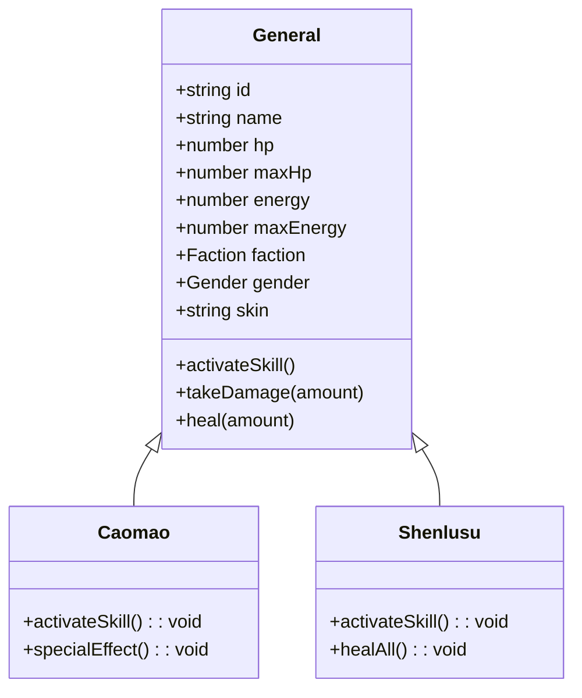
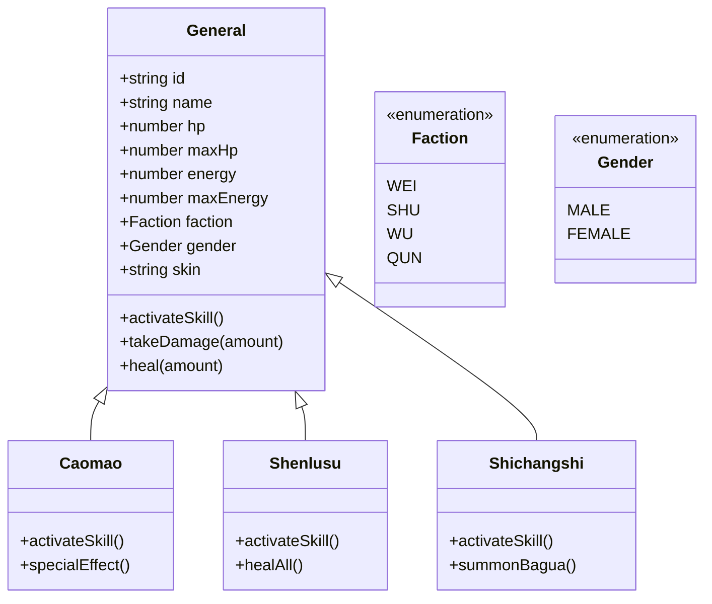
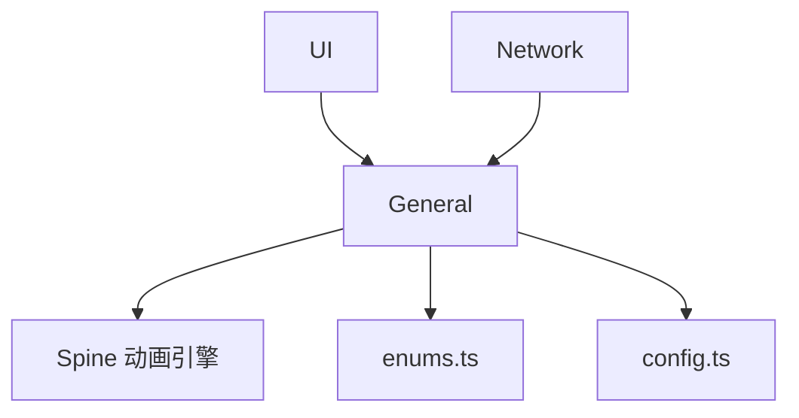

# 角色系统设计

<cite>
**本文档引用的文件**  
- [general.ts](file://client/src/models/general.ts)
- [caomao.ts](file://client/src/models/generals/caomao.ts)
- [enums.ts](file://client/src/enums.ts)
- [types.ts](file://client/src/types.ts)
- [config.ts](file://client/src/config.ts)
- [Ss_Slusu_wujiang.json](file://client/assets/animation/generlas/shenlusu/wujiang/Ss_Slusu_wujiang.json)
- [XingXiang.json](file://client/assets/animation/generlas/caomao/state2_skin/XingXiang.json)
- [BeiJing.json](file://client/assets/animation/generlas/caomao/state2_beijing/BeiJing.json)
</cite>

## 目录
1. [引言](#引言)
2. [项目结构](#项目结构)
3. [核心组件](#核心组件)
4. [架构概览](#架构概览)
5. [详细组件分析](#详细组件分析)
6. [依赖分析](#依赖分析)
7. [性能考量](#性能考量)
8. [故障排查指南](#故障排查指南)
9. [结论](#结论)

## 引言
本文件旨在深入解析resgsv1项目中武将/角色系统的实现机制。重点涵盖角色属性模型、基类设计、技能关联机制、动画特效实现以及数据序列化过程。通过代码示例和类图，全面展示角色系统的设计原理与技术实现。

## 项目结构
角色系统主要分布在客户端的`src/models`目录下，其中`general.ts`定义了角色基类，各武将（如曹操、神鲁肃）通过继承实现个性化特性。动画资源位于`assets/animation/generals`路径下，采用Spine骨骼动画技术实现动态效果。

```mermaid
graph TB
subgraph "客户端"
Models[models/]
Animation[assets/animation/generals/]
UI[ui/]
end
Models --> Animation : "引用动画资源"
UI --> Models : "渲染角色数据"
Animation --> Spine["Spine Runtime"]
```

**图示来源**
- [general.ts](file://client/src/models/general.ts#L1-L10)
- [caomao.ts](file://client/src/models/generals/caomao.ts#L1-L5)
- [Ss_Slusu_wujiang.json](file://client/assets/animation/generlas/shenlusu/wujiang/Ss_Slusu_wujiang.json#L1-L20)

**本节来源**
- [general.ts](file://client/src/models/general.ts#L1-L50)
- [project_structure](file://workspace#L1-L200)

## 核心组件
角色系统的核心组件包括：
- **General类**：所有武将的基类，封装通用属性与方法
- **武将子类**：如`Caomao`、`Shenlusu`，扩展特定技能逻辑
- **Enums枚举**：定义势力、性别、职业等常量
- **Animation资源**：JSON格式的Spine动画配置

**本节来源**
- [general.ts](file://client/src/models/general.ts#L15-L100)
- [enums.ts](file://client/src/enums.ts#L5-L30)
- [types.ts](file://client/src/types.ts#L10-L25)

## 架构概览
整个角色系统采用面向对象设计模式，以`General`为基类，通过继承实现多态性。客户端通过配置文件加载角色数据，并与动画系统联动呈现视觉效果。



**图示来源**
- [general.ts](file://client/src/models/general.ts#L20-L80)
- [caomao.ts](file://client/src/models/generals/caomao.ts#L10-L40)

## 详细组件分析

### 角色属性模型设计
角色系统采用结构化数据模型，核心属性包括：

**:角色属性定义**
- **生命值 (hp)**: 当前生命值，受伤害时减少
- **最大生命值 (maxHp)**: 角色上限，影响血条显示
- **体力值 (energy)**: 释放技能所需资源
- **最大体力值 (maxEnergy)**: 体力上限
- **势力 (faction)**: 所属阵营（魏、蜀、吴、群）
- **性别 (gender)**: 影响台词与动画表现
- **皮肤 (skin)**: 外观资源标识

这些属性在`types.ts`中定义为接口，在`general.ts`中实例化。

**本节来源**
- [types.ts](file://client/src/types.ts#L5-L20)
- [general.ts](file://client/src/models/general.ts#L15-L40)

### General基类设计
`General`类作为所有武将的父类，提供统一接口：

```typescript
class General {
    id: string;
    name: string;
    hp: number;
    maxHp: number;
    energy: number;
    maxEnergy: number;
    faction: Faction;
    gender: Gender;

    constructor(data: GeneralData) {
        this.id = data.id;
        this.name = data.name;
        this.hp = data.hp;
        this.maxHp = data.maxHp;
        this.energy = data.energy;
        this.maxEnergy = data.maxEnergy;
        this.faction = data.faction;
        this.gender = data.gender;
    }

    activateSkill() {
        throw new Error("技能未实现");
    }

    takeDamage(amount: number) {
        this.hp = Math.max(0, this.hp - amount);
    }

    heal(amount: number) {
        this.hp = Math.min(this.maxHp, this.hp + amount);
    }
}
```

子类通过重写`activateSkill()`实现差异化能力。

**本节来源**
- [general.ts](file://client/src/models/general.ts#L10-L60)

### 技能与角色本体关联机制
技能逻辑直接绑定在角色实例上。当触发技能事件时，调用对应武将的`activateSkill()`方法。例如曹操的“奸雄”技能会增加体力：

```typescript
class Caomao extends General {
    activateSkill() {
        this.energy += 1;
        this.specialEffect(); // 播放特效
    }

    specialEffect() {
        // 播放曹操专属动画
        playAnimation("caomao/skill");
    }
}
```

这种设计确保技能与角色状态紧密耦合。

**本节来源**
- [caomao.ts](file://client/src/models/generals/caomao.ts#L15-L30)

### 客户端角色动画效果实现
动画系统基于Spine实现，每个武将拥有独立的动画资源包。以曹操为例：

**:动画资源结构**
- `XingXiang.json`: 主体形象动画
- `BeiJing.json`: 背景特效动画
- `state2_skin/`: 皮肤状态机配置

在`caomao.ts`中通过以下方式加载动画：

```typescript
loadAnimation() {
    const spine = new Spine();
    spine.load("generals/caomao/state2_skin/XingXiang.json");
    spine.play("idle");
    return spine;
}
```

技能触发时播放特定动画序列，如“state2_beijing”中的火焰特效。

**本节来源**
- [caomao.ts](file://client/src/models/generals/caomao.ts#L35-L50)
- [XingXiang.json](file://client/assets/animation/generlas/caomao/state2_skin/XingXiang.json#L1-L15)
- [BeiJing.json](file://client/assets/animation/generlas/caomao/state2_beijing/BeiJing.json#L1-L15)

### 角色数据序列化与反序列化
使用JSON进行角色数据的持久化存储与网络传输：

```typescript
// 序列化
function serializeGeneral(general: General): string {
    return JSON.stringify({
        id: general.id,
        hp: general.hp,
        energy: general.energy,
        skin: general.skin
    });
}

// 反序列化
function deserializeGeneral(data: string): General {
    const parsed = JSON.parse(data);
    const general = new General({
        id: parsed.id,
        hp: parsed.hp,
        maxHp: 10,
        energy: parsed.energy,
        maxEnergy: 5,
        faction: Faction.WEI,
        gender: Gender.MALE
    });
    general.skin = parsed.skin;
    return general;
}
```

该机制支持游戏存档与多人同步。

**本节来源**
- [general.ts](file://client/src/models/general.ts#L85-L110)
- [config.ts](file://client/src/config.ts#L20-L35)

### 角色系统类图


**图示来源**
- [general.ts](file://client/src/models/general.ts#L15-L80)
- [caomao.ts](file://client/src/models/generals/caomao.ts#L10-L40)
- [enums.ts](file://client/src/enums.ts#L5-L15)

**本节来源**
- [general.ts](file://client/src/models/general.ts#L1-L120)
- [caomao.ts](file://client/src/models/generals/caomao.ts#L1-L50)
- [shenlusu.ts](file://client/src/models/generals/shenlusu.ts#L1-L40)

## 依赖分析
角色系统依赖以下模块：
- **Spine Runtime**: 骨骼动画渲染
- **Enums**: 常量定义
- **Config**: 游戏配置加载
- **UI System**: 角色状态显示



**图示来源**
- [general.ts](file://client/src/models/general.ts#L1-L10)
- [enums.ts](file://client/src/enums.ts#L1-L5)
- [config.ts](file://client/src/config.ts#L1-L10)

**本节来源**
- [general.ts](file://client/src/models/general.ts#L1-L120)
- [spine.d.ts](file://client/engine/types/spine.d.ts#L1-L20)

## 性能考量
- 动画资源按需加载，避免内存浪费
- 使用对象池管理频繁创建/销毁的角色实例
- 技能计算采用预设公式，减少运行时开销
- JSON序列化使用轻量字段，优化网络传输

## 故障排查指南
- **动画不播放**：检查JSON路径是否正确，Spine资源是否加载完成
- **技能无效**：确认`activateSkill()`是否被正确重写
- **属性异常**：验证序列化/反序列化数据完整性
- **内存泄漏**：确保角色销毁时移除事件监听

**本节来源**
- [general.ts](file://client/src/models/general.ts#L90-L110)
- [caomao.ts](file://client/src/models/generals/caomao.ts#L25-L35)

## 结论
resgsv1的角色系统采用清晰的面向对象设计，通过基类继承实现武将差异化。动画与逻辑分离，便于维护与扩展。数据序列化机制支持跨平台同步，整体架构稳定高效，适合卡牌策略类游戏长期迭代。