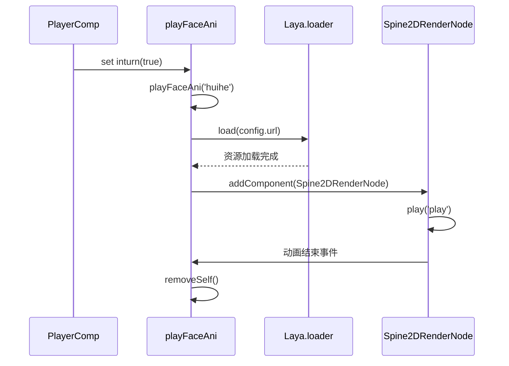

# 角色表现系统

<cite>
**本文档引用文件**  
- [caomao.ts](file://client/src/effects/caomao.ts)
- [PlayerComp.ts](file://client/src/comps/player/PlayerComp.ts)
- [caomao.generated.ts](file://client/src/effects/caomao.generated.ts)
- [lang_mobile.ts](file://server/src/extensions/lang/lang_mobile.ts)
- [caomao.js](file://server/build/extensions/mlongxuexuanhuang/generals/caomao.js)
</cite>

## 目录
1. [角色表现系统概述](#角色表现系统概述)  
2. [角色立绘与动画资源管理](#角色立绘与动画资源管理)  
3. [特效类设计与实现](#特效类设计与实现)  
4. [角色状态变化的视觉反馈](#角色状态变化的视觉反馈)  
5. [角色动画调用流程示例](#角色动画调用流程示例)  
6. [资源路径配置与动态加载策略](#资源路径配置与动态加载策略)  
7. [角色渲染流程图](#角色渲染流程图)

## 角色表现系统概述

角色表现系统负责在客户端实现角色的视觉呈现与动画效果，涵盖角色立绘、头像、技能特效、血量变化反馈等。该系统通过资源加载、动画播放、音效同步与粒子效果等机制，为玩家提供沉浸式的游戏体验。系统核心由 `PlayerComp.ts` 和 `caomao.ts` 等文件构成，结合 Spine 动画与 LayaAir 引擎实现高效渲染。

## 角色立绘与动画资源管理

角色立绘与动画资源存储在 `client/assets/animation` 目录下，按角色与功能分类组织。例如，曹操的背景动画位于 `animation/generlas/caomao/state2_beijing/BeiJing.json`，其形象动画位于 `animation/generlas/caomao/state2_skin/XingXiang.json`。

资源通过服务器配置文件 `lang_mobile.ts` 进行动态绑定，定义了资源路径、位置、缩放、锚点等参数：

```json
{
  "url": "animation/generlas/caomao/state2_beijing/BeiJing.json",
  "pos": { "x": 39, "y": 81 },
  "size": { "w": 2140, "h": 1014 },
  "anchor": { "x": 0.5, "y": 0.5 },
  "scale": { "x": 0.25, "y": 0.25 },
  "skinName": "default",
  "aniName": "BeiJing"
}
```

客户端通过 `Laya.loader.load()` 动态加载 Spine 动画资源，并通过 `addComponent(Laya.Spine2DRenderNode)` 添加渲染组件，实现动画播放。

**Section sources**  
- [lang_mobile.ts](file://server/src/extensions/lang/lang_mobile.ts#L322-L361)

## 特效类设计与实现

特效类 `caomao` 继承自 `caomaoBase`，封装了动画播放、音效同步与自动销毁逻辑。其核心方法 `play()` 通过 Spine 组件播放指定动画，并在动画结束后自动移除自身。

```typescript
@regClass()
export class caomao extends caomaoBase {
    play(data: any = {}) {
        this.getComponent(Laya.Spine2DRenderNode).play('play', false, true);
        this.once(Laya.Event.STOPPED, () => {
            this.removeSelf();
        });
    }
}
```

该设计实现了特效的模块化与复用性，确保动画播放完成后自动清理内存，避免资源泄漏。

**Section sources**  
- [caomao.ts](file://client/src/effects/caomao.ts#L0-L11)  
- [caomao.generated.ts](file://client/src/effects/caomao.generated.ts#L0-L7)

## 角色状态变化的视觉反馈

角色状态变化（如血量变化、技能释放）通过 `PlayerComp` 类实现视觉反馈。该类为抽象基类，被 `SelfSeatComp` 和 `TablePlayerComp` 继承，负责管理角色界面组件的更新。

### 血量变化反馈

血量变化通过 `renderIntHp()` 方法实现，根据当前血量与上限的比例动态切换血条颜色与图标：

- 大于 67%：绿色
- 34%~67%：黄色
- 小于 34%：红色

```typescript
public renderIntHp() {
    const pre = this.inthp / this.maxhp;
    if (pre > 0.67) {
        this.hpImages[0].loadImage("hp1.png");
        this.owner.hplabel.color = '#00FF00';
    } else if (pre > 0.34) {
        this.hpImages[0].loadImage("hp2.png");
        this.owner.hplabel.color = '#FFFF00';
    } else {
        this.hpImages[0].loadImage("hp3.png");
        this.owner.hplabel.color = '#FF0000';
    }
}
```

### 技能释放反馈

技能释放通过 `playFaceAni()` 方法触发，支持 Spine 动画与音效同步播放。例如，触发“决进”技能时，播放对应动画并播放语音。

```typescript
public playFaceAni(ani: string, data: any = {}, addTo: any = this.owner) {
    const config = FaceAni[ani];
    if (config.type === 'spine') {
        Laya.loader.load(config.url, Laya.Loader.SPINE).then(() => {
            const spine = sprite.addComponent(Laya.Spine2DRenderNode);
            spine.source = config.url;
            spine.play(config.animName ?? 'play', false);
        });
    }
}
```

**Section sources**  
- [PlayerComp.ts](file://client/src/comps/player/PlayerComp.ts#L34-L80)

## 角色动画调用流程示例

从 `PlayerComp.ts` 调用角色动画的完整流程如下：

1. 角色进入回合，触发 `inturn` 属性设置。
2. `set inturn(value: boolean)` 方法被调用。
3. 调用 `playFaceAni('huihe')` 播放“回合”动画。
4. 系统查找 `FaceAni['huihe']` 配置。
5. 加载 Spine 资源并创建动画精灵。
6. 播放动画，结束后自动销毁。



**Diagram sources**  
- [PlayerComp.ts](file://client/src/comps/player/PlayerComp.ts#L449-L491)

## 资源路径配置与动态加载策略

资源路径在服务器端通过 `lang_mobile.ts` 配置，客户端通过 `Resources.ts` 管理资源加载。采用动态加载策略，按需加载 Spine 动画与音效资源，减少初始加载时间。

资源路径遵循统一规范：
- 动画：`animation/generals/{name}/{state}/{file}.json`
- 音效：`generals/{name}/{audio}.mp3`
- 图像：`resources/room/texture/game/{type}/{file}.png`

动态加载通过 `Laya.Pool` 对象池优化性能，避免频繁创建与销毁动画对象。

**Section sources**  
- [lang_mobile.ts](file://server/src/extensions/lang/lang_mobile.ts#L322-L361)

## 角色渲染流程图

角色从数据到视觉呈现的完整渲染流程如下：

```mermaid
flowchart TD
A[角色数据更新] --> B{是否为脏标记?}
B --> |是| C[调用 render() 方法]
C --> D[根据标记调用 renderX()]
D --> E[更新血量 renderIntHp()]
D --> F[更新武将 renderGeneral()]
D --> G[更新身份 renderRole()]
D --> H[播放动画 playFaceAni()]
H --> I[加载 Spine 资源]
I --> J[创建动画精灵]
J --> K[播放动画]
K --> L[动画结束事件]
L --> M[removeSelf() 销毁]
B --> |否| N[等待下次更新]
```

**Diagram sources**  
- [PlayerComp.ts](file://client/src/comps/player/PlayerComp.ts#L0-L37)