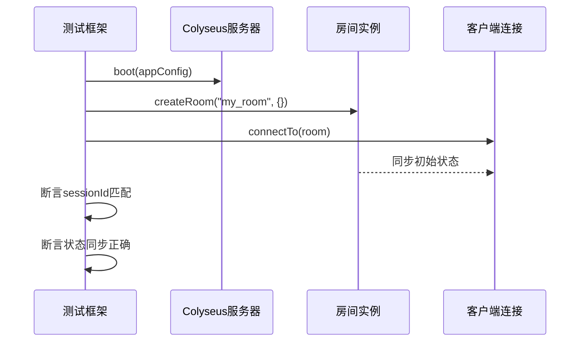
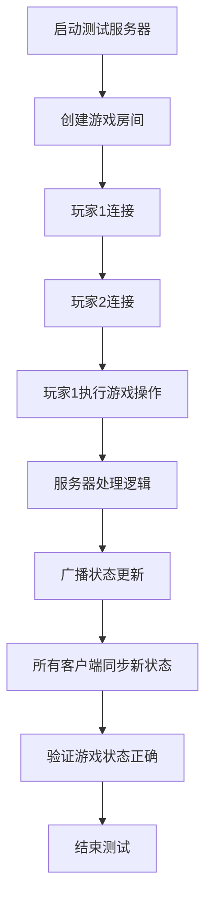

# 测试策略

<cite>
**本文档引用的文件**   
- [MyRoom_test.ts](file://server/test/MyRoom_test.ts#L0-L30)
- [index.test.ts](file://server/src/index.test.ts#L0-L9)
</cite>

## 目录
1. [引言](#引言)
2. [项目结构与测试布局](#项目结构与测试布局)
3. [单元测试实现](#单元测试实现)
4. [集成测试方法](#集成测试方法)
5. [端到端测试设置](#端到端测试设置)
6. [现有测试用例分析](#现有测试用例分析)
7. [测试数据管理](#测试数据管理)
8. [持续集成中的测试执行策略](#持续集成中的测试执行策略)
9. [编写有效测试用例的最佳实践](#编写有效测试用例的最佳实践)

## 引言

本测试策略文档旨在全面阐述resgsv1项目的测试方法论和实践。文档详细描述了单元测试、集成测试和端到端测试的实施方式，分析了现有测试用例的覆盖范围和断言逻辑，并提供了测试数据管理和持续集成中的测试执行策略。通过本策略，开发者可以理解如何为项目编写高质量的测试用例，确保代码的稳定性和可靠性。

## 项目结构与测试布局

resgsv1项目采用前后端分离的架构，测试文件主要分布在服务器端的`server/test`和`server/src`目录下。前端代码位于`client`目录，而服务器逻辑和测试代码位于`server`目录。

```mermaid
graph TB
subgraph "前端 (client)"
ClientSrc[src]
ClientAssets[assets]
ClientBin[bin]
end
subgraph "后端 (server)"
ServerSrc[src]
ServerTest[test]
ServerBuild[build]
end
ClientSrc --> ServerSrc : "通过WebSocket通信"
ServerTest --> ServerSrc : "测试源码"
```

**图示来源**
- [MyRoom_test.ts](file://server/test/MyRoom_test.ts#L0-L30)
- [index.test.ts](file://server/src/index.test.ts#L0-L9)

**本节来源**
- [MyRoom_test.ts](file://server/test/MyRoom_test.ts#L0-L30)
- [index.test.ts](file://server/src/index.test.ts#L0-L9)

## 单元测试实现

单元测试是验证代码中最小可测试单元（如函数、方法）正确性的基础。在resgsv1中，单元测试主要针对核心游戏逻辑、状态机和业务规则。

例如，在`server/src/index.test.ts`中，虽然该文件当前仅包含字符串操作的简单示例，但它展示了单元测试的基本结构：

```typescript
const id = 'a.b.c.d';
const sp = id.split('.');
const _name = sp.at(-1);
const effect = id.slice(0, id.length - _name.length - 1);
```

此代码片段演示了如何对字符串解析逻辑进行单元测试，验证`_name`是否正确提取最后一个部分，`effect`是否正确获取前缀。在实际应用中，类似的测试可用于验证技能ID、角色属性等的解析逻辑。

对于核心游戏逻辑，如状态机和业务规则，应编写独立的测试用例，确保每个状态转换和规则判断都经过验证。例如，可以测试一个角色在特定条件下是否能正确触发技能，或判断牌的使用条件是否满足。

**本节来源**
- [index.test.ts](file://server/src/index.test.ts#L0-L9)

## 集成测试方法

集成测试用于验证多个组件协同工作的正确性，特别是在客户端与服务器通信的场景中。resgsv1使用Colyseus框架进行实时通信，其集成测试策略通过`@colyseus/testing`工具包实现。

在`MyRoom_test.ts`中，定义了一个完整的集成测试流程：



**图示来源**
- [MyRoom_test.ts](file://server/test/MyRoom_test.ts#L0-L30)

**本节来源**
- [MyRoom_test.ts](file://server/test/MyRoom_test.ts#L0-L30)

该测试流程包括：
1. **启动测试服务器**：使用`boot(appConfig)`启动一个隔离的Colyseus服务器实例。
2. **创建房间**：调用`createRoom`创建一个名为"my_room"的游戏房间。
3. **连接客户端**：通过`connectTo`模拟客户端连接到房间。
4. **验证连接**：断言客户端的`sessionId`与服务器端记录的会话ID一致。
5. **验证状态同步**：等待状态补丁（`waitForNextPatch`）后，断言客户端接收到的初始状态与预期相符。

这种测试方法确保了客户端与服务器之间的通信协议、状态同步机制和房间管理逻辑的正确性。

## 端到端测试设置

端到端测试模拟真实用户场景，验证从客户端操作到服务器处理再到状态更新的完整流程。在resgsv1中，可以通过扩展`MyRoom_test.ts`中的测试来实现多玩家游戏流程的测试。

一个典型的端到端测试场景如下：



**图示来源**
- [MyRoom_test.ts](file://server/test/MyRoom_test.ts#L0-L30)

**本节来源**
- [MyRoom_test.ts](file://server/test/MyRoom_test.ts#L0-L30)

具体实现可以包括：
- 模拟两个或更多客户端连接到同一个房间。
- 让一个玩家执行特定操作（如出牌、使用技能）。
- 验证服务器是否正确处理该操作并更新游戏状态。
- 验证所有连接的客户端是否都收到了正确的状态更新。
- 测试游戏结束条件和胜利判定逻辑。

## 现有测试用例分析

### MyRoom_test.ts 分析

`MyRoom_test.ts`是resgsv1中一个关键的集成测试文件，其主要功能和覆盖范围如下：

**测试目标**：验证Colyseus应用程序的基本连接和状态同步功能。

**测试结构**：
- **前置条件** (`before`)：启动测试服务器。
- **后置条件** (`after`)：关闭测试服务器。
- **每个测试前** (`beforeEach`)：清理房间状态，确保测试独立性。
- **测试用例** (`it`)：测试客户端连接到房间的流程。

**断言逻辑**：
1. `assert.strictEqual(client1.sessionId, room.clients[0].sessionId)`：验证客户端连接后，其会话ID与服务器记录的会话ID完全一致。这确保了连接管理的正确性。
2. `assert.deepStrictEqual({ mySynchronizedProperty: "Hello world" }, client1.state.toJSON())`：验证客户端接收到的游戏状态与服务器端的初始状态完全匹配。`deepStrictEqual`确保对象的深层结构和值都相等。

该测试用例虽然简单，但覆盖了实时游戏框架的核心功能：连接、会话管理和状态同步。

**本节来源**
- [MyRoom_test.ts](file://server/test/MyRoom_test.ts#L0-L30)

### index.test.ts 分析

`index.test.ts`目前包含一个简单的字符串处理示例，主要用于演示基本的JavaScript/TypeScript操作。虽然它不是一个典型的游戏逻辑测试，但它可以作为单元测试的模板，用于测试字符串解析、ID生成等辅助功能。

**本节来源**
- [index.test.ts](file://server/src/index.test.ts#L0-L9)

## 测试数据管理

有效的测试依赖于良好的测试数据管理。在resgsv1中，应采用以下策略：

### 模拟数据
- **使用TypeScript接口**：如`MyRoomState`定义了游戏房间的同步状态结构，为测试提供了类型安全的模拟数据基础。
- **创建测试专用数据工厂**：编写函数来生成符合游戏规则的玩家、卡牌和技能实例，确保测试数据的一致性和可重用性。

### 测试数据库
- **隔离的测试环境**：在`@colyseus/testing`中，`boot(appConfig)`会创建一个与生产环境隔离的服务器实例，其数据库状态在每次测试后通过`cleanup()`重置。
- **内存数据库**：推荐使用内存数据库（如SQLite in-memory）进行测试，以提高速度并避免对持久化数据的影响。

### 数据准备与清理
- **BeforeEach/AfterEach**：利用测试框架的钩子，在每个测试前准备数据，在测试后清理数据，保证测试的独立性。
- **快照与回滚**：对于复杂的状态，可以使用Colyseus的状态快照功能，在测试开始前保存初始状态，测试后回滚。

**本节来源**
- [MyRoom_test.ts](file://server/test/MyRoom_test.ts#L0-L30)

## 持续集成中的测试执行策略

为了确保代码质量，应在持续集成（CI）流程中严格执行测试。

### 测试执行流程
1. **代码提交/拉取请求触发**：当代码推送到仓库或创建拉取请求时，自动触发CI流程。
2. **环境准备**：安装依赖（`npm install`）。
3. **运行测试**：执行`npm test`或`npx jest`等命令运行所有测试。
4. **覆盖率检查**：使用`jest --coverage`生成测试覆盖率报告。
5. **结果报告**：将测试结果和覆盖率报告上传至代码托管平台。

### 测试覆盖率要求
- **最低覆盖率**：设定一个最低覆盖率阈值（例如80%），CI流程中如果未达到该阈值则失败。
- **关键模块全覆盖**：对于核心游戏逻辑、状态机和网络通信模块，要求100%的语句和分支覆盖率。

### 失败处理流程
- **立即失败**：任何测试失败或覆盖率不足都会导致CI流程失败，阻止代码合并。
- **详细日志**：提供详细的测试失败日志，包括错误堆栈和断言信息，便于开发者快速定位问题。
- **自动通知**：通过邮件或即时通讯工具通知相关开发者。

**本节来源**
- [MyRoom_test.ts](file://server/test/MyRoom_test.ts#L0-L30)
- [index.test.ts](file://server/src/index.test.ts#L0-L9)

## 编写有效测试用例的最佳实践

为了帮助开发者编写高质量的测试用例，遵循以下最佳实践：

### 清晰的测试命名
使用描述性名称，明确表达测试的意图，例如`"should allow player to use card when conditions are met"`。

### 单一职责
每个测试用例只验证一个功能点，避免在一个测试中验证多个断言，除非它们是同一逻辑流程的一部分。

### 可重复性
确保测试不依赖外部状态或随机数据，每次运行都应得到相同的结果。

### 快速执行
优化测试代码，避免不必要的延迟（如使用`waitForNextPatch`时应有超时机制），确保整个测试套件能在合理时间内完成。

### 模拟与存根
对于外部依赖（如数据库、网络服务），使用模拟（mock）或存根（stub）来隔离测试，提高速度和可靠性。

### 边界条件测试
不仅要测试正常流程，还要测试边界条件和错误情况，例如：
- 玩家血量为0时是否死亡。
- 手牌数量达到上限时是否无法摸牌。
- 网络中断时客户端的重连机制。

通过遵循这些实践，可以构建一个健壮、可靠的测试套件，为resgsv1项目的长期发展提供坚实的质量保障。

**本节来源**
- [MyRoom_test.ts](file://server/test/MyRoom_test.ts#L0-L30)
- [index.test.ts](file://server/src/index.test.ts#L0-L9)