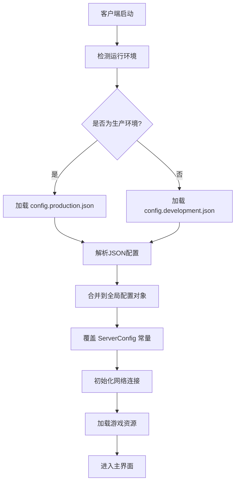

# 环境配置

<cite>
**本文档中引用的文件**  
- [config.development.json](file://client/bin/configs/config.development.json)
- [config.production.json](file://client/bin/configs/config.production.json)
- [config.ts](file://client/src/config.ts)
</cite>

## 目录
1. [项目结构分析](#项目结构分析)
2. [配置文件结构详解](#配置文件结构详解)
3. [开发与生产环境配置对比](#开发与生产环境配置对比)
4. [配置加载流程](#配置加载流程)
5. [环境变量覆盖机制](#环境变量覆盖机制)
6. [最佳实践指南](#最佳实践指南)
7. [配置使用示例](#配置使用示例)

## 项目结构分析

resgsv1项目的客户端配置系统主要位于`client/bin/configs/`目录下，包含两个核心JSON配置文件：`config.development.json`（开发环境）和`config.production.json`（生产环境）。这些配置文件在客户端启动时被加载，用于初始化服务器连接、资源路径等关键参数。

此外，`client/src/config.ts`文件中定义了硬编码的默认配置常量，作为运行时配置的基础。该文件还包含了房间选项、玩家位置、测试玩家数据等静态配置信息。

**Section sources**
- [config.development.json](file://client/bin/configs/config.development.json)
- [config.production.json](file://client/bin/configs/config.production.json)
- [config.ts](file://client/src/config.ts)

## 配置文件结构详解

### 开发环境配置 (config.development.json)

```json
{
    "serverHost": "192.168.1.3",
    "serverPort": 12699,
    "gameAssetsUrl": "."
}
```

- **serverHost**: 指定后端服务器的IP地址，在开发环境中为局域网地址`192.168.1.3`，便于本地调试。
- **serverPort**: 服务器监听的端口号，固定为`12699`。
- **gameAssetsUrl**: 游戏资源的基础URL路径。开发环境下设为当前目录`.`，表示从本地加载资源。

### 生产环境配置 (config.production.json)

```json
{
    "serverHost": "47.93.84.143",
    "serverPort": 12699,
    "gameAssetsUrl": "http://res.resgs.com"
}
```

- **serverHost**: 生产环境中的公网服务器IP地址`47.93.84.143`，确保所有用户均可访问。
- **serverPort**: 与开发环境一致，保持端口统一。
- **gameAssetsUrl**: 指向CDN或静态资源服务器的完整URL`http://res.resgs.com`，用于高效分发游戏资源。

### 源码内嵌配置 (config.ts)

`client/src/config.ts`文件中通过TypeScript常量定义了默认服务器配置：

```typescript
export const ServerConfig = {
    host: '47.93.84.143',
    port: 12699,
    res_url: 'http://res.resgs.com',
};
```

此配置作为代码内的默认值，可被外部JSON配置文件覆盖。同时，该文件还包含大量游戏逻辑相关的静态配置，如：
- `playerPos`: 不同玩家数量下的UI布局坐标
- `testPlayers`: 测试用玩家账号列表
- `RoomOptions`: 多种游戏模式的房间配置（如[wars]、[doudizhu_test]等）

**Section sources**
- [config.development.json](file://client/bin/configs/config.development.json#L1-L6)
- [config.production.json](file://client/bin/configs/config.production.json#L1-L6)
- [config.ts](file://client/src/config.ts#L1-L831)

## 开发与生产环境配置对比

| 配置项 | 开发环境 | 生产环境 | 说明 |
|-------|--------|--------|------|
| **服务器地址** | `192.168.1.3` | `47.93.84.143` | 开发使用局域网IP，生产使用公网IP |
| **资源路径** | `.` (本地) | `http://res.resgs.com` (远程) | 开发时从本地加载资源以加快迭代速度，生产时从CDN加载以提升性能 |
| **安全性** | 低 | 高 | 生产环境需考虑HTTPS、WAF等安全措施 |
| **调试功能** | 启用 | 禁用 | 开发环境可启用日志、热更新等功能 |

这种分离策略确保了开发效率与生产稳定性的平衡。

**Section sources**
- [config.development.json](file://client/bin/configs/config.development.json)
- [config.production.json](file://client/bin/configs/config.production.json)

## 配置加载流程

客户端启动时的配置初始化流程如下：



**Diagram sources**
- [config.development.json](file://client/bin/configs/config.development.json)
- [config.production.json](file://client/bin/configs/config.production.json)
- [config.ts](file://client/src/config.ts)

**Section sources**
- [config.development.json](file://client/bin/configs/config.development.json)
- [config.production.json](file://client/bin/configs/config.production.json)
- [config.ts](file://client/src/config.ts)

## 环境变量覆盖机制

虽然当前项目主要依赖JSON文件进行配置管理，但可通过环境变量实现动态覆盖。建议实现方式如下：

```typescript
// 伪代码示例：环境变量覆盖
const finalConfig = {
    serverHost: process.env.SERVER_HOST || jsonConfig.serverHost || ServerConfig.host,
    serverPort: parseInt(process.env.SERVER_PORT || jsonConfig.serverPort || ServerConfig.port),
    gameAssetsUrl: process.env.ASSETS_URL || jsonConfig.gameAssetsUrl || ServerConfig.res_url
};
```

这样可以在部署时通过设置环境变量来临时修改配置，而无需更改代码或配置文件，特别适用于容器化部署场景。

## 最佳实践指南

### 配置版本控制
- 将`config.development.json`纳入版本控制，供团队共享开发配置。
- **禁止**将`config.production.json`提交至代码仓库，应通过安全渠道分发，防止敏感信息泄露。

### 环境切换
使用构建脚本自动选择配置文件：
```bash
# 构建开发版本
cp config.development.json dist/config.json

# 构建生产版本  
cp config.production.json dist/config.json
```

### 配置验证
在加载配置后添加校验逻辑：
```typescript
function validateConfig(config) {
    if (!config.serverHost) throw new Error('服务器地址未配置');
    if (!config.serverPort || config.serverPort <= 0) throw new Error('端口配置无效');
    // 其他验证规则...
}
```

### 敏感信息管理
- 数据库密码、API密钥等敏感信息不应出现在前端配置中。
- 使用后端服务代理敏感操作，前端仅保留必要的连接信息。

## 配置使用示例

在TypeScript代码中使用配置的典型方式：

```typescript
import { ServerConfig } from './config';

class GameClient {
    private socket: WebSocket;
    
    connect() {
        const host = ServerConfig.host;
        const port = ServerConfig.port;
        const url = `ws://${host}:${port}`;
        
        this.socket = new WebSocket(url);
        this.socket.onopen = () => console.log('连接服务器成功');
    }
}

// 动态获取资源路径
function getAssetUrl(assetName: string): string {
    return `${ServerConfig.res_url}/assets/${assetName}`;
}
```

运行时也可动态调整配置：
```typescript
// 示例：切换到测试服务器
function useTestServer() {
    ServerConfig.host = 'test.resgs.com';
    // 重新连接...
}
```

**Section sources**
- [config.ts](file://client/src/config.ts#L1-L831)