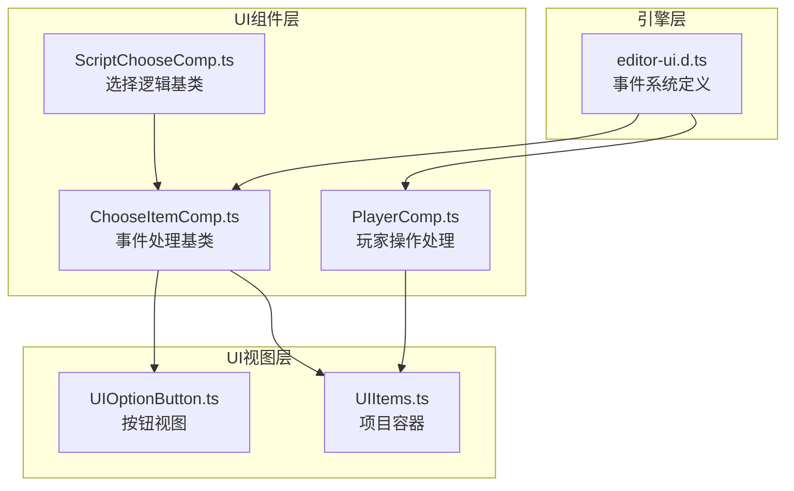
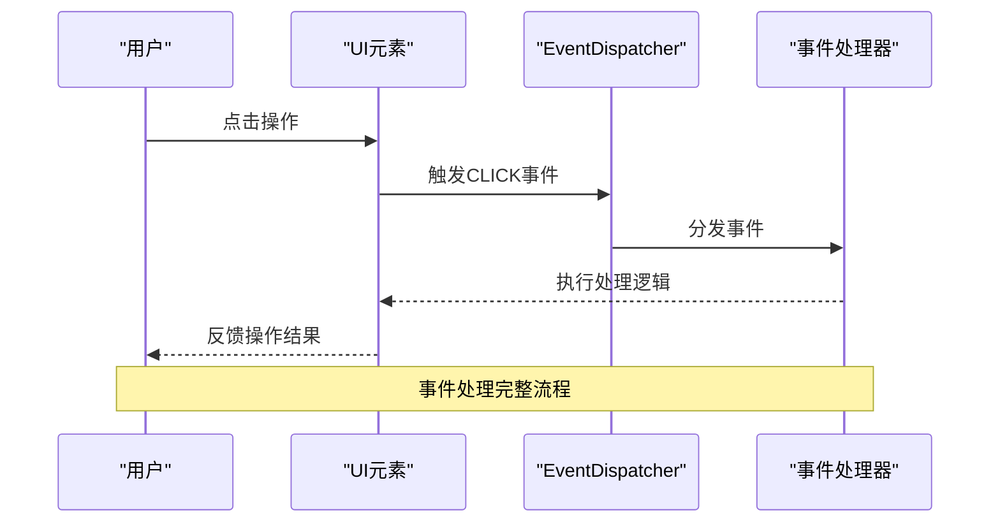
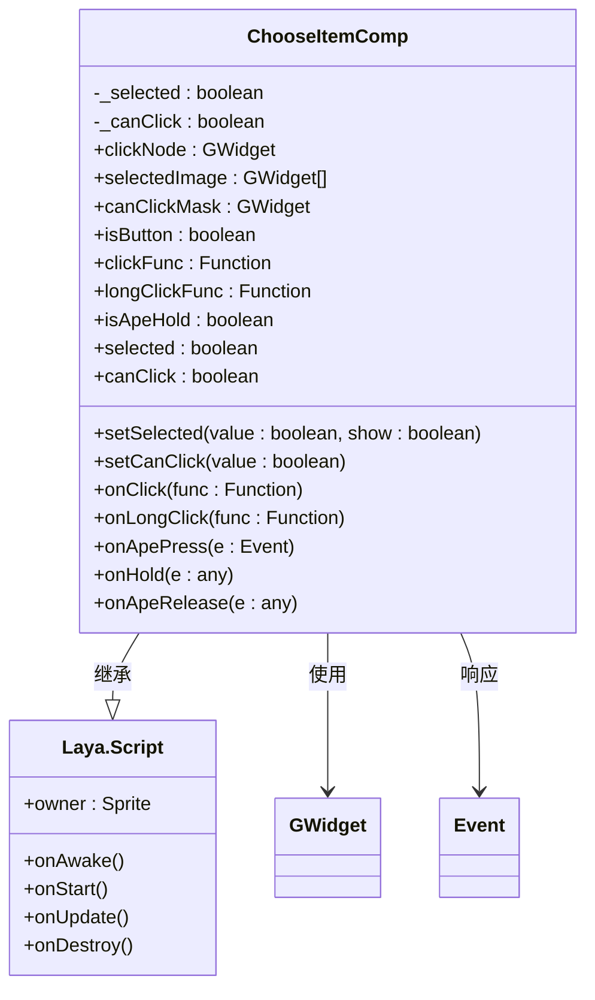
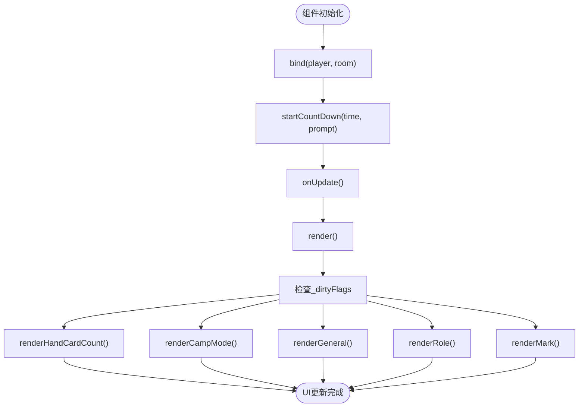
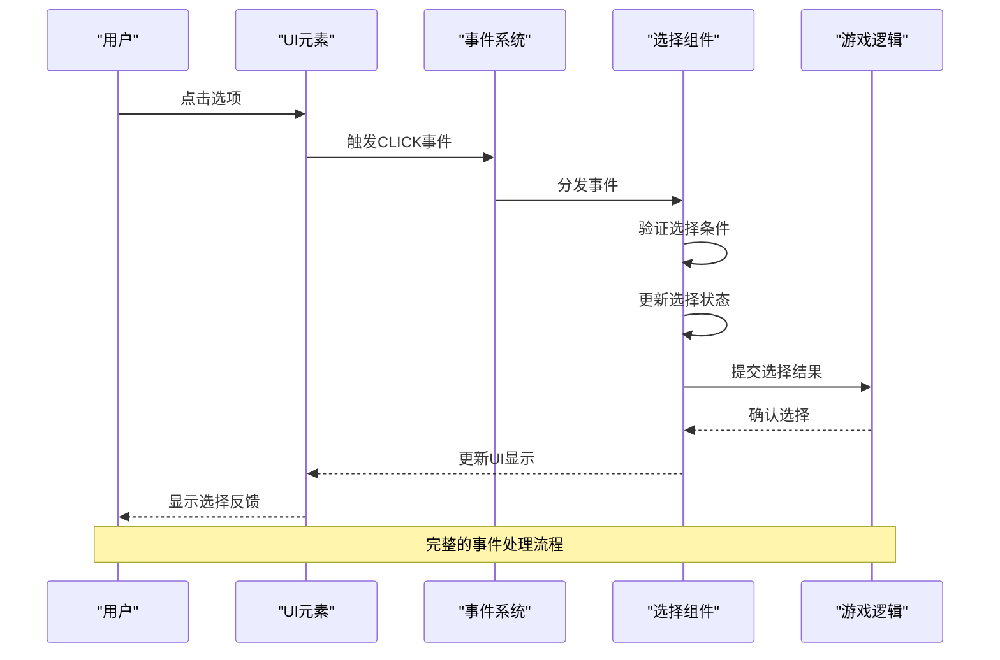
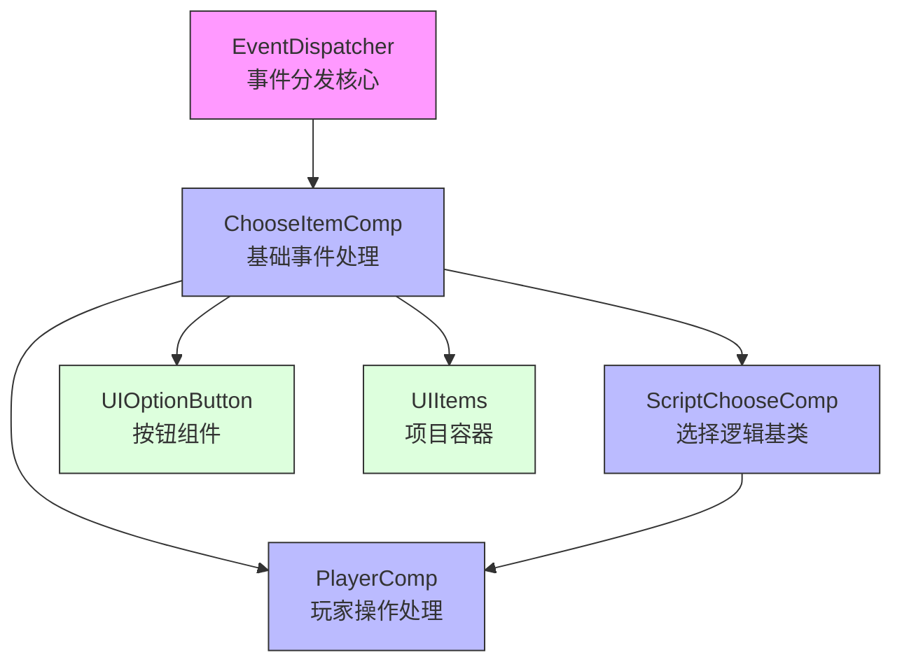

# UI事件机制

<cite>
**本文档中引用的文件**   
- [ChooseItemComp.ts](file://client/src/comps/ChooseItemComp.ts)
- [PlayerComp.ts](file://client/src/comps/player/PlayerComp.ts)
- [ScriptChooseComp.ts](file://client/src/comps/choose/ScriptChooseComp.ts)
- [UIOptionButton.ts](file://client/src/ui/UIOptionButton.ts)
- [UIItems.ts](file://client/src/ui/UIItems.ts)
- [editor-ui.d.ts](file://client/engine/types/editor-ui.d.ts)
</cite>

## 目录
1. [简介](#简介)
2. [项目结构](#项目结构)
3. [核心组件](#核心组件)
4. [架构概述](#架构概述)
5. [详细组件分析](#详细组件分析)
6. [依赖分析](#依赖分析)
7. [性能考虑](#性能考虑)
8. [故障排除指南](#故障排除指南)
9. [结论](#结论)

## 简介
本文档全面解析了游戏客户端中的UI事件机制，重点分析了事件系统的架构设计、事件处理流程、事件委托模式以及跨组件通信机制。文档详细阐述了触摸事件和点击事件在UI层级中的捕获和冒泡机制，并深入探讨了ChooseItemComp.ts中选项选择事件的处理逻辑和PlayerComp.ts中玩家操作事件的响应机制。同时，文档还提供了事件性能优化策略，包括事件节流、防抖和内存泄漏预防。

## 项目结构
项目采用分层架构设计，将UI组件、业务逻辑和数据模型分离。UI事件处理主要集中在`client/src/comps`目录下的组件类中，这些组件通过继承Laya.Script实现事件绑定和处理。UI视图类位于`client/src/ui`目录，负责界面渲染和用户交互。



**图示来源**
- [ChooseItemComp.ts](file://client/src/comps/ChooseItemComp.ts)
- [PlayerComp.ts](file://client/src/comps/player/PlayerComp.ts)
- [ScriptChooseComp.ts](file://client/src/comps/choose/ScriptChooseComp.ts)
- [UIOptionButton.ts](file://client/src/ui/UIOptionButton.ts)
- [UIItems.ts](file://client/src/ui/UIItems.ts)
- [editor-ui.d.ts](file://client/engine/types/editor-ui.d.ts)

**本节来源**
- [ChooseItemComp.ts](file://client/src/comps/ChooseItemComp.ts)
- [PlayerComp.ts](file://client/src/comps/player/PlayerComp.ts)

## 核心组件
UI事件机制的核心组件包括事件分发器、事件监听器和事件处理器。系统基于Laya引擎的事件系统实现，通过`EventDispatcher`类管理事件的注册、分发和移除。`ChooseItemComp`类作为基础事件处理组件，封装了点击、长按等常见UI事件的处理逻辑。

**本节来源**
- [ChooseItemComp.ts](file://client/src/comps/ChooseItemComp.ts)
- [editor-ui.d.ts](file://client/engine/types/editor-ui.d.ts)

## 架构概述
UI事件系统采用观察者模式设计，实现了事件的发布-订阅机制。当用户与界面交互时，底层引擎会触发相应的事件，这些事件通过事件冒泡机制向上传递，最终由注册了监听器的组件进行处理。



**图示来源**
- [editor-ui.d.ts](file://client/engine/types/editor-ui.d.ts)
- [ChooseItemComp.ts](file://client/src/comps/ChooseItemComp.ts)

## 详细组件分析

### ChooseItemComp组件分析
`ChooseItemComp`是UI事件处理的基础组件，负责管理UI元素的点击、长按等交互行为。该组件通过封装Laya引擎的原生事件，提供了更高级的事件处理接口。



**图示来源**
- [ChooseItemComp.ts](file://client/src/comps/ChooseItemComp.ts#L0-L93)

**本节来源**
- [ChooseItemComp.ts](file://client/src/comps/ChooseItemComp.ts#L0-L93)

### PlayerComp组件分析
`PlayerComp`组件负责处理玩家相关的UI事件，包括倒计时、状态更新等。该组件通过监听玩家数据的变化，自动更新UI显示。



**图示来源**
- [PlayerComp.ts](file://client/src/comps/player/PlayerComp.ts#L0-L799)

**本节来源**
- [PlayerComp.ts](file://client/src/comps/player/PlayerComp.ts#L0-L799)

### 事件处理流程分析
UI事件的处理流程从用户交互开始，经过事件捕获、事件分发和事件处理三个阶段。系统通过事件冒泡机制确保事件能够被正确的组件处理。



**图示来源**
- [ChooseItemComp.ts](file://client/src/comps/ChooseItemComp.ts)
- [ScriptChooseComp.ts](file://client/src/comps/choose/ScriptChooseComp.ts)

## 依赖分析
UI事件系统依赖于Laya引擎的事件机制，通过`EventDispatcher`类实现事件的注册和分发。各组件之间通过继承和组合关系建立依赖。



**图示来源**
- [editor-ui.d.ts](file://client/engine/types/editor-ui.d.ts)
- [ChooseItemComp.ts](file://client/src/comps/ChooseItemComp.ts)
- [ScriptChooseComp.ts](file://client/src/comps/choose/ScriptChooseComp.ts)
- [PlayerComp.ts](file://client/src/comps/player/PlayerComp.ts)

**本节来源**
- [editor-ui.d.ts](file://client/engine/types/editor-ui.d.ts#L722-L755)
- [ChooseItemComp.ts](file://client/src/comps/ChooseItemComp.ts)
- [ScriptChooseComp.ts](file://client/src/comps/choose/ScriptChooseComp.ts)

## 性能考虑
UI事件系统在设计时考虑了性能优化，通过以下策略确保系统的高效运行：

1. **事件节流**：对于高频事件（如鼠标移动），采用节流策略限制事件处理频率
2. **事件防抖**：对于可能重复触发的事件，使用防抖机制确保只处理最后一次事件
3. **内存泄漏预防**：在组件销毁时及时移除事件监听器
4. **脏检查机制**：只在数据变化时更新UI，避免不必要的渲染

```typescript
// 内存泄漏预防示例
public destroy(): void {
    // 移除所有事件监听
    this.clickNode.offAll(Laya.Event.CLICK);
    this.clickNode.offAll(Laya.Event.MOUSE_DOWN);
    this.owner.off(Laya.Event.MOUSE_UP, this, this.onApeRelease);
    
    // 调用父类销毁方法
    super.destroy();
}
```

**本节来源**
- [ChooseItemComp.ts](file://client/src/comps/ChooseItemComp.ts)
- [PlayerComp.ts](file://client/src/comps/player/PlayerComp.ts)

## 故障排除指南
在开发和调试UI事件相关功能时，可能会遇到以下常见问题：

1. **事件未触发**：检查事件监听器是否正确注册，确保UI元素的`mouseEnabled`属性为true
2. **事件重复触发**：在注册新事件监听器前，先使用`offAll`方法移除旧的监听器
3. **内存泄漏**：确保在组件销毁时移除所有事件监听器
4. **UI更新不及时**：检查脏检查标记是否正确设置，确保`onUpdate`方法被正确调用

**本节来源**
- [ChooseItemComp.ts](file://client/src/comps/ChooseItemComp.ts#L0-L93)
- [PlayerComp.ts](file://client/src/comps/player/PlayerComp.ts#L0-L799)

## 结论
本文档详细分析了游戏客户端的UI事件机制，涵盖了从事件触发到处理的完整流程。系统采用模块化设计，通过基础组件封装通用的事件处理逻辑，提高了代码的复用性和可维护性。事件系统与游戏逻辑分离的设计使得UI交互更加灵活，便于扩展和维护。通过合理的性能优化策略，确保了系统在高频率事件处理下的稳定运行。