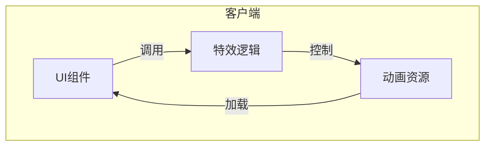
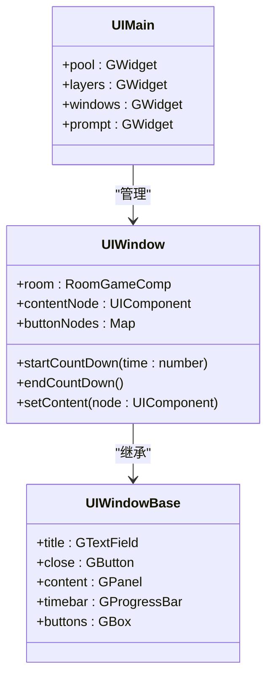
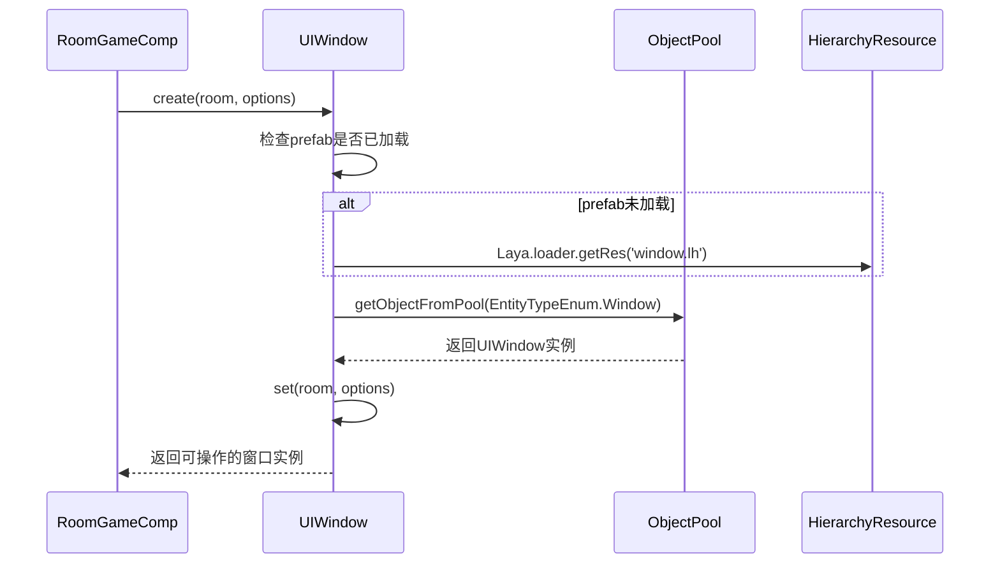
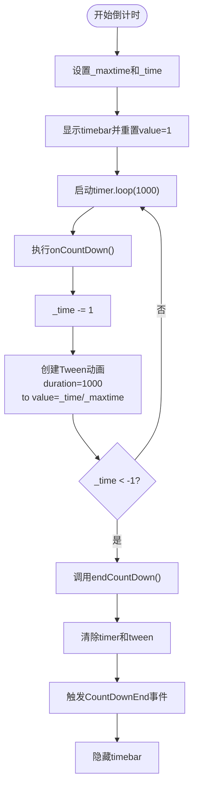
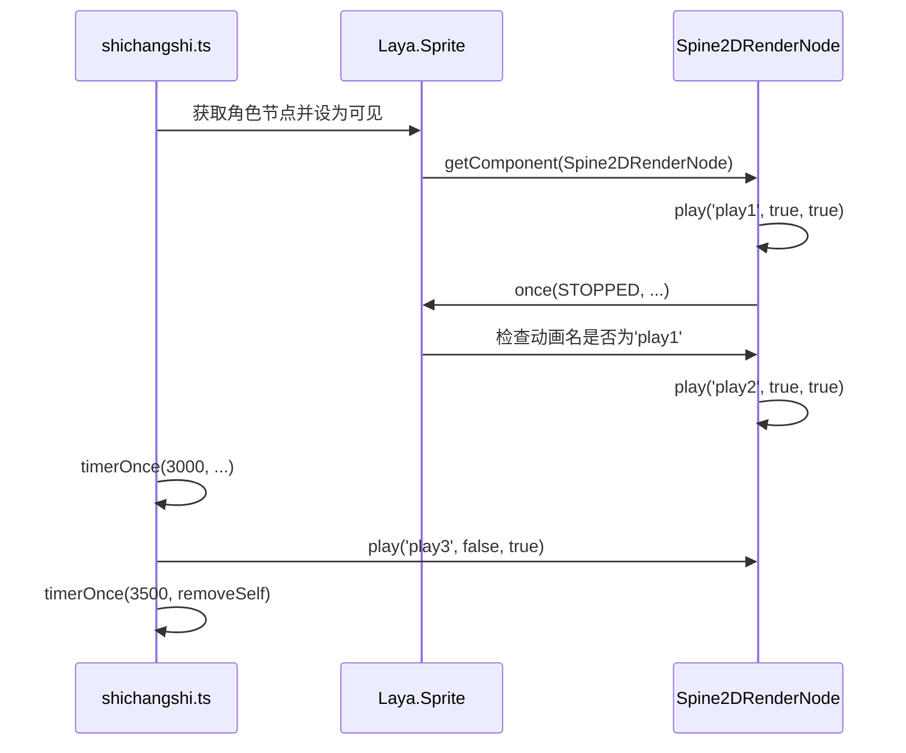
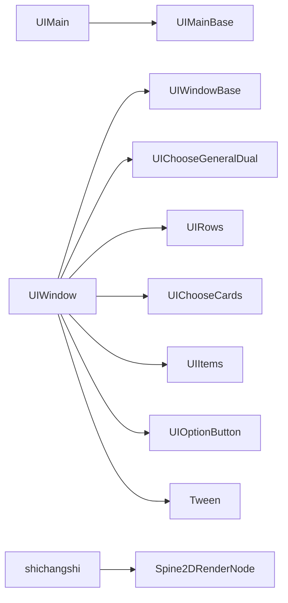

# UI动画与主题

<cite>
**本文档引用的文件**  
- [UIMain.ts](file://client/src/ui/UIMain.ts)
- [UIMain.generated.ts](file://client/src/ui/UIMain.generated.ts)
- [UIWindow.ts](file://client/src/ui/UIWindow.ts)
- [UIWindow.generated.ts](file://client/src/ui/UIWindow.generated.ts)
- [shichangshi.ts](file://client/src/effects/shichangshi.ts)
</cite>

## 目录
1. [简介](#简介)
2. [项目结构](#项目结构)
3. [核心组件](#核心组件)
4. [架构概览](#架构概览)
5. [详细组件分析](#详细组件分析)
6. [依赖分析](#依赖分析)
7. [性能考量](#性能考量)
8. [故障排除指南](#故障排除指南)
9. [结论](#结论)

## 简介
本文档深入解析了游戏客户端中UI动画系统与主题皮肤的设计与实现。重点涵盖补间动画、关键帧动画和骨骼动画在UI中的应用，详细说明了界面切换动画的配置与执行流程，以及角色特效与UI的集成方式。同时，文档阐述了UI皮肤系统的结构设计、资源映射机制和动态切换逻辑，并提供了动画性能监控与优化建议。

## 项目结构
项目采用分层结构组织代码，主要分为客户端（client）和服务端（server）两大部分。客户端代码集中于`client`目录，其核心UI逻辑位于`client/src/ui`路径下，动画资源存储在`client/assets/animation`目录中。UI组件通过LayaAir引擎生成的`.generated.ts`文件进行绑定，实现了视图与逻辑的分离。

**图示来源**
- [UIMain.ts](file://client/src/ui/UIMain.ts)
- [UIWindow.ts](file://client/src/ui/UIWindow.ts)

**本节来源**
- [UIMain.ts](file://client/src/ui/UIMain.ts#L1-L6)
- [UIWindow.ts](file://client/src/ui/UIWindow.ts#L1-L188)

## 核心组件
核心UI组件包括`UIMain`和`UIWindow`，分别负责主界面的初始化和窗口的动态创建与管理。`UIMain`作为主场景入口，提供了基础的UI容器结构；`UIWindow`则封装了窗口的通用行为，如倒计时、按钮管理、内容动态加载等。

**本节来源**
- [UIMain.ts](file://client/src/ui/UIMain.ts#L1-L6)
- [UIWindow.ts](file://client/src/ui/UIWindow.ts#L1-L188)

## 架构概览
系统采用基于LayaAir的组件化架构，UI元素通过预制体（Prefab）和对象池（Object Pool）进行高效管理。动画系统结合了Spine骨骼动画与Laya内置的补间动画，实现了复杂的视觉效果。主题皮肤系统通过配置文件和资源路径映射实现动态切换。

**图示来源**
- [UIMain.generated.ts](file://client/src/ui/UIMain.generated.ts#L1-L20)
- [UIWindow.generated.ts](file://client/src/ui/UIWindow.generated.ts#L1-L27)
- [UIWindow.ts](file://client/src/ui/UIWindow.ts#L1-L188)

## 详细组件分析

### UIWindow组件分析
`UIWindow`类是UI交互的核心，负责窗口的创建、内容设置、倒计时控制和事件响应。它通过静态`create`方法从对象池中获取实例，避免频繁创建和销毁节点，提升性能。

#### 窗口创建与复用流程

**图示来源**
- [UIWindow.ts](file://client/src/ui/UIWindow.ts#L10-L20)

#### 倒计时动画实现
倒计时功能通过`startCountDown`方法启动，结合`Laya.Tween`实现进度条的平滑过渡动画。每秒触发一次`onCountDown`回调，更新进度条值并播放缓动效果。

**图示来源**
- [UIWindow.ts](file://client/src/ui/UIWindow.ts#L90-L110)

**本节来源**
- [UIWindow.ts](file://client/src/ui/UIWindow.ts#L1-L188)

### UI动画系统分析
UI动画系统主要依赖Spine骨骼动画和Laya内置的补间动画。`shichangshi.ts`文件中的代码展示了如何控制角色的骨骼动画播放序列。

#### 骨骼动画播放流程

**图示来源**
- [shichangshi.ts](file://client/src/effects/shichangshi.ts#L34-L58)

**本节来源**
- [shichangshi.ts](file://client/src/effects/shichangshi.ts#L34-L58)

## 依赖分析
UI组件之间存在明确的依赖关系。`UIMain`依赖于`UIMainBase`提供的UI结构，`UIWindow`依赖于`UIWindowBase`和多种子组件（如`UIChooseGeneralDual`、`UIRows`等）。动画系统依赖于Laya引擎的`Spine2DRenderNode`和`Tween`模块。

**图示来源**
- [UIWindow.generated.ts](file://client/src/ui/UIWindow.generated.ts#L1-L27)
- [UIWindow.ts](file://client/src/ui/UIWindow.ts#L1-L188)

**本节来源**
- [UIWindow.generated.ts](file://client/src/ui/UIWindow.generated.ts#L1-L27)
- [UIWindow.ts](file://client/src/ui/UIWindow.ts#L1-L188)

## 性能考量
系统通过多种机制优化UI性能：
1. **对象池技术**：`UIWindow`使用`S.ui.getObjectFromPool`和`retObjectFromPool`管理实例，减少GC压力。
2. **动画复用**：Spine动画通过`play`方法复用动画状态，避免重复加载。
3. **缓动优化**：使用`Laya.Tween.killAll`在结束时清除所有缓动，防止内存泄漏。
4. **资源预加载**：窗口预制体在首次创建时预加载，后续直接复用。

建议在复杂动画场景中使用性能监控工具，如Laya自带的`Stats`面板，监控FPS、内存和绘制调用，避免过度绘制。

**本节来源**
- [UIWindow.ts](file://client/src/ui/UIWindow.ts#L10-L20)
- [UIWindow.ts](file://client/src/ui/UIWindow.ts#L90-L110)

## 故障排除指南
常见问题及解决方案：
- **动画不播放**：检查Spine资源是否正确加载，`play`方法参数是否正确，节点是否可见。
- **窗口无法关闭**：确认`close`按钮的点击事件是否绑定，`room.window.close(this)`是否被正确调用。
- **倒计时不准确**：检查`timer.loop`是否被正确清除，避免多个定时器叠加。
- **内存泄漏**：确保在`destroy`方法中正确清理所有子节点和事件监听。

**本节来源**
- [UIWindow.ts](file://client/src/ui/UIWindow.ts#L150-L188)
- [shichangshi.ts](file://client/src/effects/shichangshi.ts#L34-L58)

## 结论
本文档全面解析了UI动画与主题系统的实现机制。通过对象池、Spine骨骼动画和补间动画的结合，系统实现了高效且丰富的视觉效果。建议在开发中遵循组件化设计原则，合理使用动画资源，并持续进行性能监控与优化，以确保流畅的用户体验。