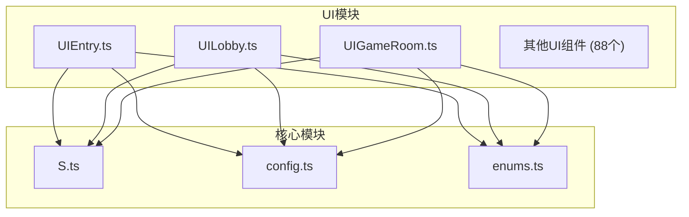
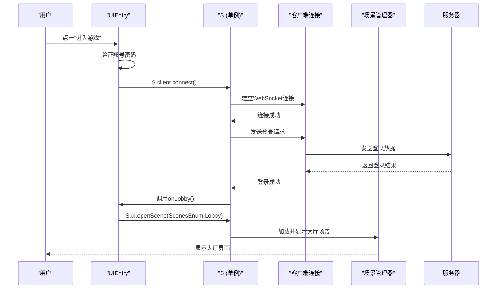
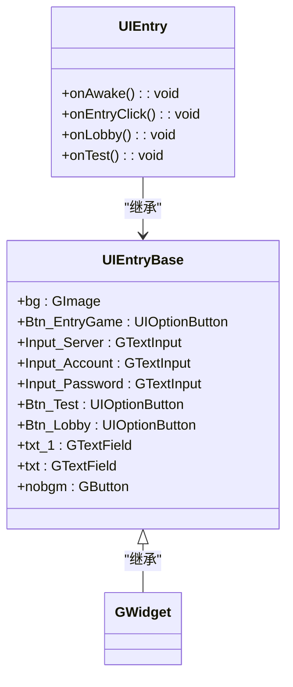
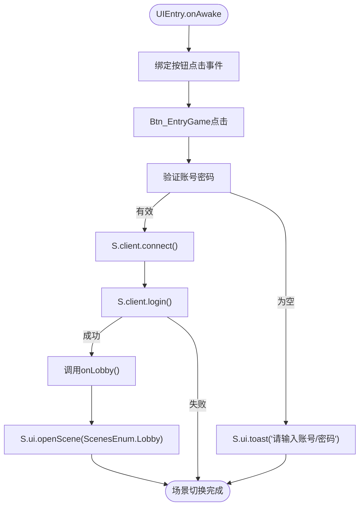
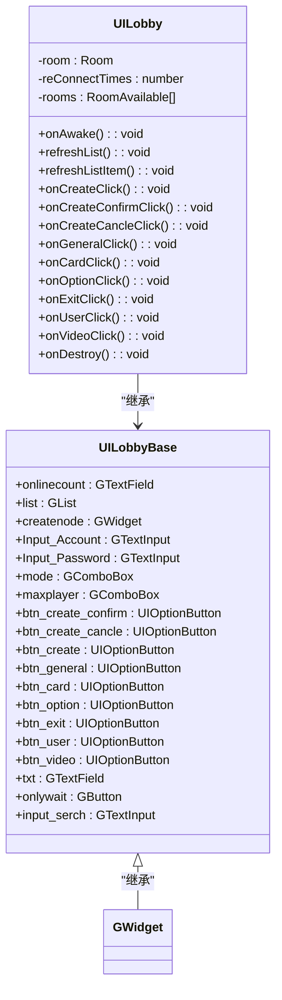
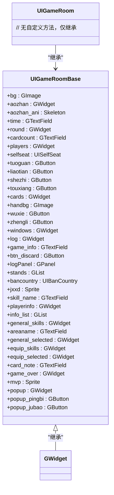
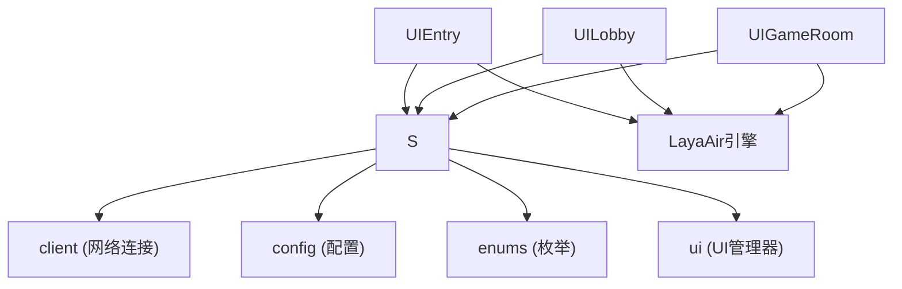

# UI系统

<cite>
**本文档引用的文件**  
- [UIEntry.ts](file://client/src/ui/UIEntry.ts)
- [UIEntry.generated.ts](file://client/src/ui/UIEntry.generated.ts)
- [UILobby.ts](file://client/src/ui/UILobby.ts)
- [UILobby.generated.ts](file://client/src/ui/UILobby.generated.ts)
- [UIGameRoom.ts](file://client/src/ui/UIGameRoom.ts)
- [UIGameRoom.generated.ts](file://client/src/ui/UIGameRoom.generated.ts)
- [editor-ui.d.ts](file://client/engine/types/editor-ui.d.ts)
- [config.ts](file://client/src/config.ts)
- [singleton.ts](file://client/src/singleton.ts)
- [enums.ts](file://client/src/enums.ts)
</cite>

## 目录
1. [简介](#简介)
2. [项目结构](#项目结构)
3. [核心组件](#核心组件)
4. [架构概览](#架构概览)
5. [详细组件分析](#详细组件分析)
6. [依赖分析](#依赖分析)
7. [性能考虑](#性能考虑)
8. [故障排除指南](#故障排除指南)
9. [结论](#结论)

## 简介
本文档深入分析了前端UI系统的设计与实现，重点涵盖UI组件的层级结构、UIEntry.ts作为入口点的初始化流程、主要界面（如UIGameRoom、UILobby）的布局设计与交互逻辑、UI组件的生成与销毁机制、UI事件处理流程、动画实现方式以及皮肤系统等核心功能。文档旨在为开发者提供全面的技术参考，帮助理解系统的整体架构和关键实现细节。

## 项目结构
项目采用模块化设计，前端代码位于`client/src`目录下，其中`ui`文件夹集中管理所有UI相关组件。每个UI界面由`.ts`和`.generated.ts`两个文件组成：`.generated.ts`为LayaAirIDE自动生成的UI结构定义文件，包含界面元素的引用；`.ts`为主逻辑文件，负责事件绑定、数据处理和业务逻辑。这种分离设计实现了UI结构与逻辑的解耦，便于维护和扩展。

**图示来源**
- [UIEntry.ts](file://client/src/ui/UIEntry.ts)
- [UILobby.ts](file://client/src/ui/UILobby.ts)
- [UIGameRoom.ts](file://client/src/ui/UIGameRoom.ts)

**本节来源**
- [UIEntry.ts](file://client/src/ui/UIEntry.ts)
- [UILobby.ts](file://client/src/ui/UILobby.ts)

## 核心组件
UI系统的核心组件包括UIEntry（登录入口）、UILobby（大厅界面）和UIGameRoom（游戏房间界面）。这些组件通过`@regClass()`装饰器注册为LayaAir的可识别类，并继承自`.generated.ts`文件中定义的基类，从而获得对UI元素的引用。组件通过`onAwake()`生命周期方法进行初始化，绑定事件监听器，并通过单例模式`S.ui`进行统一管理。

**本节来源**
- [UIEntry.ts](file://client/src/ui/UIEntry.ts#L1-L10)
- [UILobby.ts](file://client/src/ui/UILobby.ts#L1-L20)
- [UIGameRoom.ts](file://client/src/ui/UIGameRoom.ts#L1-L5)

## 架构概览
UI系统采用基于组件的架构，所有UI元素均继承自LayaAir的`GWidget`基类。系统通过事件驱动模型处理用户交互，核心流程包括：UI初始化、事件绑定、状态管理、场景切换和资源管理。单例模式`S`贯穿整个系统，提供对客户端连接、UI管理器、配置等全局服务的统一访问。

**图示来源**
- [UIEntry.ts](file://client/src/ui/UIEntry.ts#L15-L35)
- [singleton.ts](file://client/src/singleton.ts)
- [config.ts](file://client/src/config.ts)

## 详细组件分析

### UIEntry组件分析
UIEntry是整个应用的入口点，负责用户登录和初始场景跳转。其核心功能包括账号密码验证、客户端连接、用户登录以及场景切换。

#### 类结构与继承关系

**图示来源**
- [UIEntry.generated.ts](file://client/src/ui/UIEntry.generated.ts#L1-L18)
- [UIEntry.ts](file://client/src/ui/UIEntry.ts#L1-L5)

#### 初始化与事件处理流程
UIEntry在`onAwake()`方法中完成初始化，为三个按钮（进入游戏、测试、大厅）绑定点击事件。点击“进入游戏”后，系统会验证输入，调用`S.client.login()`进行登录。登录成功后，调用`onLobby()`方法，通过`S.ui.openScene()`打开大厅场景。

**图示来源**
- [UIEntry.ts](file://client/src/ui/UIEntry.ts#L10-L45)

**本节来源**
- [UIEntry.ts](file://client/src/ui/UIEntry.ts#L1-L50)
- [UIEntry.generated.ts](file://client/src/ui/UIEntry.generated.ts)

### UILobby组件分析
UILobby是游戏大厅界面，负责展示房间列表、创建房间和跳转至其他功能页面。

#### 类结构与继承关系

**图示来源**
- [UILobby.generated.ts](file://client/src/ui/UILobby.generated.ts#L1-L35)
- [UILobby.ts](file://client/src/ui/UILobby.ts#L1-L10)

#### 房间列表与创建逻辑
UILobby通过监听`refreshRoomList`事件来更新房间列表。`refreshList()`方法根据搜索框内容或“仅等待”筛选条件，从`S.client.allRooms`中过滤出符合条件的房间，并更新`GList`组件。创建房间时，系统从`RoomOptions`配置中克隆对应模式的选项，填充用户输入的密码、房间名和最大玩家数，然后调用`S.client.createRoom()`创建房间。

**本节来源**
- [UILobby.ts](file://client/src/ui/UILobby.ts#L30-L120)
- [UILobby.generated.ts](file://client/src/ui/UILobby.generated.ts)

### UIGameRoom组件分析
UIGameRoom是游戏进行中的主界面，展示了游戏的核心元素，如玩家座位、手牌区、日志等。

#### 类结构与继承关系

**图示来源**
- [UIGameRoom.generated.ts](file://client/src/ui/UIGameRoom.generated.ts#L1-L79)
- [UIGameRoom.ts](file://client/src/ui/UIGameRoom.ts#L1-L5)

#### 布局设计
UIGameRoom的布局设计复杂，包含多个功能区域：
- **顶部区域**：显示游戏时间、回合信息和卡牌总数。
- **中央区域**：`players`容器包含所有玩家的座位组件（`UISelfSeat`），`cards`容器管理手牌。
- **底部区域**：`handbg`为手牌背景，`wuxie`和`zhengli`为无懈可击和整理手牌按钮。
- **侧边区域**：`log`为游戏日志面板，`stands`为立绘列表。
- **弹出层**：`popup`为举报和屏蔽功能的弹窗。

**本节来源**
- [UIGameRoom.ts](file://client/src/ui/UIGameRoom.ts)
- [UIGameRoom.generated.ts](file://client/src/ui/UIGameRoom.generated.ts)

## 依赖分析
UI系统高度依赖LayaAir引擎提供的UI框架，所有组件均继承自`GWidget`。系统通过`singleton.ts`中的`S`单例与网络层（`client`）、配置层（`config.ts`）和枚举层（`enums.ts`）进行交互。UI组件之间通过事件系统（如`Laya.stage.on()`）进行通信，实现了松耦合。

**图示来源**
- [singleton.ts](file://client/src/singleton.ts)
- [UIEntry.ts](file://client/src/ui/UIEntry.ts)
- [UILobby.ts](file://client/src/ui/UILobby.ts)

**本节来源**
- [singleton.ts](file://client/src/singleton.ts)
- [config.ts](file://client/src/config.ts)
- [enums.ts](file://client/src/enums.ts)

## 性能考虑
UI系统在性能方面主要考虑以下几点：
1.  **事件管理**：通过`onAwake()`一次性绑定事件，避免重复绑定，减少性能开销。
2.  **组件复用**：`GList`组件通过`itemRenderer`机制复用列表项，避免为每个房间创建独立的UI实例，有效降低内存占用。
3.  **资源加载**：使用`Laya.LayaEnv.isPreview`控制测试按钮的可见性，避免在生产环境中加载不必要的资源。
4.  **异步操作**：网络请求（如`S.client.login()`）使用`async/await`，防止阻塞主线程，保证UI流畅。

## 故障排除指南
- **问题：点击“进入游戏”无反应**
  - 检查`onAwake()`中的事件绑定是否成功。
  - 确认`S.client`是否已正确初始化。
  - 检查网络连接状态。

- **问题：大厅房间列表不更新**
  - 确认`Laya.stage.on('refreshRoomList', ...)`事件监听器是否已正确注册。
  - 检查`S.client.allRooms`数据源是否正常接收服务器推送。

- **问题：创建房间失败**
  - 检查`RoomOptions`配置是否正确。
  - 确认`S.client.createRoom()`的Promise是否被正确处理。

**本节来源**
- [UIEntry.ts](file://client/src/ui/UIEntry.ts)
- [UILobby.ts](file://client/src/ui/UILobby.ts)

## 结论
本文档详细分析了前端UI系统的架构与实现。系统采用清晰的组件化设计，通过`.generated.ts`和`.ts`文件分离UI结构与逻辑。`UIEntry`作为入口点，负责用户认证和场景跳转；`UILobby`和`UIGameRoom`分别管理大厅和游戏内的复杂交互。系统通过单例模式和事件驱动模型实现了高效的组件通信和状态管理。整体设计合理，具备良好的可维护性和扩展性。