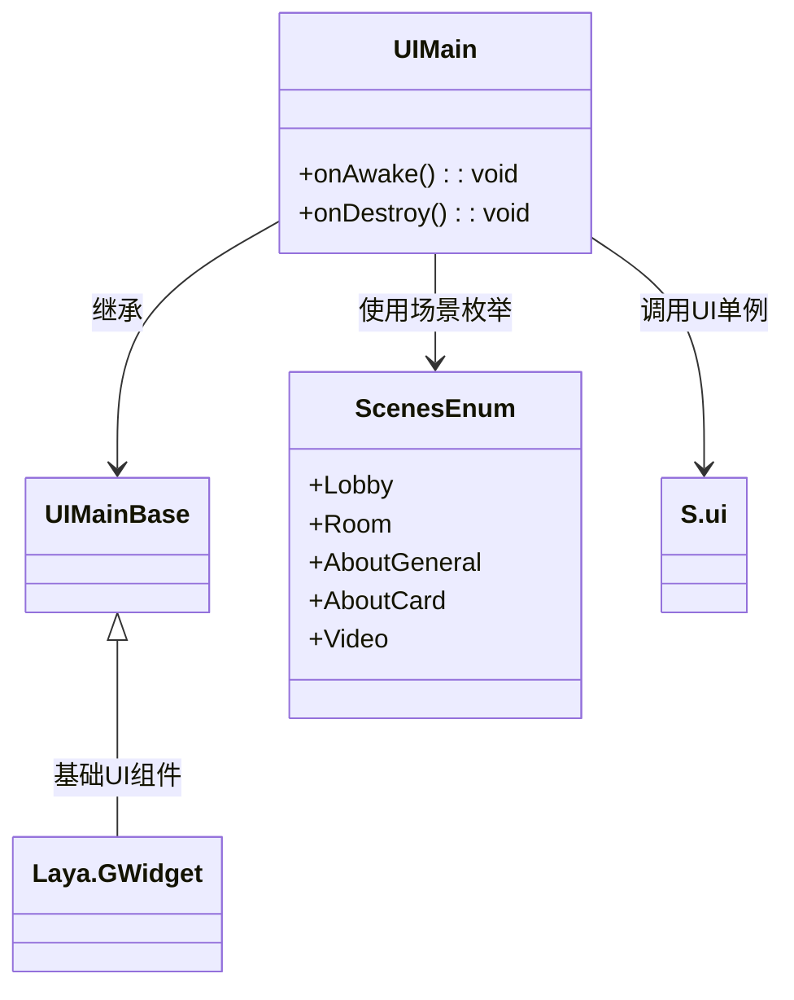
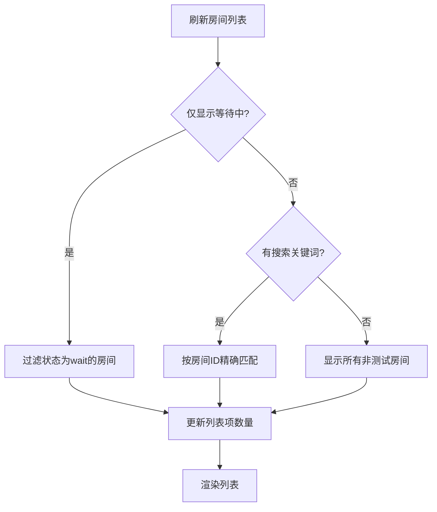
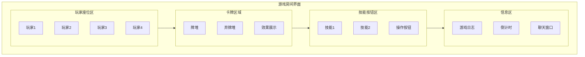

# 主界面组件

<cite>
**本文档引用文件**   
- [UIEntry.ts](file://client/src/ui/UIEntry.ts#L1-L271)
- [UIEntry.generated.ts](file://client/src/ui/UIEntry.generated.ts#L1-L21)
- [UIMain.ts](file://client/src/ui/UIMain.ts#L1-L6)
- [UIMain.generated.ts](file://client/src/ui/UIMain.generated.ts)
- [UILobby.ts](file://client/src/ui/UILobby.ts#L1-L186)
- [UILobby.generated.ts](file://client/src/ui/UILobby.generated.ts)
- [UIGameRoom.ts](file://client/src/ui/UIGameRoom.ts#L1-L6)
- [UIGameRoom.generated.ts](file://client/src/ui/UIGameRoom.generated.ts)
- [UILobbyItem.ts](file://client/src/ui/UILobbyItem.ts)
- [config.ts](file://client/src/config.ts)
- [singleton.ts](file://client/src/singleton.ts)
- [enums.ts](file://client/src/enums.ts)
</cite>

## 目录
1. [主界面组件](#主界面组件)
2. [入口界面初始化流程](#入口界面初始化流程)
3. [主菜单布局与导航](#主菜单布局与导航)
4. [游戏大厅功能实现](#游戏大厅功能实现)
5. [游戏房间界面结构](#游戏房间界面结构)
6. [界面状态管理机制](#界面状态管理机制)
7. [界面跳转与参数传递](#界面跳转与参数传递)

## 入口界面初始化流程

`UIEntry` 类是整个UI系统的入口点，负责处理用户登录、测试房间创建和大厅跳转等核心初始化操作。该类继承自 `UIEntryBase`，通过LayaAir的组件系统自动绑定UI元素。

在 `onAwake` 生命周期方法中，系统注册了三个主要按钮的点击事件监听器：
- **进入游戏按钮**：触发登录逻辑
- **测试按钮**：创建本地测试房间（仅预览模式可见）
- **大厅按钮**：直接跳转至游戏大厅

```mermaid
sequenceDiagram
participant 用户
participant UIEntry
participant S.client
participant S.ui
用户->>UIEntry : 点击“进入游戏”
UIEntry->>UIEntry : 验证账号密码
alt 输入为空
UIEntry-->>用户 : 显示提示信息
stop
end
UIEntry->>S.client : 发起连接请求
S.client->>S.client : 执行登录操作
S.client-->>UIEntry : 返回登录结果
alt 登录成功
UIEntry->>S.ui : 播放大厅BGM
UIEntry->>S.ui : 打开大厅场景
end
```

**图示来源**
- [UIEntry.ts](file://client/src/ui/UIEntry.ts#L8-L271)

**本节来源**
- [UIEntry.ts](file://client/src/ui/UIEntry.ts#L8-L271)
- [UIEntry.generated.ts](file://client/src/ui/UIEntry.generated.ts#L1-L21)

## 主菜单布局与导航

`UIMain` 类作为主菜单的逻辑控制器，结构极为简洁。其主要职责是作为场景切换的锚点，实际的UI布局由 `UIMain.generated.ts` 自动生成的基类定义。

该组件目前未实现具体功能逻辑，表明主菜单可能仅作为占位符或由其他系统动态控制。导航逻辑主要通过全局单例 `S.ui` 的 `openScene` 方法实现，支持基于枚举 `ScenesEnum` 的场景跳转。



**图示来源**
- [UIMain.ts](file://client/src/ui/UIMain.ts#L1-L6)
- [UIMain.generated.ts](file://client/src/ui/UIMain.generated.ts)

**本节来源**
- [UIMain.ts](file://client/src/ui/UIMain.ts#L1-L6)
- [enums.ts](file://client/src/enums.ts)

## 游戏大厅功能实现

`UILobby` 类实现了游戏大厅的核心功能，包括房间列表展示、筛选、搜索和房间创建。该类通过监听全局事件来动态更新UI状态。

### 房间列表管理

系统通过 `Laya.stage` 的事件机制监听 `refreshRoomList` 事件，调用 `refreshList` 方法更新房间数据。房间数据来源为 `S.client.allRooms`，支持三种过滤模式：
1. **仅显示等待中房间**：通过 `onlywait` 开关控制
2. **按房间ID搜索**：通过输入框输入精确ID
3. **显示所有公开房间**：默认模式



### 房间创建流程

创建房间时，系统从预设配置 `RoomOptions` 中克隆对应模式的选项，并允许用户自定义以下参数：
- 房间名称
- 最大玩家数量
- 密码保护
- 模式特定规则（如斗地主固定3人）

创建成功后自动跳转至游戏房间场景，并关闭当前大厅界面。

**本节来源**
- [UILobby.ts](file://client/src/ui/UILobby.ts#L1-L186)
- [config.ts](file://client/src/config.ts)
- [UILobbyItem.ts](file://client/src/ui/UILobbyItem.ts)

## 游戏房间界面结构

`UIGameRoom` 类是游戏房间的主界面控制器，目前为空实现，表明其功能可能完全由生成的基类或运行时动态逻辑处理。

该类继承自 `UIGameRoomBase`，后者由LayaAirIDE自动生成，包含所有UI元素的引用。实际的游戏房间布局可能包括：
- **玩家座位区**：按固定位置排列玩家头像和状态
- **卡牌区域**：中央区域用于展示公共卡牌和游戏效果
- **技能按钮区**：底部或侧边栏提供技能选择和操作按钮
- **聊天与信息区**：显示游戏日志和玩家交流

虽然当前代码未体现具体布局，但通过命名约定可推断其结构设计遵循典型的卡牌游戏UI模式。



**本节来源**
- [UIGameRoom.ts](file://client/src/ui/UIGameRoom.ts#L1-L6)
- [UIGameRoom.generated.ts](file://client/src/ui/UIGameRoom.generated.ts)

## 界面状态管理机制

系统采用基于事件的响应式状态管理机制，通过 `Laya.stage` 的全局事件总线实现跨组件通信。

### 状态更新模式

1. **数据变更**：由网络层或游戏逻辑触发数据更新
2. **事件广播**：通过 `Laya.stage.event()` 发送状态变更事件
3. **UI响应**：注册了对应事件的UI组件执行刷新逻辑

例如，玩家在线人数的更新流程：
```typescript
Laya.stage.on('refreshPlayerCount', () => {
    this.onlinecount.setVar('playerCount', S.client.lobbyRoom.state.playerCount);
});
```

### 断线重连处理

系统实现了完善的断线重连机制，在 `UILobby` 中监听 `onReconnectToken` 事件，当检测到重连令牌时，自动尝试加入之前的房间，提升用户体验。

**本节来源**
- [UILobby.ts](file://client/src/ui/UILobby.ts#L58-L78)
- [singleton.ts](file://client/src/singleton.ts)

## 界面跳转与参数传递

系统通过单例模式 `S.ui` 统一管理界面跳转，提供 `openScene` 和 `closeScene` 两个核心方法。

### 跳转参数传递

`openScene` 方法支持传递场景参数，采用数组形式：
```typescript
S.ui.openScene(ScenesEnum.Room, [server]);
```
此机制允许将复杂对象（如房间实例、服务器连接等）直接传递给目标场景，避免全局状态污染。

### 场景枚举控制

所有可跳转场景通过 `ScenesEnum` 枚举集中管理，确保类型安全和代码可维护性。典型跳转路径包括：
- 登录 → 大厅
- 大厅 → 游戏房间
- 大厅 → 武将图鉴
- 大厅 → 卡牌图鉴
- 大厅 → 视频中心

**本节来源**
- [UIEntry.ts](file://client/src/ui/UIEntry.ts#L45-L47)
- [UILobby.ts](file://client/src/ui/UILobby.ts#L110-L113)
- [enums.ts](file://client/src/enums.ts)