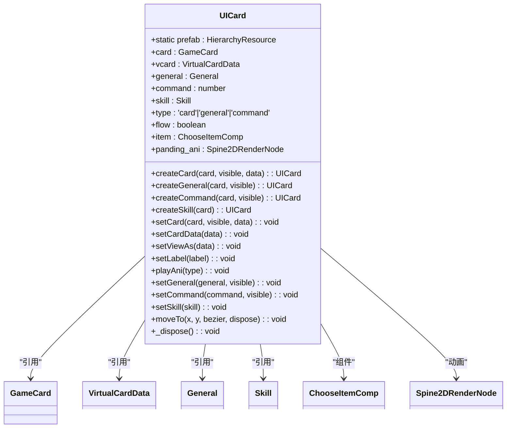

# 通用UI组件

<cite>
**本文档中引用的文件**   
- [UIWindow.ts](file://client/src/ui/UIWindow.ts)
- [UISeat.ts](file://client/src/ui/UISeat.ts)
- [UICard.ts](file://client/src/ui/UICard.ts)
- [UIEquip.ts](file://client/src/ui/UIEquip.ts)
- [UISkillButton.ts](file://client/src/ui/UISkillButton.ts)
</cite>

## 目录
1. [项目结构](#项目结构)
2. [核心组件](#核心组件)
3. [窗口基类设计模式](#窗口基类设计模式)
4. [玩家座位组件状态显示](#玩家座位组件状态显示)
5. [卡牌组件交互功能](#卡牌组件交互功能)
6. [装备栏布局与替换逻辑](#装备栏布局与替换逻辑)
7. [技能按钮状态管理](#技能按钮状态管理)
8. [组件复用与性能优化](#组件复用与性能优化)

## 项目结构

项目采用分层架构设计，主要分为客户端和服务器端两大部分。客户端代码位于`client`目录下，其中UI相关组件集中存放在`client/src/ui`目录中。UI组件采用TypeScript编写，基于Laya引擎实现，通过`.generated.ts`文件进行UI元素的自动生成和绑定。


**图示来源**
- [UIWindow.ts](file://client/src/ui/UIWindow.ts)
- [UISeat.ts](file://client/src/ui/UISeat.ts)

## 核心组件

系统包含多个核心UI组件，每个组件负责特定的用户界面功能。主要组件包括：
- **UIWindow**: 窗口基类，提供通用窗口管理功能
- **UISeat**: 玩家座位组件，显示玩家状态信息
- **UICard**: 卡牌组件，处理卡牌显示和交互
- **UIEquip**: 装备栏组件，管理装备显示
- **UISkillButton**: 技能按钮组件，控制技能使用

这些组件通过对象池模式进行管理，提高了内存使用效率和性能表现。

**组件来源**
- [UIWindow.ts](file://client/src/ui/UIWindow.ts)
- [UISeat.ts](file://client/src/ui/UISeat.ts)
- [UICard.ts](file://client/src/ui/UICard.ts)
- [UIEquip.ts](file://client/src/ui/UIEquip.ts)
- [UISkillButton.ts](file://client/src/ui/UISkillButton.ts)

## 窗口基类设计模式

### 窗口创建与管理

`UIWindow`类作为所有窗口的基类，实现了统一的窗口创建和管理机制。通过静态`create`方法创建窗口实例，使用对象池技术避免频繁的内存分配和回收。


**图示来源**
- [UIWindow.ts](file://client/src/ui/UIWindow.ts#L14-L186)

### 窗口打开/关闭动画

窗口的打开和关闭通过可见性控制实现。`set`方法初始化窗口时将`visible`设置为`false`，在`setContent`方法中设置内容后才将`visible`设为`true`，实现平滑的显示效果。

```typescript
public set(room: RoomGameComp, options: WindowOptions = {}) {
    this.room = room;
    this.isActiveClinet = true;
    this.visible = false; // 初始隐藏
    this.setOptions(options);
    // ...
}
```

### 模态遮罩与层级管理

虽然代码中未直接体现模态遮罩的实现，但通过`center()`方法确保窗口居中显示，并通过对象池管理窗口实例的生命周期，间接实现了层级管理。

### 倒计时功能

窗口内置倒计时功能，通过`startCountDown`和`endCountDown`方法控制。倒计时使用`Laya.Tween`实现平滑的进度条动画效果。


**图示来源**
- [UIWindow.ts](file://client/src/ui/UIWindow.ts#L115-L145)

**组件来源**
- [UIWindow.ts](file://client/src/ui/UIWindow.ts#L14-L186)

## 玩家座位组件状态显示

### 状态显示逻辑

`UISeat`组件负责显示玩家座位的相关状态信息，特别是国战模式下的势力选择功能。


**图示来源**
- [UISeat.ts](file://client/src/ui/UISeat.ts#L4-L45)

### 势力选择交互

组件通过为不同势力按钮注册点击事件来实现交互功能。当玩家点击某个势力按钮时，该势力的明置和暗置状态会同步切换。

```typescript
onAwake(): void {
    this.item = this.getComponent(ChooseItemComp);

    this.b_wei.on(Laya.Event.CLICK, this, () => {
        this.b_wei.grayed = this.s_wei.grayed = !this.b_wei.grayed;
        this.guozhan_mark_big.visible = false;
    });
    // 其他势力类似...
}
```

### 状态图标管理

组件通过`grayed`属性控制势力图标的灰显状态，表示该势力是否已被明置。小标记点击后会显示大标记，提供更清晰的视觉反馈。

**组件来源**
- [UISeat.ts](file://client/src/ui/UISeat.ts#L4-L45)

## 卡牌组件交互功能

### 卡牌翻转动画

`UICard`组件通过`setCard`、`setGeneral`等方法实现卡牌的翻转效果。当`visible`参数为`false`时，显示背面图像；为`true`时显示正面内容。



**图示来源**
- [UICard.ts](file://client/src/ui/UICard.ts#L26-L543)

### 悬停效果实现

虽然代码中没有直接的悬停效果实现，但通过`ChooseItemComp`组件提供了基础的交互能力，可以在此基础上扩展悬停功能。

### 拖拽交互处理

卡牌的移动通过`moveTo`方法实现，支持直线和贝塞尔曲线两种动画路径。`dispose`参数控制移动后是否自动销毁。


**图示来源**
- [UICard.ts](file://client/src/ui/UICard.ts#L500-L535)

**组件来源**
- [UICard.ts](file://client/src/ui/UICard.ts#L26-L543)

## 装备栏布局与替换逻辑

### 布局算法

`UIEquip`组件采用简单的绝对定位布局，通过`set`方法动态设置装备图标和属性显示。


**图示来源**
- [UIEquip.ts](file://client/src/ui/UIEquip.ts#L7-L43)

### 装备替换逻辑

当传入`undefined`时，组件会隐藏自身；否则根据卡牌数据更新显示内容，包括装备图标、花色和点数。

```typescript
public set(card: GameCard) {
    if (card === undefined) {
        this.card = undefined;
        this.visible = false;
        return;
    }
    this.card = card;
    this.img.loadImage(`${ServerConfig.res_url}/image/equips/${card.name}.png`);
    // 更新花色和点数显示
    this.visible = true;
}
```

**组件来源**
- [UIEquip.ts](file://client/src/ui/UIEquip.ts#L7-L43)

## 技能按钮状态管理

### 冷却状态显示

`UISkillButton`组件通过不同的图片资源显示技能的不同状态，包括主动技能、锁定技、觉醒技和限定技。


**图示来源**
- [UISkillButton.ts](file://client/src/ui/UISkillButton.ts#L8-L73)

### 激活条件判断

组件通过检查技能效果的标签来确定显示状态：

```typescript
set(skill: Skill, mode: number = 1) {
    this.skill = skill;
    if (!skill) return;
    let image = 'resources/buttons/texture/proactive.png';
    if (skill.effects.every((v) => v.hasTag(SkillTag.Lock))) {
        image = 'resources/buttons/texture/lock2.png';
    }
    if (skill.effects.find((v) => v.hasTag(SkillTag.Awake))) {
        image = 'resources/buttons/texture/awake.png';
    }
    if (skill.effects.find((v) => v.hasTag(SkillTag.Limit))) {
        image = 'resources/buttons/texture/limit.png';
    }
    // 更新图片和文本
}
```

### 状态管理机制

组件实现了`onGet`和`onRet`生命周期方法，确保从对象池获取和归还时的状态正确性。

**组件来源**
- [UISkillButton.ts](file://client/src/ui/UISkillButton.ts#L8-L73)

## 组件复用与性能优化

### 对象池模式应用

所有UI组件都实现了对象池模式，通过`getObjectFromPool`和`retObjectFromPool`方法管理实例生命周期，避免频繁的创建和销毁操作。

```typescript
private static _create() {
    if (!this.prefab) {
        this.prefab = Laya.loader.getRes('resources/card/card.lh');
    }
    const node = S.ui.getObjectFromPool(EntityTypeEnum.Card, () => {
        return this.prefab.create() as UICard;
    }) as UICard;
    return node;
}
```

### 资源预加载

组件使用静态`prefab`属性缓存预制资源，避免重复加载，提高创建效率。

### 事件清理机制

在`onRet`和`destroy`方法中及时清理事件监听器和定时器，防止内存泄漏。

```typescript
onRet(): void {
    Laya.Tween.killAll(this);
    this.clearTimer(this, this._dispose);
    if (this.item) {
        this.item.onClick(undefined);
        this.item.setCanClick(true);
        this.item.setSelected(false);
        this.item.onLongClick(undefined);
    }
    // 清理其他状态
}
```

### 性能优化建议

1. **批量更新**: 对于频繁更新的UI元素，考虑批量更新而非逐个更新
2. **懒加载**: 对于不常用的资源，采用懒加载策略
3. **缓存计算结果**: 对于复杂的布局计算，缓存结果避免重复计算
4. **减少重绘**: 合理使用`visible`属性而非频繁创建销毁
5. **优化动画**: 使用硬件加速的CSS3动画替代JavaScript动画

**优化来源**
- [UIWindow.ts](file://client/src/ui/UIWindow.ts)
- [UICard.ts](file://client/src/ui/UICard.ts)
- [UISkillButton.ts](file://client/src/ui/UISkillButton.ts)