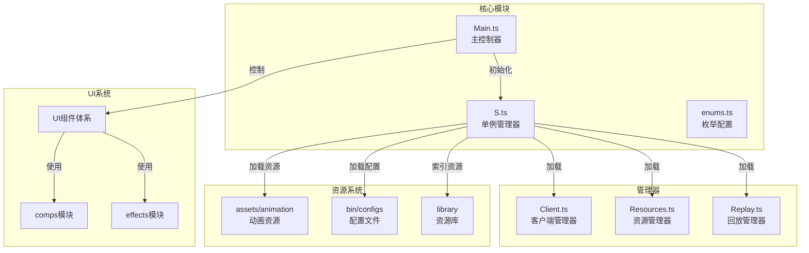
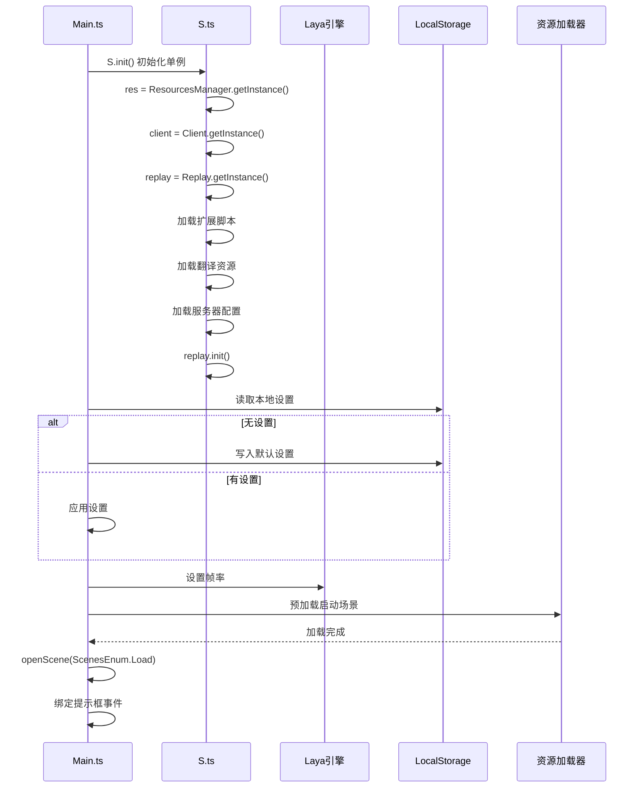

# 前端目录结构

<cite>
**本文档引用文件**  
- [Main.ts](file://client/src/Main.ts)
- [enums.ts](file://client/src/enums.ts)
- [singleton.ts](file://client/src/singleton.ts)
- [tsconfig.json](file://client/tsconfig.json)
- [config.development.json](file://client/bin/configs/config.development.json)
- [config.production.json](file://client/bin/configs/config.production.json)
</cite>

## 目录

1. [项目结构概览](#项目结构概览)
2. [src源码模块解析](#src源码模块解析)
3. [资源目录组织结构](#资源目录组织结构)
4. [TypeScript配置说明](#typescript配置说明)
5. [前端架构与初始化流程](#前端架构与初始化流程)

## 项目结构概览

前端项目位于`client`目录下，采用模块化分层架构设计。主要包含以下核心目录：

- **assets**: 静态资源目录，存放动画、配置等资源文件
- **bin**: 构建输出与配置目录，包含环境配置和HTML入口
- **engine**: 引擎类型定义文件
- **library**: 资源库文件，按哈希值分目录存储
- **local**: 本地开发环境配置
- **release**: 发布版本输出目录
- **settings**: 项目构建设置
- **src**: 源代码主目录
- **package.json**: 项目依赖配置
- **tsconfig.json**: TypeScript编译配置

**Section sources**
- [tsconfig.json](file://client/tsconfig.json)

## src源码模块解析

### 组件模块（comps）

`src/comps`目录存放UI组件类，按功能模块划分：
- **choose**: 选择相关组件（武将、卡牌等）
- **player**: 玩家相关组件（座位、玩家信息等）
- **room**: 房间游戏组件（游戏动画、卡牌、消息等）

这些组件通过LayaAir的组件系统实现，负责具体UI元素的逻辑控制。

### 特效模块（effects）

`src/effects`目录存放角色技能特效类，每个武将对应一组.ts和.generated.ts文件：
- caomao: 曹操技能特效
- shenlusu: 神鲁肃技能特效
- shichangshi: 史苌氏技能特效
- shitaishici: 史太史慈技能特效

.generated.ts为自动生成的代码文件，.ts为可编辑的逻辑文件。

### 管理器模块（mgr）

`src/mgr`目录存放核心管理器单例：
- **Client.ts**: 客户端网络通信管理器
- **Replay.ts**: 回放系统管理器
- **Resources.ts**: 资源管理器

这些管理器通过单例模式全局访问，实现系统级功能管理。

### 数据模型（models）

`src/models`目录存放状态数据模型：
- **LobbyState.ts**: 大厅状态模型
- **RoomStata.ts**: 房间状态模型

定义了前端应用的状态结构和数据契约。

### 界面模块（ui）

`src/ui`目录存放所有UI界面类，采用生成模式：
- 每个UI界面有`.generated.ts`（自动生成）和`.ts`（可编辑）两个文件
- 包含从主界面到各种弹窗的完整UI体系
- 如UIMain、UIAbout、UICard、UIGameRoom等

**Section sources**
- [Main.ts](file://client/src/Main.ts)
- [enums.ts](file://client/src/enums.ts)

## 资源目录组织结构

### 动画资源（assets\animation）

动画资源按功能分类组织：
- **aozhanbg**: 傲战背景动画
- **biaojichufa**: 标记触发动画
- **border**: 边框特效
- **face**: 表情动画（玫瑰、捧杯等）
- **generlas**: 武将专属特效（曹操、神鲁肃等）
- **hongsha**: 红杀特效
- **huanhua_bagua**: 幻化八卦特效
- **jiu**: 酒特效
- **mingguangkai1/2**: 明光铠特效
- **sanjianliangrendao**: 三尖两刃刀特效
- **save**: 救我特效
- **tao**: 桃特效
- **wuliujian**: 乌雷剑特效

### 配置文件（bin/configs）

配置文件区分环境：
- **config.development.json**: 开发环境配置
- **config.production.json**: 生产环境配置

包含服务器地址、端口、资源URL等关键配置。

### 资源库（library）

`library`目录采用哈希分片存储策略：
- 按前两位十六进制数分66个子目录（00-ff）
- 存储JSON格式的资源元数据
- 实现资源的高效索引和加载

**Section sources**
- [config.development.json](file://client/bin/configs/config.development.json)
- [config.production.json](file://client/bin/configs/config.production.json)

## TypeScript配置说明

`tsconfig.json`配置文件定义了TypeScript编译选项：

```json
{
    "compilerOptions": {
        "module": "ESNext",
        "target": "es6",
        "lib": ["ESNext", "DOM"],
        "strict": true,
        "strictNullChecks": false,
        "strictFunctionTypes": false,
        "noEmitHelpers": true,
        "sourceMap": false,
        "experimentalDecorators": true,
        "skipLibCheck": true,
        "moduleResolution": "node",
        "allowSyntheticDefaultImports": true,
        "paths": {
            "~/packages/*": ["./library/packages/*"]
        }
    },
    "include": ["./assets", "./src", "./engine"],
    "exclude": ["./src/extensions"]
}
```

关键配置说明：
- **module**: 使用ESNext模块系统
- **target**: 编译目标为ES6
- **lib**: 包含ESNext和DOM库
- **experimentalDecorators**: 启用装饰器语法（用于LayaAir组件）
- **paths**: 配置路径别名，~/packages指向library/packages
- **include/exclude**: 指定编译范围

**Section sources**
- [tsconfig.json](file://client/tsconfig.json)

## 前端架构与初始化流程

### 前端架构图



**Diagram sources**
- [Main.ts](file://client/src/Main.ts)
- [singleton.ts](file://client/src/singleton.ts)
- [enums.ts](file://client/src/enums.ts)

### 初始化流程分析

`Main.ts`作为应用入口，其`onAwake`方法实现初始化流程：



**关键初始化步骤：**
1. **单例初始化**: 通过`S.init()`创建各管理器实例
2. **配置加载**: 从localStorage读取用户设置，从config文件读取服务器配置
3. **资源预加载**: 加载启动场景和基础资源
4. **事件绑定**: 设置UI交互事件监听

该流程确保了应用启动时各模块的正确初始化和依赖关系建立。

**Section sources**
- [Main.ts](file://client/src/Main.ts#L0-L161)
- [singleton.ts](file://client/src/singleton.ts#L0-L57)