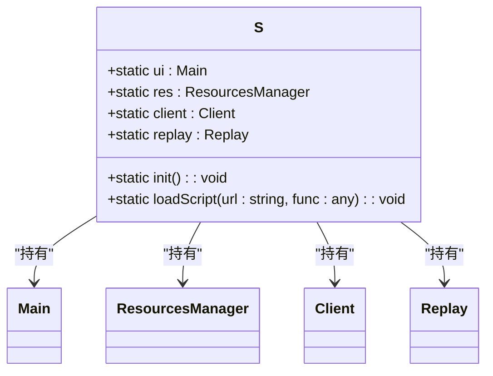
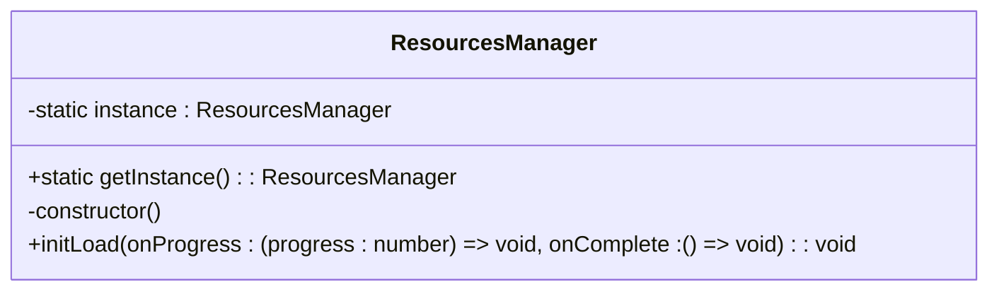
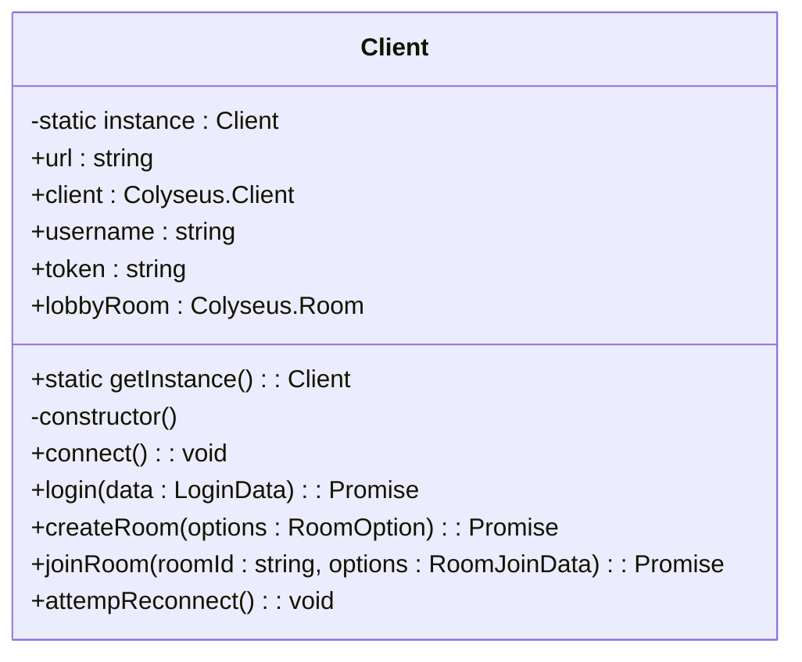
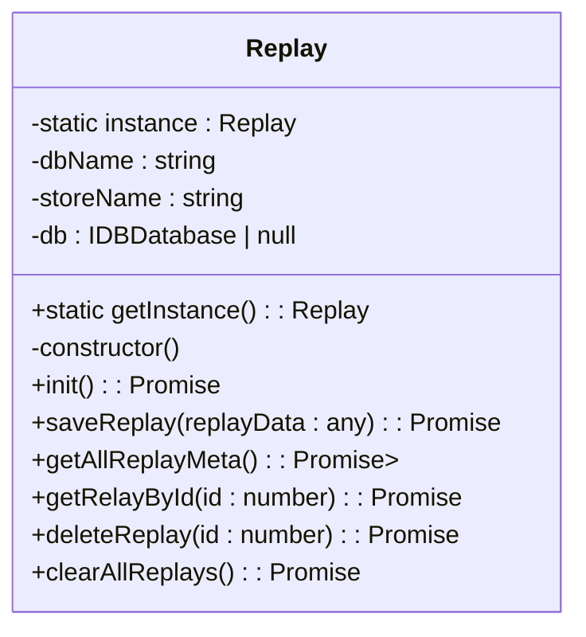
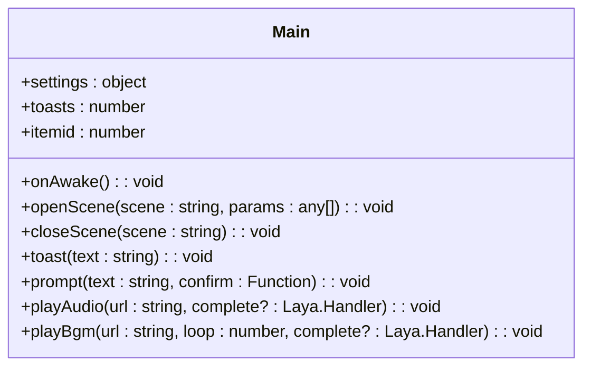

# 单例模式

<cite>
**本文档中引用的文件**   
- [singleton.ts](file://client/src/singleton.ts#L1-L57)
- [Resources.ts](file://client/src/mgr/Resources.ts#L2-L29)
- [Client.ts](file://client/src/mgr/Client.ts#L24-L366)
- [Replay.ts](file://client/src/mgr/Replay.ts#L2-L186)
- [Main.ts](file://client/src/Main.ts#L8-L160)
</cite>

## 目录
1. [简介](#简介)
2. [项目结构](#项目结构)
3. [核心组件](#核心组件)
4. [架构概述](#架构概述)
5. [详细组件分析](#详细组件分析)
6. [依赖关系分析](#依赖关系分析)
7. [性能考虑](#性能考虑)
8. [故障排除指南](#故障排除指南)
9. [结论](#结论)

## 简介
本文档深入探讨了游戏客户端中单例模式的实现与应用。重点分析 `singleton.ts` 文件中全局状态管理器的设计原理和实现细节，阐述单例模式在状态共享、组件通信中的关键作用。文档涵盖单例对象的生命周期管理、多单例协作时的依赖关系、最佳实践以及扩展使用方法，旨在为开发者提供全面的技术指导。

## 项目结构
项目采用典型的客户端-服务器架构，客户端代码位于 `client` 目录下。核心逻辑和单例模式的实现集中在 `client/src` 目录中。`singleton.ts` 作为全局服务的注册中心，通过静态属性暴露多个单例实例，这些实例在应用启动时被初始化并贯穿整个生命周期。

**文档来源**
- [singleton.ts](file://client/src/singleton.ts#L1-L57)

## 核心组件
`S` 类是整个客户端应用的核心单例管理器。它通过静态方法 `init()` 集中初始化所有关键服务，并将这些服务的单例实例挂载为自身的静态属性，从而为整个应用提供一个统一的、全局可访问的接口。

**Section sources**
- [singleton.ts](file://client/src/singleton.ts#L4-L57)

## 架构概述
系统架构围绕 `S` 类构建，该类作为全局服务的枢纽，协调资源管理、网络通信、回放系统和UI控制等核心模块。各模块通过单例模式确保其唯一性和全局可访问性。

```mermaid
graph TB
S[S类<br/>单例管理器] --> ResourcesManager[ResourcesManager<br/>资源管理器]
S --> Client[Client<br/>网络客户端]
S --> Replay[Replay<br/>回放系统]
S --> Main[Main<br/>主UI控制器]
S --> sgs[sgs<br/>核心游戏逻辑]
subgraph "初始化流程"
Init[init()] --> LoadConfig[加载配置文件]
Init --> InitReplay[初始化回放系统]
Init --> LoadExtensions[加载扩展脚本]
end
S -.-> Init
```

**Diagram sources**
- [singleton.ts](file://client/src/singleton.ts#L4-L57)

## 详细组件分析

### S类分析
`S` 类是一个抽象类，其主要职责是作为全局服务的容器和初始化器。它不直接实现单例模式，而是通过调用其他类的 `getInstance()` 方法来获取并持有这些单例实例。

#### 类图


**Diagram sources**
- [singleton.ts](file://client/src/singleton.ts#L4-L57)

### 资源管理器 (ResourcesManager)
`ResourcesManager` 是一个典型的单例类，用于管理游戏资源的加载。它通过私有的静态 `instance` 属性和 `getInstance()` 方法确保全局唯一性。

#### 类图


**Diagram sources**
- [Resources.ts](file://client/src/mgr/Resources.ts#L2-L29)

### 网络客户端 (Client)
`Client` 类封装了与服务器的网络通信，包括连接、登录、创建房间、加入房间等操作。它同样遵循单例模式，确保整个应用使用同一个网络连接实例。

#### 类图


**Diagram sources**
- [Client.ts](file://client/src/mgr/Client.ts#L24-L366)

### 回放系统 (Replay)
`Replay` 类负责游戏回放数据的本地存储和管理，使用 IndexedDB 进行持久化。它也实现了单例模式，以保证对数据库的访问是线程安全的。

#### 类图


**Diagram sources**
- [Replay.ts](file://client/src/mgr/Replay.ts#L2-L186)

### 主UI控制器 (Main)
`Main` 类是游戏主界面的控制器，它本身通过 `S.ui` 被注册为一个全局单例。它负责管理场景切换、UI弹窗、音效播放等。

#### 类图


**Diagram sources**
- [Main.ts](file://client/src/Main.ts#L8-L160)

## 依赖关系分析
`S` 类是整个依赖关系的核心。在 `init()` 方法中，它按特定顺序初始化各个服务，形成了明确的依赖链。

```mermaid
flowchart TD
Start([S.init()]) --> InitRes["初始化资源管理器<br/>S.res = ResourcesManager.getInstance()"]
InitRes --> InitClient["初始化网络客户端<br/>S.client = Client.getInstance()"]
InitClient --> InitReplay["初始化回放系统<br/>S.replay = Replay.getInstance()"]
InitReplay --> LoadConfig["加载服务器配置<br/>从JSON文件读取"]
LoadConfig --> InitReplaySys["调用S.replay.init()"]
InitReplaySys --> End([初始化完成])
```

**Diagram sources**
- [singleton.ts](file://client/src/singleton.ts#L4-L57)

## 性能考虑
单例模式在此项目中的应用极大地优化了性能和资源管理：
1.  **资源复用**：`ResourcesManager` 确保资源只被加载一次，避免了重复加载的开销。
2.  **连接复用**：`Client` 单例维护单一的WebSocket连接，减少了网络开销和服务器压力。
3.  **内存效率**：通过全局唯一实例，避免了创建多个功能相同对象的内存浪费。
4.  **启动优化**：所有服务在启动时集中初始化，可以进行批处理和进度反馈，提升用户体验。

## 故障排除指南
在使用单例模式时，可能会遇到以下问题：

1.  **初始化顺序错误**：如果在 `S.init()` 执行前就访问了 `S` 的某个属性（如 `S.client`），会得到 `undefined`。**解决方案**：确保所有对 `S` 的访问都在 `Main.onAwake()` 或之后进行。

2.  **内存泄漏**：单例对象的生命周期与应用相同，如果持有对其他对象的强引用，可能导致这些对象无法被垃圾回收。**解决方案**：在单例对象中，对不再需要的引用及时置为 `null`。

3.  **线程安全问题**：虽然JavaScript是单线程的，但在异步操作中仍需注意状态一致性。**解决方案**：`Client` 和 `Replay` 类在处理异步操作时，都使用了 `Promise` 和事件机制，保证了操作的原子性。

**Section sources**
- [singleton.ts](file://client/src/singleton.ts#L4-L57)
- [Client.ts](file://client/src/mgr/Client.ts#L24-L366)
- [Replay.ts](file://client/src/mgr/Replay.ts#L2-L186)

## 结论
本项目中的单例模式实现是高效且合理的。`S` 类作为全局服务的注册表，简化了组件间的通信，实现了状态的全局共享。`ResourcesManager`、`Client` 和 `Replay` 等核心模块通过单例模式，确保了资源、连接和数据的一致性与唯一性。这种设计模式非常适合游戏客户端这种需要全局状态管理和高效组件通信的场景。遵循本文档的最佳实践，可以有效避免常见问题，构建出稳定、高性能的应用。