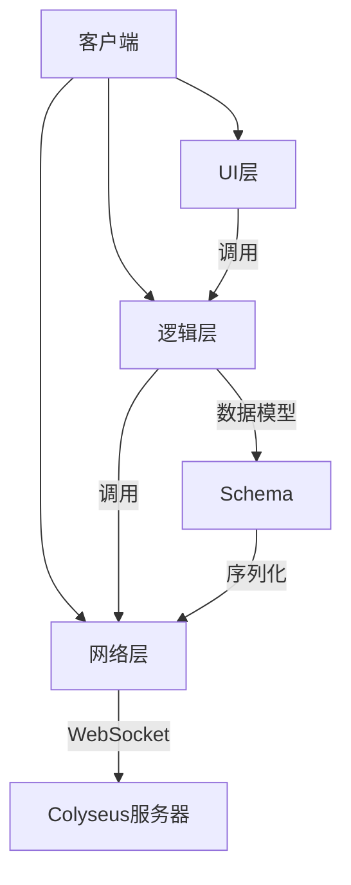
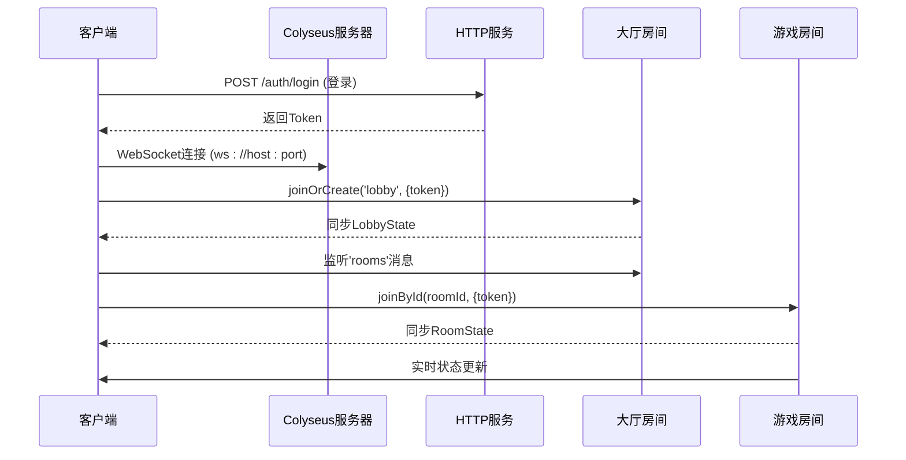
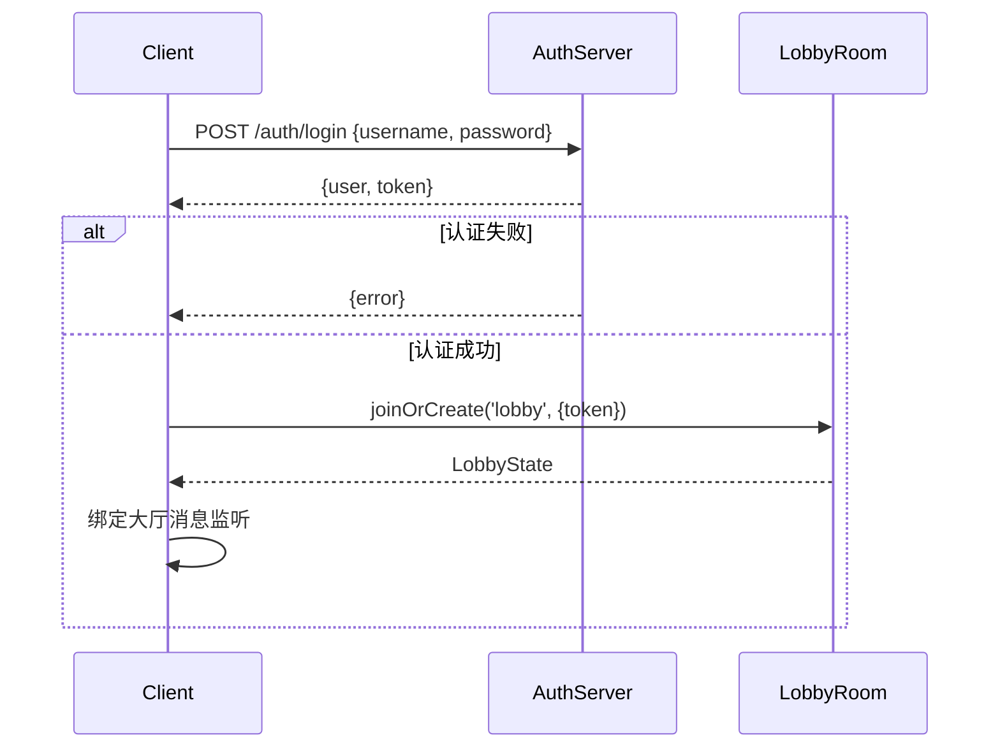
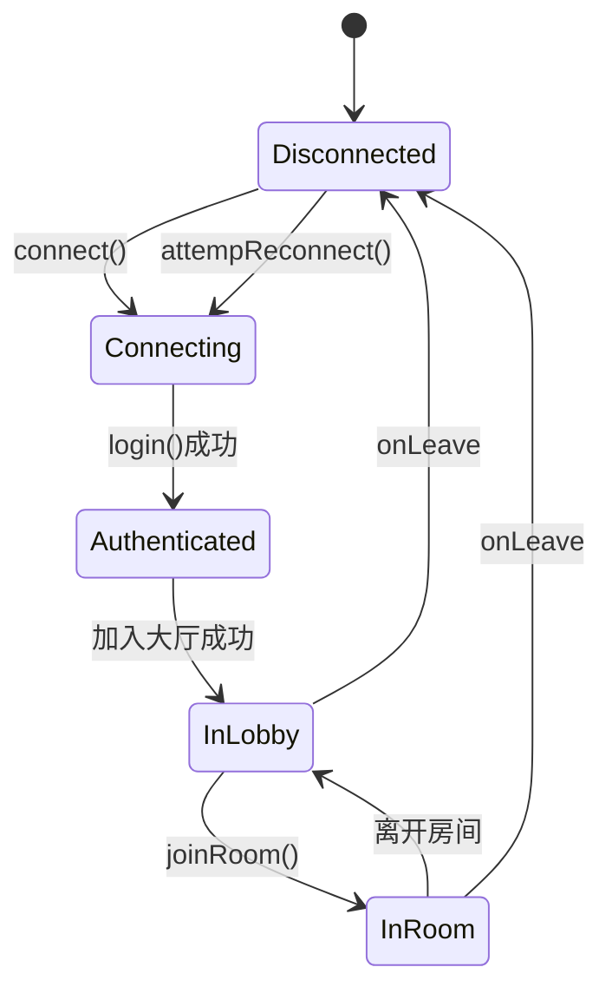
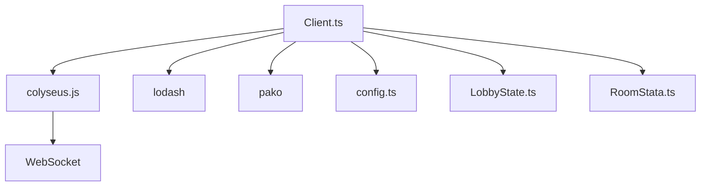

# 客户端连接管理

<cite>
**本文档引用文件**  
- [Client.ts](file://client/src/mgr/Client.ts)
- [config.ts](file://client/src/config.ts)
- [LobbyState.ts](file://client/src/models/LobbyState.ts)
- [RoomStata.ts](file://client/src/models/RoomStata.ts)
- [types.ts](file://client/src/core/types.ts)
- [enums.ts](file://client/src/core/enums.ts)
- [package.json](file://client/package.json)
</cite>

## 目录
1. [简介](#简介)
2. [项目结构](#项目结构)
3. [核心组件](#核心组件)
4. [架构概览](#架构概览)
5. [详细组件分析](#详细组件分析)
6. [依赖分析](#依赖分析)
7. [性能考虑](#性能考虑)
8. [故障排除指南](#故障排除指南)
9. [结论](#结论)

## 简介
本文档详细阐述了基于Colyseus框架的客户端连接管理机制。重点分析了`Client.ts`中的WebSocket连接建立、维护、断线重连、认证流程、消息序列化与反序列化、连接状态生命周期、错误处理策略以及性能优化技巧。通过代码示例和架构图，为开发者提供全面的连接管理实践指导。

## 项目结构
客户端项目采用模块化设计，主要结构如下：
- `client/assets`: 游戏资源（动画、音效、图片）
- `client/bin`: 构建输出和配置文件
- `client/src`: 核心源代码
  - `comps`: UI组件
  - `effects`: 特效逻辑
  - `mgr`: 管理器（核心的`Client.ts`在此）
  - `models`: 数据模型（Colyseus Schema）
  - `server`: 服务器通信接口
  - `ui`: 界面脚本
  - 其他工具类（`config.ts`, `enums.ts`等）



**图示来源**
- [Client.ts](file://client/src/mgr/Client.ts)
- [LobbyState.ts](file://client/src/models/LobbyState.ts)

**本节来源**
- [Client.ts](file://client/src/mgr/Client.ts)
- [project_structure](file://workspace)

## 核心组件
`Client.ts`是客户端连接管理的核心，封装了与Colyseus服务器的所有交互。它是一个单例类，确保全局唯一的连接实例。主要职责包括：
- WebSocket连接的建立与销毁
- 用户登录与身份认证
- 大厅（Lobby）和游戏房间（Room）的加入与离开
- 消息监听与事件分发
- 断线重连机制
- 错误处理与用户提示

**本节来源**
- [Client.ts](file://client/src/mgr/Client.ts#L1-L368)

## 架构概览
系统采用客户端-服务器（C/S）架构，通过WebSocket进行实时通信。客户端通过`colyseus.js`库与后端`Colyseus`服务器交互。通信分为两个主要通道：
1.  **HTTP通道**：用于登录、广播等非实时操作。
2.  **WebSocket通道**：用于实时同步大厅和房间状态。



**图示来源**
- [Client.ts](file://client/src/mgr/Client.ts#L100-L150)
- [UserManager.ts](file://server/src/UserManager.ts#L86-L128)
- [lobby.ts](file://server/src/rooms/lobby.ts#L36-L57)

## 详细组件分析

### 客户端连接初始化
连接的建立始于`connect()`方法。该方法检查并创建一个`Colyseus.Client`实例，使用`config.ts`中定义的服务器地址和端口。

```typescript
connect() {
    if (this.client) return;
    const url = `${ServerConfig.host}:${ServerConfig.port}`;
    let client = new Colyseus.Client(`ws://${url}`);
    this.url = url;
    this.client = client;
}
```
此方法确保连接的幂等性，避免重复创建。

**本节来源**
- [Client.ts](file://client/src/mgr/Client.ts#L60-L67)
- [config.ts](file://client/src/config.ts#L1-L10)

### 连接认证与登录流程
登录流程是安全通信的基础，分为HTTP认证和WebSocket连接两个阶段。

#### 认证流程
1.  **HTTP认证**：客户端通过`client.http.post`向`/auth/login`发送用户名和密码。
2.  **获取Token**：服务器验证成功后返回用户信息和一个JWT Token。
3.  **加入大厅**：客户端使用Token通过`joinOrCreate('lobby')`加入大厅房间。



**图示来源**
- [Client.ts](file://client/src/mgr/Client.ts#L70-L110)
- [UserManager.js](file://server/build/UserManager.js#L69-L113)

**本节来源**
- [Client.ts](file://client/src/mgr/Client.ts#L70-L110)
- [types.ts](file://client/src/core/types.ts#L11-L20)

### 消息序列化与反序列化
客户端使用`@colyseus/schema`库进行高效的数据同步。`LobbyState`和`RoomState`都继承自`Schema`类，其字段通过`@type`装饰器声明。

- **序列化**：当服务器修改状态时，`@colyseus/schema`会计算出最小的变更数据包（patch）。
- **反序列化**：客户端收到patch后，自动更新本地的`LobbyState`或`RoomState`实例。

```typescript
// RoomStata.ts
export class RoomState extends Schema {
    @type({ map: PlayerState })
    public players = new MapSchema<PlayerState>();
    // ...
}
```
这种机制极大地减少了网络传输量。

**本节来源**
- [RoomStata.ts](file://client/src/models/RoomStata.ts#L50-L110)
- [LobbyState.ts](file://client/src/models/LobbyState.ts#L1-L9)

### 连接状态生命周期
连接状态的完整生命周期由`Client`类管理，从初始化到最终断开。



**图示来源**
- [Client.ts](file://client/src/mgr/Client.ts#L112-L150)
- [Client.ts](file://client/src/mgr/Client.ts#L200-L230)

**本节来源**
- [Client.ts](file://client/src/mgr/Client.ts)

### 断线重连机制
`Client`类实现了指数退避的断线重连策略，以应对网络波动。

1.  **触发**：当`lobbyRoom.onLeave`事件被触发时，调用`attempReconnect()`。
2.  **重试**：重连尝试次数递增，延迟时间按2的幂次增长（1s, 2s, 4s, 8s, 16s）。
3.  **恢复**：成功重连后，重置尝试次数并重新绑定消息监听。

```typescript
public attempReconnect() {
    if (this.reconnectAttempts >= this.maxReconnectAttempts) {
        S.ui.toast('网络异常，请刷新重试');
        return;
    }
    this.reconnectAttempts++;
    const delay = this.reconnectDelay * Math.pow(2, this.reconnectAttempts - 1);
    // ...
    setTimeout(async () => {
        const lobby = await this.client.joinOrCreate('lobby', { username: this.username });
        // ...
    }, delay);
}
```

**本节来源**
- [Client.ts](file://client/src/mgr/Client.ts#L200-L230)

### 错误处理策略
客户端对不同类型的错误进行了分类处理，并向用户展示友好的提示。

- **网络异常**：在`catch`块中捕获，提示“未连接服务器”。
- **认证失败**：根据`ServerCode`枚举映射错误码到中文提示。
- **房间加入失败**：如“房间已经开始游戏”、“密码错误”等。

```typescript
const codes = {
    [ServerCode.AuthError]: '登录状态失效，请刷新重试',
    [ServerCode.AlreadyJoined]: '您已经在房间中',
    // ...
};

toastEroor(e: { code: ServerCode }) {
    if ((codes as any)[e.code]) {
        S.ui.toast((codes as any)[e.code]);
    }
}
```

**本节来源**
- [Client.ts](file://client/src/mgr/Client.ts#L232-L240)
- [enums.ts](file://client/src/core/enums.ts#L1-L20)

### 连接性能优化
#### 心跳与状态同步
Colyseus内置了心跳机制，客户端会定期向服务器发送心跳包以维持连接。状态同步采用增量更新（patch），只传输变化的数据。

#### 连接池管理
本项目未显式实现连接池，但通过单例模式的`Client`类，确保了整个应用生命周期内只有一个WebSocket连接，避免了连接资源的浪费。

## 依赖分析
客户端主要依赖以下外部库：
- `colyseus.js`: 核心的WebSocket客户端库，用于连接Colyseus服务器。
- `lodash`: 提供实用的JavaScript工具函数。
- `pako`: 用于数据压缩。



**图示来源**
- [package.json](file://client/package.json#L1-L20)
- [Client.ts](file://client/src/mgr/Client.ts)

**本节来源**
- [package.json](file://client/package.json)
- [Client.ts](file://client/src/mgr/Client.ts)

## 性能考虑
- **减少消息体积**：使用`@colyseus/schema`的patch机制，仅同步变更数据。
- **连接复用**：单例模式避免了频繁创建和销毁WebSocket连接。
- **指数退避重连**：避免在网络不稳定时产生过多的无效连接请求。
- **异步操作**：所有网络请求均使用`async/await`，避免阻塞UI线程。

## 故障排除指南
- **无法连接服务器**：检查`config.ts`中的`host`和`port`是否正确，确认服务器已启动。
- **登录失败**：检查用户名密码，确认服务器`/auth/login`接口正常。
- **状态不同步**：检查`@type`装饰器是否正确应用，确保客户端和服务器的Schema定义一致。
- **频繁断线**：检查网络状况，或调整`maxReconnectAttempts`和`reconnectDelay`参数。

**本节来源**
- [Client.ts](file://client/src/mgr/Client.ts)
- [config.ts](file://client/src/config.ts)

## 结论
`Client.ts`模块提供了一套完整、健壮的客户端连接管理方案。它基于Colyseus框架，实现了安全的认证、高效的实时同步、智能的断线重连和清晰的错误处理。通过合理的架构设计和性能优化，确保了游戏客户端与服务器之间稳定、低延迟的通信，为上层游戏逻辑提供了坚实的基础。