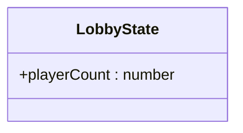
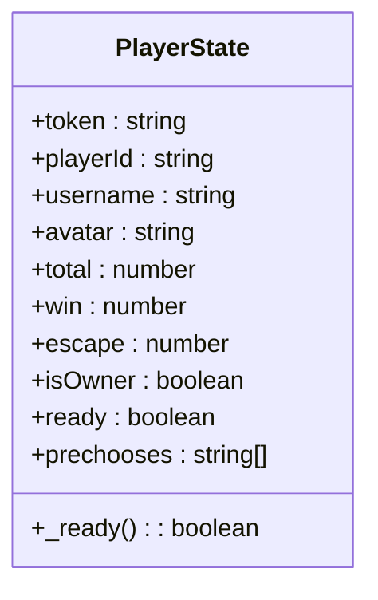
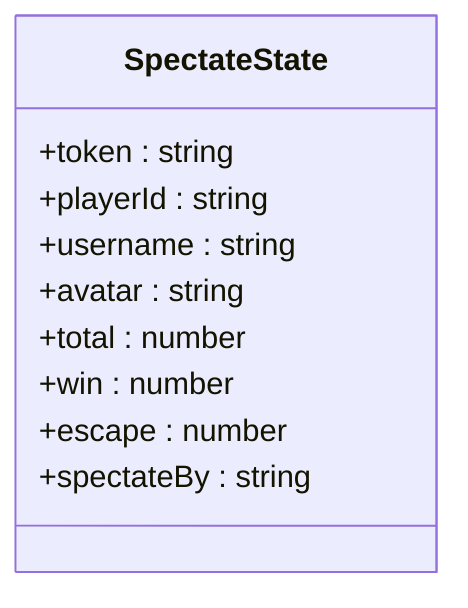
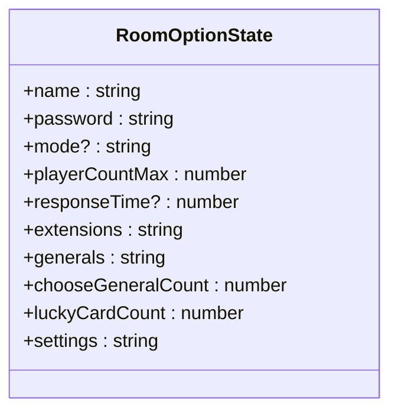
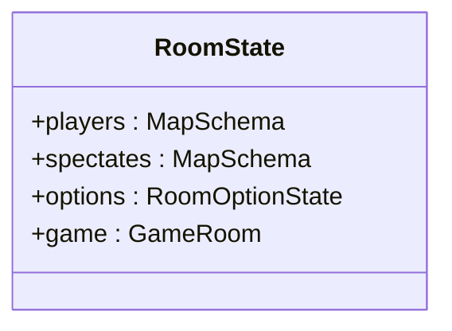
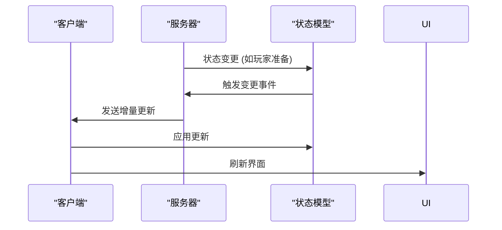
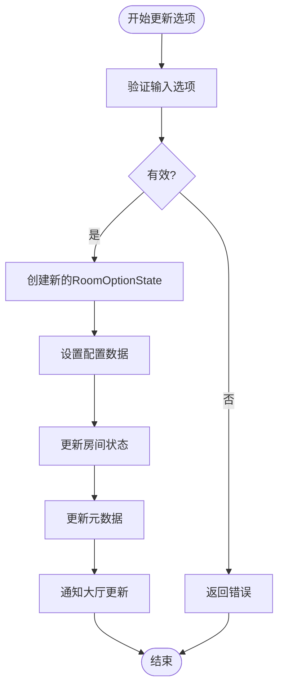

# 数据模型

<cite>
**本文档引用文件**   
- [LobbyState.ts](file://client/src/models/LobbyState.ts)
- [RoomStata.ts](file://client/src/models/RoomStata.ts)
- [LobbyState.ts](file://server/src/models/LobbyState.ts)
- [RoomStata.ts](file://server/src/models/RoomStata.ts)
- [game.ts](file://server/src/rooms/game.ts)
</cite>

## 目录
1. [引言](#引言)
2. [项目结构](#项目结构)
3. [核心数据模型](#核心数据模型)
4. [大厅状态模型分析](#大厅状态模型分析)
5. [房间状态模型分析](#房间状态模型分析)
6. [状态同步与序列化机制](#状态同步与序列化机制)
7. [版本控制与向后兼容策略](#版本控制与向后兼容策略)
8. [数据验证与异常处理](#数据验证与异常处理)
9. [状态转换与游戏场景](#状态转换与游戏场景)
10. [扩展最佳实践](#扩展最佳实践)

## 引言

本文档深入分析游戏客户端与服务器端的数据模型设计，重点解析 `LobbyState` 和 `RoomStata` 两个核心状态类的结构与功能。文档将详细阐述状态数据的定义、同步机制、验证规则以及在实际游戏场景中的应用，为开发者提供全面的数据模型理解与扩展指导。

## 项目结构

游戏项目采用前后端分离架构，客户端与服务器端分别维护各自的状态模型文件。核心数据模型位于 `src/models` 目录下，通过 Colyseus 框架实现状态的自动同步。

```mermaid
graph TB
subgraph "客户端"
CL[client/src/models]
CL --> CLS[LobbyState.ts]
CL --> CRS[RoomStata.ts]
end
subgraph "服务器端"
SL[server/src/models]
SL --> SLS[LobbyState.ts]
SL --> SRS[RoomStata.ts]
end
CLS < --> SLS
CRS < --> SRS
```

**图示来源**
- [LobbyState.ts](file://client/src/models/LobbyState.ts)
- [LobbyState.ts](file://server/src/models/LobbyState.ts)
- [RoomStata.ts](file://client/src/models/RoomStata.ts)
- [RoomStata.ts](file://server/src/models/RoomStata.ts)

**本节来源**
- [LobbyState.ts](file://client/src/models/LobbyState.ts)
- [RoomStata.ts](file://client/src/models/RoomStata.ts)

## 核心数据模型

系统定义了两组核心状态模型：大厅状态（LobbyState）和房间状态（RoomStata），分别管理玩家在大厅和游戏房间中的数据。

### 模型对比

| 模型 | 客户端字段 | 服务器端字段 | 用途 |
|------|-----------|------------|------|
| **LobbyState** | playerCount, players | playerCount | 管理大厅玩家列表与计数 |
| **RoomStata** | PlayerState, SpectateState, RoomOptionState, RoomState | PlayerState, SpectateState, RoomOptionState, RoomState | 管理房间内玩家、旁观者、房间选项和游戏实例 |

**本节来源**
- [LobbyState.ts](file://client/src/models/LobbyState.ts)
- [LobbyState.ts](file://server/src/models/LobbyState.ts)
- [RoomStata.ts](file://client/src/models/RoomStata.ts)
- [RoomStata.ts](file://server/src/models/RoomStata.ts)

## 大厅状态模型分析

### 客户端大厅状态 (LobbyState)

```mermaid
classDiagram
class LobbyState {
+players : Map<string, { username : string; status : string }>
+playerCount : number
}
```

**图示来源**
- [LobbyState.ts](file://client/src/models/LobbyState.ts#L3-L7)

**本节来源**
- [LobbyState.ts](file://client/src/models/LobbyState.ts#L1-L8)

#### 字段说明

- **players**: `Map<string, { username: string; status: string }>`  
  存储大厅中所有玩家的信息，键为玩家ID，值为包含用户名和状态的对象。用于在UI上显示玩家列表。

- **playerCount**: `number`  
  当前大厅在线玩家数量，用 `@type('number')` 装饰器标记，确保能被 Colyseus 正确序列化和同步。

### 服务器端大厅状态 (LobbyState)



**图示来源**
- [LobbyState.ts](file://server/src/models/LobbyState.ts#L3-L5)

**本节来源**
- [LobbyState.ts](file://server/src/models/LobbyState.ts#L1-L6)

#### 字段说明

- **playerCount**: `number`  
  服务器端仅维护玩家计数，实际的玩家详细信息由房间系统管理。该字段用于大厅的统计和显示。

### 差异分析

客户端 `LobbyState` 包含完整的 `players` 映射，而服务器端仅保留 `playerCount`。这表明玩家详细列表可能通过其他机制（如房间列表服务）获取，或服务器端在特定情况下才填充完整信息。

## 房间状态模型分析

### 玩家状态 (PlayerState)



**图示来源**
- [RoomStata.ts](file://client/src/models/RoomStata.ts#L4-L37)
- [RoomStata.ts](file://server/src/models/RoomStata.ts#L4-L39)

**本节来源**
- [RoomStata.ts](file://client/src/models/RoomStata.ts#L4-L37)
- [RoomStata.ts](file://server/src/models/RoomStata.ts#L4-L39)

#### 字段说明

- **token**: `string`  
  玩家的会话令牌，用于身份验证和安全通信。

- **playerId**: `string`  
  玩家的唯一标识符，用 `@type('string')` 装饰，确保同步。

- **username**: `string`  
  玩家昵称，用于显示。

- **avatar**: `string`  
  玩家头像标识，用于UI展示。

- **total**: `number`  
  玩家参与的游戏总场次。

- **win**: `number`  
  玩家获胜的场次。

- **escape**: `number`  
  玩家逃跑（中途退出）的次数。

- **isOwner**: `boolean`  
  标记该玩家是否为房间创建者（房主），拥有房间管理权限。

- **ready**: `boolean`  
  标记玩家是否已准备就绪，用于游戏开始前的准备阶段。

- **prechooses**: `string[]`  
  预选武将列表，存储玩家在选将阶段选择的武将ID。

- **_ready()**: `boolean`  
  只读属性，返回 `ready` 字段的值，提供统一的访问接口。

### 旁观者状态 (SpectateState)



**图示来源**
- [RoomStata.ts](file://client/src/models/RoomStata.ts#L40-L63)
- [RoomStata.ts](file://server/src/models/RoomStata.ts#L42-L65)

**本节来源**
- [RoomStata.ts](file://client/src/models/RoomStata.ts#L40-L63)
- [RoomStata.ts](file://server/src/models/RoomStata.ts#L42-L65)

#### 字段说明

- **spectateBy**: `string`  
  记录该旁观者正在观察的玩家ID，用于将旁观视角与特定玩家绑定。

### 房间选项状态 (RoomOptionState)



**图示来源**
- [RoomStata.ts](file://client/src/models/RoomStata.ts#L66-L84)
- [RoomStata.ts](file://server/src/models/RoomStata.ts#L68-L86)

**本节来源**
- [RoomStata.ts](file://client/src/models/RoomStata.ts#L66-L84)
- [RoomStata.ts](file://server/src/models/RoomStata.ts#L68-L86)

#### 字段说明

- **name**: `string`  
  房间名称。

- **password**: `string`  
  房间密码（可选）。

- **mode**: `string`  
  游戏模式（可选）。

- **playerCountMax**: `number`  
  房间最大玩家数量。

- **responseTime**: `number`  
  玩家操作响应时间限制（可选）。

- **extensions**: `string`  
  启用的扩展模块，以JSON字符串形式存储。

- **generals**: `string`  
  可用武将列表，以JSON字符串形式存储。

- **chooseGeneralCount**: `number`  
  每位玩家可预选的武将数量。

- **luckyCardCount**: `number`  
  幸运卡数量。

- **settings**: `string`  
  其他游戏设置，以JSON字符串形式存储。

### 房间状态 (RoomState)



**图示来源**
- [RoomStata.ts](file://client/src/models/RoomStata.ts#L87-L98)
- [RoomStata.ts](file://server/src/models/RoomStata.ts#L90-L101)

**本节来源**
- [RoomStata.ts](file://client/src/models/RoomStata.ts#L87-L98)
- [RoomStata.ts](file://server/src/models/RoomStata.ts#L90-L101)

#### 字段说明

- **players**: `MapSchema<PlayerState>`  
  使用 `MapSchema` 存储所有玩家状态，确保集合的变更能被 Colyseus 检测并同步。

- **spectates**: `MapSchema<SpectateState>`  
  使用 `MapSchema` 存储所有旁观者状态。

- **options**: `RoomOptionState`  
  房间的配置选项。

- **game**: `GameRoom`  
  指向当前房间的游戏逻辑实例，此字段**不会**被序列化到网络，仅在服务器端存在，用于处理游戏逻辑。

## 状态同步与序列化机制

### 同步流程



**图示来源**
- [RoomStata.ts](file://client/src/models/RoomStata.ts)
- [RoomStata.ts](file://server/src/models/RoomStata.ts)

**本节来源**
- [RoomStata.ts](file://client/src/models/RoomStata.ts)
- [RoomStata.ts](file://server/src/models/RoomStata.ts)

### 序列化规则

1. **装饰器驱动**: 所有需要同步的字段必须使用 `@type()` 装饰器标记，指定其数据类型。
2. **集合类型**: 使用 `MapSchema` 和 `ArraySchema` 替代原生 `Map` 和 `Array`，以支持变更检测。
3. **私有字段**: 未标记的字段（如 `token`, `client`, `key`）不会被序列化，仅在本地或服务器端使用。
4. **复杂对象**: `game` 字段是复杂对象引用，不会被序列化，仅在服务器端有效。

## 版本控制与向后兼容策略

### 设计原则

- **渐进式更新**: 新增字段应设计为可选（使用 `?`）或提供默认值，确保旧客户端能正常解析新状态。
- **类型安全**: 使用 `@type()` 明确指定类型，避免类型不匹配导致的解析错误。
- **JSON字符串化**: 对于复杂配置（如 `extensions`, `generals`, `settings`），使用字符串化存储，便于未来扩展而无需修改状态模型结构。

### 兼容性示例

当需要添加新字段 `level: number` 到 `PlayerState` 时：
```typescript
@type('number')
level: number = 1; // 提供默认值，旧客户端忽略此字段，新客户端使用默认值
```

**本节来源**
- [RoomStata.ts](file://client/src/models/RoomStata.ts)
- [RoomStata.ts](file://server/src/models/RoomStata.ts)

## 数据验证与异常处理

### 验证机制

- **输入验证**: 在服务器端接收客户端请求时（如 `updateOptions`），应对数据进行验证。
- **状态一致性**: 在状态变更时，业务逻辑应确保数据一致性（如 `playerCountMax` 不能小于当前玩家数）。

### 异常处理示例

在 `game.ts` 中的 `updateOptions` 方法展示了如何处理房间选项更新：



**图示来源**
- [game.ts](file://server/src/rooms/game.ts#L816-L859)

**本节来源**
- [game.ts](file://server/src/rooms/game.ts#L816-L859)

## 状态转换与游戏场景

### 准备阶段

- **触发条件**: 玩家点击"准备"按钮。
- **影响**: `PlayerState.ready` 字段变为 `true`，服务器检测到所有玩家准备后，进入游戏开始流程。

### 选将阶段

- **触发条件**: 游戏开始，进入选将。
- **影响**: 玩家通过界面选择武将，其选择被添加到 `PlayerState.prechooses` 数组中。

### 游戏进行中

- **触发条件**: 游戏逻辑实例 (`game`) 被创建并运行。
- **影响**: `RoomState.game` 字段被赋值，游戏状态由 `GameRoom` 实例管理，其内部状态变化会通过事件机制影响 `RoomState`。

### 旁观加入

- **触发条件**: 玩家选择旁观某个房间。
- **影响**: 创建 `SpectateState` 实例，加入 `RoomState.spectates` 集合，并设置 `spectateBy` 指向目标玩家。

**本节来源**
- [RoomStata.ts](file://client/src/models/RoomStata.ts)
- [game.ts](file://server/src/rooms/game.ts)

## 扩展最佳实践

### 新增字段

1. **明确需求**: 确定新字段的用途和数据类型。
2. **添加装饰器**: 使用 `@type()` 装饰器标记字段。
3. **提供默认值**: 为新字段设置合理的默认值，保证向后兼容。
4. **更新文档**: 记录新字段的含义和使用场景。

### 修改结构

- **避免破坏性变更**: 尽量避免删除或重命名现有字段。
- **使用新字段替代**: 如需修改语义，可添加新字段，并在业务逻辑中逐步迁移。
- **测试兼容性**: 确保新旧版本客户端能与服务器正常交互。

### 注意事项

- **性能**: 频繁变更的大数据集（如实时战斗数据）不应直接放在主状态模型中，应通过事件单独发送。
- **安全**: 敏感信息（如 `token`, `client`）绝不应序列化到客户端。
- **清晰性**: 为每个字段添加清晰的注释，说明其用途和业务规则。

**本节来源**
- [RoomStata.ts](file://client/src/models/RoomStata.ts)
- [RoomStata.ts](file://server/src/models/RoomStata.ts)