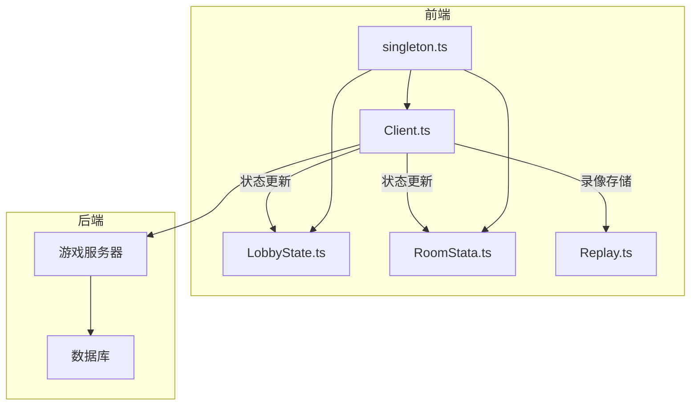
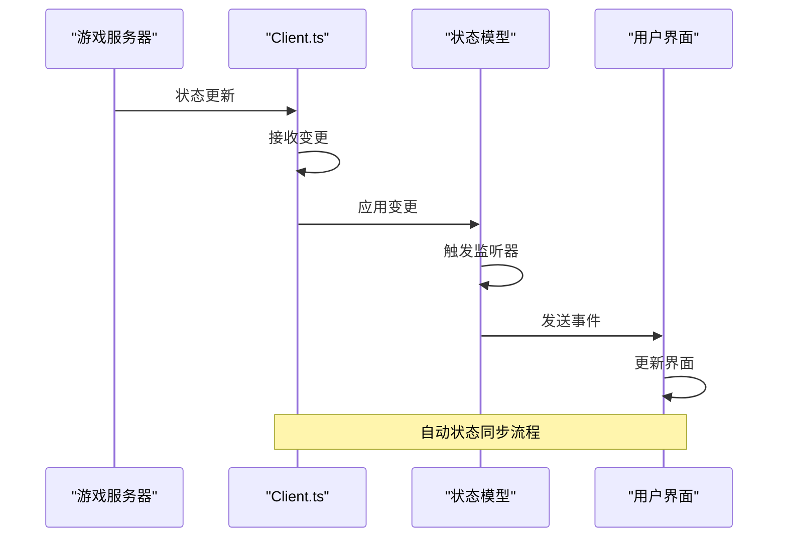
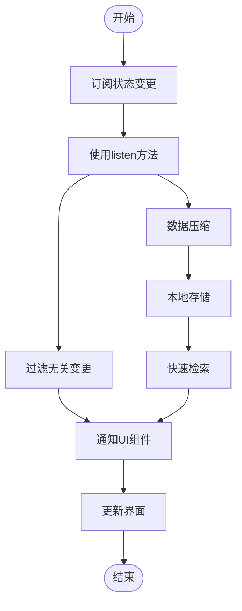
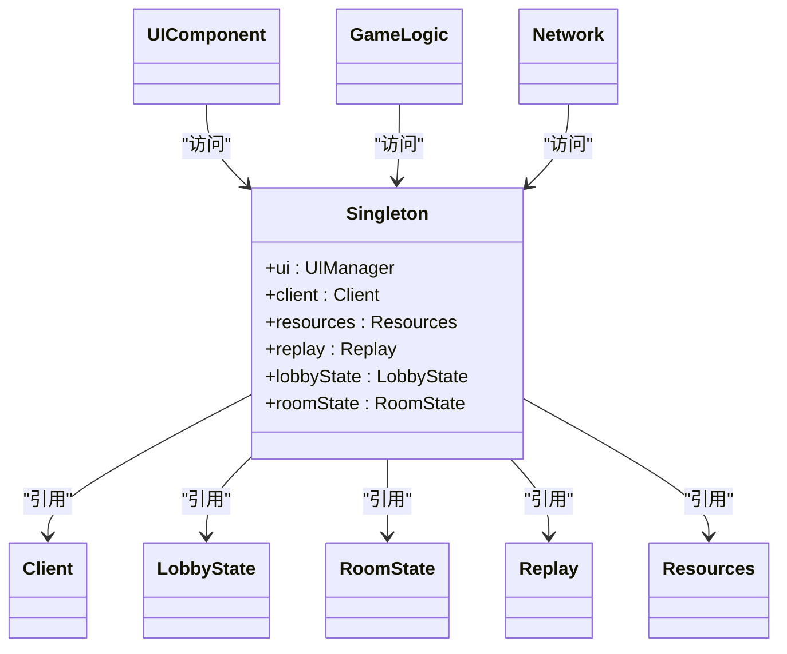
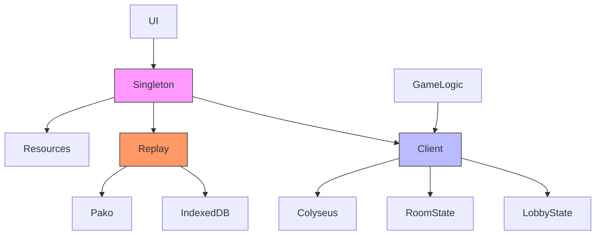

# 状态管理

<cite>
**本文档引用的文件**   
- [Client.ts](file://client/src/mgr/Client.ts)
- [LobbyState.ts](file://client/src/models/LobbyState.ts)
- [RoomStata.ts](file://client/src/models/RoomStata.ts)
- [Replay.ts](file://client/src/mgr/Replay.ts)
- [singleton.ts](file://client/src/singleton.ts)
</cite>

## 目录
1. [简介](#简介)
2. [项目结构](#项目结构)
3. [核心组件](#核心组件)
4. [架构概览](#架构概览)
5. [详细组件分析](#详细组件分析)
6. [依赖分析](#依赖分析)
7. [性能考虑](#性能考虑)
8. [故障排除指南](#故障排除指南)
9. [结论](#结论)

## 简介
本文档深入探讨了前端状态管理系统的实现机制，重点分析了单例模式、数据模型结构、状态同步逻辑、回放系统以及全局状态管理器的设计。文档旨在为开发者提供一个全面且易于理解的状态管理指南，涵盖从基础概念到高级实践的各个方面。

## 项目结构
项目采用模块化设计，前端代码位于`client/src`目录下，主要分为以下几个模块：
- `comps`：UI组件
- `effects`：特效相关
- `mgr`：管理器类，包含核心状态管理逻辑
- `models`：数据模型定义
- `ui`：用户界面
- 根目录下的工具类和配置文件

关键状态管理文件位于`mgr`和`models`目录中，通过Colyseus框架实现客户端与服务器之间的状态同步。

## 核心组件
核心状态管理组件包括：
- **Client.ts**：客户端主管理器，实现单例模式，负责连接管理、认证和房间操作
- **LobbyState.ts** 和 **RoomStata.ts**：定义大厅和房间的数据模型
- **Replay.ts**：游戏回放系统，负责录像的存储和检索
- **singleton.ts**：全局单例访问入口

这些组件共同构成了前端状态管理的基础架构。

**本节来源**
- [Client.ts](file://client/src/mgr/Client.ts#L1-L367)
- [LobbyState.ts](file://client/src/models/LobbyState.ts#L1-L9)
- [RoomStata.ts](file://client/src/models/RoomStata.ts#L1-L110)
- [Replay.ts](file://client/src/mgr/Replay.ts#L1-L187)

## 架构概览
系统采用客户端-服务器架构，通过WebSocket实现实时通信。状态管理分为本地状态和远程状态，本地状态通过单例模式集中管理，远程状态通过Colyseus框架自动同步。



**图表来源**
- [Client.ts](file://client/src/mgr/Client.ts#L1-L367)
- [LobbyState.ts](file://client/src/models/LobbyState.ts#L1-L9)
- [RoomStata.ts](file://client/src/models/RoomStata.ts#L1-L110)
- [Replay.ts](file://client/src/mgr/Replay.ts#L1-L187)

## 详细组件分析

### Client.ts中的单例模式实现
`Client`类通过静态方法`getInstance()`实现单例模式，确保整个应用中只有一个客户端实例。

```mermaid
classDiagram
class Client {
-static instance : Client
+static getInstance() : Client
-constructor()
+url : string
+client : Colyseus.Client
+username : string
+avatar : string
+token : string
+reconnectToken : string
+lobbyRoom : Colyseus.Room<LobbyState>
+gameRooms : { [key : string] : Colyseus.Room[] }
+allRooms : Colyseus.RoomAvailable<RoomMetedata>[]
+reconnectAttempts : number
+isAdmin : boolean
+isSuperAdmin : boolean
+connect() : void
+login(data : LoginData) : Promise<any>
+createRoom(options : RoomOption) : Promise<any>
+joinRoom(roomId : string, options : RoomJoinData) : Promise<any>
+attempReconnect() : void
+broadcast(message : string) : Promise<void>
+updateAvatar(avatar : string) : Promise<void>
+ban(username : string, data : { type : 'ban' | 'muted' | 'game', reason : string, times : number }) : Promise<void>
+unban(username : string, type : 'ban' | 'muted' | 'game') : Promise<void>
-bindLobby() : void
-toastEroor(e : { code : ServerCode }) : void
}
Client : "单例模式实现"
Client : "状态管理中枢"
Client : "网络通信管理"
```

**图表来源**
- [Client.ts](file://client/src/mgr/Client.ts#L1-L367)

**本节来源**
- [Client.ts](file://client/src/mgr/Client.ts#L1-L367)

### LobbyState和RoomStata数据模型
`LobbyState`和`RoomStata`类定义了大厅和房间的状态结构，使用Colyseus的Schema系统进行类型定义和变更跟踪。

```mermaid
classDiagram
class LobbyState {
+players : Map<string, { username : string; status : string }>
+playerCount : number
}
class RoomState {
+players : MapSchema<PlayerState>
+spectates : MapSchema<SpectateState>
+options : RoomOptionState
+game : GameRoom
}
class PlayerState {
+playerId : string
+username : string
+avatar : string
+total : number
+win : number
+escape : number
+isOwner : boolean
+ready : boolean
+prechooses : string[]
+_ready() : boolean
}
class SpectateState {
+playerId : string
+username : string
+avatar : string
+total : number
+win : number
+escape : number
+spectateBy : string
}
class RoomOptionState {
+name : string
+password : string
+mode : string
+playerCountMax : number
+responseTime : number
+extensions : string
+generals : string
+chooseGeneralCount : number
+luckyCardCount : number
+settings : string
}
LobbyState --> "1" RoomState : "包含"
RoomState --> "1..*" PlayerState : "玩家"
RoomState --> "0..*" SpectateState : "旁观者"
RoomState --> "1" RoomOptionState : "房间选项"
```

**图表来源**
- [LobbyState.ts](file://client/src/models/LobbyState.ts#L1-L9)
- [RoomStata.ts](file://client/src/models/RoomStata.ts#L1-L110)

**本节来源**
- [LobbyState.ts](file://client/src/models/LobbyState.ts#L1-L9)
- [RoomStata.ts](file://client/src/models/RoomStata.ts#L1-L110)

### 游戏状态同步机制
状态同步通过Colyseus框架自动处理，客户端监听服务器状态变更并更新本地UI。



**图表来源**
- [Client.ts](file://client/src/mgr/Client.ts#L1-L367)
- [LobbyState.ts](file://client/src/models/LobbyState.ts#L1-L9)
- [RoomStata.ts](file://client/src/models/RoomStata.ts#L1-L110)

**本节来源**
- [Client.ts](file://client/src/mgr/Client.ts#L1-L367)

### Replay.ts回放系统
回放系统使用IndexedDB本地存储，通过Pako库进行数据压缩，实现高效的录像管理。

```mermaid
classDiagram
class Replay {
-static instance : Replay
+static getInstance() : Replay
-constructor()
-dbName : string
-storeName : string
-db : IDBDatabase | null
-version : number
+init() : Promise<void>
+saveReplay(replayData : any) : Promise<number>
+getAllReplayMeta() : Promise<Array<any>>
+getRelayById(id : number) : Promise<any>
+deleteReplay(id : number) : Promise<void>
+clearAllReplays() : Promise<void>
+getDatabaseSize() : Promise<{ usage : number; quota : number }>
}
class IndexedDB {
+objectStore : "replays"
+keyPath : "id"
+index : "timestamp"
}
Replay --> IndexedDB : "使用"
Replay : "录像压缩"
Replay : "异步存储"
Replay : "元数据管理"
```

**图表来源**
- [Replay.ts](file://client/src/mgr/Replay.ts#L1-L187)

**本节来源**
- [Replay.ts](file://client/src/mgr/Replay.ts#L1-L187)

### 状态管理最佳实践
#### 状态订阅与变更通知
- 使用Colyseus的`listen`方法订阅状态变更
- 通过事件系统通知UI组件更新
- 避免直接修改状态，确保变更可追踪

#### 性能优化技巧
- 合理使用状态监听，避免过度订阅
- 对大型数据进行分页或懒加载
- 使用数据压缩减少存储空间
- 实现重连机制保证用户体验



**图表来源**
- [Client.ts](file://client/src/mgr/Client.ts#L1-L367)
- [Replay.ts](file://client/src/mgr/Replay.ts#L1-L187)

**本节来源**
- [Client.ts](file://client/src/mgr/Client.ts#L1-L367)
- [Replay.ts](file://client/src/mgr/Replay.ts#L1-L187)

### singleton.ts全局状态管理器
`singleton.ts`提供全局访问点，简化组件间的通信和状态共享。



**图表来源**
- [singleton.ts](file://client/src/singleton.ts)
- [Client.ts](file://client/src/mgr/Client.ts#L1-L367)

**本节来源**
- [singleton.ts](file://client/src/singleton.ts)
- [Client.ts](file://client/src/mgr/Client.ts#L1-L367)

## 依赖分析
系统各组件之间存在明确的依赖关系，通过单例模式和依赖注入实现松耦合。



**图表来源**
- [Client.ts](file://client/src/mgr/Client.ts#L1-L367)
- [Replay.ts](file://client/src/mgr/Replay.ts#L1-L187)
- [singleton.ts](file://client/src/singleton.ts)

**本节来源**
- [Client.ts](file://client/src/mgr/Client.ts#L1-L367)
- [Replay.ts](file://client/src/mgr/Replay.ts#L1-L187)
- [singleton.ts](file://client/src/singleton.ts)

## 性能考虑
状态管理系统在设计时考虑了多项性能优化：
- 使用二进制压缩减少网络传输量
- 本地存储录像避免服务器压力
- 增量状态更新减少数据传输
- 重连机制提升用户体验
- 内存管理避免泄漏

## 故障排除指南
常见问题及解决方案：
- **连接失败**：检查网络连接，确认服务器地址正确
- **状态不同步**：确保监听器正确注册，检查网络延迟
- **录像无法保存**：检查浏览器存储权限，确认IndexedDB可用
- **内存泄漏**：确保及时清理事件监听器，避免循环引用

**本节来源**
- [Client.ts](file://client/src/mgr/Client.ts#L1-L367)
- [Replay.ts](file://client/src/mgr/Replay.ts#L1-L187)

## 结论
本文档详细分析了前端状态管理系统的各个组件和工作机制。通过单例模式、Colyseus状态同步、IndexedDB存储等技术，实现了高效、可靠的状态管理。建议开发者遵循最佳实践，合理使用状态订阅，优化性能，确保良好的用户体验。